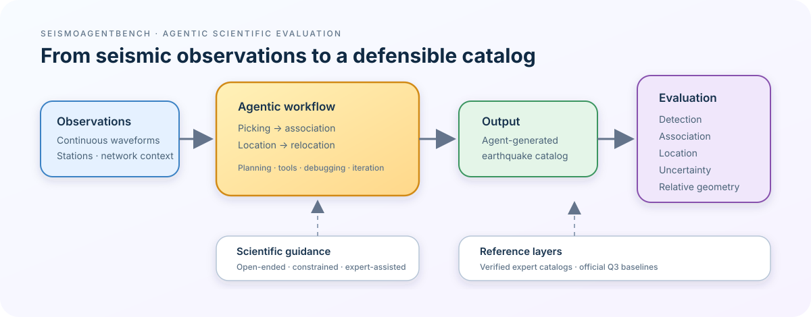
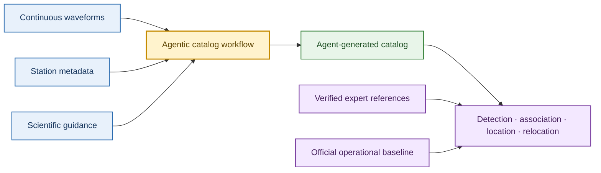

# SeismoAgentBench

### Agentic Seismic Catalog Benchmark

SeismoAgentBench evaluates what an AI agent can do when asked to build an
earthquake catalog from continuous seismic observations—and how much expert
guidance is still required.

<p align="center">
  
</p>

The benchmark is built around real, published earthquake and volcanic
sequences. It separates data preparation and scientific reference validation
from the later task of reproducing catalogs with agents.

The extraction contract for paper methods, catalog schemas, and case-level
synthesis is defined in [`docs/01_3_Information_Extraction_Schema.md`](docs/01_3_Information_Extraction_Schema.md).

## What this project does

- Curates six information-rich seismic benchmark cases.
- Verifies the papers, supplements, waveform context, and published catalogs
  associated with each case.
- Freezes common time, space, depth, network, and quality conditions for fair
  comparisons.
- Keeps multiple reference catalogs separate when they measure different
  scientific capabilities.
- Provides official operational catalogs as Q3 baselines, not as universal
  ground truth.
- Prepares article extraction, catalog summaries, visualizations, waveform
  manifests, and evaluation-ready inputs.
- Will later evaluate agentic catalog construction under controlled observation
  and expert-guidance conditions.

## The benchmark idea



The central question is:

> How independently, and to what level of scientific quality, can an agent
> construct an earthquake catalog from seismic observations?

## Phase I cases

| Case | Regime | Main challenge |
|---|---|---|
| [Prague, Oklahoma](data/2011_prague_oklahoma/) | Mainshock–aftershock | Changing heterogeneous network |
| [Kaikōura, New Zealand](data/2016_kaikoura_new_zealand/) | Dense aftershock sequence | Temporary network and relocation |
| [Maple Creek, Yellowstone](data/2017_maple_creek_yellowstone/) | Earthquake swarm | Sparse routine catalog |
| [Kīlauea, Hawaiʻi](data/2018_kilauea_hawaii/) | Volcanic eruption sequence | High-rate changing sources |
| [Ridgecrest, California](data/2019_ridgecrest_california/) | Dense faulting sequence | Overlapping events and complex geometry |
| [Magna, Utah](data/2020_magna_utah/) | Moderate earthquake sequence | Permanent versus nodal networks |

The cases are deliberately different. The goal is not one leaderboard, but a
capability profile showing where an agent succeeds, fails, or needs expert
intervention.

## Project stages

```text
1. Verify papers and data releases
2. Read and extract article methods and scope
3. Organize and normalize reference catalogs
4. Freeze common benchmark windows
5. Prepare waveform and station manifests
6. Run agentic catalog-construction experiments
7. Compare against role-specific references and baselines
```

Current work is concentrated on stages 1–5. Agent reproduction is intentionally
the next stage, after the data and reference conditions are frozen.

## Repository map

```text
docs/
  00_Research_Plan.md       benchmark design and research questions
  01_Case_details.md        compact case index and summary
  02_Case_Data_Audit.md     data and provenance audit
  03_Information_Extraction_Schema.md  extraction contract
  04_Paper_Parsing_Audit.md   MinerU output audit

data/
  REFERENCES_MANIFEST.md    paper/supplement/catalog readiness
  <case>/references/        source papers and supplementary materials
  <case>/catalogs/          source catalogs and catalog-level products
  <case>/analysis/          cross-reference case conclusions

scripts/
  01_pdf_parsing/           official MinerU paper parsing wrapper
  download_official_baselines.py
```

Detailed organization rules belong in [data/README.md](data/README.md), and
the current reference readiness belongs in
[data/REFERENCES_MANIFEST.md](data/REFERENCES_MANIFEST.md).

## Quick start

List paper PDFs available for MinerU parsing:

```bash
python scripts/01_pdf_parsing/parse_papers_with_mineru.py --list
```

Parse one paper through the existing official Knowledge Graph MinerU workflow:

```bash
python scripts/01_pdf_parsing/parse_papers_with_mineru.py \
  --source COCHRAN2020_GJIGGAA153 \
  --timeout 1800
```

Download official operational baseline snapshots:

```bash
python scripts/download_official_baselines.py --direct --scope full
```

## Reference interpretation

Reference catalogs are role-specific expert targets, not a single absolute
truth set. A catalog can be excellent for detection completeness or relative
relocation while being unsuitable for absolute-location evaluation. Each case
therefore records the reference role, spatial and temporal scope, quality tier,
and network condition separately.

## Project status

Phase I has six cases, archived reference materials, paper-level extraction
records, research-catalog audits, and official operational snapshots. The
current reference-calibration baseline is frozen at the case/window level;
remaining gaps are explicit in `REFERENCES_MANIFEST.md` and the case analyses.

Next deliverables are:

- comparable catalog visualizations under each catalog product;
- station-day/channel availability and waveform manifests;
- recovery of confirmed missing products (for example Pang Maple Creek,
  Ross DC1, and the Magna Baker paper) without substituting unrelated data;
- controlled agent reproduction and role-specific evaluation.

## Documentation

- [Research plan](docs/00_Research_Plan.md)
- [Case details](docs/01_1_Case_details.md)
- [Case data audit](docs/01_2_Case_Data_Audit.md)
- [Information extraction schema](docs/01_3_Information_Extraction_Schema.md)
- [Paper parsing audit](docs/01_4_Paper_Parsing_Audit.md)
- [Reference manifest](data/REFERENCES_MANIFEST.md)
- [Data organization rules](data/README.md)

**Canonical project name:** `SeismoAgentBench`  \
**Repository slug:** `seismoagent-bench`  \
**Short form:** `SABench`
