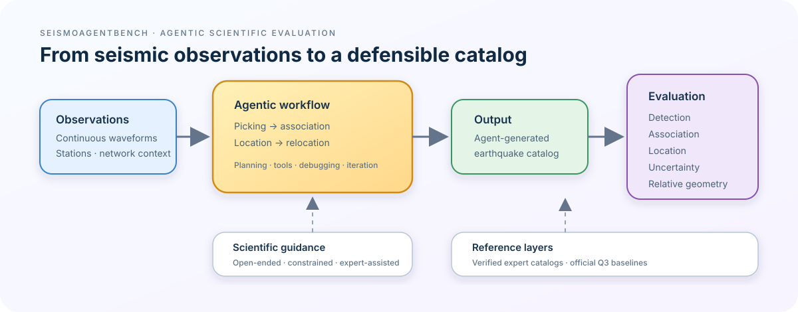
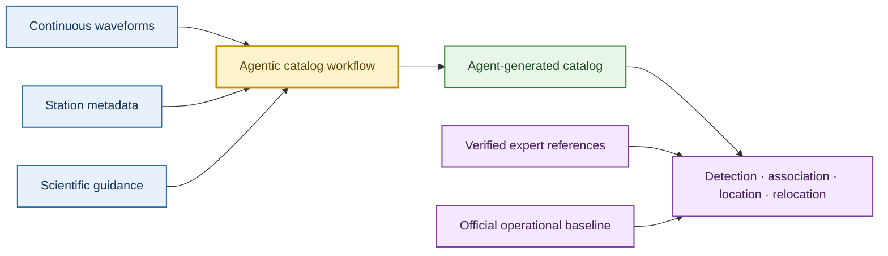

# SeismoAgentBench

### Agentic Seismic Catalog Benchmark

SeismoAgentBench evaluates what an AI agent can do when asked to build an
earthquake catalog from continuous seismic observations—and how much expert
guidance is still required.

<p align="center">
  
</p>

The benchmark is built around real, published earthquake and volcanic
sequences. It separates data preparation and scientific reference validation
from the later task of reproducing catalogs with agents.

The extraction contract for paper methods, catalog schemas, and case-level
synthesis is defined in [`docs/research/01_3_Information_Extraction_Schema.md`](docs/research/01_3_Information_Extraction_Schema.md).

The current implementation and scientific readiness are tracked in [`docs/research/03_PROJECT_STATUS.md`](docs/research/03_PROJECT_STATUS.md).

## Evaluation environment

The current trusted-development execution path is implemented in
[`SeismoAgentBench/execution`](SeismoAgentBench/execution). It creates a fresh
run directory, records the command and environment, applies a timeout, and
keeps agent execution separate from artifact validation and scoring. Formal
isolation is a replaceable future execution backend; it is not required by the
task and scoring contracts.

## Professional tool snapshots

[seismotools/](seismotools/README.md) contains copied PhaseNet/DPP/EQTransformer models, GaMMA, NonLinLoc and hypoDD sources, local weight identities, usage documentation and validation/build commands. It provides versioned implementation inputs for future controlled tool comparisons; case data and experiment scripts stay separate. Existing expert runs retain their recorded tool paths.

## What this project does

- Curates six information-rich seismic benchmark cases.
- Verifies the papers, supplements, waveform context, and published catalogs
  associated with each case.
- Freezes common time, space, depth, network, and quality conditions for fair
  comparisons.
- Keeps multiple reference catalogs separate when they measure different
  scientific capabilities.
- Provides official operational catalogs as Q3 baselines, not as universal
  ground truth.
- Prepares article extraction, catalog summaries, visualizations, waveform
  manifests, and evaluation-ready inputs.
- Will later evaluate agentic catalog construction under controlled observation
  and expert-guidance conditions.

## The benchmark idea


```mermaid
flowchart LR
    W[Continuous waveforms] --> A[Agentic catalog workflow]
    M[Station metadata] --> A
    G[Scientific guidance] --> A
    A --> C[Agent-generated catalog]
    C --> E[Detection · association · location · relocation]
    R[Verified expert references] --> E
    B[Official operational baseline] --> E

    classDef input fill:#E8F1FB,stroke:#2B6CB0,color:#17365D,stroke-width:1.5px
    classDef agent fill:#FFF3CD,stroke:#C58B00,color:#5C4300,stroke-width:2px
    classDef output fill:#E8F5E9,stroke:#2E7D32,color:#1B4D20,stroke-width:1.5px
    classDef eval fill:#F3E8FF,stroke:#7B3FA1,color:#45205C,stroke-width:1.5px
    class W,M,G input
    class A agent
    class C output
    class E,R,B eval
```

The central question is:

> How independently, and to what level of scientific quality, can an agent
> construct an earthquake catalog from seismic observations?

## Phase I cases

| Case | Regime | Main challenge |
|---|---|---|
| [Prague, Oklahoma](data/2011_prague_oklahoma) | Mainshock–aftershock | Changing heterogeneous network |
| [Kaikōura, New Zealand](data/2016_kaikoura_new_zealand) | Dense aftershock sequence | Temporary network and relocation |
| [Maple Creek, Yellowstone](data/2017_maple_creek_yellowstone) | Earthquake swarm | Sparse routine catalog |
| [Kīlauea, Hawaiʻi](data/2018_kilauea_hawaii) | Volcanic eruption sequence | High-rate changing sources |
| [Ridgecrest, California](data/2019_ridgecrest_california) | Dense faulting sequence | Overlapping events and complex geometry |
| [Magna, Utah](data/2020_magna_utah) | Moderate earthquake sequence | Permanent versus nodal networks |

The cases are deliberately different. The goal is not one leaderboard, but a
capability profile showing where an agent succeeds, fails, or needs expert
intervention.

## Project stages

```text
1. Verify papers and data releases
2. Read and extract article methods and scope
3. Organize and normalize reference catalogs
4. Freeze common benchmark windows
5. Prepare waveform and station manifests
6. Run agentic catalog-construction experiments
7. Compare against role-specific references and baselines
```

Current work is concentrated on stages 1–5. Agent reproduction is intentionally
the next stage, after the data and reference conditions are frozen.

## Repository map

```text
docs/
  research/                 scientific design, case inventory and data preparation
  framework/                reusable benchmark workflow and implementation records

data/
  REFERENCES_MANIFEST.md    paper/supplement/catalog readiness
  <case>/references/        source papers and supplementary materials
  <case>/data/catalogs/     source catalogs and catalog-level analysis products
  <case>/data/waveforms/    local waveform payloads (ignored by Git)
  <case>/analysis/          cross-reference case conclusions

workflows/data_preparation/
  01_pdf_parsing/           official MinerU paper parsing wrapper
  00_catalog_downloading/  official baseline download and audit
  02_supplement_processing/ supplement conversion
  03_information_extraction/ reusable extraction validation
  04_catalog_analysis/     catalog manifest generation

workflows/tasks/
  <task>/                   benchmark task packages and case-specific workflows
```

Detailed organization rules belong in [data/README.md](data/README.md), and
the current reference readiness belongs in
[data/REFERENCES_MANIFEST.md](data/REFERENCES_MANIFEST.md).

## Quick start

List paper PDFs available for MinerU parsing:

```bash
python workflows/data_preparation/01_pdf_parsing/parse_papers_with_mineru.py --list
```

Parse one paper through the existing official Knowledge Graph MinerU workflow:

```bash
python workflows/data_preparation/01_pdf_parsing/parse_papers_with_mineru.py \
  --source COCHRAN2020_GJIGGAA153 \
  --timeout 1800
```

Download official operational baseline snapshots:

```bash
python workflows/data_preparation/00_catalog_downloading/download_official_baselines.py --direct --scope full
```

## Reference interpretation

Reference catalogs are role-specific expert targets, not a single absolute
truth set. A catalog can be excellent for detection completeness or relative
relocation while being unsuitable for absolute-location evaluation. Each case
therefore records the reference role, spatial and temporal scope, quality tier,
and network condition separately.

## Project status

Phase I has six cases, archived reference materials, paper-level extraction
records, research-catalog audits, and official operational snapshots. The
current case configurations explicitly mark benchmark windows as `not_frozen`;
existing masked statistics and figures are exploratory. Remaining gaps are
recorded in `REFERENCES_MANIFEST.md` and the case analyses.

Next deliverables are:

- consolidation of scientific window choices and existing exploratory figures;
- station-day/channel availability and waveform manifests;
- recovery of confirmed missing products (for example Pang Maple Creek,
  Ross DC1, and the Magna Baker paper) without substituting unrelated data;
- controlled agent reproduction and role-specific evaluation.

## Documentation

- [Research plan](docs/research/00_Research_Plan.md)
- [Case details](docs/research/01_1_Case_details.md)
- [Information extraction schema](docs/research/01_3_Information_Extraction_Schema.md)
- [Paper parsing audit](docs/research/01_4_Paper_Parsing_Audit.md)
- [Framework documentation](docs/framework/README.md)
- [Reference manifest](data/REFERENCES_MANIFEST.md)
- [Data organization rules](data/README.md)
- [Repository cleanup and retention decisions](docs/research/02_Repository_Cleanup.md)

**Canonical project name:** `SeismoAgentBench`  \
**Repository slug:** `seismoagent-bench`  \
**Short form:** `SABench`

The project code package is [`SeismoAgentBench/`](SeismoAgentBench/README.md). Source registry tools are one utility under [`utils/source_prepare/`](SeismoAgentBench/utils/source_prepare/), with regression tests in [`tests/`](tests/). Ridgecrest is the first case using the versioned source registry; see the [source architecture and commands](data/README.md#通用-source-架构ridgecrest-试点). Evaluation will be implemented separately.

Automated regressions use one entry point: `python -B -m unittest discover -s tests -v`. Follow the [test maintenance rules](tests/AGENTS.md) when adding or changing tests.
