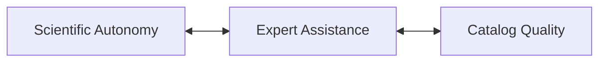
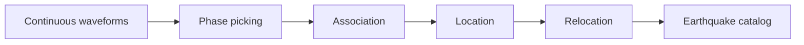
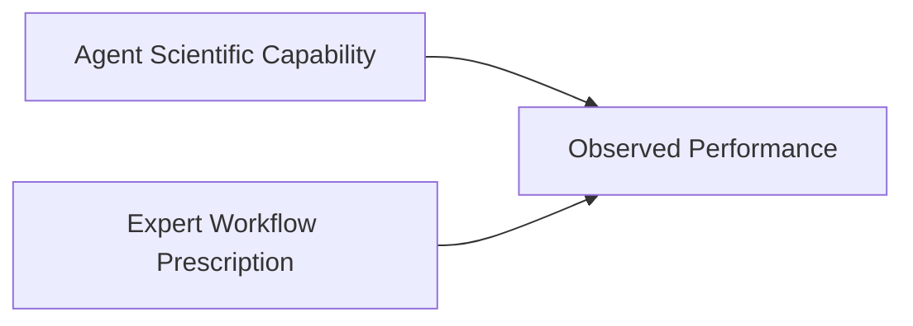
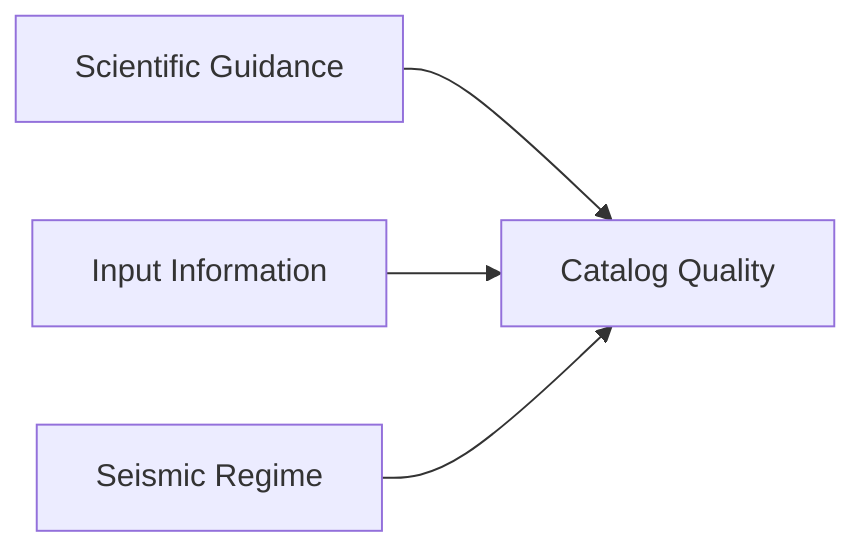

# SeismoAgentBench

**Formal name:** Agentic Seismic Catalog Benchmark  
**Short project name:** SeismoAgentBench  
**Repository/CLI slug:** `seismoagent-bench`  
**Short abbreviation:** SABench

`SeismoAgentBench` is the canonical project name. The hyphenated
`seismoagent-bench` form is reserved for repository names, command-line
commands, URLs, and other contexts where lowercase slugs are preferred.

## Benchmark Design, Candidate Pool, and Phase I Case Inventory

**Version:** v0.2  
**Phase I detailed cases:** Ridgecrest (2019), Prague (2011), Magna (2020), Maple Creek (2017), Kīlauea (2018), Kaikōura (2016)  
**Candidate pool:** 20+ earthquake sequences and swarms  
**Current source-verification date:** 2026-09-18

> **Interpretation rule:** Reference catalogs in this benchmark are **expert reference catalogs / high-quality target catalogs**, not absolute ground truth. A catalog may be an excellent target for detection completeness or relative relocation while remaining unsuitable as an absolute-location truth set.

---

# Part I — Benchmark Design

## 1.1 Motivation and Core Questions

Agentic AI systems are rapidly evolving from language-generation tools into systems capable of long-horizon planning, coding, tool use, execution, debugging, and iterative problem solving. General-purpose agents have demonstrated increasingly strong capabilities on complex software-engineering tasks, while domain-specific scientific agents have begun to execute multi-step scientific workflows in areas such as seismic monitoring and earthquake analysis.

However, for a **specific, complete, and objectively testable scientific task** such as earthquake catalog construction, the actual capability boundary of current Agents remains unclear.

Several fundamental questions remain open:

- Can an Agent construct a scientifically usable earthquake catalog directly from seismic observations with minimal expert intervention?
- How much domain knowledge, workflow prescription, parameter guidance, or human debugging is still required?
- Can an Agent-generated catalog approach the quality of catalogs carefully constructed by domain experts?
- Or should current Agent-generated catalogs primarily be regarded as preliminary products that still require substantial expert refinement?

These questions are critical for determining how Agentic systems should be used in future seismic monitoring. Before large-scale deployment, we need a controlled benchmark that can determine **what current Agents can do independently, what level of scientific product they can produce, and where expert support remains necessary**.

> **Core benchmark question:**  
> **How independently, and to what level of scientific quality, can current Agents construct earthquake catalogs from seismic observations?**

The benchmark therefore focuses on the relationship among three quantities:

It evaluates the complete Agent-controlled seismic-monitoring workflow rather than a single picker, associator, locator, or relocation algorithm:

The resulting catalog is then compared with high-quality expert reference products that are withheld from the Agent during the benchmark.

The benchmark is intended to provide the empirical basis for later reliability-aware and self-improving systems. With hidden expert references, we can determine when the Agent actually succeeds or fails; later, when those references are unavailable, we can test whether the Agent itself can recognize that reliability.

---

## 1.2 Benchmark Design

### Compact, high-information cases

The benchmark should favor **short-duration, information-rich seismic sequences** rather than multi-year continuous catalogs.

A preferred benchmark case should contain:

- **3–7 days** of continuous waveform data;
- generally **no more than 14 days** unless scientifically necessary;
- a manageable number of stations;
- a sufficiently dense event population to stress the workflow;
- one or more high-quality published reference catalogs that can be subset to the same temporal and spatial window.

This design keeps waveform downloading, preprocessing, repeated Agent runs, controlled ablations, and manual inspection computationally feasible.

The goal is to benchmark **scientific capability**, rather than storage capacity or data-transfer bandwidth.

### Multiple scientific regimes

The candidate pool should include different monitoring conditions, such as:

- mainshock–aftershock sequences;
- earthquake swarms;
- volcanic seismicity;
- induced or triggered seismicity;
- dense permanent networks;
- temporary near-source deployments;
- changing network geometries;
- simple and complex fault systems.

The objective is **diversity of scientific difficulty**, not geographic diversity for its own sake.

### Two experimental dimensions

The benchmark should explicitly control both:

1. **what observational information the Agent receives**; and
2. **how much scientific guidance the Agent receives**.

#### Observational input conditions

| Input condition | Agent receives | Main capability tested |
|---|---|---|
| **Raw-waveform condition** | Continuous waveforms + station metadata + general regional context | Full catalog construction from observations |
| **Routine-catalog-assisted condition** | Waveforms + station metadata + operational catalog | Catalog enhancement, refinement, and relocation |
| **Phase-assisted condition** | Waveforms + metadata + routine phase picks | Location, relocation, and higher-level workflow reasoning |

These should be treated as different benchmark tasks rather than merged into one score.

#### Scientific-guidance settings

| Guidance setting | Agent access | Main capability tested |
|---|---|---|
| **Closed-reference** | Generic tools and scientific knowledge, but no target paper, target catalog, or target-specific workflow details | Independent workflow construction |
| **Open-literature** | Papers, software documentation, and public method descriptions are accessible; target catalog remains hidden | Scientific retrieval, adaptation, and workflow reuse |
| **Expert-guided control** | Expert workflow, parameter guidance, or target-specific scientific decisions are supplied | Upper-control performance with strong expert support |

These conditions make it possible to separate:

the Agent's own scientific capability from performance contributed by expert workflow prescription.

### Target leakage control

Target leakage is a major methodological risk.

If an Agent accesses the target catalog, exact event tables, target-specific parameters, or published expert decisions during a nominally autonomous run, the experiment may measure reproduction rather than autonomous scientific reasoning.

Therefore:

- target reference catalogs should remain hidden in all benchmark conditions;
- closed-reference runs should block target-specific publications and supplementary material;
- open-literature runs should record whether the Agent retrieved the target paper or a closely related workflow;
- all accessible resources should be logged as part of the benchmark record.

---

## 1.3 Reference Catalogs and Evaluation

### Reference hierarchy

A single earthquake sequence may have several high-quality catalogs. The benchmark should not automatically select the largest or newest catalog.

For each case, reference products should be organized as:

| Reference level | Role |
|---|---|
| **Primary reference** | Preferred high-quality target for the principal benchmark dimension |
| **Secondary reference** | Complementary high-quality catalog based on different data, methods, or scientific emphasis |
| **Baseline / auxiliary reference** | Routine operational catalog, phase-arrival dataset, structural product, or other supporting information |

The primary reference should be selected using:

- construction quality;
- expert/scientific acceptance;
- method transparency;
- data accessibility;
- uncertainty and QC information;
- overlap with the compact benchmark window;
- suitability for the intended evaluation dimension;
- independence from the Agent workflow.

> **The catalog with the most events is not necessarily the best benchmark target.**

### Reference quality and case-level evaluation

Reference catalogs are not absolute ground truth. Each case may contain multiple reference products with different quality, scope, and scientific roles. The quality hierarchy and required case-level reference record are defined in [`01_1_Case_details.md`](./01_1_Case_details.md); the benchmark design uses those records when selecting targets and assigning metrics.

### Reference independence and multi-role evaluation

Reference quality, evaluation role, and methodological independence must be kept separate. A case may use several products for detection, phase timing, association, absolute location, relative relocation, completeness, and uncertainty; no single catalog should be treated as complete truth for every dimension. The detailed quality tiers, scope fields, and allowed metrics are specified in [`01_1_Case_details.md`](./01_1_Case_details.md).

---

## 1.4 Expected Benchmark Outputs

The benchmark should not produce only a single leaderboard score.

Its primary output should be a **capability map** describing what current Agents can achieve, under which conditions, and with how much expert assistance.

Each Agent configuration should be characterized along several dimensions:

| Dimension | Main question |
|---|---|
| **Task completion** | Did the Agent complete the full scientific workflow successfully? |
| **Catalog quality** | How closely does the result approach the relevant expert references? |
| **Scientific autonomy** | Which scientific decisions were made independently by the Agent? |
| **Expert assistance** | What domain knowledge, workflow prescription, or human intervention was required? |
| **Workflow bottlenecks** | Which processing stages or scientific decisions most often limited performance? |
| **Failure modes** | How and why did the workflow fail when it failed? |
| **Computational cost** | How much execution, retrying, and tool use was required? |
| **Case dependence** | How does behavior change across different seismic regimes? |

Conceptually, the benchmark should characterize:

The objective is to determine whether current Agentic systems are best viewed as:

- autonomous earthquake-catalog constructors;
- expert-level workflow assistants;
- preliminary-catalog generators;
- or systems whose appropriate role depends strongly on the scientific setting.

A useful benchmark conclusion may therefore take the form:

> Under a curated tool-and-knowledge environment, the Agent approaches expert-reference quality for selected catalog dimensions in dense regional networks, but still requires expert support for specific scientific decisions in more complex settings.

Such a capability profile is more informative for scientific deployment than a single aggregate score.

Ultimately, the benchmark should establish:

> **What can current Agents do independently, what still requires expert support, and what level of earthquake catalog can be trusted as a scientific product?**

# Part II — Candidate Case Pool

## 2.1 Purpose of the candidate pool

The candidate pool is intentionally broader than the first implementation set.

It serves four purposes:

1. preserve multiple options before waveform-access and compute tests are completed;
2. cover distinct monitoring regimes;
3. identify cases with multiple high-quality reference catalogs;
4. provide a path for expanding the benchmark after the first six cases are operational.

Cases are selected because they combine, to varying degrees:

- a high-quality published reference catalog;
- continuous or event waveform availability;
- transparent processing methods;
- a short sequence or a scientifically meaningful short-window subset;
- complementary scientific difficulty.

The table below is a **research candidate pool**, not a final ranking. Cases marked as long-duration studies would only be used through compact subsets.

## 2.2 Tier A — Phase I highest-priority cases

| Case | Sequence / regime | Candidate primary reference(s) | Reference methods | Waveform / data access | Why selected | Main concern |
|---|---|---|---|---|---|---|
| **2019 Ridgecrest, California** | Dense foreshock–mainshock–aftershock sequence | Shelly (2020), 34,091 events; Ross et al. (2019) secondary | Template matching, waveform correlation, precise relative relocation / GrowClust-style structural catalog | SCEDC/SCSN public | Excellent public data, widely accepted high-resolution target, extreme association density, existing TRACE baseline | Shared raw-data lineage among references; target-method leakage must be controlled |
| **2020 Magna, Utah** | Moderate mainshock–aftershock sequence | Pang et al. (2020); Baker et al. ML/nodal catalog secondary | Matched filtering, cross-correlation, high-precision relocation; independent ML/nodal workflow | EarthScope/IRIS + COSMOS; UU data public | Two complementary enhanced catalogs; manageable scale; explicit robustness tests in reference work | Reference catalogs use different station configurations |
| **2017 Maple Creek, Yellowstone** | Earthquake swarm | Shelly & Hardebeck (2019), 15,912 well-located events | Template matching, large differential-time set, hypoDD | EarthScope/IRIS + public supporting data | Strong swarm benchmark; 27-station published setup; clear routine-to-enhanced gap | Main phase-arrival auxiliary data share the same matched-filter lineage |
| **2011 Prague, Oklahoma** | Induced/triggered aftershock sequence | McMahon et al. (2017), 5,446-event public release | Subspace detection, associator, Bayesloc, manually reviewed seed catalog | EarthScope/IRIS + USGS release | Different methodology from common PhaseNet/GaMMA pipelines; 31-station mixed network; explicit uncertainty filtering | Network deployment changes during early sequence; paper/release count discrepancy |
| **2018 Kīlauea, Hawaiʻi** | Volcanic / caldera-collapse seismicity | Shelly & Thelen (2019); Wei et al. (2022) secondary | Template matching + hypoDD; independent broader NonLinLoc/3-D workflow | HVO/EarthScope public; public USGS release | Strong domain shift from tectonic sequences; very high event rate; multiple catalogs | Primary and secondary catalogs cover different spatial domains and networks |
| **2016 Kaikōura, New Zealand** | Complex multi-fault aftershock sequence | Lanza et al. (2019); Tan et al. (2024) SUGAR secondary | 3-D relocation, waveform CC, hypoDD, bootstrap; CV-based detection + GrowClust | GeoNet public + temporary deployment details | Hard benchmark for complex geometry, uncertainty, and changing network conditions | Different targets optimize different event populations; temporary-network availability must be matched |

## 2.3 Tier B — Strong expansion candidates

| Case | Sequence / regime | Candidate reference(s) | Why selected | Data-access / compact-window status | Main concern |
|---|---|---|---|---|---|
| **2010 El Mayor–Cucapah / Yuha Desert, California** | Major aftershock sequence | Kroll et al. (2013), 9,770 relocated events; ~40 m horizontal / ~120 m vertical bootstrap errors | Expert repicking + Hypoinverse + VELEST + hypoDD + waveform cross-correlation gives an unusually strong relocation target | SCSN/SCEDC data; a 3–7 day subset is feasible | Published reference covers ~2 months; short-window target must be recomputed |
| **2014 South Napa, California** | Mw 6.0 aftershock sequence | Hardebeck & Shelly (2016) | Matched-filter detection + precise differential times + double-difference relocation in 3-D model; compact first-week sequence | NCEDC/network data likely practical; short window natural | Smaller target catalog than some other cases; waveform-access workflow needs confirmation |
| **2020 Westmorland, California** | Short swarm / slow-slip related | Sirorattanakul et al. (2022), relocated catalog | Sequence itself spans ~30 Sep–6 Oct; >2,000 events; high-resolution relocated seismicity; data/code deposited at CaltechDATA | SCEDC waveforms and catalog public; naturally compact 7-day task | Reference workflow uses PhaseLink/HypoSVI/GrowClust; overlap with Agent tools must be documented |
| **2010 Madison Plateau, Yellowstone** | Three-week volcanic swarm | Shelly et al. (2013), 8,710 events | Waveform template detection + precise DD relocation; nearly 4× routine catalog | EarthScope/IRIS Yellowstone data; 3–7 day subset possible | Older workflow; public event-product accessibility should be checked |
| **2023 Kahramanmaraş, Türkiye** | Doublet and extreme early aftershock sequence | Ding et al. (2023) PALM catalog; GFZ GaMMA/GENIE/NLLoc/hypoDD catalogs | Multiple independent modern pipelines; PALM gives 29,519 well-located events over Feb.; GFZ provides first-5-day GaMMA 17,550, GENIE 14,805, and 5,215 hypoDD events | GFZ catalogs public; AFAD/KOERI waveform access requires practical verification | Different reference products use different station/data selections; target leakage likely if PALM is supplied as Agent prior |
| **2016–2017 Central Italy** | Multi-mainshock aftershock cascade | Waldhauser et al. 390,334 high-precision relocations; Tan et al. ML catalog; Spallarossa automatic catalog | Exceptionally rich reference hierarchy: manual/operational picks, ML-enhanced events, waveform CC, DD relocation | INGV/EIDA data available; use only a 3–7 day Amatrice or Norcia subset | Full study is very large; benchmark must avoid downloading the full-year waveform archive |
| **2020 Samos, eastern Aegean** | Mw 7.0 aftershock sequence | Fountoulakis et al. high-precision relocated catalog, ISC DOI 10.31905/SK7LCETI | Public relocated catalog tied to a peer-reviewed BSSA study; compact sequence suitable for location benchmark | Catalog public at ISC; waveform/EIDA access should be verified | Need to confirm waveform and phase-pick accessibility for raw-input benchmark |
| **2021 Yangbi, Yunnan** | Foreshock–mainshock–aftershock sequence | Zhou et al. ~7,943–8,000 well-located events; Su et al. independent DL workflow | Particularly attractive foreshock benchmark; multiple high-resolution catalogs; matched filter + AI picker + cross-correlated DD times | Catalog papers/data available; raw regional waveform openness needs confirmation | Some waveforms are from regional agency/temporary stations; public access may be incomplete |
| **2022 Luding, Sichuan** | Mw 6.8 aftershock sequence | Zhao et al. 7,388 relocated events; later LOC-FLOW studies 13k–15k events | Modern DL picking + relocation; waveform package and relocated catalog have Zenodo releases; strong method transparency | Catalog DOI 10.5281/zenodo.7556059; related waveform package DOI 10.5281/zenodo.8112022 | Some studies use longer pre-mainshock windows; benchmark should restrict to first 3–7 days |
| **2024 Hualien, Taiwan** | Mw 7.4 aftershock sequence | Yang et al. (2025) AutoQuake ML-enhanced catalog | Very recent end-to-end automated catalog; 3-D DD relocation; local catalog incompleteness explicitly motivates automation | Reference paper public; raw CWBSN/agency data access needs verification | Target method is itself an automated end-to-end workflow, so independence may be low for similar Agent toolchains |
| **2016 Kumamoto, Japan** | Mw 7.0 foreshock/mainshock sequence | Yue et al. (2017), 36,543 precisely located events | 63,336 template detections followed by GrowClust relocation; excellent dense Japanese sequence | NIED/JMA data available to registered users; short-window subset feasible | Data access less frictionless than SCEDC/EarthScope; reference is template-heavy |
| **2020 Southwestern Puerto Rico — January subset** | Foreshock–Mw 6.4–aftershock sequence | Yoon et al. enhanced catalog | EQTransformer + probabilistic neural/eikonal location + waveform CC relocation; 43 stations in full study | PR network data available; use only late Dec 2019–mid Jan 2020 subset | Published catalog spans 3+ years; benchmark must avoid full-duration download |
| **2020 Monte Cristo Range, Nevada** | Mw 6.5 aftershock sequence + dense nodal deployment | Zhang et al. 2025 enhanced catalog (conference/poster stage) | EQTransformer/SeisBench + association + NonLinLoc on NSL broadband + 48-node LASSO deployment | NSL and deployment waveforms reported available through IRIS/EarthScope | High-resolution target is recent and may not yet have the same archival maturity as peer-reviewed core cases |

## 2.4 Tier C — Specialist / watchlist candidates

| Case | Sequence / regime | Candidate reference(s) | Why keep in pool | Current limitation / watch item |
|---|---|---|---|---|
| **2020 Petrinja, Croatia** | Mw 6.4 aftershock sequence | Herak & Herak (2023), ~14,000 located events in first six months | Strong example of location improvement after local-network deployment; velocity-model epistemic uncertainty explicitly studied | Waveform/public-data workflow needs verification; published study is months long, so compact subset must be designed |
| **2023 Noto Peninsula Mj 6.5, Japan** | Large event inside long-running swarm | Kato (2024) precise May 5–22 catalog | 17 permanent stations; PhaseNet + REAL + DD relocation + matched filter; naturally short post-mainshock window | NIED/JMA waveform access may require registration; high overlap with modern Agent pipeline |
| **2016–2019 Cahuilla Swarm, California — short subset only** | Long-lived swarm | Ross et al. (2020), ~22,000-event high-resolution catalog | Excellent 3-D fault-architecture catalog, public SCEDC product, strong scientific acceptance | Full catalog spans years; only include if a compact scientifically meaningful 3–7 day interval is identified |
| **2021 Nippes, Haiti** | Mw 7.2 aftershock sequence | Recent 5,341-event NLL-SSST-coherence relocation; additional high-resolution work ongoing | Valuable sparse/heterogeneous/citizen-network regime and independent nonlinear location methodology | Temporary broadband data were scheduled for public IRIS release in Oct. 2026; not yet ideal for immediate Phase I use |
| **2020–2023 Puerto Rico full sequence** | Multi-year complex fault activation | Yoon et al. ~180,000-event catalog | Excellent long-term generalization/scalability reference | Excluded from compact benchmark unless reduced to a short January 2020 window |
| **2021 Maduo, Qinghai** | Mw 7.4 intraplate sequence | Guan et al. (2024), 78,832 events with LOC-FLOW | Dense portable array; clear modern workflow; useful future reproduction/generalization case | Reference processing spans ~2 years; portable-array waveform access must be verified; use only short subset |
| **2023/2024 Noto long swarm** | Long-lived fluid-related swarm | Amezawa et al. high-resolution relocated swarm catalog + Kato 2024 event-specific catalog | Multiple catalogs and rich fluid-driven swarm physics | Full swarm is multi-year; should only be used through event-centered compact subsets |

## 2.5 Candidate-pool summary

The candidate pool currently contains **23 case families**.

The current strategy is:

- **Phase I:** deeply verify and operationalize the first six cases;
- **Tier B:** retain scientifically strong alternatives with good reference catalogs;
- **Tier C:** preserve specialized cases that require further access checks, short-window design, or stronger archival targets.

The candidate pool should remain editable until waveform access, exact benchmark windows, and reference-file schemas are confirmed.

---

# Part III — Information-Collection Standard and Phase I Case Details

## 3.1 Information-collection standard

Each detailed benchmark case should be documented in three layers.

### A. Case information

This section describes the earthquake sequence itself, independent of any particular target catalog.

| Field | Required information |
|---|---|
| **Case ID** | Stable benchmark identifier |
| **Case / sequence name** | Standard scientific name |
| **Region** | Geographic setting |
| **Tectonic / volcanic context** | Strike-slip, normal faulting, subduction, volcanic, induced, etc. |
| **Sequence type** | Mainshock–aftershock, swarm, foreshock sequence, volcanic sequence, etc. |
| **Key event(s)** | Mainshock / largest event and important milestones |
| **Scientific significance** | Why the sequence is scientifically important |
| **Full study span** | Time range of the published reference study |
| **Recommended benchmark window** | Compact interval actually proposed for benchmarking |
| **Reason for window selection** | Scientific importance + computational practicality |
| **Network context** | Permanent / temporary / dense / sparse / changing network |
| **Raw waveform source** | SCEDC, EarthScope/IRIS, GeoNet, NIED, EIDA, agency archive, etc. |
| **Routine catalog / phase availability** | Operational inputs that may be used in assisted conditions |
| **Expected difficulty** | Low / Medium / High |
| **Primary benchmark role** | Detection, association, location, relocation, workflow recovery, etc. |

### B. Reference catalog information

A case may have one to three reference products. Each should be documented separately.

| Field | Required information |
|---|---|
| **Catalog name / label** | Stable name for the reference |
| **Priority** | Primary / Secondary / Baseline / Auxiliary |
| **Reference type** | Detection, phase, absolute location, relative location, structural, completeness, etc. |
| **Reference paper** | Authors, year, journal, DOI |
| **Public data release** | Repository and DOI/URL |
| **Catalog span** | Full published target interval |
| **Catalog size** | Number of events in the distributed/full reference |
| **Magnitude range / completeness** | If documented |
| **Stations / channels** | Number used in the reference workflow |
| **Waveform source** | Data center / network |
| **Waveform type** | Continuous, event waveform, template waveform, nodal, etc. |
| **Initial catalog source** | Routine catalog / analyst catalog / template set |
| **Phase-pick source** | Manual, automatic, neural, correlation-derived |
| **Detection method** | Template matching, subspace, ML, operational detection |
| **Association method** | GaMMA, REAL, clustering, custom method, manual |
| **Absolute-location method** | Hypoinverse, NonLinLoc, Bayesloc, VELEST, etc. |
| **Relative-relocation method** | hypoDD, GrowClust, cross-correlation DD, etc. |
| **Velocity model** | 1-D / 3-D / calibrated / station corrections |
| **Manual QC / expert review** | Type and extent of human review |
| **Uncertainty / QC products** | Formal error, bootstrap, quality classes, residuals, filtering thresholds |
| **Catalog open access?** | Yes / registration / restricted |
| **Raw waveform open access?** | Yes / registration / restricted / unclear |
| **Phase data open access?** | Yes / No / partial |
| **Reference quality** | Provisional High / Medium / Low |
| **Reference independence** | High / Medium / Low |
| **Why considered reliable** | Short evidence-based justification |
| **Best benchmark use** | What dimension this product should score |
| **Main limitation** | What cannot be inferred from it |

### C. Benchmark suitability

| Field | Required information |
|---|---|
| **Recommended?** | Yes / Maybe / No |
| **Primary target** | Selected high-quality reference |
| **Secondary references** | Other 0–2 reference products |
| **Baseline** | Routine operational catalog |
| **Suggested Agent input** | Raw-only / routine-catalog-assisted / phase-assisted |
| **Benchmark window** | Frozen compact interval |
| **Target event count in window** | Recomputed from the actual reference file |
| **Active station/channel count** | Recomputed for the benchmark interval |
| **Approximate waveform volume** | Computed from real request |
| **Expected compute cost** | Low / Medium / High |
| **Main capability tested** | Principal benchmark purpose |
| **Main benchmark risk** | Leakage, data access, method overlap, network changes, etc. |
| **Overall assessment** | Short recommendation |

## 3.2 Rules for selecting the primary reference

When several high-quality catalogs exist for the same sequence, choose the primary reference according to the benchmark dimension, not simply by event count.

A preferred primary reference should have as many of the following as possible:

1. strong expert acceptance;
2. high-quality picking / waveform correlation / relocation;
3. explicit QC and uncertainty information;
4. public catalog files;
5. transparent methods;
6. good overlap with the proposed compact benchmark window;
7. reasonable independence from the Agent workflow.

Secondary catalogs should be preserved when they offer:

- a different processing methodology;
- stronger absolute-location information;
- stronger relative-location information;
- an independent event-detection view;
- phase-level reference data;
- structural or uncertainty constraints.

## 3.3 Required verification before benchmark freeze

| Check | Why it matters |
|---|---|
| **Subset each reference catalog to the exact benchmark window and region** | Determines the actual target-event count for the benchmark task. |
| **Extract the active station/channel list for the compact interval** | Prevents full-study station counts from being incorrectly applied to the short benchmark window. |
| **Estimate waveform volume from the actual request** | Makes storage and compute costs reproducible. |
| **Download a small waveform sample from every required network** | Confirms current practical data access. |
| **Inspect reference catalog schemas and stable IDs** | Required for event matching, duplicate handling, and phase comparison. |
| **Reconcile publication and release counts** | Prevents ambiguous target definitions. |
| **Document method overlap between Agent tools and each reference** | Separates independent evaluation from workflow reproduction. |
| **Freeze what information is hidden from the Agent** | Prevents target leakage. |
| **Freeze the Agent input condition** | Raw-only and assisted tasks must remain distinct. |
| **Assign an evaluation role to every reference product** | Detection, phase timing, absolute location, relative location, and uncertainty should not be scored against one undifferentiated target. |

## 3.4 Case Details Overview

| Case | Proposed benchmark window | Primary reference | Full primary-reference size | Waveform access | Primary role | Current priority |
|---|---|---|---:|---|---|---|
| **Ridgecrest 2019** | 34 h or Jul 4–7 | Shelly 2020 | 34,091 | SCEDC/SCSN public | Dense detection + association + relative location | **A+** |
| **Magna 2020** | Mar 18–25 | Pang 2020 | 5,623 high-precision relocated | EarthScope/IRIS + COSMOS | Medium-scale end-to-end + relocation | **A+** |
| **Maple Creek 2017** | Jun 11–18 | Shelly & Hardebeck 2019 | 15,912 well located | EarthScope/IRIS | Swarm + relative relocation | **A** |
| **Prague 2011** | Nov 11–18 | McMahon 2017 | 5,446 release / 5,262 paper final | Mostly EarthScope/IRIS | Heterogeneous network + detection + location QC | **A** |
| **Kīlauea 2018** | May 1–8 | Shelly & Thelen 2019 | 44,188 summit events | EarthScope/IRIS | Volcanic / high-rate monitoring | **A−** |
| **Kaikōura 2016** | Dec 1–8 | Lanza 2019 | 2,013 final hypoDD | GeoNet public | Complex 3-D relocation + uncertainty | **A− / hard tier** |
