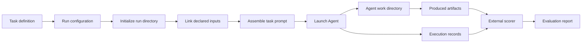

# Reliable Agentic Seismic Monitoring
The goal of this project is to use skill evolution or self-improving agents to obtain more reliable earthquake-location catalogs from seismic observations.

## Assessing the capabilities of general-purpose agents in seismological workflows
- Baseline: a general-purpose Agent framework without expert seismological knowledge or specialized seismic tools.
- Target: an expert-level earthquake-location catalog, such as the Ridgecrest catalog published by Shelly.
- Improvement strategy: a self-improving Agent or an evolving set of skills.

## Baseline and Benchmarking

### Benchmark purpose

The benchmark is designed to determine whether a general-purpose Agent is already capable of performing seismological workflow tasks at a level that is useful for scientific catalog construction. It provides the same task description, observations and execution interface to general-purpose Agents, then compares their workflows and catalogs with expert references.

The benchmark first measures what a general-purpose Agent can achieve independently. These results provide the starting point for later skill evolution or self-improving Agent experiments.

### Baseline

The baseline is a general-purpose Agent without expert seismological knowledge or specialized seismic tools. Codex is the first baseline Agent. The deterministic `main.py` baseline verifies task execution and catalog artifact generation, while the Ridgecrest phase-picking workflow test verifies the end-to-end task path with real waveform inputs.

### Benchmarking progress

1. Multiple scientific cases have been identified and organized as candidate benchmark tasks.
2. Ridgecrest waveform and station data have been collected and prepared for Agent execution.
3. A reusable benchmark framework has been built, including task definitions, input mapping, Agent execution, run records and post-run evaluation.

### Internal benchmark flow

The framework prepares one run from a task definition and run configuration,
exposes the declared inputs to the Agent, launches the selected Agent through
its adapter, and preserves the Agent's artifacts and execution records. The
external scorer reads the completed run and produces the evaluation report.
