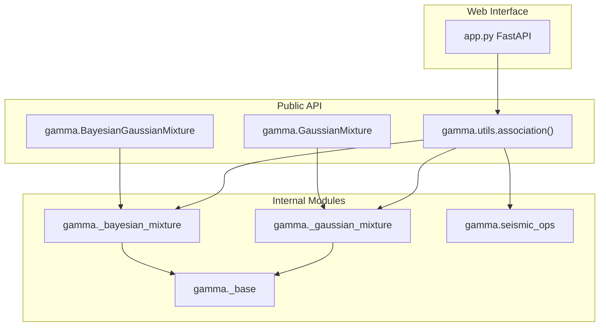
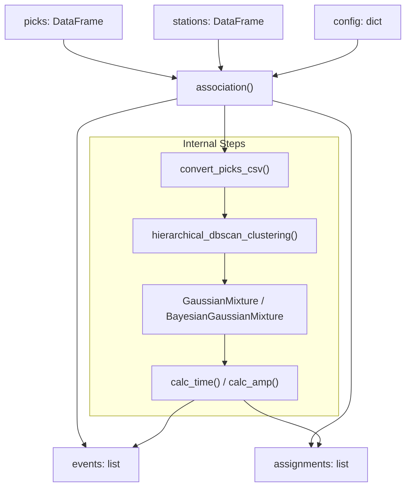
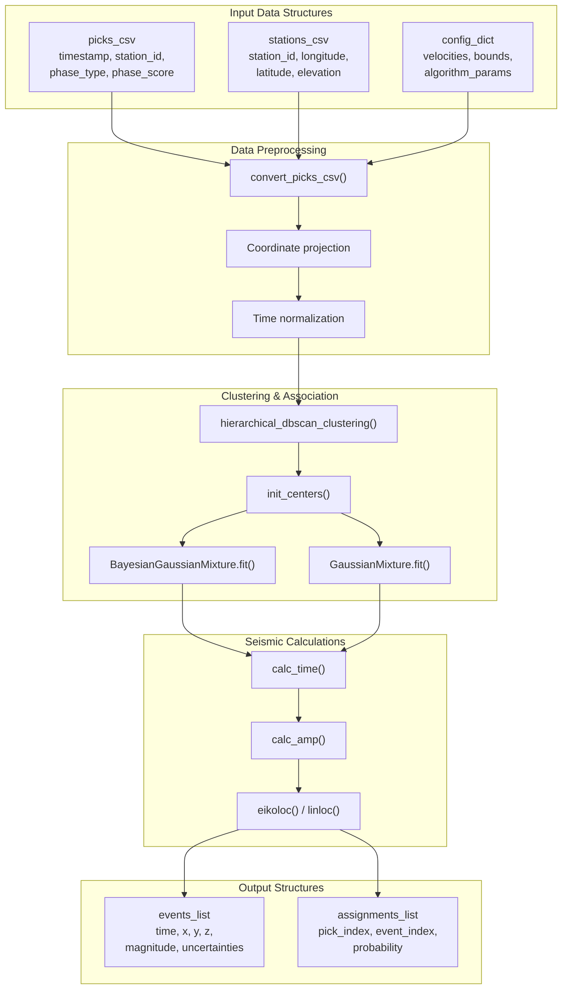
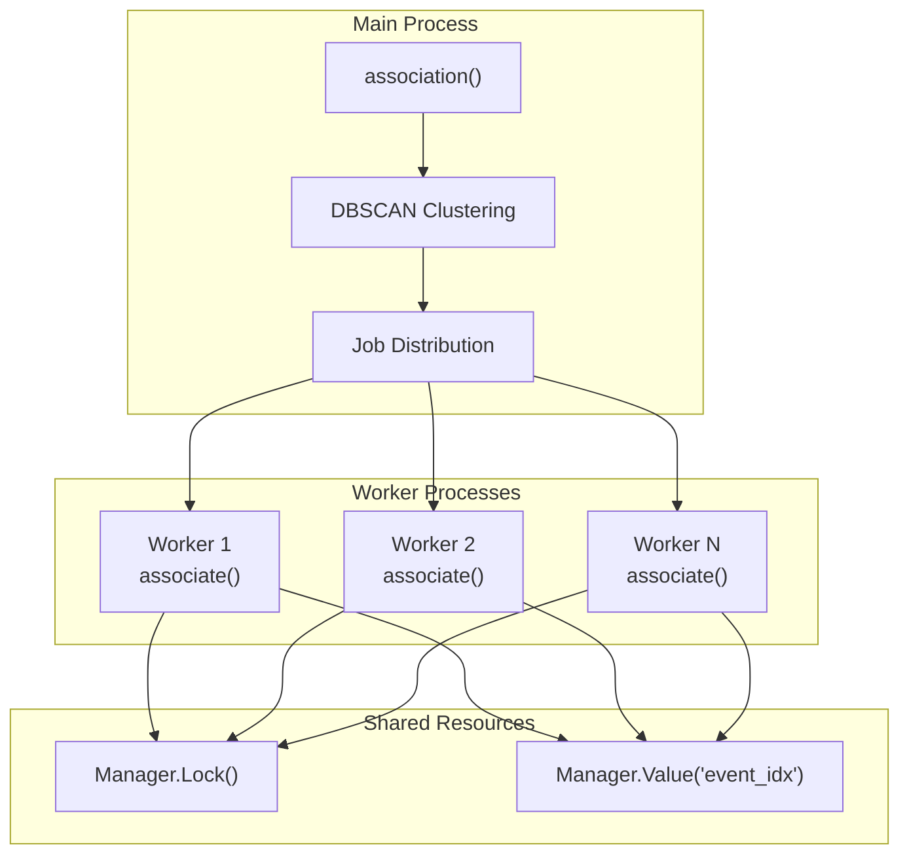

# API Reference

> **Relevant source files**
> * [gamma/__init__.py](https://github.com/AI4EPS/GaMMA/blob/edcf2cec/gamma/__init__.py)
> * [gamma/utils.py](https://github.com/AI4EPS/GaMMA/blob/edcf2cec/gamma/utils.py)
> * [tests/comparison/stations_ridgecrest.csv](https://github.com/AI4EPS/GaMMA/blob/edcf2cec/tests/comparison/stations_ridgecrest.csv)
> * [tests/test_seismoc_ops.py](https://github.com/AI4EPS/GaMMA/blob/edcf2cec/tests/test_seismoc_ops.py)

This page provides comprehensive reference documentation for all GaMMA modules, classes, and functions. It covers the core association algorithms, seismic calculations, mixture model implementations, and web service interfaces.

For practical usage examples, see [Examples and Tutorials](/AI4EPS/GaMMA/5-examples-and-tutorials). For conceptual background, see [Core Concepts](/AI4EPS/GaMMA/3-core-concepts).

## Core Module Structure

The GaMMA library is organized into several key modules that work together to perform seismic event association:



**Main Association Function**



Sources: [gamma/utils.py L155-L276](https://github.com/AI4EPS/GaMMA/blob/edcf2cec/gamma/utils.py#L155-L276)

 [gamma/__init__.py L1-L14](https://github.com/AI4EPS/GaMMA/blob/edcf2cec/gamma/__init__.py#L1-L14)

## Data Flow and Processing Pipeline



Sources: [gamma/utils.py L54-L85](https://github.com/AI4EPS/GaMMA/blob/edcf2cec/gamma/utils.py#L54-L85)

 [gamma/utils.py L155-L276](https://github.com/AI4EPS/GaMMA/blob/edcf2cec/gamma/utils.py#L155-L276)

## Function Parameter Reference

### Core Association Function

The main entry point `association()` accepts the following parameters:

| Parameter | Type | Description | Default |
| --- | --- | --- | --- |
| `picks` | `pandas.DataFrame` | Pick data with columns: timestamp, id, type, prob, amp | Required |
| `stations` | `pandas.DataFrame` | Station metadata with columns: id, longitude, latitude, elevation | Required |
| `config` | `dict` | Configuration parameters (see Configuration Schema below) | Required |
| `event_idx0` | `int` | Starting event index for numbering | `0` |
| `method` | `str` | Association method: "BGMM" or "GMM" | `"BGMM"` |

### Configuration Schema

```mermaid
flowchart TD

A["config dict"]
B["Algorithm Parameters"]
C["Velocity Model"]
D["Coordinate System"]
E["Filtering Thresholds"]
B1["method: 'BGMM'/'GMM'"]
B2["use_dbscan: bool"]
B3["use_amplitude: bool"]
B4["min_picks_per_eq: int"]
B5["oversample_factor: int"]
C1["vel: {'p': 6.0, 's': 3.46}"]
C2["eikonal: dict/None"]
D1["dims: ['x(km)', 'y(km)', 'z(km)']"]
D2["x(km): [min, max]"]
D3["y(km): [min, max]"]
D4["z(km): [min, max]"]
D5["bfgs_bounds: optimization bounds"]
E1["max_sigma11: float"]
E2["max_sigma22: float"]
E3["dbscan_eps: float"]
E4["dbscan_min_samples: int"]

A --> B
A --> C
A --> D
A --> E
B --> B1
B --> B2
B --> B3
B --> B4
B --> B5
C --> C1
C --> C2
D --> D1
D --> D2
D --> D3
D --> D4
D --> D5
E --> E1
E --> E2
E --> E3
E --> E4
```



Sources: [gamma/utils.py L155-L167](https://github.com/AI4EPS/GaMMA/blob/edcf2cec/gamma/utils.py#L155-L167)

 [gamma/utils.py L319-L357](https://github.com/AI4EPS/GaMMA/blob/edcf2cec/gamma/utils.py#L319-L357)

## Data Conversion Functions

### convert_picks_csv()

Converts input DataFrames to internal numpy arrays for processing:

```markdown
# Function signature
convert_picks_csv(picks, stations, config) -> tuple
```

**Returns:**

* `data`: Time and amplitude arrays `[N, 1]` or `[N, 2]`
* `locs`: Station coordinates `[N, 3]`
* `phase_type`: Phase labels `[N]`
* `phase_weight`: Pick weights `[N, 1]`
* `pick_idx`: Original pick indices `[N]`
* `pick_station_id`: Station-phase identifiers `[N]`
* `timestamp0`: Reference timestamp for normalization

Sources: [gamma/utils.py L54-L85](https://github.com/AI4EPS/GaMMA/blob/edcf2cec/gamma/utils.py#L54-L85)

### Clustering Functions

#### hierarchical_dbscan_clustering()

Implements adaptive DBSCAN clustering with hierarchical refinement:

```
hierarchical_dbscan_clustering(
    data, phase_loc, phase_type, phase_weight, vel,
    eps=15, min_samples=3, min_cluster_size=500, 
    max_time_space_ratio=10
) -> labels
```

Key features:

* Initial DBSCAN clustering in time-space domain
* Iterative refinement with decreasing `eps` values
* Splits clusters that violate time-space consistency
* Stops when no further improvements are made

Sources: [gamma/utils.py L88-L152](https://github.com/AI4EPS/GaMMA/blob/edcf2cec/gamma/utils.py#L88-L152)

#### init_centers()

Initializes cluster centers for mixture model fitting:

```
init_centers(config, data_, locs_, type_, weight_, max_num_event=1) -> centers_init
```

Strategy:

1. Sort picks by time, prioritizing P-waves
2. Sample picks evenly across time range
3. Add spatial perturbation based on station distribution
4. Initialize at middle depth of search bounds

Sources: [gamma/utils.py L605-L657](https://github.com/AI4EPS/GaMMA/blob/edcf2cec/gamma/utils.py#L605-L657)

## Mixture Model Classes

### BayesianGaussianMixture

Extended from scikit-learn with seismic-specific features:

```javascript
from gamma import BayesianGaussianMixture

bgmm = BayesianGaussianMixture(
    n_components=max_events,
    weight_concentration_prior=1.0/max_events,
    covariance_prior=covariance_matrix,
    init_params="centers",
    centers_init=initial_centers,
    station_locs=station_coordinates, 
    phase_type=phase_labels,
    phase_weight=pick_weights,
    vel=velocity_model,
    eikonal=eikonal_solver,
    bounds=optimization_bounds,
    random_state=42
)
```

Key seismic extensions:

* Custom initialization with seismic centers
* Travel time calculation integration
* Phase-specific velocity models
* Eikonal solver support for complex velocity structures

Sources: [gamma/utils.py L360-L379](https://github.com/AI4EPS/GaMMA/blob/edcf2cec/gamma/utils.py#L360-L379)

### GaussianMixture

Standard GMM with seismic adaptations:

```javascript
from gamma import GaussianMixture

gmm = GaussianMixture(
    n_components=max_events,
    init_params="centers", 
    centers_init=initial_centers,
    station_locs=station_coordinates,
    phase_type=phase_labels,
    phase_weight=pick_weights,
    vel=velocity_model,
    eikonal=eikonal_solver,
    bounds=optimization_bounds,
    random_state=42
)
```

Sources: [gamma/utils.py L380-L398](https://github.com/AI4EPS/GaMMA/blob/edcf2cec/gamma/utils.py#L380-L398)

## Seismic Operations Module

### Travel Time Calculation

#### calc_time()

Calculates theoretical travel times for given event locations:

```javascript
from gamma.seismic_ops import calc_time

travel_times = calc_time(
    event_centers,    # [n_events, 4] - x, y, z, t0
    station_locs,     # [n_stations, 3] - x, y, z  
    phase_types,      # [n_stations] - 'p' or 's'
    vel=velocity_dict,         # {'p': 6.0, 's': 3.46}
    eikonal=eikonal_solver    # None for 1D or dict for 3D
)
```

**Velocity Models:**

* **1D Model**: Constant velocities (when `eikonal=None`)
* **3D Model**: Eikonal solver with complex velocity structure

Sources: [gamma/utils.py L428-L434](https://github.com/AI4EPS/GaMMA/blob/edcf2cec/gamma/utils.py#L428-L434)

 [tests/test_seismoc_ops.py L115-L122](https://github.com/AI4EPS/GaMMA/blob/edcf2cec/tests/test_seismoc_ops.py#L115-L122)

### Location Algorithms

#### linloc() - Linear Location

Fast linear location assuming constant velocity:

```javascript
from gamma.seismic_ops import linloc

location, loss = linloc(
    initial_guess,    # [1, 4] - x, y, z, t0
    phase_times,      # [n_picks, 1] 
    phase_types,      # [n_picks]
    station_locs,     # [n_picks, 3]
    phase_weights,    # [n_picks, 1]
    max_iter=1000
)
```

Sources: [tests/test_seismoc_ops.py L106-L109](https://github.com/AI4EPS/GaMMA/blob/edcf2cec/tests/test_seismoc_ops.py#L106-L109)

#### eikoloc() - Eikonal Location

Precise location using eikonal solver:

```javascript
from gamma.seismic_ops import eikoloc

location, loss = eikoloc(
    initial_guess,    # [1, 4] - x, y, z, t0  
    phase_times,      # [n_picks, 1]
    phase_types,      # [n_picks]
    station_locs,     # [n_picks, 3] 
    phase_weights,    # [n_picks, 1]
    up=p_wave_grid,   # Precomputed P-wave travel time grid
    us=s_wave_grid,   # Precomputed S-wave travel time grid
    rgrid=r_coordinates,
    zgrid=z_coordinates, 
    h=grid_spacing,
    max_iter=1000
)
```

Sources: [tests/test_seismoc_ops.py L102-L104](https://github.com/AI4EPS/GaMMA/blob/edcf2cec/tests/test_seismoc_ops.py#L102-L104)

### Amplitude Calculation

#### calc_amp()

Calculates theoretical amplitude based on source-receiver distance:

```javascript
from gamma.seismic_ops import calc_amp

amplitudes = calc_amp(
    magnitude_centers,  # [n_events, 1] - magnitude
    event_centers,      # [n_events, 4] - x, y, z, t0
    station_locs        # [n_stations, 3] - x, y, z
)
```

Sources: [gamma/utils.py L458-L462](https://github.com/AI4EPS/GaMMA/blob/edcf2cec/gamma/utils.py#L458-L462)

## Output Data Structures

### Events List

Each event is represented as a dictionary with the following fields:

```css
event = {
    "time": "2019-07-04T17:33:49.123",     # ISO format timestamp
    "x(km)": 10.5,                         # X coordinate 
    "y(km)": -5.2,                        # Y coordinate
    "z(km)": 8.0,                         # Depth
    "magnitude": 2.1,                      # Magnitude (999 if not used)
    "sigma_time": 0.15,                    # Time uncertainty (seconds)
    "sigma_amp": 0.3,                      # Amplitude uncertainty  
    "cov_time_amp": 0.02,                  # Time-amplitude covariance
    "gamma_score": 0.85,                   # Association probability
    "num_picks": 12,                       # Total picks associated
    "num_p_picks": 7,                      # P-wave picks
    "num_s_picks": 5,                      # S-wave picks  
    "event_index": 42                      # Unique event identifier
}
```

### Assignment List

Pick-to-event assignments as tuples:

```markdown
assignment = [
    (pick_index, event_index, probability),
    # Example:
    (156, 42, 0.92),  # Pick 156 assigned to event 42 with 92% probability
    (157, 42, 0.88),  # Pick 157 assigned to event 42 with 88% probability  
    # ...
]
```

Sources: [gamma/utils.py L507-L528](https://github.com/AI4EPS/GaMMA/blob/edcf2cec/gamma/utils.py#L507-L528)

## Processing Control and Parallelization

### Multiprocessing Architecture



**Configuration Parameters:**

* `ncpu`: Number of CPU cores to use
* Automatic detection: `min(clusters//4, min(32, cpu_count-1))`
* Platform-specific process spawning (fork vs spawn)

Sources: [gamma/utils.py L194-L244](https://github.com/AI4EPS/GaMMA/blob/edcf2cec/gamma/utils.py#L194-L244)

### Filtering and Quality Control

The association process applies multiple filtering stages:

1. **Time Residual Filter**: `|t_obs - t_calc| < max_sigma11`
2. **Station Duplicate Filter**: Keep best pick per station per event
3. **Amplitude Filter**: `|a_obs - a_calc| < max_sigma22` (if enabled)
4. **Minimum Pick Requirements**: `num_picks >= min_picks_per_eq`
5. **Phase Balance**: Minimum P and S picks (if configured)
6. **Station Coverage**: Minimum number of unique stations

Sources: [gamma/utils.py L427-L490](https://github.com/AI4EPS/GaMMA/blob/edcf2cec/gamma/utils.py#L427-L490)