# Advanced Topics

> **Relevant source files**
> * [docs/example_phasenet_ransac.ipynb](https://github.com/AI4EPS/GaMMA/blob/edcf2cec/docs/example_phasenet_ransac.ipynb)
> * [tests/comparison/real/run.py](https://github.com/AI4EPS/GaMMA/blob/edcf2cec/tests/comparison/real/run.py)

This document covers advanced usage patterns and specialized applications of GaMMA, including RANSAC integration for robust event location, custom velocity model implementation, and integration with other seismological software tools. This material assumes familiarity with basic GaMMA concepts and API usage.

For basic GaMMA usage and API reference, see [Core Association Functions](/AI4EPS/GaMMA/4.1-core-association-functions). For standard examples and tutorials, see [Examples and Tutorials](/AI4EPS/GaMMA/5-examples-and-tutorials).

## RANSAC Integration

GaMMA can be combined with RANSAC (Random Sample Consensus) algorithms to improve the robustness of earthquake event location, particularly when dealing with noisy pick data or complex velocity structures.

The integration leverages GaMMA's probabilistic association capabilities alongside RANSAC's outlier detection to iteratively refine event locations:

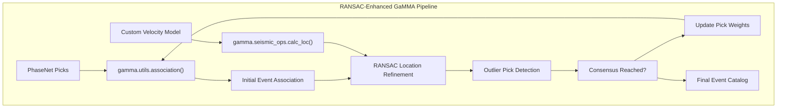

**RANSAC Parameter Configuration:**

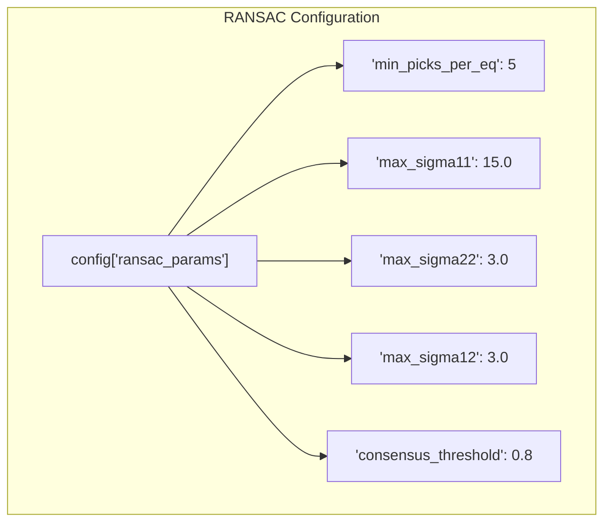

Sources: [docs/example_phasenet_ransac.ipynb L332-L338](https://github.com/AI4EPS/GaMMA/blob/edcf2cec/docs/example_phasenet_ransac.ipynb#L332-L338)

## Custom Velocity Models

GaMMA supports sophisticated velocity models through its eikonal solver implementation, enabling accurate travel time calculations for complex geological structures.

### Velocity Model Configuration

The eikonal solver can handle both 1D layered velocity models and more complex 3D structures:

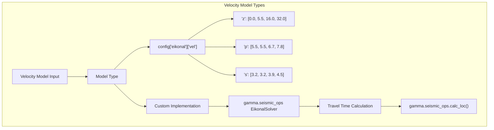

**Ridgecrest Velocity Model Example:**

```css
# 1D layered velocity model for Ridgecrest region
zz = [0.0, 5.5, 16.0, 32.0]  # Depth layers (km)
vp = [5.5, 5.5, 6.7, 7.8]    # P-wave velocities (km/s)
vs = [v / 1.73 for v in vp]   # S-wave velocities (km/s)
vel = {"z": zz, "p": vp, "s": vs}
config["eikonal"] = {
    "vel": vel, 
    "h": 1.0,  # Grid spacing
    "xlim": config["x(km)"], 
    "ylim": config["y(km)"], 
    "zlim": config["z(km)"]
}
```

**IASP91 Global Model Example:**

```css
# Global velocity model (e.g., for teleseismic events)
velocity_model = pd.read_csv("iasp91.csv", names=["zz", "rho", "vp", "vs"])
vel = {
    "z": velocity_model["zz"].values, 
    "p": velocity_model["vp"].values, 
    "s": velocity_model["vs"].values
}
```

Sources: [docs/example_phasenet_ransac.ipynb L308-L325](https://github.com/AI4EPS/GaMMA/blob/edcf2cec/docs/example_phasenet_ransac.ipynb#L308-L325)

 [docs/example_phasenet_ransac.ipynb L317-L322](https://github.com/AI4EPS/GaMMA/blob/edcf2cec/docs/example_phasenet_ransac.ipynb#L317-L322)

### Eikonal Solver Integration

The eikonal solver provides accurate travel times for complex velocity structures:

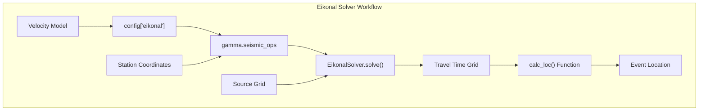

Sources: [docs/example_phasenet_ransac.ipynb L316-L322](https://github.com/AI4EPS/GaMMA/blob/edcf2cec/docs/example_phasenet_ransac.ipynb#L316-L322)

## Advanced Configuration Parameters

GaMMA provides extensive configuration options for fine-tuning association performance and quality control.

### Association Method Selection

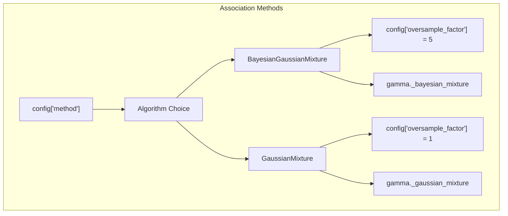

### DBSCAN Pre-clustering

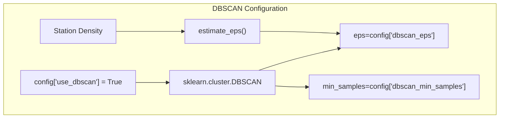

### Quality Control Parameters

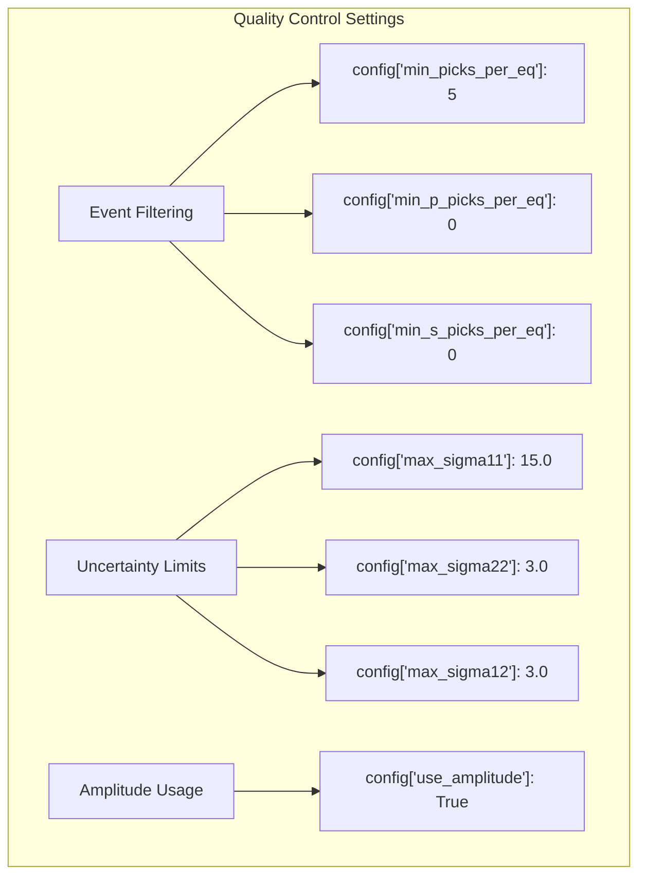

Sources: [docs/example_phasenet_ransac.ipynb L270-L338](https://github.com/AI4EPS/GaMMA/blob/edcf2cec/docs/example_phasenet_ransac.ipynb#L270-L338)

## Integration with PhaseNet

GaMMA integrates seamlessly with PhaseNet deep learning picks, providing a complete workflow from raw seismic data to final event catalogs.

### PhaseNet Pick Processing

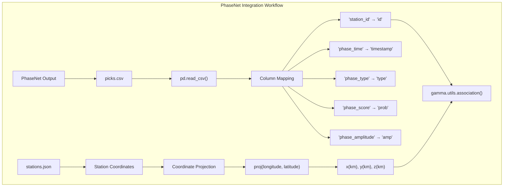

### Data Format Requirements

| Column | Description | Example |
| --- | --- | --- |
| `id` | Station identifier | "BG.AL1..DP" |
| `timestamp` | Pick time | "2023-01-01 18:35:33.390" |
| `prob` | Detection probability | 0.349 |
| `type` | Phase type | "P" or "S" |
| `amp` | Phase amplitude | 0.000007 |

Sources: [docs/example_phasenet_ransac.ipynb L232-L242](https://github.com/AI4EPS/GaMMA/blob/edcf2cec/docs/example_phasenet_ransac.ipynb#L232-L242)

## Performance Optimization

### Parallel Processing Configuration

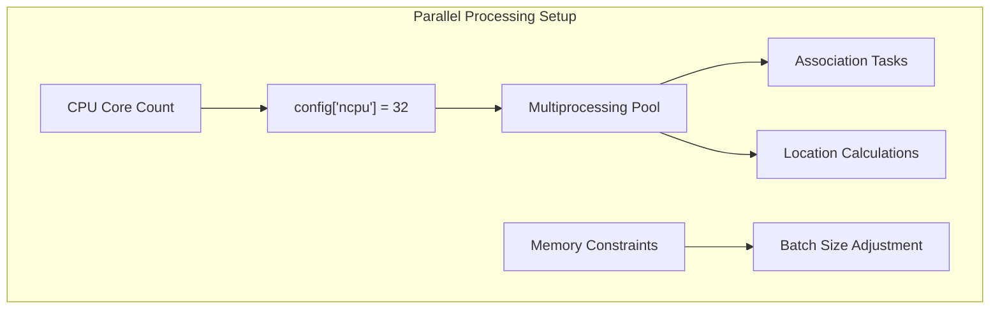

### Memory Management

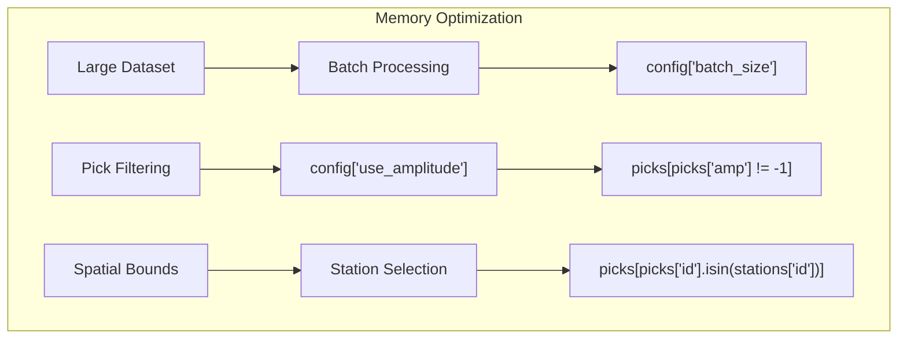

Sources: [docs/example_phasenet_ransac.ipynb L329-L342](https://github.com/AI4EPS/GaMMA/blob/edcf2cec/docs/example_phasenet_ransac.ipynb#L329-L342)

## Integration with Other Seismological Tools

### REAL Algorithm Comparison

GaMMA can be benchmarked against other association algorithms like REAL:

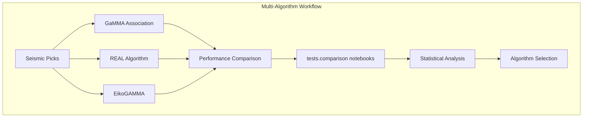

### External Tool Integration

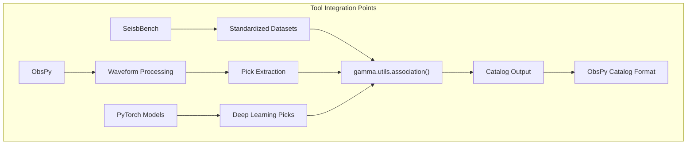

Sources: [docs/example_phasenet_ransac.ipynb L1-L67](https://github.com/AI4EPS/GaMMA/blob/edcf2cec/docs/example_phasenet_ransac.ipynb#L1-L67)

## Advanced Error Analysis

### Uncertainty Quantification

The uncertainty parameters `max_sigma11`, `max_sigma22`, and `max_sigma12` control the covariance matrix bounds for event location:

* `max_sigma11`: Maximum time uncertainty (seconds)
* `max_sigma22`: Maximum amplitude uncertainty (log10(m/s))
* `max_sigma12`: Maximum covariance between time and amplitude

### Location Quality Assessment

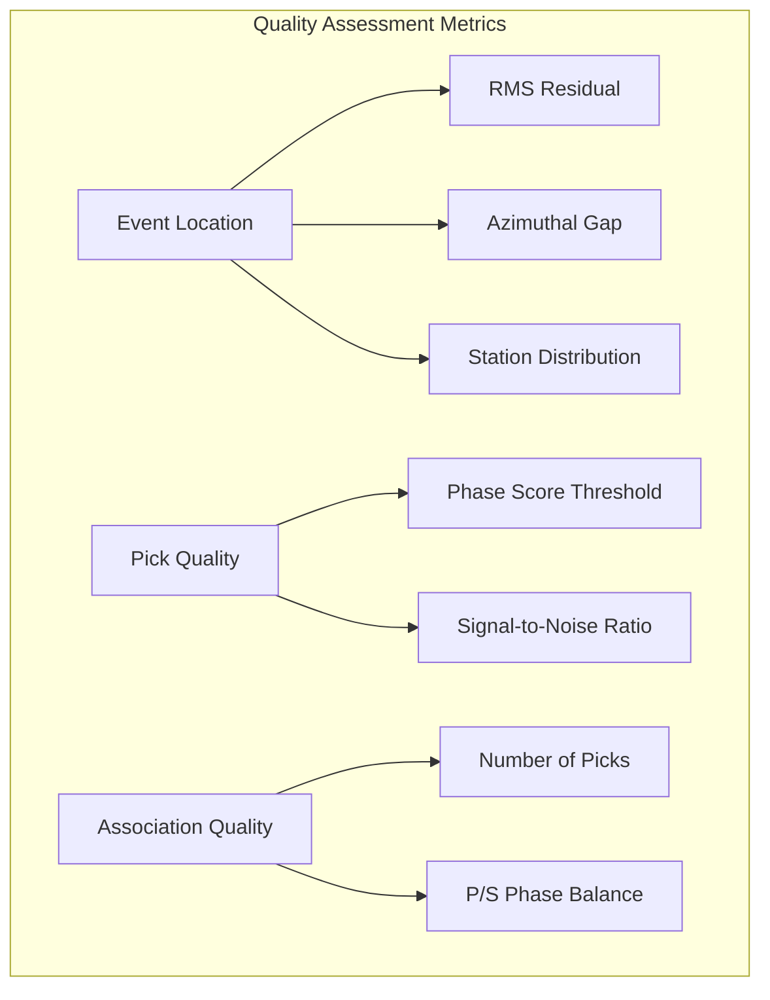

This advanced configuration enables robust earthquake detection and location across diverse seismological applications, from local monitoring networks to regional catalog construction.

Sources: [docs/example_phasenet_ransac.ipynb L332-L338](https://github.com/AI4EPS/GaMMA/blob/edcf2cec/docs/example_phasenet_ransac.ipynb#L332-L338)