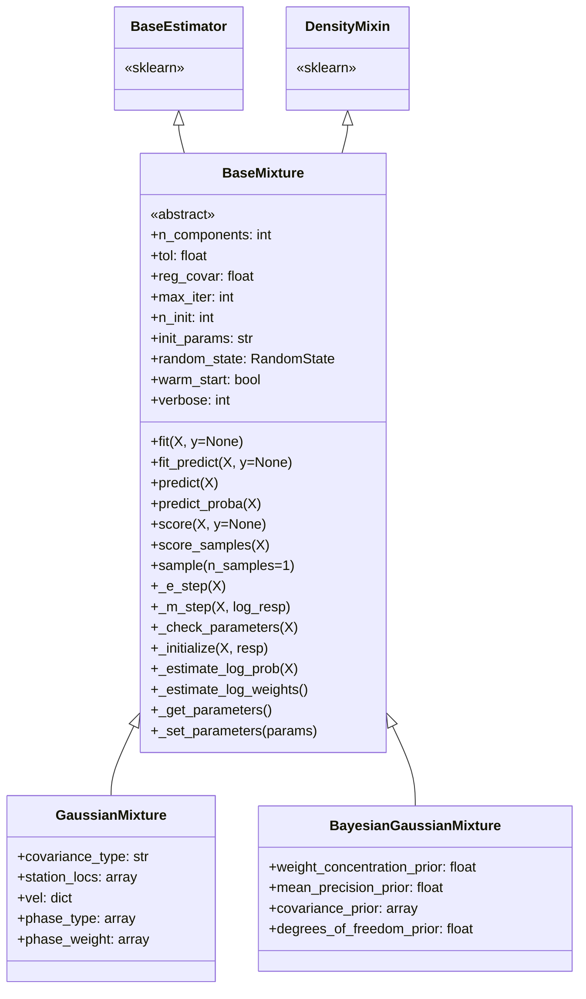
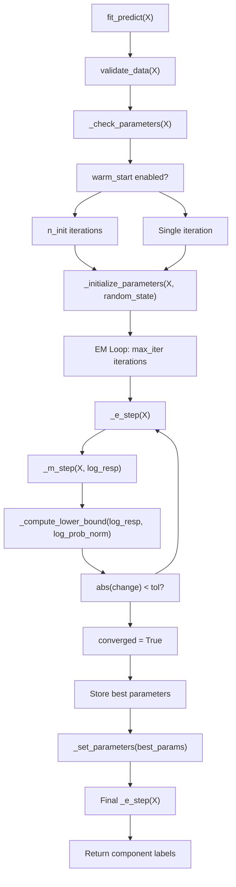
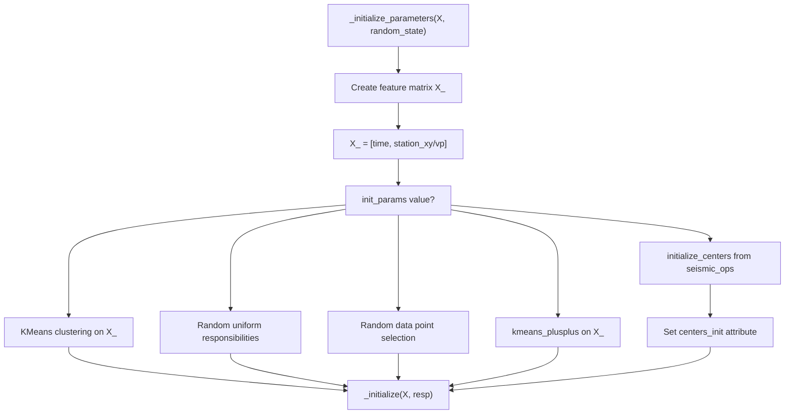
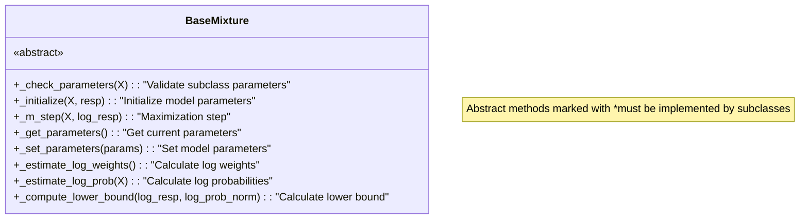
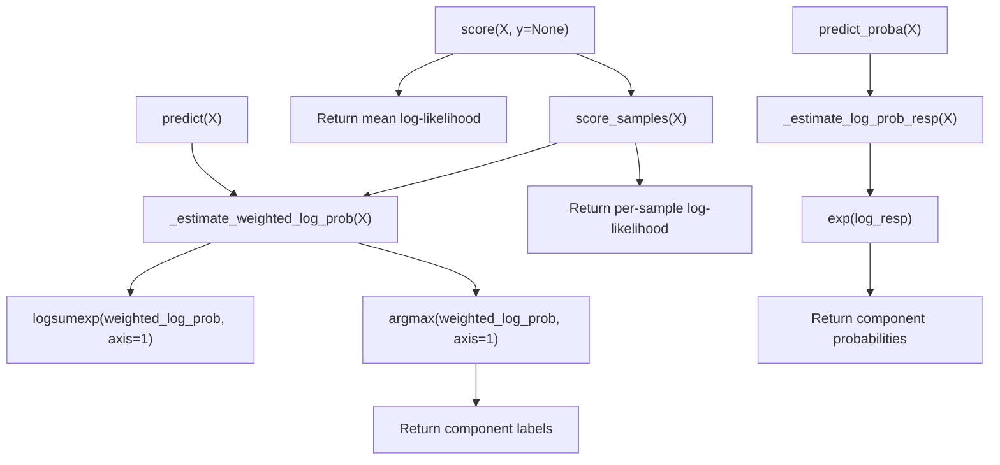

# Base Classes

> **Relevant source files**
> * [docs/assets/diagram_gamma_annotated.png](https://github.com/AI4EPS/GaMMA/blob/edcf2cec/docs/assets/diagram_gamma_annotated.png)
> * [gamma/_base.py](https://github.com/AI4EPS/GaMMA/blob/edcf2cec/gamma/_base.py)

This page documents the foundational `BaseMixture` class that provides the core EM (Expectation-Maximization) algorithm implementation for all mixture models in GaMMA. This abstract base class defines the interface and common functionality shared by the Gaussian mixture model variants.

For information about the specific mixture model implementations that inherit from this base class, see [Mixture Model Classes](/AI4EPS/GaMMA/4.3-mixture-model-classes).

## BaseMixture Class Architecture

The `BaseMixture` class serves as the abstract foundation for all mixture models in GaMMA, providing a standardized interface and common EM algorithm implementation. It inherits from scikit-learn's `BaseEstimator` and `DensityMixin` to ensure compatibility with the scikit-learn ecosystem.

**Sources:** [gamma/_base.py L40-L84](https://github.com/AI4EPS/GaMMA/blob/edcf2cec/gamma/_base.py#L40-L84)

## EM Algorithm Implementation

The `BaseMixture` class implements the complete EM algorithm workflow, managing multiple initializations and convergence checking. The algorithm alternates between expectation and maximization steps until convergence or maximum iterations are reached.

The EM algorithm tracks the lower bound of the log-likelihood at each iteration and selects the best performing initialization run. The process includes comprehensive logging and convergence monitoring.

**Sources:** [gamma/_base.py L189-L300](https://github.com/AI4EPS/GaMMA/blob/edcf2cec/gamma/_base.py#L189-L300)

## Parameter Initialization Strategies

The `BaseMixture` class supports multiple initialization strategies for mixture model parameters, including seismic-specific initialization methods that leverage domain knowledge about travel times and station locations.

| Initialization Method | Description | Use Case |
| --- | --- | --- |
| `"kmeans"` | K-means clustering on time-space features | General purpose, fast initialization |
| `"random"` | Random uniform responsibilities | Exploration of parameter space |
| `"random_from_data"` | Random selection from data points | Data-driven initialization |
| `"k-means++"` | K-means++ algorithm | Improved cluster center selection |
| `"centers"` | Seismic-specific center initialization | Domain-specific initialization using travel times |

The seismic-specific `"centers"` initialization method calls `initialize_centers` from the `seismic_ops` module, which uses travel time calculations and station geometry to provide physically meaningful initial cluster centers.

**Sources:** [gamma/_base.py L98-L146](https://github.com/AI4EPS/GaMMA/blob/edcf2cec/gamma/_base.py#L98-L146)

 [gamma/_base.py L19](https://github.com/AI4EPS/GaMMA/blob/edcf2cec/gamma/_base.py#L19-L19)

## Abstract Methods Interface

The `BaseMixture` class defines several abstract methods that must be implemented by concrete subclasses. This interface ensures consistent behavior across different mixture model variants while allowing for specialized implementations.

These abstract methods provide clear extension points for different mixture model types:

* **Parameter Management**: `_get_parameters()`, `_set_parameters()`, `_check_parameters()`
* **EM Algorithm Steps**: `_initialize()`, `_m_step()`, `_compute_lower_bound()`
* **Probability Estimation**: `_estimate_log_weights()`, `_estimate_log_prob()`

**Sources:** [gamma/_base.py L88-L96](https://github.com/AI4EPS/GaMMA/blob/edcf2cec/gamma/_base.py#L88-L96)

 [gamma/_base.py L147-L157](https://github.com/AI4EPS/GaMMA/blob/edcf2cec/gamma/_base.py#L147-L157)

 [gamma/_base.py L321-L333](https://github.com/AI4EPS/GaMMA/blob/edcf2cec/gamma/_base.py#L321-L333)

 [gamma/_base.py L335-L341](https://github.com/AI4EPS/GaMMA/blob/edcf2cec/gamma/_base.py#L335-L341)

 [gamma/_base.py L484-L508](https://github.com/AI4EPS/GaMMA/blob/edcf2cec/gamma/_base.py#L484-L508)

## Parameter Validation and Constraints

The `BaseMixture` class includes comprehensive parameter validation using scikit-learn's constraint system. This ensures that all parameters are within valid ranges and of appropriate types before fitting begins.

| Parameter | Constraint | Description |
| --- | --- | --- |
| `n_components` | `Interval(Integral, 1, None)` | Number of mixture components ≥ 1 |
| `tol` | `Interval(Real, 0.0, None)` | Convergence tolerance ≥ 0 |
| `reg_covar` | `Interval(Real, 0.0, None)` | Covariance regularization ≥ 0 |
| `max_iter` | `Interval(Integral, 0, None)` | Maximum iterations ≥ 0 |
| `n_init` | `Interval(Integral, 1, None)` | Number of initializations ≥ 1 |
| `init_params` | `StrOptions({"kmeans", "random", ...})` | Initialization strategy |
| `verbose_interval` | `Interval(Integral, 1, None)` | Verbose output interval ≥ 1 |

The validation system automatically checks these constraints during the `@_fit_context` decorator execution, providing clear error messages for invalid parameter combinations.

**Sources:** [gamma/_base.py L47-L58](https://github.com/AI4EPS/GaMMA/blob/edcf2cec/gamma/_base.py#L47-L58)

 [gamma/_base.py L217-L224](https://github.com/AI4EPS/GaMMA/blob/edcf2cec/gamma/_base.py#L217-L224)

## Utility Methods and Functionality

The `BaseMixture` class provides several utility methods for model evaluation, sampling, and debugging:

### Model Evaluation Methods

### Sample Generation

The `sample()` method generates synthetic data points from the fitted mixture model, useful for model validation and data augmentation. It uses multinomial sampling to determine component membership and then generates samples from the appropriate component distributions.

**Sources:** [gamma/_base.py L343-L379](https://github.com/AI4EPS/GaMMA/blob/edcf2cec/gamma/_base.py#L343-L379)

 [gamma/_base.py L381-L417](https://github.com/AI4EPS/GaMMA/blob/edcf2cec/gamma/_base.py#L381-L417)

 [gamma/_base.py L418-L469](https://github.com/AI4EPS/GaMMA/blob/edcf2cec/gamma/_base.py#L418-L469)