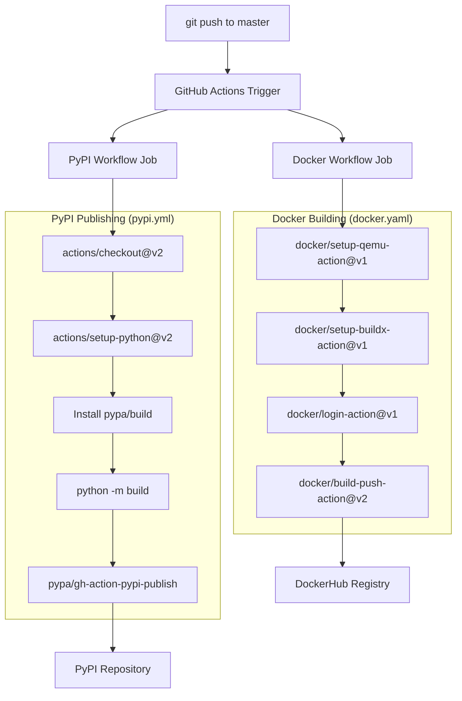
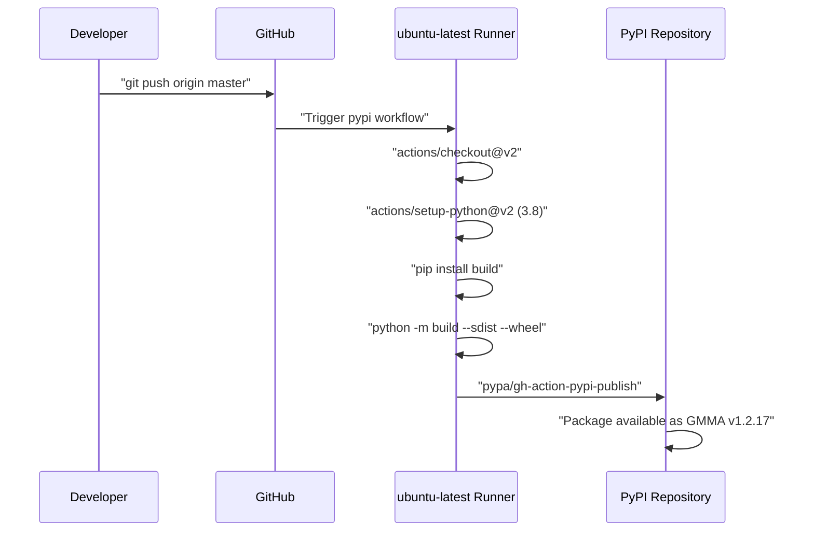
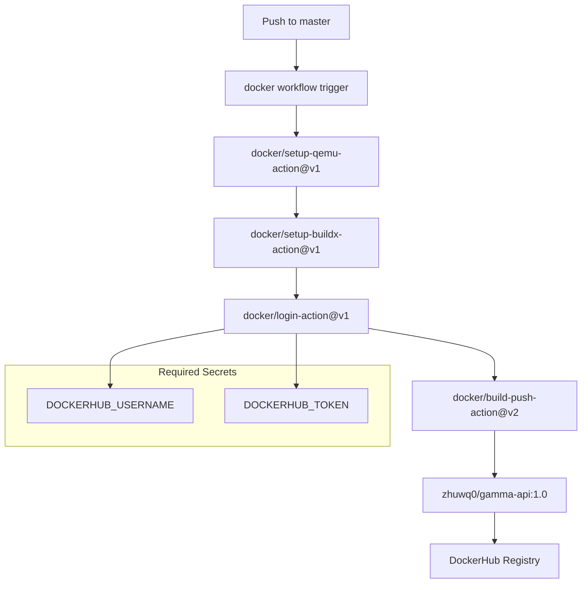

# CI/CD Pipeline

> **Relevant source files**
> * [.github/workflows/docker.yaml](https://github.com/AI4EPS/GaMMA/blob/edcf2cec/.github/workflows/docker.yaml)
> * [.github/workflows/pypi.yml](https://github.com/AI4EPS/GaMMA/blob/edcf2cec/.github/workflows/pypi.yml)
> * [setup.py](https://github.com/AI4EPS/GaMMA/blob/edcf2cec/setup.py)
> * [tests/GaMMA.ipynb](https://github.com/AI4EPS/GaMMA/blob/edcf2cec/tests/GaMMA.ipynb)

This page documents the continuous integration and deployment (CI/CD) pipeline for GaMMA, which automates the build, test, and deployment processes using GitHub Actions. The pipeline handles automatic publishing to PyPI and Docker image distribution when changes are pushed to the master branch.

For information about setting up the development environment, see [Development Environment](/AI4EPS/GaMMA/7.1-development-environment). For documentation system deployment, see [Documentation System](/AI4EPS/GaMMA/7.3-documentation-system).

## Overview

GaMMA uses GitHub Actions to implement a CI/CD pipeline with two main workflows: PyPI package publishing and Docker image building. Both workflows are triggered automatically on pushes to the master branch, ensuring that the latest stable version is always available through multiple distribution channels.

The pipeline architecture follows a trunk-based deployment model where the master branch serves as the single source of truth for production releases.

### CI/CD Workflow Architecture

Sources: [.github/workflows/pypi.yml L1-L46](https://github.com/AI4EPS/GaMMA/blob/edcf2cec/.github/workflows/pypi.yml#L1-L46)

 [.github/workflows/docker.yaml L1-L33](https://github.com/AI4EPS/GaMMA/blob/edcf2cec/.github/workflows/docker.yaml#L1-L33)

## PyPI Publishing Workflow

The PyPI publishing workflow automatically builds and uploads new package versions to the Python Package Index whenever code is pushed to master. This workflow is defined in the `pypi.yml` file and uses the official PyPI publishing action.

### PyPI Workflow Configuration

| Component | Configuration | Source |
| --- | --- | --- |
| Trigger | `push` to `master` branch | [.github/workflows/pypi.yml L2-L5](https://github.com/AI4EPS/GaMMA/blob/edcf2cec/.github/workflows/pypi.yml#L2-L5) |
| Runner | `ubuntu-latest` | [.github/workflows/pypi.yml L18](https://github.com/AI4EPS/GaMMA/blob/edcf2cec/.github/workflows/pypi.yml#L18-L18) |
| Python Version | `3.8` | [.github/workflows/pypi.yml L24](https://github.com/AI4EPS/GaMMA/blob/edcf2cec/.github/workflows/pypi.yml#L24-L24) |
| Build Tool | `pypa/build` | [.github/workflows/pypi.yml L26-L30](https://github.com/AI4EPS/GaMMA/blob/edcf2cec/.github/workflows/pypi.yml#L26-L30) |
| Authentication | `PYPI_TOKEN` secret | [.github/workflows/pypi.yml L44](https://github.com/AI4EPS/GaMMA/blob/edcf2cec/.github/workflows/pypi.yml#L44-L44) |

The workflow performs the following steps:

1. **Checkout**: Uses `actions/checkout@v2` to retrieve the source code
2. **Python Setup**: Configures Python 3.8 environment using `actions/setup-python@v2`
3. **Build Installation**: Installs the `pypa/build` tool for creating distribution packages
4. **Package Building**: Creates both source distribution (`sdist`) and wheel (`wheel`) packages
5. **Publishing**: Uploads packages to PyPI using `pypa/gh-action-pypi-publish@release/v1`

### PyPI Build Process

Sources: [.github/workflows/pypi.yml L19-L44](https://github.com/AI4EPS/GaMMA/blob/edcf2cec/.github/workflows/pypi.yml#L19-L44)

 [setup.py L3-L10](https://github.com/AI4EPS/GaMMA/blob/edcf2cec/setup.py#L3-L10)

## Docker Image Build Workflow

The Docker workflow builds and pushes container images to DockerHub, enabling containerized deployments of GaMMA. This workflow uses multi-platform building capabilities through Docker Buildx.

### Docker Workflow Configuration

The workflow configuration includes:

* **Multi-platform Support**: Uses QEMU for cross-platform builds
* **BuildKit**: Leverages Docker Buildx for enhanced build features
* **Registry Authentication**: Authenticates with DockerHub using stored secrets
* **Image Tagging**: Pushes images with the tag `zhuwq0/gamma-api:1.0`

### Docker Build Process

Sources: [.github/workflows/docker.yaml L8-L32](https://github.com/AI4EPS/GaMMA/blob/edcf2cec/.github/workflows/docker.yaml#L8-L32)

## Secrets and Configuration Management

The CI/CD pipeline relies on GitHub repository secrets for secure authentication with external services:

### Required Secrets

| Secret Name | Purpose | Used In |
| --- | --- | --- |
| `PYPI_TOKEN` | PyPI API token for package publishing | [.github/workflows/pypi.yml L44](https://github.com/AI4EPS/GaMMA/blob/edcf2cec/.github/workflows/pypi.yml#L44-L44) |
| `DOCKERHUB_USERNAME` | DockerHub account username | [.github/workflows/docker.yaml L21](https://github.com/AI4EPS/GaMMA/blob/edcf2cec/.github/workflows/docker.yaml#L21-L21) |
| `DOCKERHUB_TOKEN` | DockerHub access token | [.github/workflows/docker.yaml L22](https://github.com/AI4EPS/GaMMA/blob/edcf2cec/.github/workflows/docker.yaml#L22-L22) |

### Package Configuration

The package metadata is managed through `setup.py`, which defines:

* **Package Name**: `GMMA`
* **Version**: `1.2.17`
* **Dependencies**: Core packages including `scikit-learn==1.7`, `scipy`, `numpy`, `pyproj`, `tqdm`, `numba`
* **Description**: Gaussian Mixture Model Associator for seismic event association

Sources: [setup.py L1-L11](https://github.com/AI4EPS/GaMMA/blob/edcf2cec/setup.py#L1-L11)

## Deployment Process

The deployment process follows an automated approach where both distribution channels are updated simultaneously:

1. **Code Integration**: Developers push changes to the master branch
2. **Automatic Triggering**: GitHub Actions detects the push and triggers both workflows
3. **Parallel Execution**: PyPI and Docker workflows run concurrently
4. **Distribution**: New package version becomes available on PyPI, new Docker image on DockerHub
5. **Verification**: Workflow logs provide build status and artifact URLs

### Workflow Status Monitoring

Both workflows provide detailed logging and status information:

* **PyPI Workflow**: Reports successful package upload and provides PyPI URL
* **Docker Workflow**: Outputs image digest for verification via `echo ${{ steps.docker_build.outputs.digest }}`

The pipeline ensures that the GaMMA package remains consistently available across different deployment scenarios, from local pip installations to containerized production environments.

Sources: [.github/workflows/pypi.yml L1-L46](https://github.com/AI4EPS/GaMMA/blob/edcf2cec/.github/workflows/pypi.yml#L1-L46)

 [.github/workflows/docker.yaml L1-L33](https://github.com/AI4EPS/GaMMA/blob/edcf2cec/.github/workflows/docker.yaml#L1-L33)

 [setup.py L1-L11](https://github.com/AI4EPS/GaMMA/blob/edcf2cec/setup.py#L1-L11)