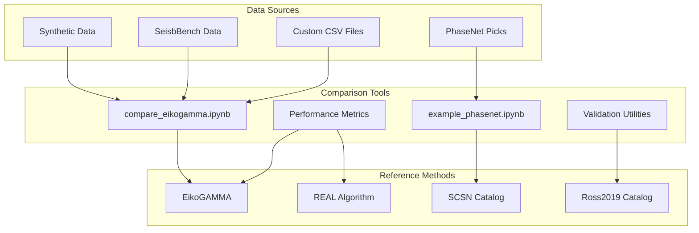
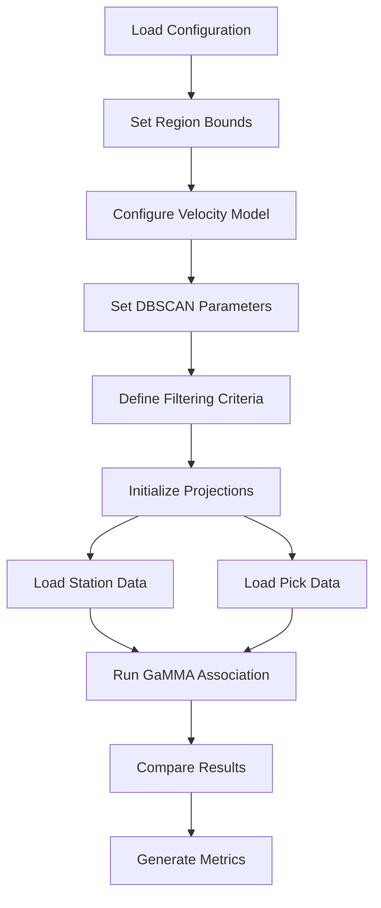
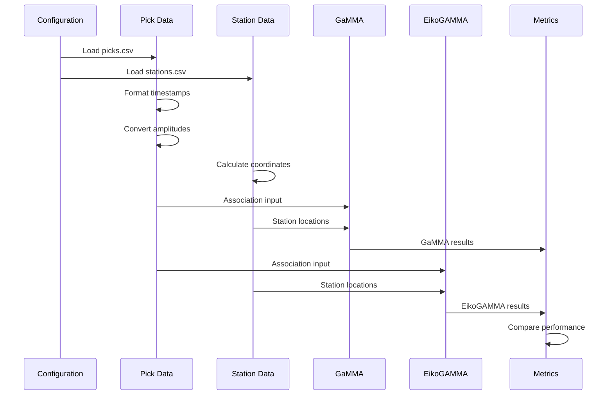
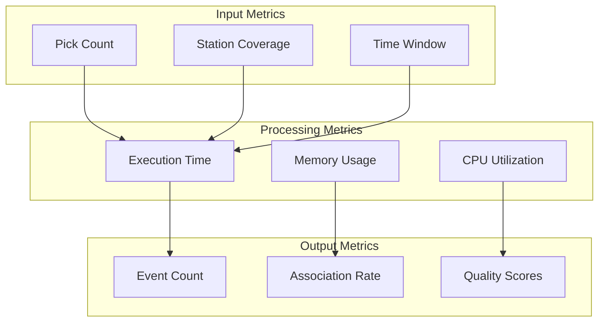
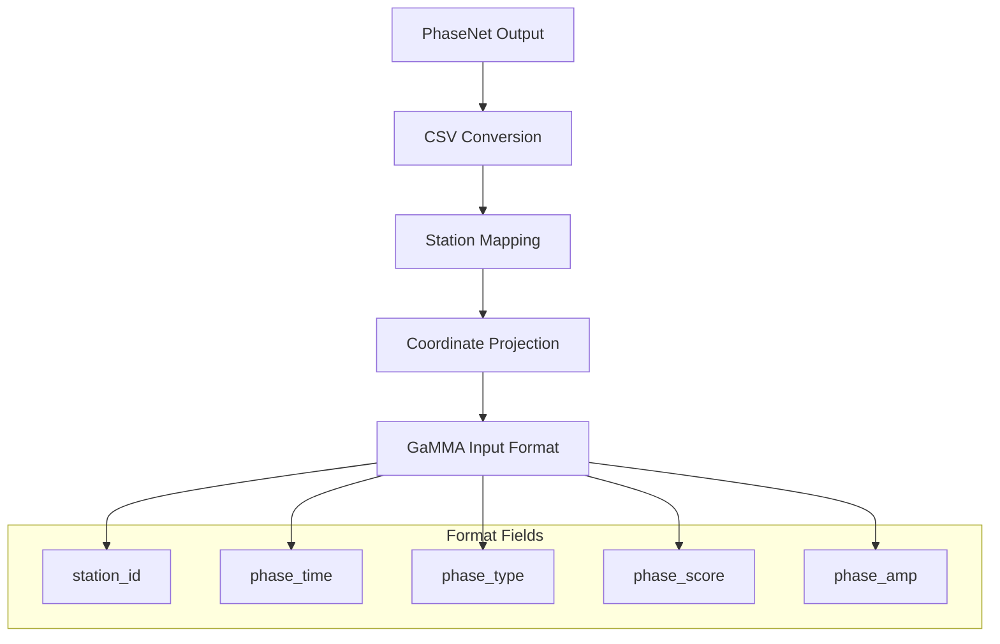
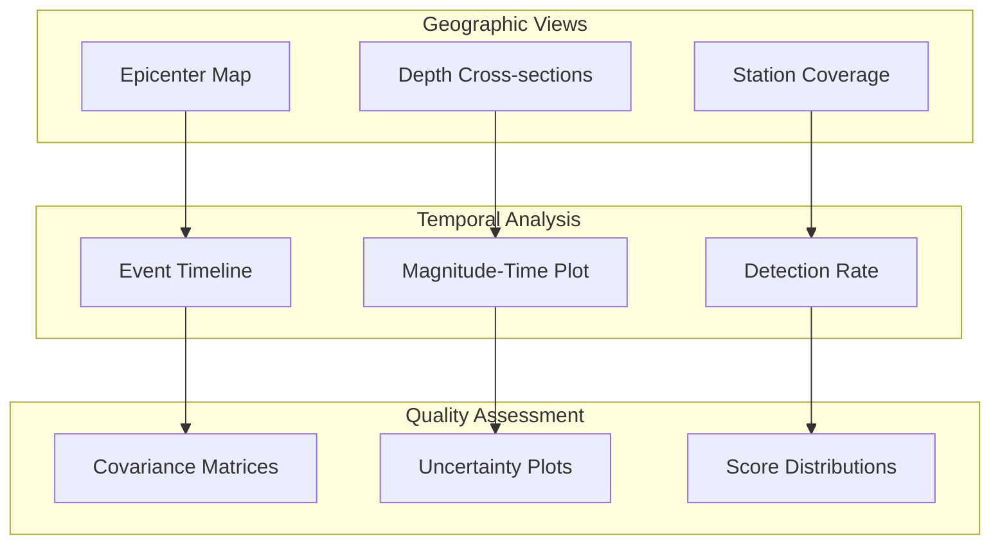
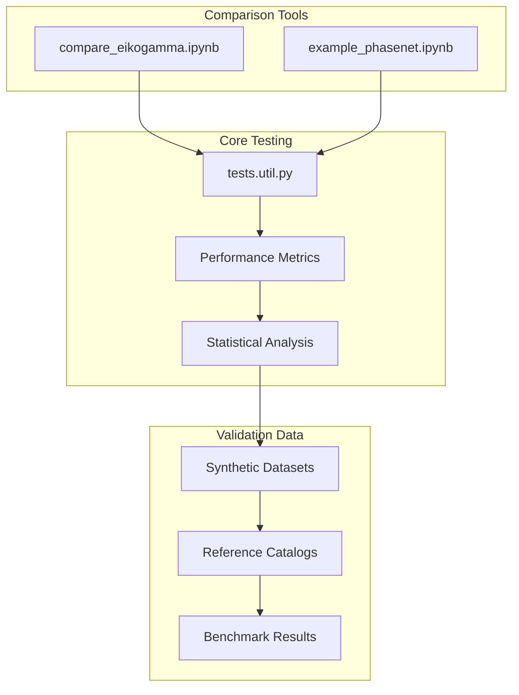

# Comparison Tools

> **Relevant source files**
> * [tests/comparison/compare_eikogamma.ipynb](https://github.com/AI4EPS/GaMMA/blob/edcf2cec/tests/comparison/compare_eikogamma.ipynb)
> * [tests/comparison/statistics.ipynb](https://github.com/AI4EPS/GaMMA/blob/edcf2cec/tests/comparison/statistics.ipynb)
> * [tests/example_phasenet.ipynb](https://github.com/AI4EPS/GaMMA/blob/edcf2cec/tests/example_phasenet.ipynb)

## Purpose and Scope

The comparison tools provide frameworks for benchmarking GaMMA's performance against other seismic event association methods and validating results against reference catalogs. These tools enable quantitative evaluation of association accuracy, processing speed, and parameter sensitivity across different datasets and methods.

For information about the core testing framework, see [Testing Framework](/AI4EPS/GaMMA/6.1-testing-framework). For performance analysis methodologies, see [Performance Analysis](/AI4EPS/GaMMA/6.3-performance-analysis).

## Available Comparison Frameworks

GaMMA includes several comparison notebooks and utilities for evaluating performance against established methods:

**Comparison Framework Components**
Sources: [tests/comparison/compare_eikogamma.ipynb L1-L669](https://github.com/AI4EPS/GaMMA/blob/edcf2cec/tests/comparison/compare_eikogamma.ipynb#L1-L669)

 [tests/example_phasenet.ipynb L1-L669](https://github.com/AI4EPS/GaMMA/blob/edcf2cec/tests/example_phasenet.ipynb#L1-L669)

## EikoGAMMA Comparison Workflow

The primary comparison framework evaluates GaMMA against EikoGAMMA, a reference implementation for seismic event association:

### Configuration Setup

The comparison uses standardized configuration parameters to ensure fair evaluation:

**EikoGAMMA Comparison Configuration**

Key configuration parameters are standardized between methods:

| Parameter | Value | Purpose |
| --- | --- | --- |
| `center` | `[-117.504, 35.705]` | Geographic center point |
| `vel` | `{"p": 6.0, "s": 3.4285714285714284}` | Velocity model |
| `method` | `"BGMM"` | Association algorithm |
| `oversample_factor` | `60` | BGMM sampling parameter |
| `dbscan_eps` | `10` | DBSCAN clustering threshold |
| `min_picks_per_eq` | `100` | Event filtering criterion |

Sources: [tests/comparison/compare_eikogamma.ipynb L139-L195](https://github.com/AI4EPS/GaMMA/blob/edcf2cec/tests/comparison/compare_eikogamma.ipynb#L139-L195)

### Data Processing Pipeline

The comparison workflow processes data through standardized steps:

**Data Processing Steps**
Sources: [tests/comparison/compare_eikogamma.ipynb L109-L159](https://github.com/AI4EPS/GaMMA/blob/edcf2cec/tests/comparison/compare_eikogamma.ipynb#L109-L159)

## Performance Metrics and Timing

The comparison tools measure multiple performance dimensions:

### Association Performance

**Performance Measurement Implementation**

The notebooks implement timing and quality assessment:

* Processing time measurement: [tests/comparison/compare_eikogamma.ipynb L244-L275](https://github.com/AI4EPS/GaMMA/blob/edcf2cec/tests/comparison/compare_eikogamma.ipynb#L244-L275)
* Event count comparison: [tests/comparison/compare_eikogamma.ipynb L251-L275](https://github.com/AI4EPS/GaMMA/blob/edcf2cec/tests/comparison/compare_eikogamma.ipynb#L251-L275)
* Quality metrics calculation: [tests/comparison/compare_eikogamma.ipynb L252-L274](https://github.com/AI4EPS/GaMMA/blob/edcf2cec/tests/comparison/compare_eikogamma.ipynb#L252-L274)

Sources: [tests/comparison/compare_eikogamma.ipynb L244-L276](https://github.com/AI4EPS/GaMMA/blob/edcf2cec/tests/comparison/compare_eikogamma.ipynb#L244-L276)

## PhaseNet Integration Example

The PhaseNet example demonstrates real-world application with machine learning picks:

### Data Format Conversion

**Format Conversion Process**

The example shows conversion from PhaseNet format to GaMMA input:

* Station ID mapping: [tests/example_phasenet.ipynb L247-L252](https://github.com/AI4EPS/GaMMA/blob/edcf2cec/tests/example_phasenet.ipynb#L247-L252)
* Timestamp conversion: [tests/example_phasenet.ipynb L248](https://github.com/AI4EPS/GaMMA/blob/edcf2cec/tests/example_phasenet.ipynb#L248-L248)
* Amplitude processing: [tests/example_phasenet.ipynb L249](https://github.com/AI4EPS/GaMMA/blob/edcf2cec/tests/example_phasenet.ipynb#L249-L249)
* Coordinate projection: [tests/example_phasenet.ipynb L262-L264](https://github.com/AI4EPS/GaMMA/blob/edcf2cec/tests/example_phasenet.ipynb#L262-L264)

Sources: [tests/example_phasenet.ipynb L246-L315](https://github.com/AI4EPS/GaMMA/blob/edcf2cec/tests/example_phasenet.ipynb#L246-L315)

### Processing Configuration

The PhaseNet example uses optimized parameters for real data:

| Parameter | Value | Justification |
| --- | --- | --- |
| `use_dbscan` | `True` | Pre-clustering for large datasets |
| `use_amplitude` | `True` | Utilize ML amplitude estimates |
| `method` | `"BGMM"` | Bayesian approach for uncertainty |
| `oversample_factor` | `4` | Balanced performance/accuracy |
| `min_picks_per_eq` | `10` | Quality threshold |

Sources: [tests/example_phasenet.ipynb L267-L308](https://github.com/AI4EPS/GaMMA/blob/edcf2cec/tests/example_phasenet.ipynb#L267-L308)

## Visualization and Analysis Tools

The comparison tools include comprehensive visualization capabilities:

### Spatial Distribution Analysis

**Visualization Components**

The notebooks generate standardized comparison plots:

* Spatial distribution plots: [tests/example_phasenet.ipynb L457-L511](https://github.com/AI4EPS/GaMMA/blob/edcf2cec/tests/example_phasenet.ipynb#L457-L511)
* Temporal analysis: [tests/example_phasenet.ipynb L428-L439](https://github.com/AI4EPS/GaMMA/blob/edcf2cec/tests/example_phasenet.ipynb#L428-L439)
* Magnitude-frequency plots: [tests/example_phasenet.ipynb L529-L541](https://github.com/AI4EPS/GaMMA/blob/edcf2cec/tests/example_phasenet.ipynb#L529-L541)
* Covariance analysis: [tests/example_phasenet.ipynb L594-L626](https://github.com/AI4EPS/GaMMA/blob/edcf2cec/tests/example_phasenet.ipynb#L594-L626)

Sources: [tests/example_phasenet.ipynb L428-L626](https://github.com/AI4EPS/GaMMA/blob/edcf2cec/tests/example_phasenet.ipynb#L428-L626)

## Integration with Testing Framework

The comparison tools integrate with the broader testing infrastructure through standardized interfaces:

**Testing Integration Points**
Sources: [tests/comparison/compare_eikogamma.ipynb L1-L669](https://github.com/AI4EPS/GaMMA/blob/edcf2cec/tests/comparison/compare_eikogamma.ipynb#L1-L669)

 [tests/example_phasenet.ipynb L1-L669](https://github.com/AI4EPS/GaMMA/blob/edcf2cec/tests/example_phasenet.ipynb#L1-L669)

The comparison tools provide essential capabilities for validating GaMMA's performance across different scenarios, datasets, and reference methods, enabling comprehensive evaluation of the association algorithm's effectiveness.