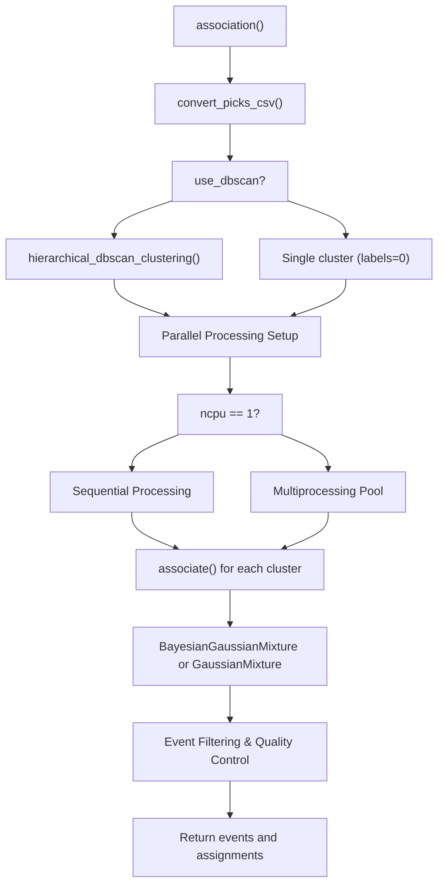
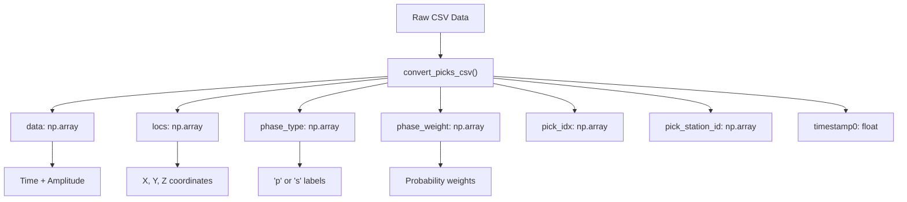
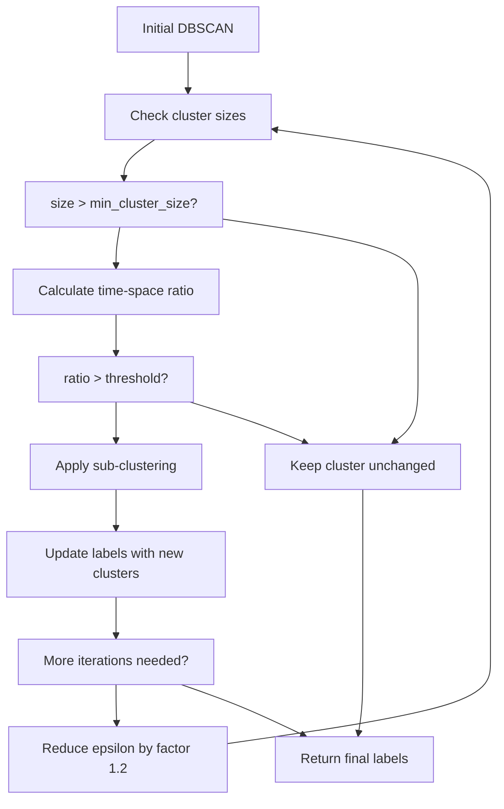
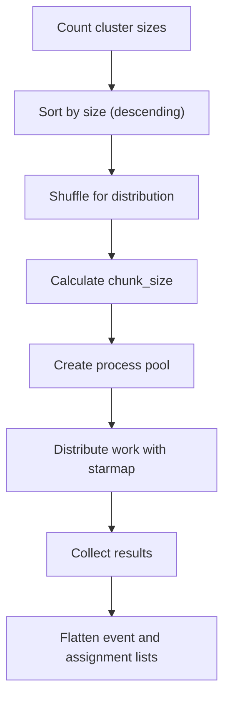

# Core Association Functions

> **Relevant source files**
> * [gamma/utils.py](https://github.com/AI4EPS/GaMMA/blob/edcf2cec/gamma/utils.py)
> * [tests/comparison/stations_ridgecrest.csv](https://github.com/AI4EPS/GaMMA/blob/edcf2cec/tests/comparison/stations_ridgecrest.csv)

This document covers the main association functions in GaMMA that perform seismic event association using Gaussian Mixture Models. The core functionality is implemented in the `gamma.utils` module, which provides the primary interface for associating seismic picks with earthquake events.

For information about the underlying mixture model implementations, see [Mixture Model Classes](/AI4EPS/GaMMA/4.3-mixture-model-classes). For details about seismic operations and travel time calculations, see [Seismic Operations](/AI4EPS/GaMMA/4.2-seismic-operations). For practical usage examples, see [PhaseNet Integration](/AI4EPS/GaMMA/5.1-phasenet-integration).

## Main Association Function

The primary entry point for seismic event association is the `association` function in [gamma/utils.py L155-L276](https://github.com/AI4EPS/GaMMA/blob/edcf2cec/gamma/utils.py#L155-L276)

 This function orchestrates the entire association workflow, from data preprocessing to parallel processing of clusters.

### Function Signature and Parameters

```python
def association(picks, stations, config, event_idx0=0, method="BGMM", **kwargs):
```

**Parameters:**

* `picks`: DataFrame containing seismic phase picks with columns: `timestamp`, `id`, `type`, `prob`, `amp`
* `stations`: DataFrame containing station metadata with columns: `id`, `longitude`, `latitude`, `elevation`
* `config`: Dictionary containing algorithm configuration parameters
* `event_idx0`: Starting event index for numbering (default: 0)
* `method`: Association method, either "BGMM" or "GMM" (default: "BGMM")

**Returns:**

* `events`: List of dictionaries containing detected earthquake events
* `assignment`: List of tuples mapping picks to events

Sources: [gamma/utils.py L155-L276](https://github.com/AI4EPS/GaMMA/blob/edcf2cec/gamma/utils.py#L155-L276)

## Association Workflow



Sources: [gamma/utils.py L155-L276](https://github.com/AI4EPS/GaMMA/blob/edcf2cec/gamma/utils.py#L155-L276)

## Data Preprocessing

### CSV Conversion Function

The `convert_picks_csv` function [gamma/utils.py L54-L85](https://github.com/AI4EPS/GaMMA/blob/edcf2cec/gamma/utils.py#L54-L85)

 standardizes input data formats and handles coordinate transformations:

| Input Processing | Description | Code Location |
| --- | --- | --- |
| Timestamp conversion | Converts ISO strings to UTC timestamps | [gamma/utils.py L56-L62](https://github.com/AI4EPS/GaMMA/blob/edcf2cec/gamma/utils.py#L56-L62) |
| Amplitude processing | Converts to log10 scale (cm/s) | [gamma/utils.py L67](https://github.com/AI4EPS/GaMMA/blob/edcf2cec/gamma/utils.py#L67-L67) |
| Station metadata merge | Joins picks with station locations | [gamma/utils.py L71](https://github.com/AI4EPS/GaMMA/blob/edcf2cec/gamma/utils.py#L71-L71) |
| Phase type normalization | Converts to lowercase ('p', 's') | [gamma/utils.py L73](https://github.com/AI4EPS/GaMMA/blob/edcf2cec/gamma/utils.py#L73-L73) |
| Data validation | Removes picks with missing metadata | [gamma/utils.py L76-L85](https://github.com/AI4EPS/GaMMA/blob/edcf2cec/gamma/utils.py#L76-L85) |

### Data Structure Transformation



Sources: [gamma/utils.py L54-L85](https://github.com/AI4EPS/GaMMA/blob/edcf2cec/gamma/utils.py#L54-L85)

## Clustering and Pre-processing

### Hierarchical DBSCAN Clustering

When `config["use_dbscan"]` is enabled, the system performs hierarchical clustering using `hierarchical_dbscan_clustering` [gamma/utils.py L88-L152](https://github.com/AI4EPS/GaMMA/blob/edcf2cec/gamma/utils.py#L88-L152)

:

**Key Features:**

* Iterative clustering with decreasing epsilon values
* Time-space ratio filtering to prevent over-splitting
* Weighted clustering using phase probabilities
* Automatic cluster size management

**Parameters:**

* `eps`: Maximum distance for clustering (default: 15)
* `min_samples`: Minimum samples per cluster (default: 3)
* `min_cluster_size`: Minimum size for cluster splitting (default: 500)
* `max_time_space_ratio`: Controls time vs. space weighting (default: 10)



Sources: [gamma/utils.py L88-L152](https://github.com/AI4EPS/GaMMA/blob/edcf2cec/gamma/utils.py#L88-L152)

## Core Association Algorithm

### Individual Cluster Processing

The `associate` function [gamma/utils.py L279-L532](https://github.com/AI4EPS/GaMMA/blob/edcf2cec/gamma/utils.py#L279-L532)

 processes individual clusters or the entire dataset when DBSCAN is disabled:

**Processing Steps:**

1. **Data Extraction**: Extract cluster-specific data and metadata
2. **Event Estimation**: Calculate maximum possible events using `max_num_event`
3. **Center Initialization**: Initialize GMM centers using `init_centers`
4. **Model Fitting**: Fit BayesianGaussianMixture or GaussianMixture
5. **Event Filtering**: Apply quality control filters
6. **Result Generation**: Create event and assignment lists

### Center Initialization Strategy

The `init_centers` function [gamma/utils.py L605-L657](https://github.com/AI4EPS/GaMMA/blob/edcf2cec/gamma/utils.py#L605-L657)

 implements an intelligent initialization strategy:

```python
def init_centers(config, data_, locs_, type_, weight_, max_num_event=1):
```

**Initialization Logic:**

* Prioritizes P-wave picks over S-wave picks
* Uses temporal sorting for event timing
* Adds spatial randomization around pick locations
* Applies weighted averages for location estimates

Sources: [gamma/utils.py L279-L532](https://github.com/AI4EPS/GaMMA/blob/edcf2cec/gamma/utils.py#L279-L532)

 [gamma/utils.py L605-L657](https://github.com/AI4EPS/GaMMA/blob/edcf2cec/gamma/utils.py#L605-L657)

## Event Quality Control

### Filtering Pipeline

The association algorithm applies multiple quality control filters:

| Filter Type | Purpose | Configuration Key |
| --- | --- | --- |
| Time residual | Remove picks with large travel time errors | `max_sigma11` |
| Station uniqueness | Select best pick per station-phase | Automatic |
| Amplitude residual | Filter picks with poor amplitude fit | `max_sigma22` |
| Minimum picks | Ensure sufficient picks per event | `min_picks_per_eq` |
| Phase requirements | Require minimum P or S picks | `min_p_picks_per_eq`, `min_s_picks_per_eq` |
| Station coverage | Ensure spatial distribution | `min_stations` |

### Event Output Format

Each detected event contains:

```css
event = {
    "time": "2023-07-04T10:30:45.123",  # ISO format timestamp
    "magnitude": 2.5,                    # Estimated magnitude
    "sigma_time": 0.15,                  # Time uncertainty (seconds)
    "sigma_amp": 0.3,                    # Amplitude uncertainty
    "cov_time_amp": 0.02,               # Time-amplitude covariance
    "gamma_score": 0.85,                 # Association probability
    "num_picks": 12,                     # Total picks assigned
    "num_p_picks": 7,                    # P-wave picks
    "num_s_picks": 5,                    # S-wave picks
    "event_index": 42,                   # Unique event ID
    "x(km)": 10.5,                      # X coordinate
    "y(km)": -5.2,                      # Y coordinate
    "z(km)": 8.0                        # Depth
}
```

Sources: [gamma/utils.py L507-L525](https://github.com/AI4EPS/GaMMA/blob/edcf2cec/gamma/utils.py#L507-L525)

## Configuration Parameters

### Required Parameters

| Parameter | Type | Description | Example |
| --- | --- | --- | --- |
| `dims` | list | Spatial dimensions to use | `["x(km)", "y(km)", "z(km)"]` |
| `use_amplitude` | bool | Include amplitude in association | `True` |
| `min_picks_per_eq` | int | Minimum picks required per event | `4` |
| `bfgs_bounds` | dict | Optimization bounds | `{"x(km)": [-50, 50]}` |
| `vel` | dict | P and S wave velocities | `{"p": 6.0, "s": 3.5}` |
| `oversample_factor` | int | GMM component oversampling | `4` |

### Optional Parameters

| Parameter | Type | Description | Default |
| --- | --- | --- | --- |
| `use_dbscan` | bool | Enable DBSCAN pre-clustering | `False` |
| `dbscan_eps` | float | DBSCAN epsilon parameter | `15` |
| `dbscan_min_samples` | int | DBSCAN minimum samples | `3` |
| `ncpu` | int | Number of CPU cores to use | `auto` |
| `eikonal` | dict | 3D velocity model configuration | `None` |

Sources: [gamma/utils.py L155-L276](https://github.com/AI4EPS/GaMMA/blob/edcf2cec/gamma/utils.py#L155-L276)

## Multiprocessing Support

### Process Management

The association function automatically determines the optimal number of processes:

```
config["ncpu"] = max(1, min(len(unique_labels) // 4, min(32, mp.cpu_count() - 1)))
```

**Features:**

* Cross-platform compatibility (Windows, macOS, Linux)
* Dynamic chunk size calculation for load balancing
* Shared memory management for event indexing
* Process-safe random seed initialization

### Load Balancing Strategy



Sources: [gamma/utils.py L194-L275](https://github.com/AI4EPS/GaMMA/blob/edcf2cec/gamma/utils.py#L194-L275)

## Integration Points

### Mixture Model Integration

The association function creates and configures mixture models:

```
if method == "BGMM":
    gmm = BayesianGaussianMixture(
        n_components=max_num_event,
        weight_concentration_prior=1.0 / max_num_event,
        covariance_prior=covariance_prior,
        init_params="centers",
        centers_init=centers_init.copy(),
        station_locs=locs_,
        phase_type=phase_type_,
        vel=vel,
        eikonal=config["eikonal"]
    )
elif method == "GMM":
    gmm = GaussianMixture(...)
```

### Seismic Operations Integration

Travel time and amplitude calculations are performed using functions from `gamma.seismic_ops`:

* `calc_time()`: Computes theoretical travel times [gamma/utils.py L428-L434](https://github.com/AI4EPS/GaMMA/blob/edcf2cec/gamma/utils.py#L428-L434)
* `calc_amp()`: Estimates amplitude predictions [gamma/utils.py L458-L462](https://github.com/AI4EPS/GaMMA/blob/edcf2cec/gamma/utils.py#L458-L462)
* `initialize_eikonal()`: Sets up 3D velocity models [gamma/utils.py L167](https://github.com/AI4EPS/GaMMA/blob/edcf2cec/gamma/utils.py#L167-L167)

Sources: [gamma/utils.py L360-L400](https://github.com/AI4EPS/GaMMA/blob/edcf2cec/gamma/utils.py#L360-L400)

 [gamma/utils.py L428-L434](https://github.com/AI4EPS/GaMMA/blob/edcf2cec/gamma/utils.py#L428-L434)

 [gamma/utils.py L458-L462](https://github.com/AI4EPS/GaMMA/blob/edcf2cec/gamma/utils.py#L458-L462)