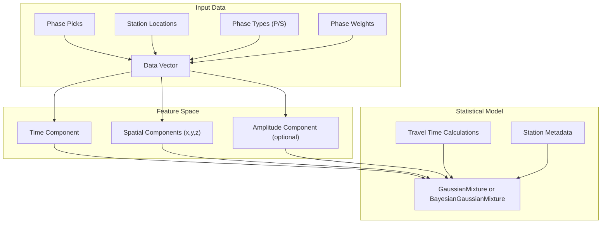
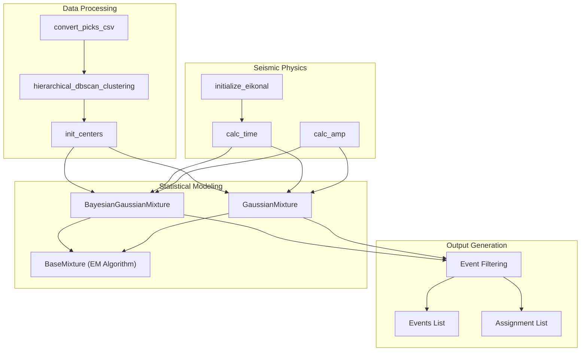
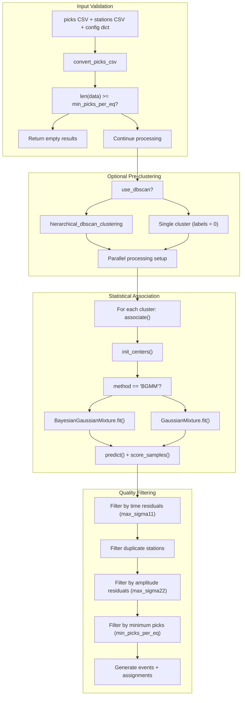
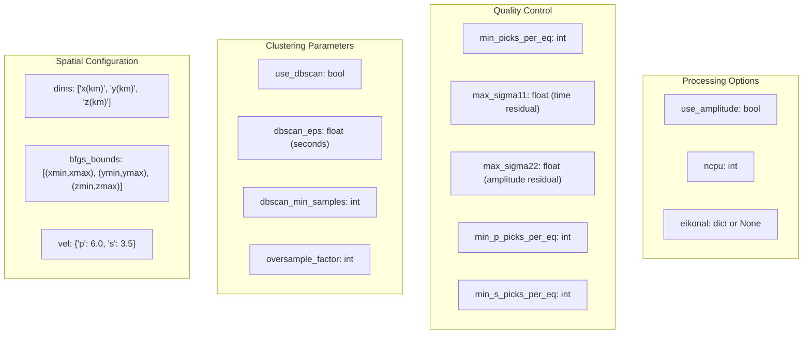
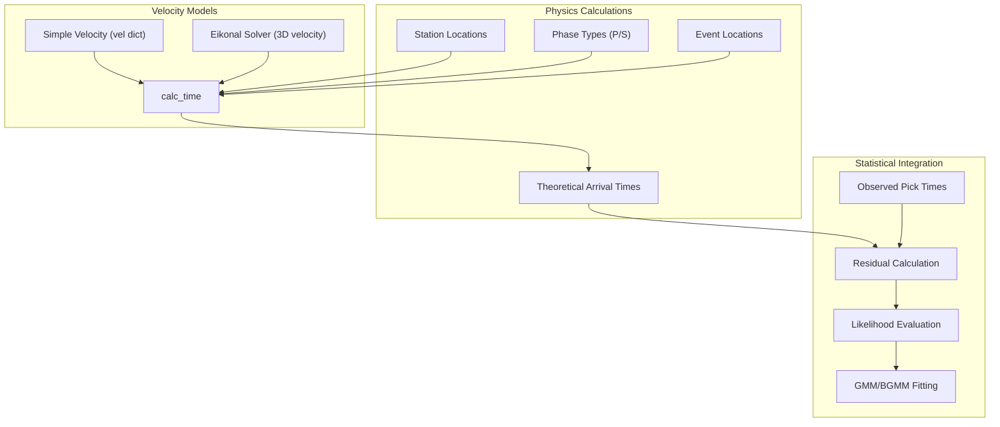

# Core Concepts

> **Relevant source files**
> * [docs/README.md](https://github.com/AI4EPS/GaMMA/blob/edcf2cec/docs/README.md)
> * [gamma/utils.py](https://github.com/AI4EPS/GaMMA/blob/edcf2cec/gamma/utils.py)
> * [tests/comparison/stations_ridgecrest.csv](https://github.com/AI4EPS/GaMMA/blob/edcf2cec/tests/comparison/stations_ridgecrest.csv)

This document explains the fundamental concepts underlying GaMMA (Gaussian Mixture Model Associator) and its approach to seismic event association. It covers the problem domain, statistical methodology, and key system components. For specific implementation details about the association algorithms, see [Core Association Functions](/AI4EPS/GaMMA/4.1-core-association-functions). For practical usage examples, see [Examples and Tutorials](/AI4EPS/GaMMA/5-examples-and-tutorials).

## Overview of Seismic Event Association

Seismic event association is the process of linking individual phase picks (P-wave and S-wave arrivals detected at different seismic stations) to their originating earthquakes. This is a fundamental challenge in seismology because:

* Multiple earthquakes can occur simultaneously or in close succession
* Seismic waves from one earthquake arrive at different stations at different times
* Noise and false detections can create spurious picks
* The same earthquake generates both P and S waves that must be correctly associated

GaMMA solves this problem by treating it as a statistical clustering challenge, where the goal is to identify which picks belong to the same seismic event based on their temporal and spatial patterns.

**Problem Formulation**: Given a set of seismic phase picks with timestamps, station locations, phase types (P or S), and optional amplitude information, determine which picks originated from the same earthquake and estimate the earthquake's location, time, and magnitude.

Sources: [gamma/utils.py L155-L276](https://github.com/AI4EPS/GaMMA/blob/edcf2cec/gamma/utils.py#L155-L276)

 [docs/README.md L13-L16](https://github.com/AI4EPS/GaMMA/blob/edcf2cec/docs/README.md#L13-L16)

## GaMMA's Statistical Approach

GaMMA formulates seismic event association as a Gaussian Mixture Model (GMM) problem. Each earthquake is represented as a Gaussian component in a high-dimensional space that includes time, location, and optionally amplitude.

### Data Representation

**Data Conversion**: The `convert_picks_csv` function transforms raw seismic data into the standardized format required by the statistical models. Time values are normalized to seconds from a reference timestamp, and amplitudes are converted to log scale.

Sources: [gamma/utils.py L54-L86](https://github.com/AI4EPS/GaMMA/blob/edcf2cec/gamma/utils.py#L54-L86)

### Statistical Models

GaMMA supports two primary statistical approaches:

1. **Standard GMM** (`GaussianMixture`): Uses maximum likelihood estimation with fixed number of components
2. **Bayesian GMM** (`BayesianGaussianMixture`): Uses variational inference and can automatically determine optimal number of components

Both models are specialized for seismic data with custom initialization, travel time calculations, and domain-specific constraints.

Sources: [gamma/_gaussian_mixture.py](https://github.com/AI4EPS/GaMMA/blob/edcf2cec/gamma/_gaussian_mixture.py)

 [gamma/_bayesian_mixture.py](https://github.com/AI4EPS/GaMMA/blob/edcf2cec/gamma/_bayesian_mixture.py)

 [gamma/utils.py L360-L400](https://github.com/AI4EPS/GaMMA/blob/edcf2cec/gamma/utils.py#L360-L400)

## Key System Components

### Core Components

* **`association`**: Main orchestration function that coordinates the entire pipeline
* **`convert_picks_csv`**: Standardizes input data format and handles coordinate transformations
* **`hierarchical_dbscan_clustering`**: Optional pre-clustering to segment large datasets temporally and spatially
* **`init_centers`**: Intelligent initialization of cluster centers based on pick timing and station geometry
* **`calc_time`**: Computes theoretical travel times using velocity models or eikonal solvers
* **`calc_amp`**: Estimates magnitude from amplitude measurements

Sources: [gamma/utils.py L155-L276](https://github.com/AI4EPS/GaMMA/blob/edcf2cec/gamma/utils.py#L155-L276)

 [gamma/seismic_ops.py](https://github.com/AI4EPS/GaMMA/blob/edcf2cec/gamma/seismic_ops.py)

## Processing Pipeline

### Pipeline Stages

1. **Data Preprocessing**: Input validation, format conversion, coordinate transformations
2. **Pre-clustering**: Optional DBSCAN to segment data into manageable chunks
3. **Parallel Processing**: Distribution of clusters across multiple CPU cores
4. **Statistical Modeling**: GMM/BGMM fitting with seismic-specific initialization and constraints
5. **Quality Control**: Multi-stage filtering based on residuals and pick counts
6. **Output Generation**: Creation of event catalogs and pick-to-event assignments

Sources: [gamma/utils.py L155-L276](https://github.com/AI4EPS/GaMMA/blob/edcf2cec/gamma/utils.py#L155-L276)

 [gamma/utils.py L279-L532](https://github.com/AI4EPS/GaMMA/blob/edcf2cec/gamma/utils.py#L279-L532)

## Data Structures and Configuration

### Configuration Parameters

GaMMA uses a comprehensive configuration dictionary with the following key categories:

### Data Flow Types

* **Input**: Picks DataFrame (timestamp, station_id, phase_type, probability, amplitude)
* **Intermediate**: Numpy arrays (time, location, phase_type, weights)
* **Output**: Events list (dictionaries with location, time, magnitude, uncertainties) and assignments list (tuples of pick_index, event_index, probability)

Sources: [gamma/utils.py L54-L86](https://github.com/AI4EPS/GaMMA/blob/edcf2cec/gamma/utils.py#L54-L86)

 [docs/README.md L20-L36](https://github.com/AI4EPS/GaMMA/blob/edcf2cec/docs/README.md#L20-L36)

## Travel Time Integration

GaMMA integrates seismic physics through travel time calculations that constrain the statistical model:

The `calc_time` function computes expected arrival times for P and S phases given an earthquake location and station positions. This physics-based constraint guides the statistical clustering to produce seismologically meaningful results.

Sources: [gamma/seismic_ops.py](https://github.com/AI4EPS/GaMMA/blob/edcf2cec/gamma/seismic_ops.py)

 [gamma/utils.py L428-L434](https://github.com/AI4EPS/GaMMA/blob/edcf2cec/gamma/utils.py#L428-L434)