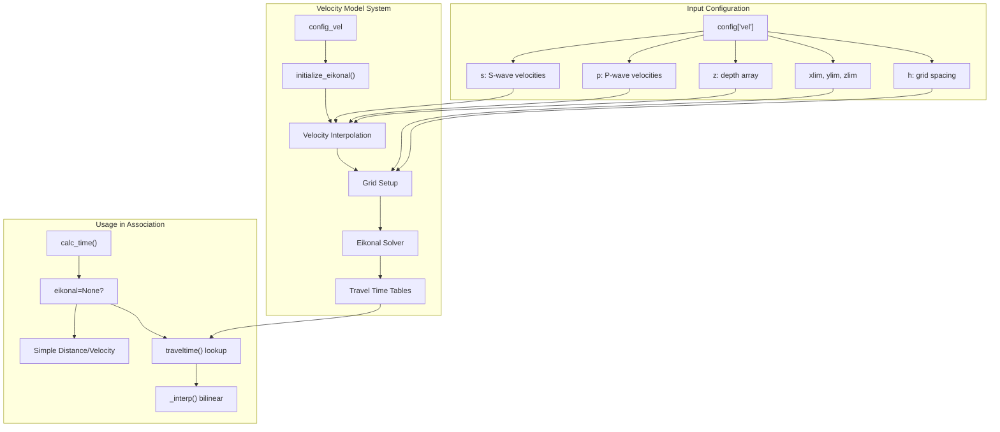
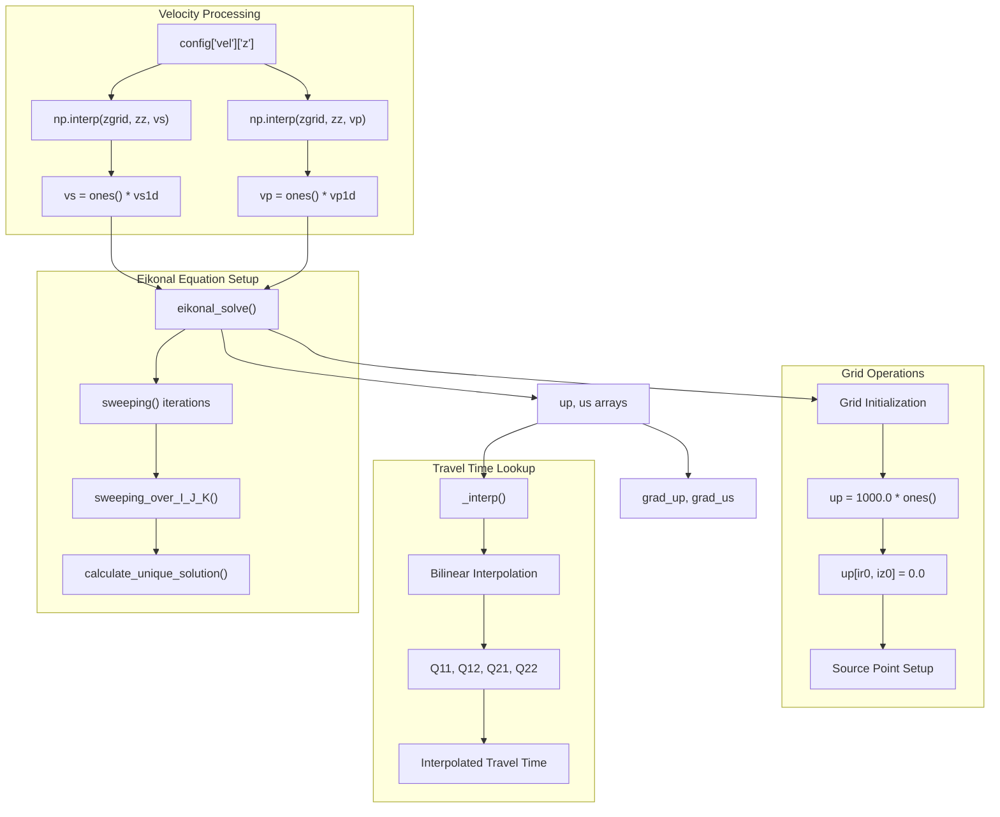
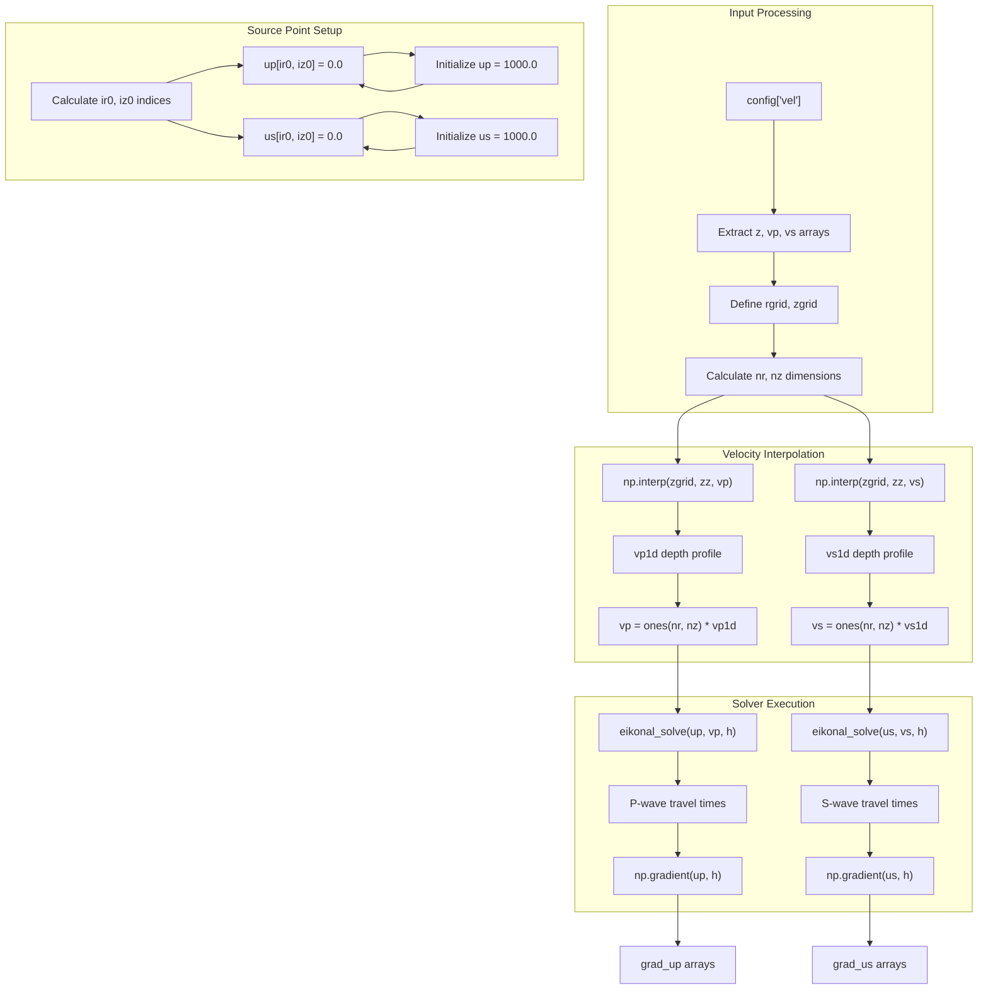
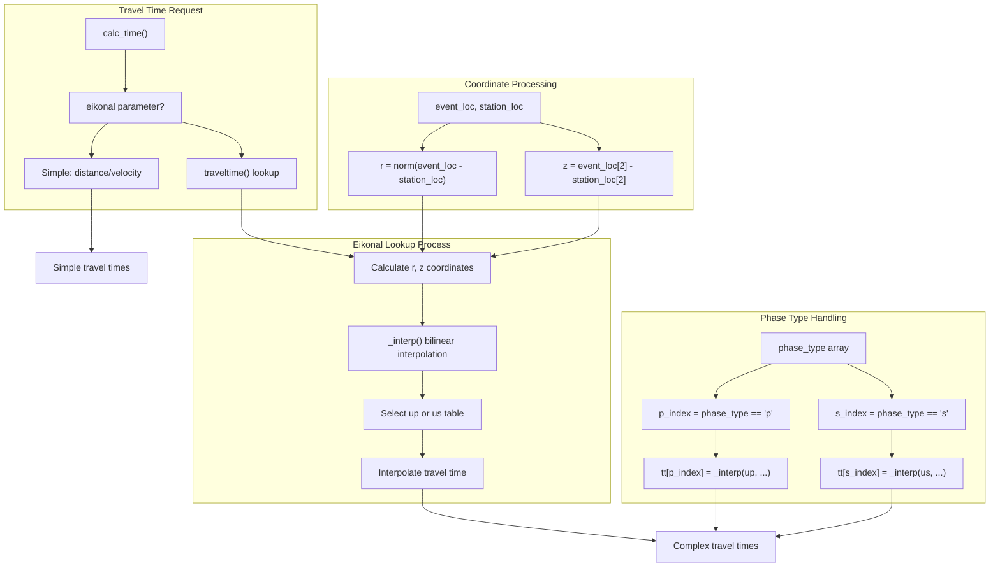

# Custom Velocity Models

> **Relevant source files**
> * [gamma/seismic_ops.py](https://github.com/AI4EPS/GaMMA/blob/edcf2cec/gamma/seismic_ops.py)
> * [tests/comparison/real/tt_db/itvel.nd](https://github.com/AI4EPS/GaMMA/blob/edcf2cec/tests/comparison/real/tt_db/itvel.nd)

This document covers the implementation and configuration of custom velocity models in GaMMA's eikonal solver system. Custom velocity models enable accurate travel time calculations for complex subsurface structures, improving seismic event association accuracy compared to simple constant velocity assumptions.

For basic travel time calculation concepts, see [Travel Time Calculation](/AI4EPS/GaMMA/3.3-travel-time-calculation). For the broader seismic operations API, see [Seismic Operations](/AI4EPS/GaMMA/4.2-seismic-operations).

## Velocity Model Architecture

GaMMA supports two approaches for travel time calculation: simple constant velocity models and complex 3D velocity models solved using the eikonal equation. The eikonal solver provides more accurate travel times by accounting for depth-dependent velocity variations.

### System Components



*Velocity Model Processing Flow*

Sources: [gamma/seismic_ops.py L315-L391](https://github.com/AI4EPS/GaMMA/blob/edcf2cec/gamma/seismic_ops.py#L315-L391)

 [gamma/seismic_ops.py L208-L217](https://github.com/AI4EPS/GaMMA/blob/edcf2cec/gamma/seismic_ops.py#L208-L217)

 [gamma/seismic_ops.py L154-L173](https://github.com/AI4EPS/GaMMA/blob/edcf2cec/gamma/seismic_ops.py#L154-L173)

## Eikonal Solver Implementation

The eikonal solver computes travel times by solving the eikonal equation `|∇u| = f`, where `u` is the travel time field and `f` is the slowness (1/velocity). GaMMA implements a fast sweeping method for efficient computation.

### Core Algorithm Components



*Eikonal Solver Algorithm Flow*

Sources: [gamma/seismic_ops.py L77-L89](https://github.com/AI4EPS/GaMMA/blob/edcf2cec/gamma/seismic_ops.py#L77-L89)

 [gamma/seismic_ops.py L54-L74](https://github.com/AI4EPS/GaMMA/blob/edcf2cec/gamma/seismic_ops.py#L54-L74)

 [gamma/seismic_ops.py L16-L21](https://github.com/AI4EPS/GaMMA/blob/edcf2cec/gamma/seismic_ops.py#L16-L21)

 [gamma/seismic_ops.py L118-L151](https://github.com/AI4EPS/GaMMA/blob/edcf2cec/gamma/seismic_ops.py#L118-L151)

## Configuration Structure

Custom velocity models are configured through the `config` dictionary passed to `initialize_eikonal()`. The configuration specifies the velocity structure, grid parameters, and spatial bounds.

### Required Configuration Parameters

| Parameter | Type | Description | Example |
| --- | --- | --- | --- |
| `vel['z']` | `np.array` | Depth values (km) | `[0, 1, 5, 10, 30]` |
| `vel['p']` | `np.array` | P-wave velocities (km/s) | `[5.5, 6.0, 6.5, 7.8, 8.1]` |
| `vel['s']` | `np.array` | S-wave velocities (km/s) | `[3.2, 3.5, 3.8, 4.5, 4.7]` |
| `xlim` | `[float, float]` | X coordinate bounds (km) | `[-50, 50]` |
| `ylim` | `[float, float]` | Y coordinate bounds (km) | `[-50, 50]` |
| `zlim` | `[float, float]` | Depth bounds (km) | `[0, 60]` |
| `h` | `float` | Grid spacing (km) | `0.5` |

### Velocity Model Processing

The `initialize_eikonal()` function processes the input velocity model through several steps:



*Velocity Model Initialization Process*

Sources: [gamma/seismic_ops.py L337-L346](https://github.com/AI4EPS/GaMMA/blob/edcf2cec/gamma/seismic_ops.py#L337-L346)

 [gamma/seismic_ops.py L348-L361](https://github.com/AI4EPS/GaMMA/blob/edcf2cec/gamma/seismic_ops.py#L348-L361)

 [gamma/seismic_ops.py L373-L389](https://github.com/AI4EPS/GaMMA/blob/edcf2cec/gamma/seismic_ops.py#L373-L389)

## Velocity Model File Formats

GaMMA supports depth-dependent velocity models specified as arrays in the configuration. While not directly reading external files, the system can integrate with standard seismological velocity model formats.

### Standard Format Example

The velocity model structure follows seismological conventions:

```
Depth (km)  P-velocity (km/s)  S-velocity (km/s)
0.00        5.50               3.18
1.00        6.00               3.46
5.00        6.20               3.58
10.00       6.50               3.75
30.00       7.80               4.50
```

### Implementation in Configuration

```
config = {
    "vel": {
        "z": np.array([0.0, 1.0, 5.0, 10.0, 30.0]),
        "p": np.array([5.5, 6.0, 6.2, 6.5, 7.8]),
        "s": np.array([3.18, 3.46, 3.58, 3.75, 4.50])
    },
    "xlim": [-50, 50],
    "ylim": [-50, 50], 
    "zlim": [0, 60],
    "h": 0.5
}
```

Sources: [gamma/seismic_ops.py L341-L346](https://github.com/AI4EPS/GaMMA/blob/edcf2cec/gamma/seismic_ops.py#L341-L346)

 [tests/comparison/real/tt_db/itvel.nd L1-L13](https://github.com/AI4EPS/GaMMA/blob/edcf2cec/tests/comparison/real/tt_db/itvel.nd#L1-L13)

## Travel Time Calculation Integration

The eikonal solver integrates with GaMMA's association algorithm through the `calc_time()` function, which switches between simple and complex velocity models based on the presence of the `eikonal` parameter.

### Lookup Process



*Travel Time Calculation Dispatch*

Sources: [gamma/seismic_ops.py L208-L217](https://github.com/AI4EPS/GaMMA/blob/edcf2cec/gamma/seismic_ops.py#L208-L217)

 [gamma/seismic_ops.py L154-L173](https://github.com/AI4EPS/GaMMA/blob/edcf2cec/gamma/seismic_ops.py#L154-L173)

 [gamma/seismic_ops.py L166-L170](https://github.com/AI4EPS/GaMMA/blob/edcf2cec/gamma/seismic_ops.py#L166-L170)

## Gradient Calculations

For event location optimization, GaMMA computes travel time gradients using the `grad_traveltime()` function, which provides derivatives needed for iterative location algorithms.

### Gradient Implementation

The gradient calculation uses pre-computed travel time derivatives stored in `grad_up` and `grad_us` arrays:

| Component | Description | Usage |
| --- | --- | --- |
| `dt_dr` | Radial derivative | Horizontal location optimization |
| `dt_dz` | Depth derivative | Vertical location optimization |
| `dr_dxy` | Coordinate transformation | Convert radial to Cartesian |

The final gradient combines radial derivatives with coordinate transformations:

```
grad = [dt_dr * dr_dx, dt_dr * dr_dy, dt_dz]
```

Sources: [gamma/seismic_ops.py L176-L202](https://github.com/AI4EPS/GaMMA/blob/edcf2cec/gamma/seismic_ops.py#L176-L202)

 [gamma/seismic_ops.py L354-L360](https://github.com/AI4EPS/GaMMA/blob/edcf2cec/gamma/seismic_ops.py#L354-L360)

## Performance Considerations

The eikonal solver provides accurate travel times at the cost of initialization time and memory usage. Key performance factors include:

* **Grid Resolution**: Finer spacing (`h`) increases accuracy but requires more computation
* **Domain Size**: Larger `xlim`, `ylim`, `zlim` increases memory requirements
* **Convergence**: The solver iterates until error < 1e-6 or maximum 50 iterations
* **Caching**: Consider pre-computing travel time tables for repeated use

The solver typically converges within 10-20 iterations for typical seismological velocity models, with total initialization time proportional to grid size.

Sources: [gamma/seismic_ops.py L77-L89](https://github.com/AI4EPS/GaMMA/blob/edcf2cec/gamma/seismic_ops.py#L77-L89)

 [gamma/seismic_ops.py L315-L391](https://github.com/AI4EPS/GaMMA/blob/edcf2cec/gamma/seismic_ops.py#L315-L391)