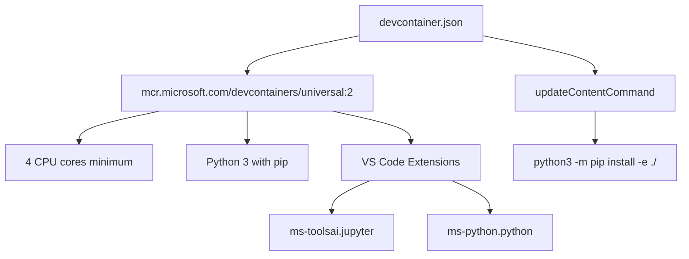
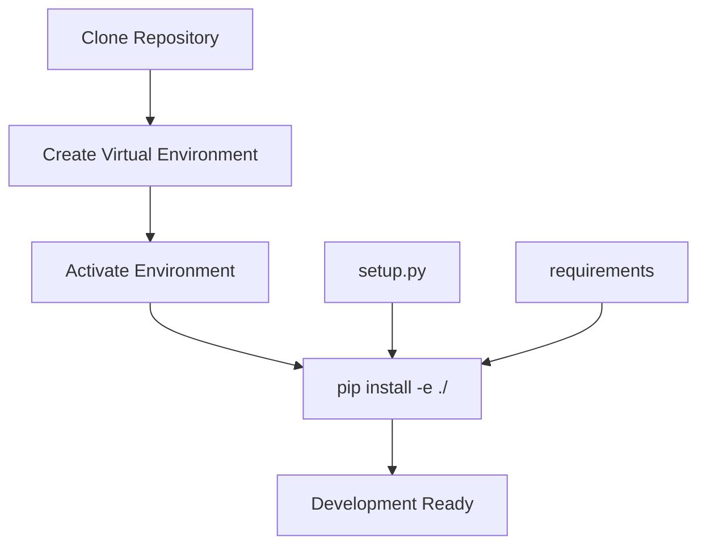
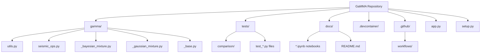
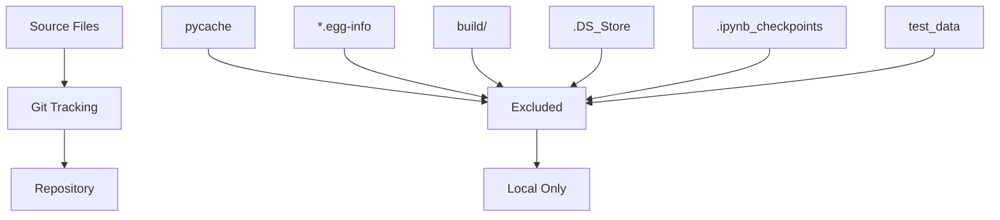
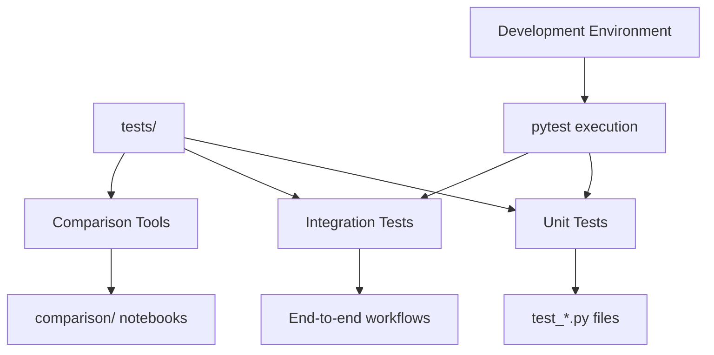

# Development Environment

> **Relevant source files**
> * [.devcontainer/devcontainer.json](https://github.com/AI4EPS/GaMMA/blob/edcf2cec/.devcontainer/devcontainer.json)
> * [.gitignore](https://github.com/AI4EPS/GaMMA/blob/edcf2cec/.gitignore)

This document provides guidance for setting up a development environment for contributing to the GaMMA project. It covers development container setup, local development configuration, and understanding the project structure for effective contribution.

For information about the CI/CD pipeline and deployment processes, see [CI/CD Pipeline](/AI4EPS/GaMMA/7.2-cicd-pipeline). For documentation building and maintenance, see [Documentation System](/AI4EPS/GaMMA/7.3-documentation-system).

## Development Container Setup

GaMMA provides a preconfigured development container that ensures a consistent development environment across different machines and platforms. The development container is configured to automatically install dependencies and set up the necessary tools.

### Container Configuration

The development environment uses Microsoft's Universal DevContainer image with the following specifications:

The container automatically executes `python3 -m pip install -e ./` during the update phase, installing GaMMA in editable mode for development work.

**Sources:** [.devcontainer/devcontainer.json L1-L22](https://github.com/AI4EPS/GaMMA/blob/edcf2cec/.devcontainer/devcontainer.json#L1-L22)

### Required Resources

| Resource | Specification | Purpose |
| --- | --- | --- |
| CPU Cores | 4 minimum | Support parallel processing in association algorithms |
| Memory | Standard (4GB+) | Handle seismic data processing workloads |
| Extensions | Jupyter, Python | Interactive development and notebook support |

### Setup Process

1. **Container Initialization**: The container uses `waitFor: "onCreateCommand"` to ensure proper setup sequencing
2. **Dependency Installation**: Automatically runs `python3 -m pip install -e ./` to install GaMMA in development mode
3. **Extension Loading**: Installs Jupyter and Python extensions for VS Code integration

**Sources:** [.devcontainer/devcontainer.json L6-L8](https://github.com/AI4EPS/GaMMA/blob/edcf2cec/.devcontainer/devcontainer.json#L6-L8)

## Local Development Setup

For developers who prefer local development without containers, GaMMA can be installed directly on the host system.

### Installation Process

### Environment Requirements

* **Python**: 3.8 or higher
* **Dependencies**: Automatically handled by `setup.py`
* **Development Tools**: pytest, jupyter, git

**Sources:** [.devcontainer/devcontainer.json L7](https://github.com/AI4EPS/GaMMA/blob/edcf2cec/.devcontainer/devcontainer.json#L7-L7)

## Project Structure Overview

Understanding the GaMMA project structure is essential for effective development. The codebase follows a modular architecture with clear separation of concerns.

### Core Directory Layout

### Key Development Files

| Path | Purpose | Importance for Development |
| --- | --- | --- |
| `gamma/utils.py` | Main association workflow | Primary development target |
| `gamma/seismic_ops.py` | Seismic calculations | Physics and math implementations |
| `gamma/_base.py` | EM algorithm foundation | Core statistical methods |
| `app.py` | FastAPI service | Web API development |
| `tests/` | Test suite | Validation and regression testing |

**Sources:** [.gitignore L1-L19](https://github.com/AI4EPS/GaMMA/blob/edcf2cec/.gitignore#L1-L19)

## Development Workflow

### File Exclusions

The development environment automatically excludes certain files and directories from version control:

### Ignored File Categories

* **Python Artifacts**: `__pycache__`, `*.egg-info`, `build/`
* **IDE Files**: `.DS_Store`, `.ipynb_checkpoints`
* **Test Data**: `test_data`, `test_data.zip`
* **Output Files**: `figures`, `results`, `timetable_*`

**Sources:** [.gitignore L1-L19](https://github.com/AI4EPS/GaMMA/blob/edcf2cec/.gitignore#L1-L19)

### Development Cycle

1. **Environment Setup**: Use dev container or local installation
2. **Code Modification**: Edit source files in `gamma/` directory
3. **Testing**: Run tests to validate changes
4. **Documentation**: Update relevant documentation
5. **Integration**: Ensure compatibility with existing workflows

## Testing Integration

The development environment integrates with GaMMA's comprehensive testing framework. Tests are organized to support both unit testing and integration validation.

### Test Organization

### Test Data Management

Test data files are automatically excluded from the repository but can be generated or downloaded as needed during development:

* `test_data.zip` and extracted `test_data/` directories
* Generated `figures` and `results` directories
* Temporary `timetable_*` files

**Sources:** [.gitignore L9-L14](https://github.com/AI4EPS/GaMMA/blob/edcf2cec/.gitignore#L9-L14)

## IDE Integration

The development container includes specific VS Code extensions optimized for GaMMA development:

| Extension | Purpose | Development Benefit |
| --- | --- | --- |
| `ms-toolsai.jupyter` | Jupyter notebook support | Interactive data analysis and examples |
| `ms-python.python` | Python language support | Code completion, debugging, linting |

These extensions enable seamless development of both the core Python library and the accompanying Jupyter notebook examples.

**Sources:** [.devcontainer/devcontainer.json L14-L19](https://github.com/AI4EPS/GaMMA/blob/edcf2cec/.devcontainer/devcontainer.json#L14-L19)