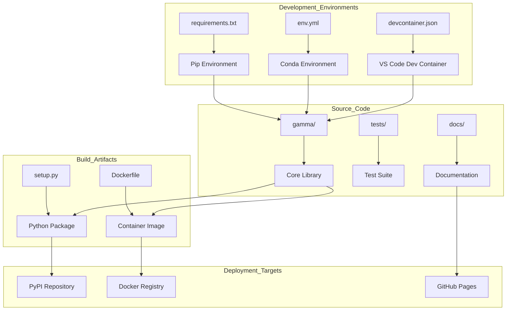
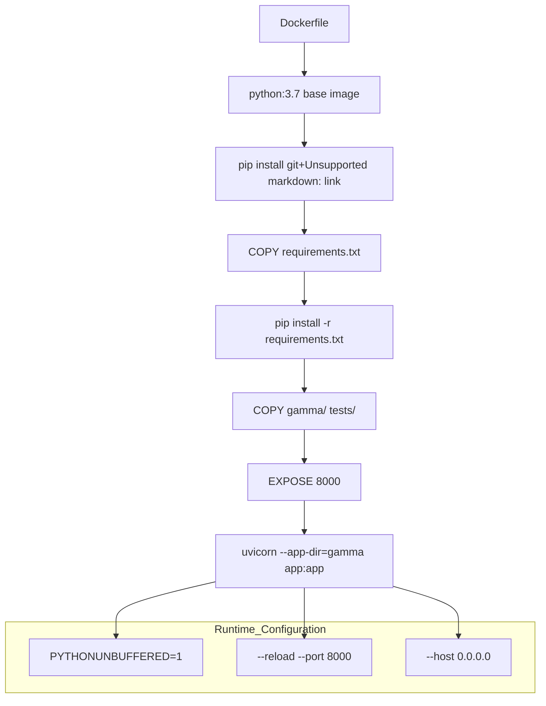
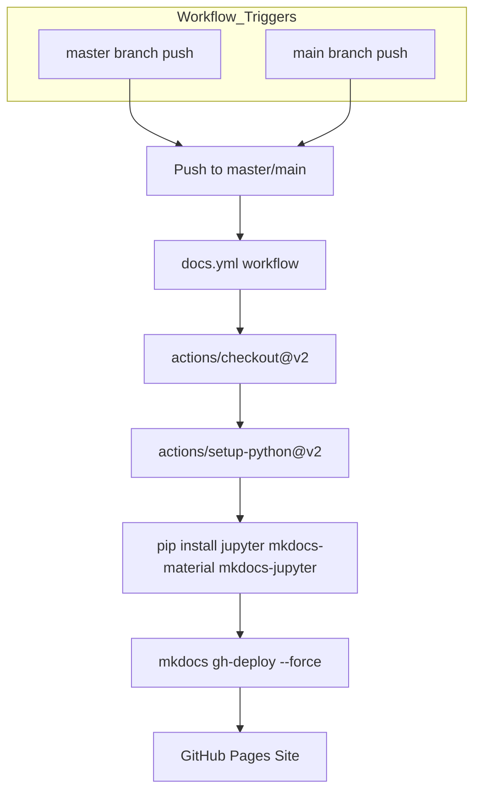

# Development and Deployment

> **Relevant source files**
> * [.devcontainer/devcontainer.json](https://github.com/AI4EPS/GaMMA/blob/edcf2cec/.devcontainer/devcontainer.json)
> * [.github/workflows/docs.yml](https://github.com/AI4EPS/GaMMA/blob/edcf2cec/.github/workflows/docs.yml)
> * [Dockerfile](https://github.com/AI4EPS/GaMMA/blob/edcf2cec/Dockerfile)
> * [env.yml](https://github.com/AI4EPS/GaMMA/blob/edcf2cec/env.yml)
> * [requirements.txt](https://github.com/AI4EPS/GaMMA/blob/edcf2cec/requirements.txt)

This document provides an overview of GaMMA's development workflow, containerized deployment, and production systems. It covers the tools and processes used for contributing to the codebase, building distributable containers, and deploying the system in various environments.

For detailed information about setting up a local development environment, see [Development Environment](/AI4EPS/GaMMA/7.1-development-environment). For comprehensive CI/CD pipeline documentation, see [CI/CD Pipeline](/AI4EPS/GaMMA/7.2-cicd-pipeline). For documentation system details, see [Documentation System](/AI4EPS/GaMMA/7.3-documentation-system).

## Development Workflow Overview

GaMMA supports multiple development approaches to accommodate different user preferences and deployment scenarios. The project structure supports both traditional Python development and modern containerized workflows.

### Development Approach Comparison

| Approach | Primary Use Case | Key Files | Benefits |
| --- | --- | --- | --- |
| Dev Container | VS Code/Codespaces | `.devcontainer/devcontainer.json` | Consistent environment, integrated tooling |
| Docker | Production deployment | `Dockerfile`, `requirements.txt` | Isolated runtime, easy deployment |
| Conda | Local development | `env.yml` | Package management, environment isolation |
| Pip | Simple installation | `requirements.txt`, `setup.py` | Quick setup, minimal overhead |

### Development Architecture

Sources: [.devcontainer/devcontainer.json L1-L21](https://github.com/AI4EPS/GaMMA/blob/edcf2cec/.devcontainer/devcontainer.json#L1-L21)

 [env.yml L1-L14](https://github.com/AI4EPS/GaMMA/blob/edcf2cec/env.yml#L1-L14)

 [requirements.txt L1-L6](https://github.com/AI4EPS/GaMMA/blob/edcf2cec/requirements.txt#L1-L6)

 [Dockerfile L1-L28](https://github.com/AI4EPS/GaMMA/blob/edcf2cec/Dockerfile#L1-L28)

## Container Deployment

The GaMMA Docker container provides a production-ready deployment package that includes the FastAPI web service and all necessary dependencies. The containerized deployment supports both development and production use cases.

### Container Build Process

Sources: [Dockerfile L1-L28](https://github.com/AI4EPS/GaMMA/blob/edcf2cec/Dockerfile#L1-L28)

The container deployment process involves several key stages:

1. **Base Image Selection**: Uses `python:3.7` as the foundation [Dockerfile L1](https://github.com/AI4EPS/GaMMA/blob/edcf2cec/Dockerfile#L1-L1)
2. **Dependency Installation**: Installs GaMMA from source and additional requirements [Dockerfile L11-L14](https://github.com/AI4EPS/GaMMA/blob/edcf2cec/Dockerfile#L11-L14)
3. **Code Copying**: Includes core library and test files [Dockerfile L17-L18](https://github.com/AI4EPS/GaMMA/blob/edcf2cec/Dockerfile#L17-L18)
4. **Service Configuration**: Exposes port 8000 and configures uvicorn [Dockerfile L21-L27](https://github.com/AI4EPS/GaMMA/blob/edcf2cec/Dockerfile#L21-L27)

### Container Runtime Configuration

The container runs the FastAPI application using uvicorn with specific configuration:

* **Application Directory**: `--app-dir=gamma` points to the gamma module [Dockerfile L27](https://github.com/AI4EPS/GaMMA/blob/edcf2cec/Dockerfile#L27-L27)
* **Application Module**: `app:app` references the FastAPI instance
* **Development Mode**: `--reload` enables automatic reloading [Dockerfile L27](https://github.com/AI4EPS/GaMMA/blob/edcf2cec/Dockerfile#L27-L27)
* **Network Binding**: `--host 0.0.0.0` allows external connections [Dockerfile L27](https://github.com/AI4EPS/GaMMA/blob/edcf2cec/Dockerfile#L27-L27)
* **Port**: `8000` is the default service port [Dockerfile L21-L27](https://github.com/AI4EPS/GaMMA/blob/edcf2cec/Dockerfile#L21-L27)

## CI/CD Pipeline Overview

The continuous integration and deployment system uses GitHub Actions to automate testing, building, and deployment processes. The primary CI/CD workflow focuses on documentation deployment to GitHub Pages.

### Documentation Deployment Workflow

Sources: [.github/workflows/docs.yml L1-L19](https://github.com/AI4EPS/GaMMA/blob/edcf2cec/.github/workflows/docs.yml#L1-L19)

The documentation workflow performs the following actions:

1. **Trigger Conditions**: Activates on pushes to `master` or `main` branches [.github/workflows/docs.yml L4-L7](https://github.com/AI4EPS/GaMMA/blob/edcf2cec/.github/workflows/docs.yml#L4-L7)
2. **Environment Setup**: Uses Ubuntu with Python 3.x [.github/workflows/docs.yml L11-L16](https://github.com/AI4EPS/GaMMA/blob/edcf2cec/.github/workflows/docs.yml#L11-L16)
3. **Dependency Installation**: Installs documentation tools including `mkdocs-material` and `mkdocs-jupyter` [.github/workflows/docs.yml L17](https://github.com/AI4EPS/GaMMA/blob/edcf2cec/.github/workflows/docs.yml#L17-L17)
4. **Deployment**: Uses `mkdocs gh-deploy --force` to publish to GitHub Pages [.github/workflows/docs.yml L18](https://github.com/AI4EPS/GaMMA/blob/edcf2cec/.github/workflows/docs.yml#L18-L18)

For comprehensive information about all CI/CD processes including testing, packaging, and release workflows, see [CI/CD Pipeline](/AI4EPS/GaMMA/7.2-cicd-pipeline).

## Documentation System Overview

GaMMA uses MkDocs with Material theme for documentation generation and GitHub Pages for hosting. The system supports both Markdown documentation and Jupyter notebook integration.

### Documentation Technology Stack

| Component | Purpose | Configuration |
| --- | --- | --- |
| MkDocs | Static site generator | `mkdocs.yml` |
| Material Theme | UI/UX framework | `mkdocs-material` package |
| Jupyter Integration | Notebook rendering | `mkdocs-jupyter` package |
| GitHub Pages | Hosting platform | Automated via GitHub Actions |

The documentation system automatically converts Jupyter notebooks to web pages and provides interactive examples alongside traditional documentation. For detailed configuration and customization information, see [Documentation System](/AI4EPS/GaMMA/7.3-documentation-system).

## Development Environment Setup

GaMMA provides multiple options for setting up development environments, each optimized for different workflows and tooling preferences.

### Dev Container Configuration

The dev container setup uses the Microsoft universal development container with specific GaMMA configurations:

* **Base Image**: `mcr.microsoft.com/devcontainers/universal:2` [.devcontainer/devcontainer.json L2](https://github.com/AI4EPS/GaMMA/blob/edcf2cec/.devcontainer/devcontainer.json#L2-L2)
* **Resource Requirements**: 4 CPU cores minimum [.devcontainer/devcontainer.json L4](https://github.com/AI4EPS/GaMMA/blob/edcf2cec/.devcontainer/devcontainer.json#L4-L4)
* **Package Installation**: Automatic editable installation via `python3 -m pip install -e ./` [.devcontainer/devcontainer.json L7](https://github.com/AI4EPS/GaMMA/blob/edcf2cec/.devcontainer/devcontainer.json#L7-L7)
* **VS Code Extensions**: Includes Python and Jupyter extensions [.devcontainer/devcontainer.json L15-L18](https://github.com/AI4EPS/GaMMA/blob/edcf2cec/.devcontainer/devcontainer.json#L15-L18)

### Environment Dependencies

The core dependencies required for GaMMA development include:

* **Scientific Computing**: `scikit-learn`, `pandas` [requirements.txt L1-L2](https://github.com/AI4EPS/GaMMA/blob/edcf2cec/requirements.txt#L1-L2)
* **Web Framework**: `fastapi`, `uvicorn` [requirements.txt L4-L5](https://github.com/AI4EPS/GaMMA/blob/edcf2cec/requirements.txt#L4-L5)
* **Utilities**: `tqdm` for progress bars, `kafka-python` for messaging [requirements.txt L3-L6](https://github.com/AI4EPS/GaMMA/blob/edcf2cec/requirements.txt#L3-L6)

For complete development environment setup instructions including IDE configuration and debugging setup, see [Development Environment](/AI4EPS/GaMMA/7.1-development-environment).

Sources: [.devcontainer/devcontainer.json L1-L21](https://github.com/AI4EPS/GaMMA/blob/edcf2cec/.devcontainer/devcontainer.json#L1-L21)

 [requirements.txt L1-L6](https://github.com/AI4EPS/GaMMA/blob/edcf2cec/requirements.txt#L1-L6)

 [env.yml L1-L14](https://github.com/AI4EPS/GaMMA/blob/edcf2cec/env.yml#L1-L14)