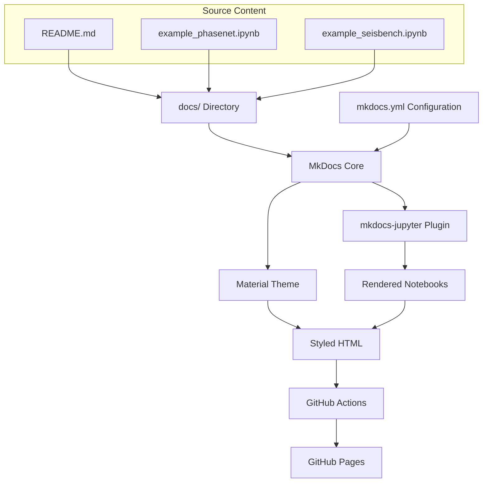
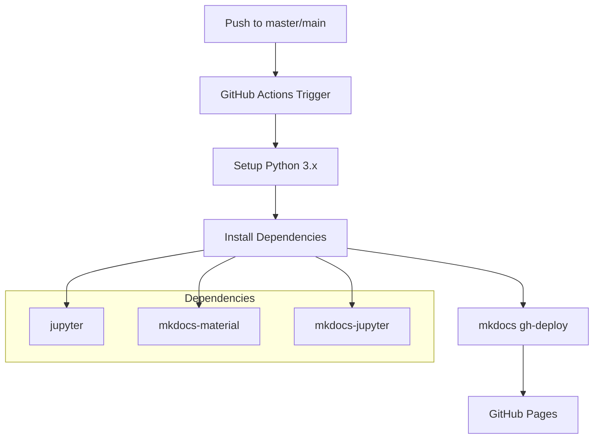
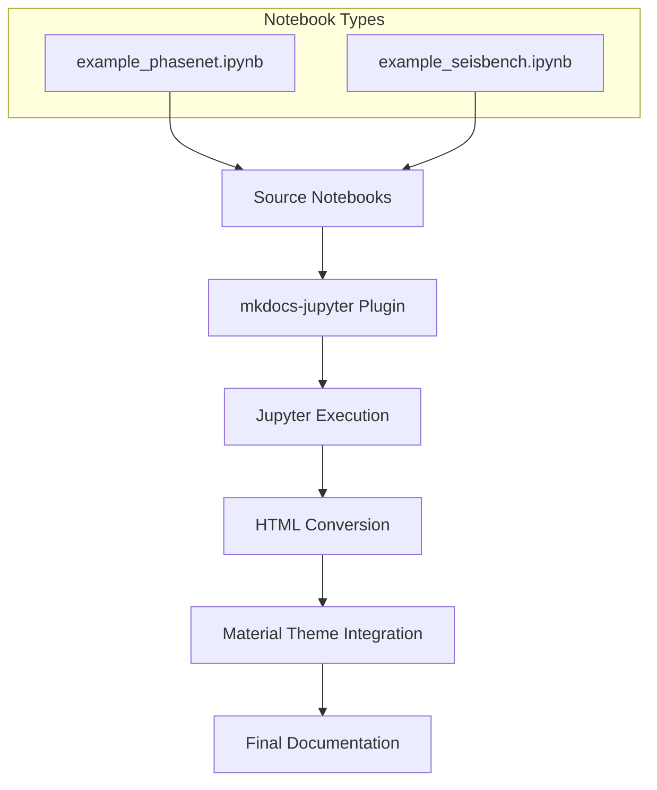
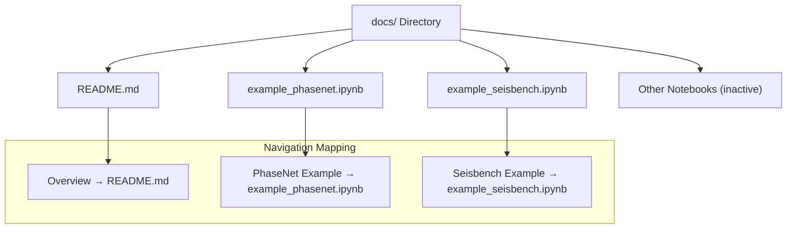

# Documentation System

> **Relevant source files**
> * [.github/workflows/docs.yml](https://github.com/AI4EPS/GaMMA/blob/edcf2cec/.github/workflows/docs.yml)
> * [Dockerfile](https://github.com/AI4EPS/GaMMA/blob/edcf2cec/Dockerfile)
> * [env.yml](https://github.com/AI4EPS/GaMMA/blob/edcf2cec/env.yml)
> * [mkdocs.yml](https://github.com/AI4EPS/GaMMA/blob/edcf2cec/mkdocs.yml)
> * [requirements.txt](https://github.com/AI4EPS/GaMMA/blob/edcf2cec/requirements.txt)

This document covers the GaMMA documentation system, including its build pipeline, configuration, and deployment mechanisms. The documentation uses MkDocs with the Material theme and integrates Jupyter notebooks as first-class documentation content.

For information about setting up the development environment, see [Development Environment](/AI4EPS/GaMMA/7.1-development-environment). For details about the CI/CD pipeline that powers documentation deployment, see [CI/CD Pipeline](/AI4EPS/GaMMA/7.2-cicd-pipeline).

## Documentation Stack Overview

GaMMA uses a modern documentation stack built around MkDocs with several key components that enable rich, interactive documentation including rendered Jupyter notebooks.

### Core Components

The documentation system consists of three primary components working together:

| Component | Purpose | Configuration |
| --- | --- | --- |
| **MkDocs** | Static site generator | [mkdocs.yml L1-L22](https://github.com/AI4EPS/GaMMA/blob/edcf2cec/mkdocs.yml#L1-L22) |
| **Material Theme** | Modern, responsive UI | [mkdocs.yml L13-L14](https://github.com/AI4EPS/GaMMA/blob/edcf2cec/mkdocs.yml#L13-L14) |
| **mkdocs-jupyter Plugin** | Jupyter notebook rendering | [mkdocs.yml L15-L17](https://github.com/AI4EPS/GaMMA/blob/edcf2cec/mkdocs.yml#L15-L17) |

### Documentation Stack Architecture



Sources: [mkdocs.yml L1-L22](https://github.com/AI4EPS/GaMMA/blob/edcf2cec/mkdocs.yml#L1-L22)

 [.github/workflows/docs.yml L1-L19](https://github.com/AI4EPS/GaMMA/blob/edcf2cec/.github/workflows/docs.yml#L1-L19)

## MkDocs Configuration

The documentation configuration is centralized in `mkdocs.yml`, which defines site metadata, navigation structure, and plugin behavior.

### Site Configuration

The site configuration establishes basic metadata and repository linking:

```yaml
site_name: "GaMMA"
site_description: 'GaMMA: earthquake phase association using a bayesian gaussian mixture model'
site_author: 'Weiqiang Zhu'
docs_dir: docs/
repo_name: 'AI4EPS/GaMMA'
repo_url: 'https://github.com/ai4eps/GaMMA'
```

### Navigation Structure

The navigation defines the documentation hierarchy and available pages:

| Navigation Item | Source File | Status |
| --- | --- | --- |
| Overview | `README.md` | Active |
| PhaseNet Example | `example_phasenet.ipynb` | Active |
| Seisbench Example | `example_seisbench.ipynb` | Active |
| Interactive Example | `example_interactive.ipynb` | Commented out |
| Synthetic Example | `example_synthetic.ipynb` | Commented out |

Sources: [mkdocs.yml L7-L12](https://github.com/AI4EPS/GaMMA/blob/edcf2cec/mkdocs.yml#L7-L12)

### Plugin Configuration

The `mkdocs-jupyter` plugin enables seamless integration of Jupyter notebooks with specific rendering options:

```yaml
plugins:
  - mkdocs-jupyter:
      ignore_h1_titles: True
```

The `ignore_h1_titles: True` setting prevents duplicate titles when notebook cells contain H1 headers that would conflict with MkDocs page titles.

Sources: [mkdocs.yml L15-L17](https://github.com/AI4EPS/GaMMA/blob/edcf2cec/mkdocs.yml#L15-L17)

## Automated Documentation Deployment

The documentation deployment is fully automated through GitHub Actions, providing continuous documentation updates whenever code changes are pushed to the main branch.

### Deployment Pipeline Architecture



Sources: [.github/workflows/docs.yml L1-L19](https://github.com/AI4EPS/GaMMA/blob/edcf2cec/.github/workflows/docs.yml#L1-L19)

### GitHub Actions Workflow

The documentation deployment workflow is defined in `.github/workflows/docs.yml` and executes the following steps:

1. **Trigger Conditions**: Activates on pushes to `master` or `main` branches
2. **Environment Setup**: Configures Ubuntu runner with Python 3.x
3. **Dependency Installation**: Installs `jupyter`, `mkdocs-material`, and `mkdocs-jupyter`
4. **Deployment**: Executes `mkdocs gh-deploy --force` to build and deploy to GitHub Pages

The `--force` flag ensures that deployment succeeds even if there are conflicts with the existing GitHub Pages branch.

Sources: [.github/workflows/docs.yml L3-L18](https://github.com/AI4EPS/GaMMA/blob/edcf2cec/.github/workflows/docs.yml#L3-L18)

## Jupyter Notebook Integration

The documentation system treats Jupyter notebooks as first-class documentation content, rendering them with full interactivity and output preservation.

### Notebook Processing Pipeline



### Notebook Configuration

The `mkdocs-jupyter` plugin configuration includes:

* **Title Handling**: `ignore_h1_titles: True` prevents conflicts between notebook H1 headers and MkDocs page titles
* **Output Preservation**: Code outputs, plots, and interactive elements are maintained in the rendered documentation
* **Navigation Integration**: Notebooks appear seamlessly in the site navigation structure

Sources: [mkdocs.yml L15-L17](https://github.com/AI4EPS/GaMMA/blob/edcf2cec/mkdocs.yml#L15-L17)

 [mkdocs.yml L11-L12](https://github.com/AI4EPS/GaMMA/blob/edcf2cec/mkdocs.yml#L11-L12)

## Analytics and Tracking

The documentation includes Google Analytics integration for usage tracking and performance monitoring.

```yaml
extra:
  analytics:
    provider: google
    property: G-Q88Y0E2EZJ
```

This configuration enables tracking of documentation usage patterns and helps identify popular content areas.

Sources: [mkdocs.yml L18-L21](https://github.com/AI4EPS/GaMMA/blob/edcf2cec/mkdocs.yml#L18-L21)

## Local Documentation Development

For local documentation development and testing, the documentation can be built and served locally using MkDocs commands.

### Development Dependencies

The required dependencies for local documentation development include:

| Package | Purpose |
| --- | --- |
| `mkdocs-material` | Theme and UI components |
| `mkdocs-jupyter` | Notebook rendering |
| `jupyter` | Notebook execution environment |

### Local Build Commands

```markdown
# Install dependencies
pip install jupyter mkdocs-material mkdocs-jupyter

# Serve documentation locally
mkdocs serve

# Build static documentation
mkdocs build

# Deploy to GitHub Pages (requires permissions)
mkdocs gh-deploy --force
```

The local development server typically runs on `http://localhost:8000` and provides live reload functionality for documentation changes.

Sources: [.github/workflows/docs.yml L17-L18](https://github.com/AI4EPS/GaMMA/blob/edcf2cec/.github/workflows/docs.yml#L17-L18)

## Documentation Content Organization

The documentation content is organized within the `docs/` directory as specified by the `docs_dir` configuration directive.

### Content Structure



The `docs_dir: docs/` configuration directive specifies that all documentation source files are located in the `docs/` directory relative to the repository root.

Sources: [mkdocs.yml L4](https://github.com/AI4EPS/GaMMA/blob/edcf2cec/mkdocs.yml#L4-L4)

 [mkdocs.yml L7-L12](https://github.com/AI4EPS/GaMMA/blob/edcf2cec/mkdocs.yml#L7-L12)