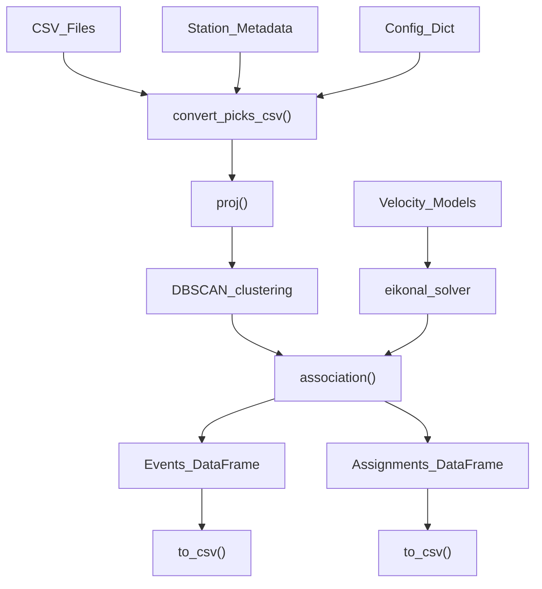
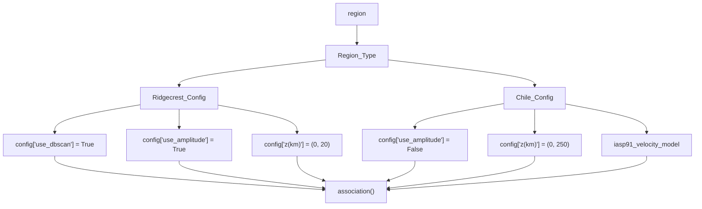
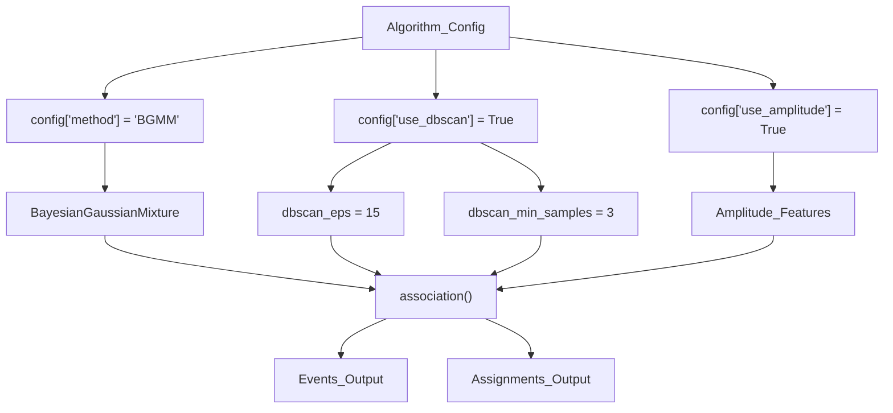
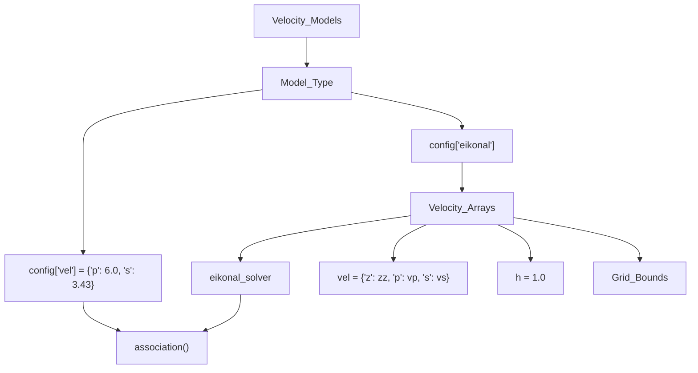
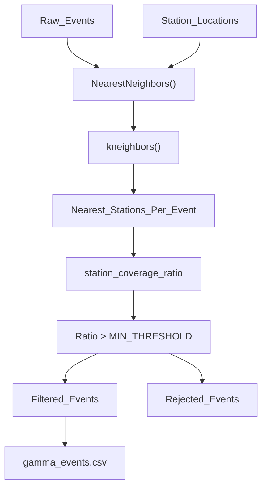
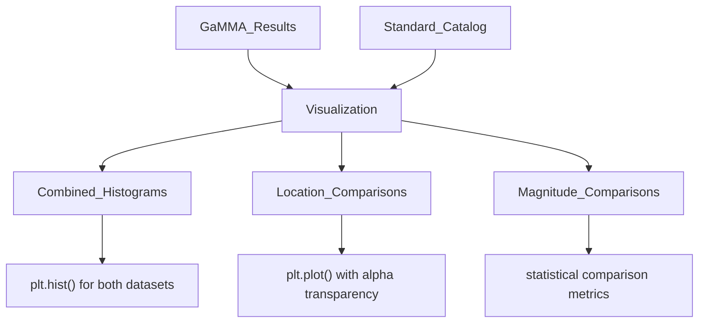

# Examples and Tutorials

> **Relevant source files**
> * [docs/example_phasenet.ipynb](https://github.com/AI4EPS/GaMMA/blob/edcf2cec/docs/example_phasenet.ipynb)

This page provides practical examples and tutorials demonstrating how to use GaMMA for seismic event association with real-world data. The examples cover different data sources, configuration patterns, and integration scenarios commonly encountered in seismological applications.

For detailed API documentation of the functions used in these examples, see [API Reference](/AI4EPS/GaMMA/4-api-reference). For conceptual background on the algorithms, see [Core Concepts](/AI4EPS/GaMMA/3-core-concepts).

## Overview

GaMMA includes several comprehensive tutorials that demonstrate different aspects of the system:

* **PhaseNet Integration**: Complete workflow using machine learning-generated picks from PhaseNet
* **Synthetic Data Processing**: Examples with controlled synthetic datasets for testing and validation
* **Multi-format Data Support**: Integration with SeisbBench and other seismic data formats
* **Web Service Usage**: Accessing GaMMA functionality through the FastAPI interface

The examples are designed to be self-contained and can be run directly, with demo data provided for immediate experimentation.

## Tutorial Data Flow

The following diagram shows the typical data processing workflow used across all GaMMA tutorials:

**Sources:** [docs/example_phasenet.ipynb L195-L325](https://github.com/AI4EPS/GaMMA/blob/edcf2cec/docs/example_phasenet.ipynb#L195-L325)

## Configuration Patterns

All tutorials follow a consistent configuration pattern using Python dictionaries with region-specific parameters:

**Sources:** [docs/example_phasenet.ipynb L234-L305](https://github.com/AI4EPS/GaMMA/blob/edcf2cec/docs/example_phasenet.ipynb#L234-L305)

## Key Tutorial Components

### Data Input Processing

The tutorials demonstrate standardized data input handling through specific function calls and data transformations:

| Component | Function/Method | Purpose |
| --- | --- | --- |
| Pick Loading | `pd.read_csv(picks_csv, parse_dates=["phase_time"])` | Load timestamped seismic picks |
| Station Loading | `pd.read_csv(station_csv)` | Load station metadata with coordinates |
| Column Mapping | `picks.rename(columns={...})` | Standardize column names |
| Coordinate Projection | `Proj(f"+proj=aeqd +lon_0={x0} +lat_0={y0} +units=km")` | Convert to Cartesian coordinates |

**Sources:** [docs/example_phasenet.ipynb L195-L231](https://github.com/AI4EPS/GaMMA/blob/edcf2cec/docs/example_phasenet.ipynb#L195-L231)

### Algorithm Configuration

The tutorials show systematic configuration of key algorithm parameters:

**Sources:** [docs/example_phasenet.ipynb L234-L243](https://github.com/AI4EPS/GaMMA/blob/edcf2cec/docs/example_phasenet.ipynb#L234-L243)

 [docs/example_phasenet.ipynb L266-L271](https://github.com/AI4EPS/GaMMA/blob/edcf2cec/docs/example_phasenet.ipynb#L266-L271)

### Velocity Model Integration

Tutorials demonstrate two approaches for incorporating velocity models:

**Sources:** [docs/example_phasenet.ipynb L274-L303](https://github.com/AI4EPS/GaMMA/blob/edcf2cec/docs/example_phasenet.ipynb#L274-L303)

## Result Processing and Validation

The tutorials include comprehensive result processing workflows:

### Output Generation

The examples show systematic output file generation with specific naming conventions and formats:

| Output Type | Filename | Content | Format Function |
| --- | --- | --- | --- |
| Events | `gamma_events.csv` | Event locations, times, magnitudes | `to_csv(float_format="%.3f")` |
| Assignments | `gamma_picks.csv` | Pick-to-event associations | `to_csv(date_format="%Y-%m-%dT%H:%M:%S.%f")` |
| Visualizations | `figures/*.png` | Quality assessment plots | `plt.savefig(dpi=300)` |

**Sources:** [docs/example_phasenet.ipynb L420-L441](https://github.com/AI4EPS/GaMMA/blob/edcf2cec/docs/example_phasenet.ipynb#L420-L441)

### Quality Control Filtering

Advanced tutorials demonstrate optional quality control through nearest station analysis:

**Sources:** [docs/example_phasenet.ipynb L465-L503](https://github.com/AI4EPS/GaMMA/blob/edcf2cec/docs/example_phasenet.ipynb#L465-L503)

## Visualization Framework

All tutorials include standardized visualization components using matplotlib with specific styling patterns:

### Plot Types Generated

The tutorial framework automatically generates several analysis plots:

1. **Temporal Distribution**: `earthquake_number.png` - Event frequency over time
2. **Spatial Distribution**: `earthquake_location.png` - Geographic and depth distribution
3. **Magnitude Analysis**: `earthquake_magnitude_frequency.png` - Magnitude-frequency relationship
4. **Quality Metrics**: `covariance.png` - Association uncertainty measures

**Sources:** [docs/example_phasenet.ipynb L566-L941](https://github.com/AI4EPS/GaMMA/blob/edcf2cec/docs/example_phasenet.ipynb#L566-L941)

### Comparison Framework

The tutorials support automatic comparison with reference catalogs when available:

**Sources:** [docs/example_phasenet.ipynb L553-L585](https://github.com/AI4EPS/GaMMA/blob/edcf2cec/docs/example_phasenet.ipynb#L553-L585)