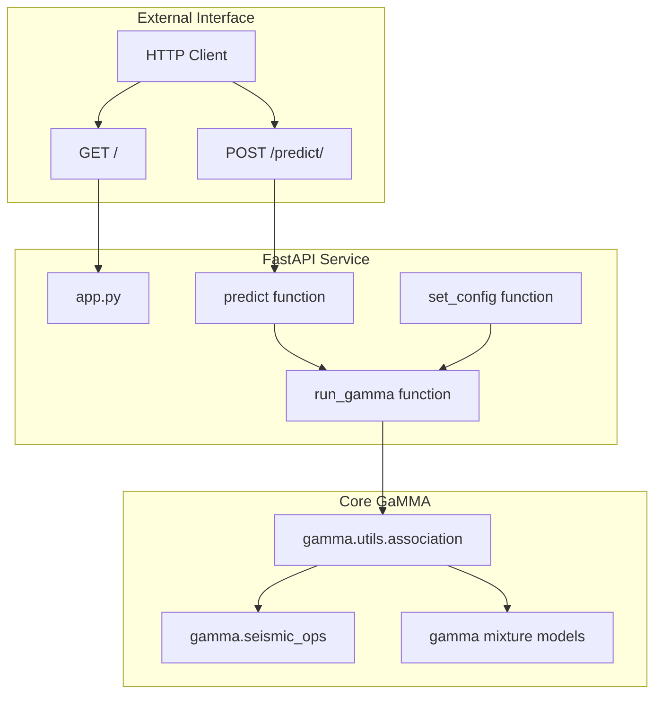
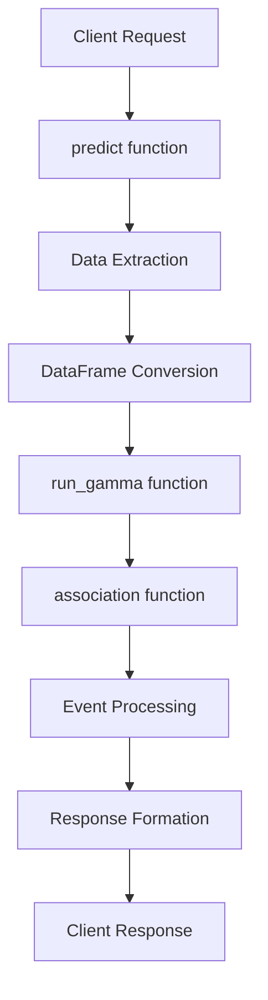
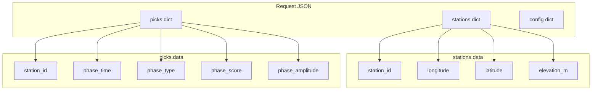
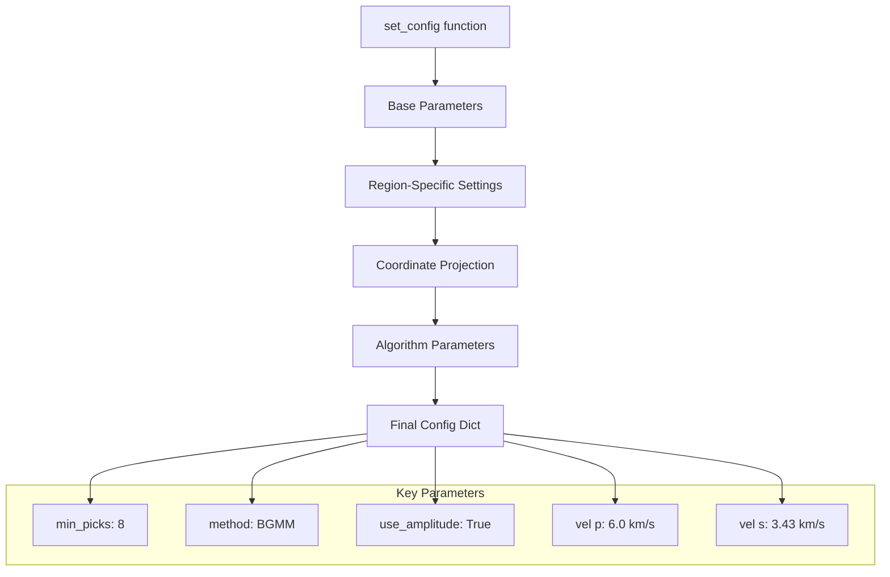
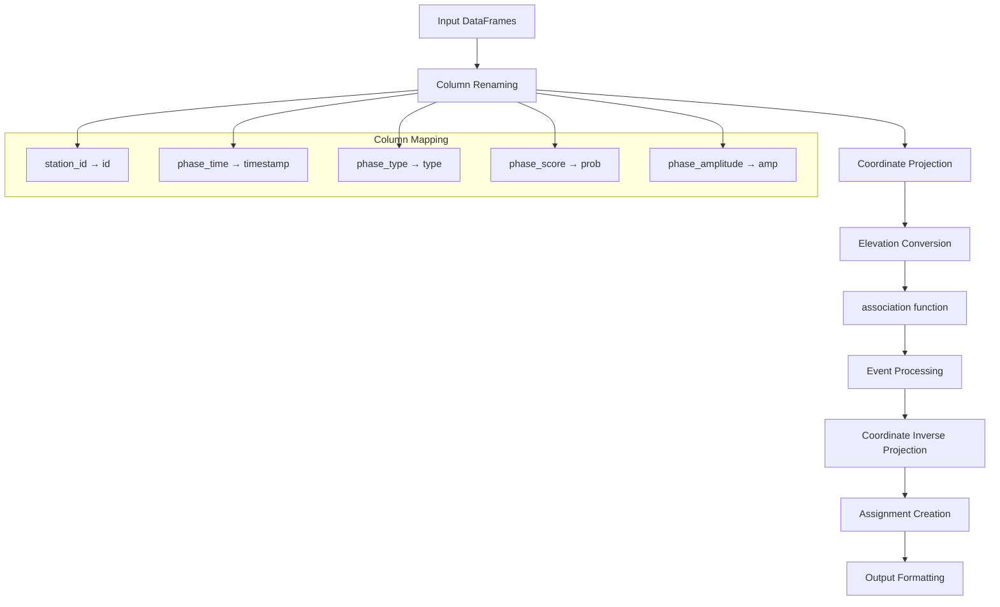
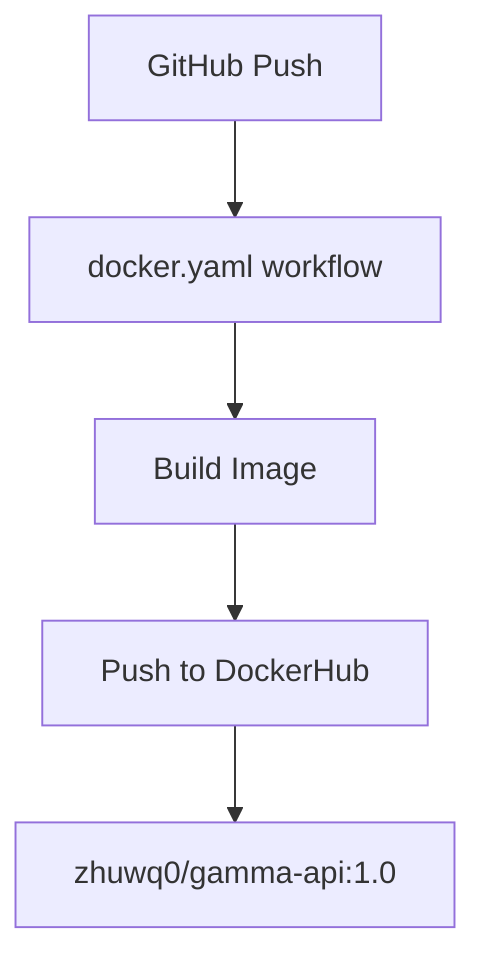

# FastAPI Service Usage

> **Relevant source files**
> * [.github/workflows/docker.yaml](https://github.com/AI4EPS/GaMMA/blob/edcf2cec/.github/workflows/docker.yaml)
> * [app.py](https://github.com/AI4EPS/GaMMA/blob/edcf2cec/app.py)
> * [docs/app.py](https://github.com/AI4EPS/GaMMA/blob/edcf2cec/docs/app.py)
> * [docs/example_fastapi.ipynb](https://github.com/AI4EPS/GaMMA/blob/edcf2cec/docs/example_fastapi.ipynb)
> * [tests/GaMMA.ipynb](https://github.com/AI4EPS/GaMMA/blob/edcf2cec/tests/GaMMA.ipynb)

This document provides comprehensive guidance on using GaMMA's FastAPI web service for seismic event association. The service exposes GaMMA's core functionality through RESTful HTTP endpoints, enabling remote access to the association algorithms without requiring local installation.

For information about using GaMMA directly through Python imports, see [Core Association Functions](/AI4EPS/GaMMA/4.1-core-association-functions). For deployment and development details, see [Development and Deployment](/AI4EPS/GaMMA/7-development-and-deployment).

## Service Architecture

The FastAPI service provides a lightweight wrapper around GaMMA's core association functionality, handling data conversion and configuration management for web-based access.

**Service Architecture Overview**



Sources: [app.py L1-L159](https://github.com/AI4EPS/GaMMA/blob/edcf2cec/app.py#L1-L159)

 [docs/app.py L1-L159](https://github.com/AI4EPS/GaMMA/blob/edcf2cec/docs/app.py#L1-L159)

## API Endpoints

The FastAPI service exposes two primary endpoints for client interaction.

### GET / - Health Check

A simple endpoint that returns a greeting message to verify service availability.

**Response Format:**

```json
{
    "Hello": "GaMMA!"
}
```

### POST /predict/ - Event Association

The main prediction endpoint that processes seismic picks and returns associated events.

**Request Data Flow**



Sources: [app.py L14-L27](https://github.com/AI4EPS/GaMMA/blob/edcf2cec/app.py#L14-L27)

 [app.py L112-L158](https://github.com/AI4EPS/GaMMA/blob/edcf2cec/app.py#L112-L158)

## Data Formats and Requirements

### Input Data Structure

The `/predict/` endpoint expects a JSON payload with three main components:

**Request Payload Structure**



### Data Preparation Requirements

| Field | Type | Description | Required |
| --- | --- | --- | --- |
| `station_id` | string | Unique station identifier | Yes |
| `phase_time` | string/datetime | Pick arrival time | Yes |
| `phase_type` | string | Phase type (P/S) | Yes |
| `phase_score` | float | Pick confidence score | Yes |
| `phase_amplitude` | float | Phase amplitude | Optional |
| `longitude` | float | Station longitude | Yes |
| `latitude` | float | Station latitude | Yes |
| `elevation_m` | float | Station elevation in meters | Yes |

Sources: [app.py L15-L20](https://github.com/AI4EPS/GaMMA/blob/edcf2cec/app.py#L15-L20)

 [app.py L119-L132](https://github.com/AI4EPS/GaMMA/blob/edcf2cec/app.py#L119-L132)

 [docs/example_fastapi.ipynb L1006-L1027](https://github.com/AI4EPS/GaMMA/blob/edcf2cec/docs/example_fastapi.ipynb#L1006-L1027)

## Configuration Management

The service uses the `set_config()` function to establish processing parameters with region-specific defaults.

**Configuration Flow**



### Default Configuration Parameters

The service provides sensible defaults for the Ridgecrest region:

* **Quality Thresholds:** `min_picks=8`, `min_score=0.6`
* **Residual Limits:** `max_residual_time=1.0s`, `max_residual_amplitude=1.0`
* **Algorithm:** Bayesian Gaussian Mixture Model (`BGMM`)
* **Velocity Model:** P-wave 6.0 km/s, S-wave 3.43 km/s
* **Coordinate System:** Azimuthal equidistant projection

Sources: [app.py L30-L106](https://github.com/AI4EPS/GaMMA/blob/edcf2cec/app.py#L30-L106)

## Data Processing Pipeline

The `run_gamma()` function orchestrates the complete processing workflow from input data to final results.

**Processing Pipeline**



### Key Processing Steps

1. **Data Normalization:** Column renaming to match GaMMA internal format
2. **Coordinate Transformation:** Geographic coordinates to projected kilometers
3. **Elevation Processing:** Convert elevation from meters to depth in kilometers
4. **Core Association:** Call `gamma.utils.association` with processed data
5. **Result Transformation:** Convert output back to geographic coordinates
6. **Assignment Linking:** Create pick-to-event assignment relationships

Sources: [app.py L112-L158](https://github.com/AI4EPS/GaMMA/blob/edcf2cec/app.py#L112-L158)

## Usage Examples

### Basic API Call

The notebook demonstrates typical usage patterns for the FastAPI service:

```javascript
import requests
import pandas as pd

# Service endpoint
GAMMA_API_URL = "https://ai4eps-gamma.hf.space"

# Prepare data
picks_data = {
    "data": picks_df.to_dict(orient="records")
}
stations_data = {
    "data": stations_df.to_dict(orient="records") 
}
config_data = {
    "xlim_degree": [-118.004, -117.004],
    "ylim_degree": [35.205, 36.205],
    "z(km)": [0, 41]
}

# Make request
response = requests.post(
    f"{GAMMA_API_URL}/predict/",
    json={
        "picks": picks_data,
        "stations": stations_data, 
        "config": config_data
    }
)

# Parse results
result = response.json()
events = result["events"]
picks_with_assignments = result["picks"]
```

### Data Preparation Example

The service expects specific data formatting:

```css
# Rename columns to expected format
picks.rename(columns={
    "id": "station_id",
    "timestamp": "phase_time", 
    "prob": "phase_score",
    "amp": "phase_amplitude",
    "type": "phase_type"
}, inplace=True)

stations.rename(columns={
    "id": "station_id",
    "elevation(m)": "elevation_m"
}, inplace=True)

# Convert phase types to uppercase
picks["phase_type"] = picks["phase_type"].str.upper()

# Merge station metadata with picks
picks = picks.merge(
    stations[["station_id", "latitude", "longitude", "elevation_m"]], 
    on="station_id", 
    how="left"
)
```

Sources: [docs/example_fastapi.ipynb L34-L35](https://github.com/AI4EPS/GaMMA/blob/edcf2cec/docs/example_fastapi.ipynb#L34-L35)

 [docs/example_fastapi.ipynb L1006-L1027](https://github.com/AI4EPS/GaMMA/blob/edcf2cec/docs/example_fastapi.ipynb#L1006-L1027)

## Response Format

### Successful Response Structure

The API returns a JSON object containing processed events and updated picks:

```json
{
    "events": [
        {
            "time(s)": 1562259600.004,
            "longitude": -117.504,
            "latitude": 35.705,
            "depth_km": 8.2,
            "magnitude": 2.1,
            "sigma_time": 0.15,
            "sigma_amp": 0.8,
            "event_idx": 0,
            "prob_gamma": 0.95
        }
    ],
    "picks": [
        {
            "station_id": "CI.WCS2..HH",
            "phase_time": "2019-07-04T17:00:00.004",
            "phase_type": "P",
            "phase_score": 0.372,
            "phase_amplitude": 1.576e-06,
            "event_index": 0,
            "gamma_score": 0.95
        }
    ]
}
```

### Error Handling

When no events are detected, the service returns:

```
{
    "events": null,
    "picks": [/* original picks data */]
}
```

Sources: [app.py L22-L27](https://github.com/AI4EPS/GaMMA/blob/edcf2cec/app.py#L22-L27)

 [app.py L155-L158](https://github.com/AI4EPS/GaMMA/blob/edcf2cec/app.py#L155-L158)

## Deployment Considerations

### Docker Deployment

The service includes Docker configuration for containerized deployment:

**Docker Workflow**



### Service Endpoints

The service is available at multiple endpoints:

* **Local Development:** `http://127.0.0.1:8000`
* **Hosted Service:** `https://ai4eps-gamma.hf.space`

### Performance Considerations

* Single CPU processing (`ncpu=1` in default config)
* Memory usage scales with input data size
* Processing time depends on number of picks and complexity
* Recommended for datasets under 5000 picks per request

Sources: [.github/workflows/docker.yaml L1-L33](https://github.com/AI4EPS/GaMMA/blob/edcf2cec/.github/workflows/docker.yaml#L1-L33)

 [docs/example_fastapi.ipynb L34-L35](https://github.com/AI4EPS/GaMMA/blob/edcf2cec/docs/example_fastapi.ipynb#L34-L35)