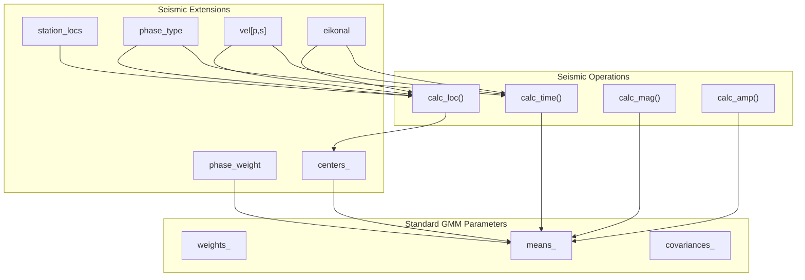
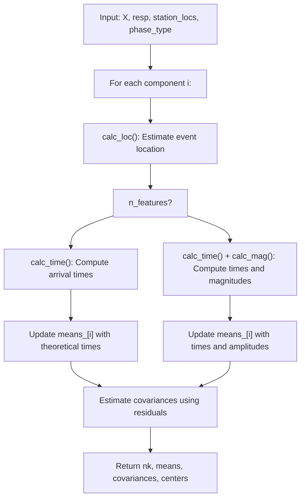
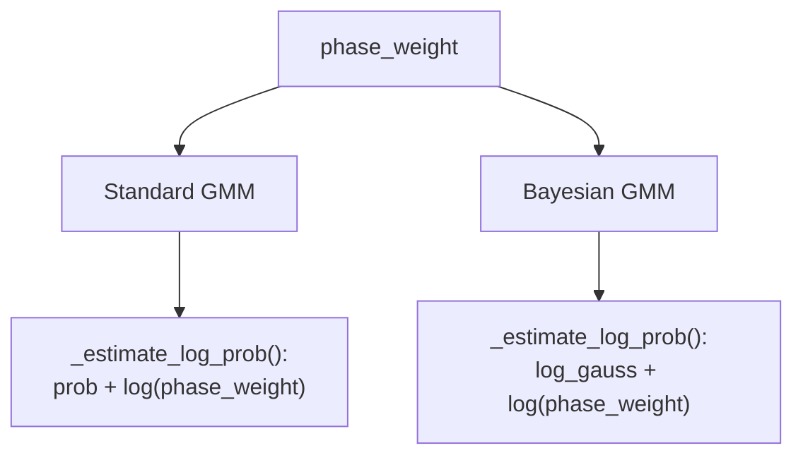
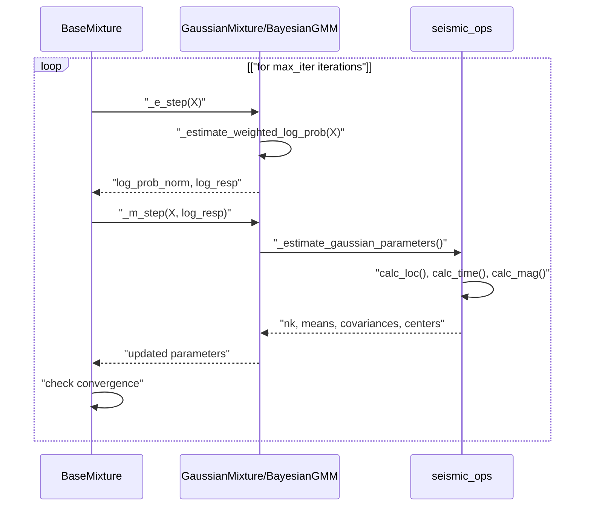
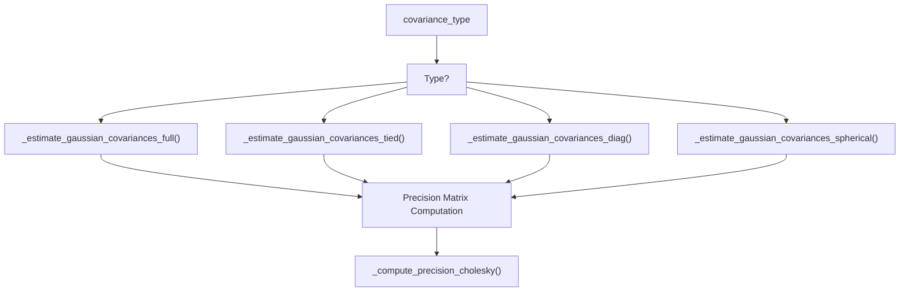

# Gaussian Mixture Models

> **Relevant source files**
> * [docs/assets/diagram_gamma_annotated.png](https://github.com/AI4EPS/GaMMA/blob/edcf2cec/docs/assets/diagram_gamma_annotated.png)
> * [gamma/_base.py](https://github.com/AI4EPS/GaMMA/blob/edcf2cec/gamma/_base.py)
> * [gamma/_bayesian_mixture.py](https://github.com/AI4EPS/GaMMA/blob/edcf2cec/gamma/_bayesian_mixture.py)
> * [gamma/_gaussian_mixture.py](https://github.com/AI4EPS/GaMMA/blob/edcf2cec/gamma/_gaussian_mixture.py)

This document explains the statistical foundation of GaMMA, focusing on how Gaussian Mixture Models (GMMs) are adapted for seismic event association. It covers the mathematical framework, implementation details, and seismic-specific adaptations that enable automatic clustering of seismic picks into discrete earthquake events.

For information about the seismic event association problem that GMMs solve, see [Seismic Event Association](/AI4EPS/GaMMA/3.1-seismic-event-association). For details about the travel time calculations used within the GMM framework, see [Travel Time Calculation](/AI4EPS/GaMMA/3.3-travel-time-calculation).

## Overview

GaMMA implements two variants of Gaussian Mixture Models specifically adapted for seismic data:

* **Standard GMM** (`GaussianMixture`): Uses maximum likelihood estimation with the Expectation-Maximization (EM) algorithm
* **Bayesian GMM** (`BayesianGaussianMixture`): Uses variational Bayesian inference to automatically determine the optimal number of components

Both models are built on a common foundation (`BaseMixture`) that implements the core EM algorithm with seismic-specific adaptations.

## Class Hierarchy and Architecture

```

```

Sources: [gamma/_base.py L40-L566](https://github.com/AI4EPS/GaMMA/blob/edcf2cec/gamma/_base.py#L40-L566)

 [gamma/_gaussian_mixture.py L553-L1007](https://github.com/AI4EPS/GaMMA/blob/edcf2cec/gamma/_gaussian_mixture.py#L553-L1007)

 [gamma/_bayesian_mixture.py L73-L890](https://github.com/AI4EPS/GaMMA/blob/edcf2cec/gamma/_bayesian_mixture.py#L73-L890)

## Seismic Adaptations

GaMMA's GMM implementation differs from standard statistical GMMs by incorporating seismic physics directly into the parameter estimation process:

### Seismic Parameters Integration



Sources: [gamma/_gaussian_mixture.py L250-L347](https://github.com/AI4EPS/GaMMA/blob/edcf2cec/gamma/_gaussian_mixture.py#L250-L347)

 [gamma/seismic_ops.py](https://github.com/AI4EPS/GaMMA/blob/edcf2cec/gamma/seismic_ops.py)

The key innovation is that instead of fitting Gaussian components directly to the pick data, GaMMA:

1. **Estimates earthquake locations** (`centers_`) using `calc_loc()` based on travel time residuals
2. **Computes theoretical arrival times** using `calc_time()` with velocity models
3. **Updates means** to reflect expected picks from estimated event locations
4. **Incorporates phase weights** to handle P-wave vs S-wave reliability differences

### Parameter Estimation Process

The `_estimate_gaussian_parameters()` function implements the seismic-specific M-step:



Sources: [gamma/_gaussian_mixture.py L250-L347](https://github.com/AI4EPS/GaMMA/blob/edcf2cec/gamma/_gaussian_mixture.py#L250-L347)

## Standard vs Bayesian GMM

### GaussianMixture (Standard GMM)

The `GaussianMixture` class uses maximum likelihood estimation:

* **Fixed number of components**: User must specify `n_components`
* **EM algorithm**: Alternates between E-step (assign picks to events) and M-step (update parameters)
* **Model selection**: Uses AIC/BIC for choosing optimal number of components

Key methods:

* `_m_step()`: Updates parameters using MLE [gamma/_gaussian_mixture.py L884-L913](https://github.com/AI4EPS/GaMMA/blob/edcf2cec/gamma/_gaussian_mixture.py#L884-L913)
* `_estimate_log_prob()`: Computes log-probabilities with phase weights [gamma/_gaussian_mixture.py L915-L917](https://github.com/AI4EPS/GaMMA/blob/edcf2cec/gamma/_gaussian_mixture.py#L915-L917)

### BayesianGaussianMixture (Variational Bayesian)

The `BayesianGaussianMixture` class uses variational Bayesian inference:

* **Automatic component selection**: Can determine optimal number of components
* **Prior distributions**: Uses priors on weights, means, and covariances
* **Regularization**: Built-in protection against overfitting

Key differences in implementation:

* `_estimate_weights()`: Uses Dirichlet priors [gamma/_bayesian_mixture.py L563-L579](https://github.com/AI4EPS/GaMMA/blob/edcf2cec/gamma/_bayesian_mixture.py#L563-L579)
* `_compute_lower_bound()`: Variational lower bound instead of likelihood [gamma/_bayesian_mixture.py L802-L851](https://github.com/AI4EPS/GaMMA/blob/edcf2cec/gamma/_bayesian_mixture.py#L802-L851)
* `_estimate_log_prob()`: Incorporates uncertainty in parameters [gamma/_bayesian_mixture.py L785-L800](https://github.com/AI4EPS/GaMMA/blob/edcf2cec/gamma/_bayesian_mixture.py#L785-L800)

### Component Weight Handling

Both models incorporate `phase_weight` to handle different reliability of P-wave vs S-wave picks:



Sources: [gamma/_gaussian_mixture.py L917](https://github.com/AI4EPS/GaMMA/blob/edcf2cec/gamma/_gaussian_mixture.py#L917-L917)

 [gamma/_bayesian_mixture.py L793](https://github.com/AI4EPS/GaMMA/blob/edcf2cec/gamma/_bayesian_mixture.py#L793-L793)

## EM Algorithm Implementation

The base EM algorithm is implemented in `BaseMixture` with seismic-specific initialization:

### Initialization Methods

The `_initialize_parameters()` method supports several initialization strategies:

| Method | Description | Implementation |
| --- | --- | --- |
| `"kmeans"` | K-means clustering on time-space data | [gamma/_base.py L113-L116](https://github.com/AI4EPS/GaMMA/blob/edcf2cec/gamma/_base.py#L113-L116) |
| `"random"` | Random assignment of responsibilities | [gamma/_base.py L117-L119](https://github.com/AI4EPS/GaMMA/blob/edcf2cec/gamma/_base.py#L117-L119) |
| `"k-means++"` | K-means++ initialization | [gamma/_base.py L124-L131](https://github.com/AI4EPS/GaMMA/blob/edcf2cec/gamma/_base.py#L124-L131) |
| `"centers"` | Initialize from provided event locations | [gamma/_base.py L132-L144](https://github.com/AI4EPS/GaMMA/blob/edcf2cec/gamma/_base.py#L132-L144) |

### E-Step and M-Step



Sources: [gamma/_base.py L302-L319](https://github.com/AI4EPS/GaMMA/blob/edcf2cec/gamma/_base.py#L302-L319)

 [gamma/_base.py L251-L264](https://github.com/AI4EPS/GaMMA/blob/edcf2cec/gamma/_base.py#L251-L264)

## Covariance Types

Both GMM implementations support multiple covariance structures:

| Type | Description | Shape | Use Case |
| --- | --- | --- | --- |
| `"full"` | Each component has full covariance matrix | `(n_components, n_features, n_features)` | Maximum flexibility |
| `"tied"` | All components share same covariance | `(n_features, n_features)` | Reduced parameters |
| `"diag"` | Diagonal covariance matrices | `(n_components, n_features)` | Independent features |
| `"spherical"` | Spherical covariances (single variance) | `(n_components,)` | Simplest model |

The covariance estimation functions handle the seismic-specific means structure:



Sources: [gamma/_gaussian_mixture.py L341-L346](https://github.com/AI4EPS/GaMMA/blob/edcf2cec/gamma/_gaussian_mixture.py#L341-L346)

 [gamma/_gaussian_mixture.py L350-L400](https://github.com/AI4EPS/GaMMA/blob/edcf2cec/gamma/_gaussian_mixture.py#L350-L400)

## Model Selection and Evaluation

### Information Criteria

The `GaussianMixture` class provides model selection tools:

* **AIC (Akaike Information Criterion)**: `aic(X)` [gamma/_gaussian_mixture.py L990-L1006](https://github.com/AI4EPS/GaMMA/blob/edcf2cec/gamma/_gaussian_mixture.py#L990-L1006)
* **BIC (Bayesian Information Criterion)**: `bic(X)` [gamma/_gaussian_mixture.py L969-L988](https://github.com/AI4EPS/GaMMA/blob/edcf2cec/gamma/_gaussian_mixture.py#L969-L988)

Both methods account for the seismic-specific parameter structure when computing the number of free parameters.

### Convergence Monitoring

The EM algorithm monitors convergence through:

* **Lower bound tracking**: For Bayesian GMM
* **Log-likelihood changes**: For standard GMM
* **Tolerance threshold**: `tol` parameter controls when to stop

Sources: [gamma/_base.py L246-L288](https://github.com/AI4EPS/GaMMA/blob/edcf2cec/gamma/_base.py#L246-L288)

 [gamma/_bayesian_mixture.py L802-L851](https://github.com/AI4EPS/GaMMA/blob/edcf2cec/gamma/_bayesian_mixture.py#L802-L851)