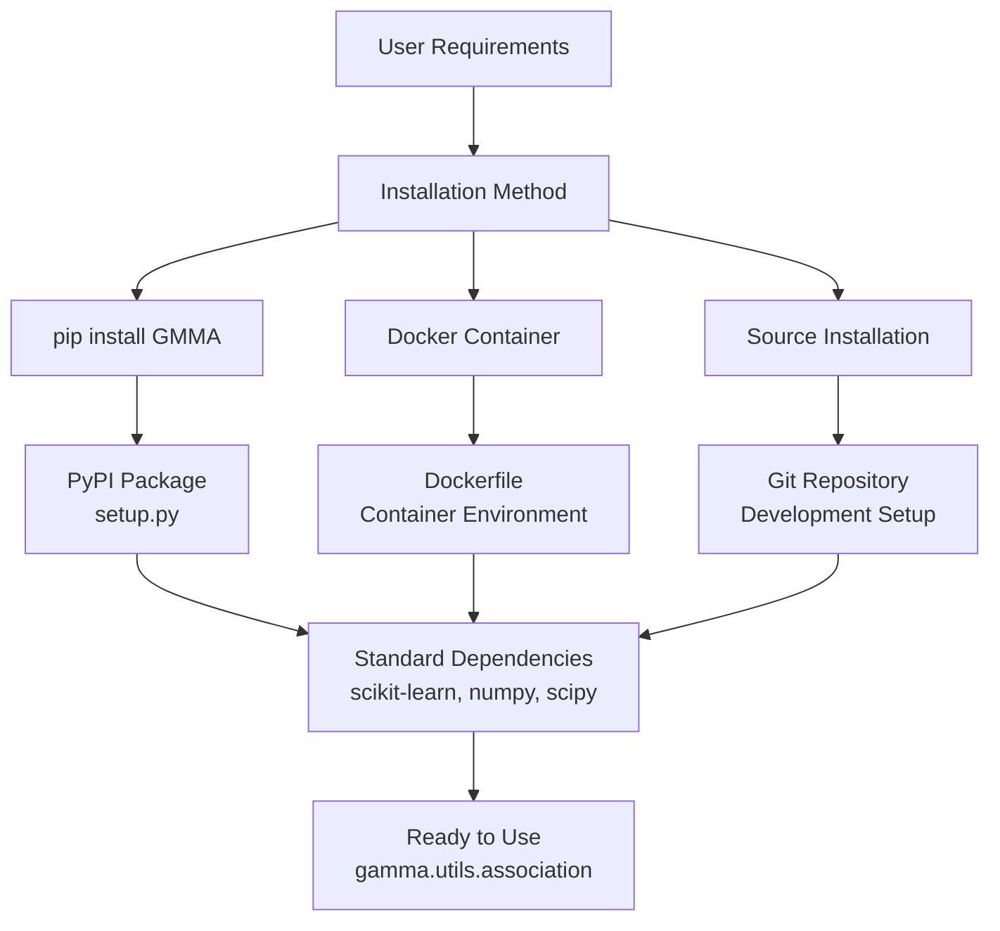
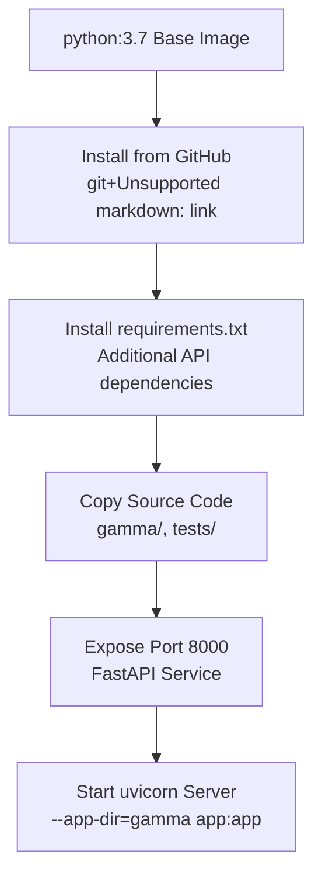
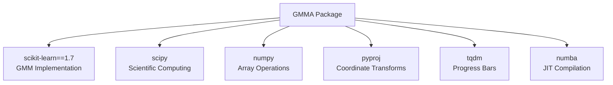
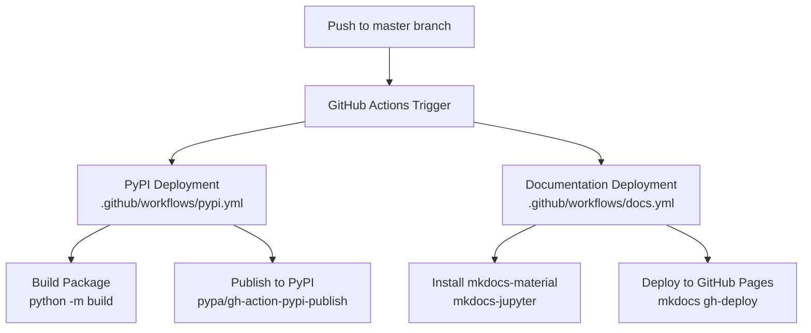

# Installation and Setup

> **Relevant source files**
> * [.devcontainer/devcontainer.json](https://github.com/AI4EPS/GaMMA/blob/edcf2cec/.devcontainer/devcontainer.json)
> * [.github/workflows/docs.yml](https://github.com/AI4EPS/GaMMA/blob/edcf2cec/.github/workflows/docs.yml)
> * [.github/workflows/pypi.yml](https://github.com/AI4EPS/GaMMA/blob/edcf2cec/.github/workflows/pypi.yml)
> * [Dockerfile](https://github.com/AI4EPS/GaMMA/blob/edcf2cec/Dockerfile)
> * [env.yml](https://github.com/AI4EPS/GaMMA/blob/edcf2cec/env.yml)
> * [requirements.txt](https://github.com/AI4EPS/GaMMA/blob/edcf2cec/requirements.txt)
> * [setup.py](https://github.com/AI4EPS/GaMMA/blob/edcf2cec/setup.py)

This document provides comprehensive instructions for installing GaMMA (Gaussian Mixture Model Associator) and setting up your environment for seismic event association. It covers installation methods, dependency management, and basic configuration steps needed to begin using GaMMA.

For usage examples and tutorials, see [Examples and Tutorials](/AI4EPS/GaMMA/5-examples-and-tutorials). For development environment setup, see [Development Environment](/AI4EPS/GaMMA/7.1-development-environment).

## Installation Methods

GaMMA can be installed through multiple methods depending on your use case and environment preferences.

### Installation Method Overview



Sources: [setup.py L1-L11](https://github.com/AI4EPS/GaMMA/blob/edcf2cec/setup.py#L1-L11)

 [Dockerfile L1-L28](https://github.com/AI4EPS/GaMMA/blob/edcf2cec/Dockerfile#L1-L28)

 [.github/workflows/pypi.yml L1-L46](https://github.com/AI4EPS/GaMMA/blob/edcf2cec/.github/workflows/pypi.yml#L1-L46)

### PyPI Installation

The recommended installation method for most users is through PyPI using pip:

```
pip install GMMA
```

This installs the package with the name `GMMA` as defined in [setup.py L4](https://github.com/AI4EPS/GaMMA/blob/edcf2cec/setup.py#L4-L4)

 The current version is `1.2.17` and includes the following core dependencies:

| Dependency | Version | Purpose |
| --- | --- | --- |
| scikit-learn | 1.7 | Gaussian Mixture Model implementation |
| scipy | latest | Scientific computing and optimization |
| numpy | latest | Numerical array operations |
| pyproj | latest | Coordinate system transformations |
| tqdm | latest | Progress bar utilities |
| numba | latest | JIT compilation for performance |

Sources: [setup.py L9](https://github.com/AI4EPS/GaMMA/blob/edcf2cec/setup.py#L9-L9)

### Docker Installation

For containerized deployments or isolated environments, use the provided Docker image:

```
docker build -t gamma .
docker run -p 8000:8000 gamma
```

The Docker setup includes:



Sources: [Dockerfile L1-L28](https://github.com/AI4EPS/GaMMA/blob/edcf2cec/Dockerfile#L1-L28)

 [requirements.txt L1-L6](https://github.com/AI4EPS/GaMMA/blob/edcf2cec/requirements.txt#L1-L6)

### Source Installation

For development or when you need the latest changes:

```
git clone https://github.com/AI4EPS/GaMMA.git
cd GaMMA
pip install -e .
```

This method is automatically configured in the development container through [.devcontainer/devcontainer.json L7](https://github.com/AI4EPS/GaMMA/blob/edcf2cec/.devcontainer/devcontainer.json#L7-L7)

Sources: [.devcontainer/devcontainer.json L1-L22](https://github.com/AI4EPS/GaMMA/blob/edcf2cec/.devcontainer/devcontainer.json#L1-L22)

## Environment Setup

### Conda Environment

For conda users, a pre-configured environment is available:

```sql
conda env create --name gamma --file=env.yml
conda activate gamma
```

The conda environment includes Python 3.7 and core scientific computing packages, with additional API dependencies installed via pip.

Sources: [env.yml L1-L14](https://github.com/AI4EPS/GaMMA/blob/edcf2cec/env.yml#L1-L14)

### Development Container

For VS Code users, a development container configuration is provided with:

* Universal development container base image
* 4 CPU cores allocated for performance
* Automatic package installation in editable mode
* Pre-installed Jupyter and Python extensions

Sources: [.devcontainer/devcontainer.json L1-L22](https://github.com/AI4EPS/GaMMA/blob/edcf2cec/.devcontainer/devcontainer.json#L1-L22)

## Dependency Details

### Core Package Dependencies

The main GaMMA package requires the following dependencies as specified in `setup.py`:



Sources: [setup.py L9](https://github.com/AI4EPS/GaMMA/blob/edcf2cec/setup.py#L9-L9)

### API Service Dependencies

For web API functionality, additional packages are required:

| Package | Purpose |
| --- | --- |
| fastapi | Web API framework |
| uvicorn | ASGI server |
| kafka-python | Message queue integration |
| pandas | Data manipulation |

Sources: [requirements.txt L1-L6](https://github.com/AI4EPS/GaMMA/blob/edcf2cec/requirements.txt#L1-L6)

 [env.yml L9-L13](https://github.com/AI4EPS/GaMMA/blob/edcf2cec/env.yml#L9-L13)

## Installation Verification

After installation, verify GaMMA is working correctly:

```javascript
import gamma
from gamma.utils import association

# Check version
print(gamma.__version__)  # Should show 1.2.17

# Verify core functions are available
print(hasattr(gamma.utils, 'association'))  # Should be True
```

### API Service Verification

If using Docker or the API service:

```markdown
# Check if service is running
curl http://localhost:8000/docs

# The service should respond with FastAPI documentation
```

The API service runs on port 8000 as configured in [Dockerfile L21](https://github.com/AI4EPS/GaMMA/blob/edcf2cec/Dockerfile#L21-L21)

 and [Dockerfile L27](https://github.com/AI4EPS/GaMMA/blob/edcf2cec/Dockerfile#L27-L27)

Sources: [Dockerfile L21](https://github.com/AI4EPS/GaMMA/blob/edcf2cec/Dockerfile#L21-L21)

 [Dockerfile L27](https://github.com/AI4EPS/GaMMA/blob/edcf2cec/Dockerfile#L27-L27)

## Configuration Basics

### Import Structure

GaMMA follows this import pattern:

```javascript
from gamma.utils import association
from gamma.seismic_ops import calc_time, calc_loc, calc_mag
```

### Basic Configuration

The association function requires configuration parameters for:

* Velocity models and travel time calculation
* Geographic coordinate bounds
* Algorithm parameters (GMM components, convergence criteria)
* Optional DBSCAN preprocessing settings

For detailed configuration examples, see [PhaseNet Integration](/AI4EPS/GaMMA/5.1-phasenet-integration).

Sources: Based on system architecture diagrams and typical usage patterns

## Automated Deployment

GaMMA includes automated deployment pipelines:



Sources: [.github/workflows/pypi.yml L1-L46](https://github.com/AI4EPS/GaMMA/blob/edcf2cec/.github/workflows/pypi.yml#L1-L46)

 [.github/workflows/docs.yml L1-L19](https://github.com/AI4EPS/GaMMA/blob/edcf2cec/.github/workflows/docs.yml#L1-L19)

## Troubleshooting

### Common Issues

1. **Version conflicts with scikit-learn**: GaMMA requires exactly version 1.7 as specified in [setup.py L9](https://github.com/AI4EPS/GaMMA/blob/edcf2cec/setup.py#L9-L9)
2. **Missing numba**: Required for performance optimizations in seismic calculations
3. **Coordinate projection errors**: Ensure `pyproj` is properly installed for geographic transformations
4. **API service not starting**: Check that port 8000 is available and uvicorn dependencies are installed

### System Requirements

* Python 3.7+ (Docker uses 3.7 specifically)
* Sufficient memory for large datasets (GMM clustering can be memory-intensive)
* Multi-core CPU recommended for parallel processing capabilities

Sources: [Dockerfile L1](https://github.com/AI4EPS/GaMMA/blob/edcf2cec/Dockerfile#L1-L1)

 [env.yml L5](https://github.com/AI4EPS/GaMMA/blob/edcf2cec/env.yml#L5-L5)

 [.devcontainer/devcontainer.json L3-L5](https://github.com/AI4EPS/GaMMA/blob/edcf2cec/.devcontainer/devcontainer.json#L3-L5)