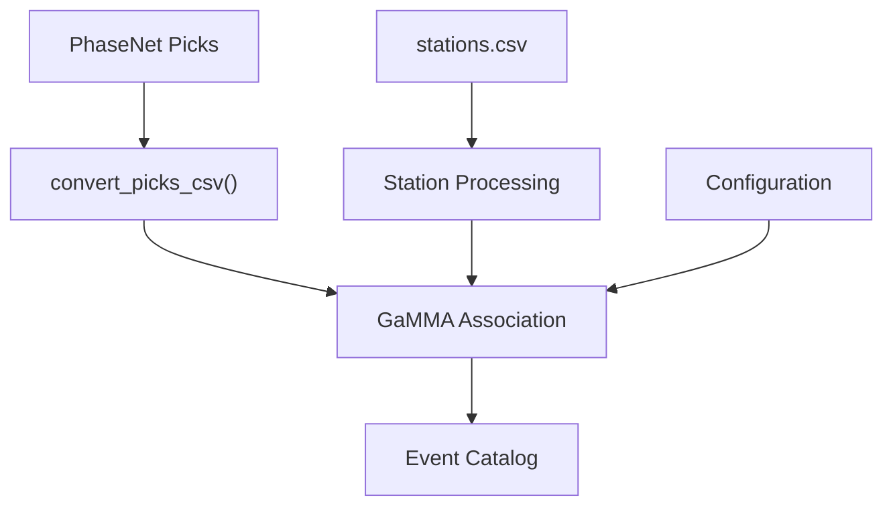
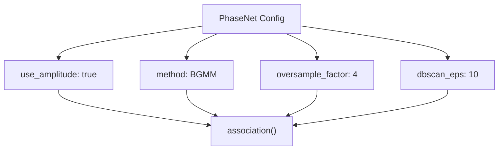
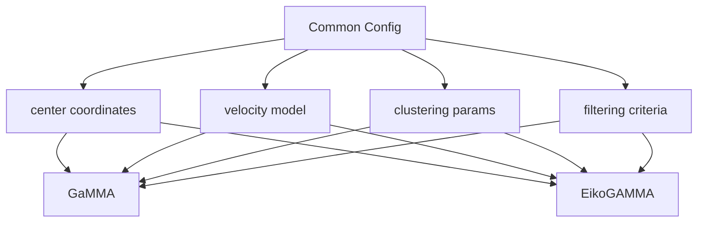
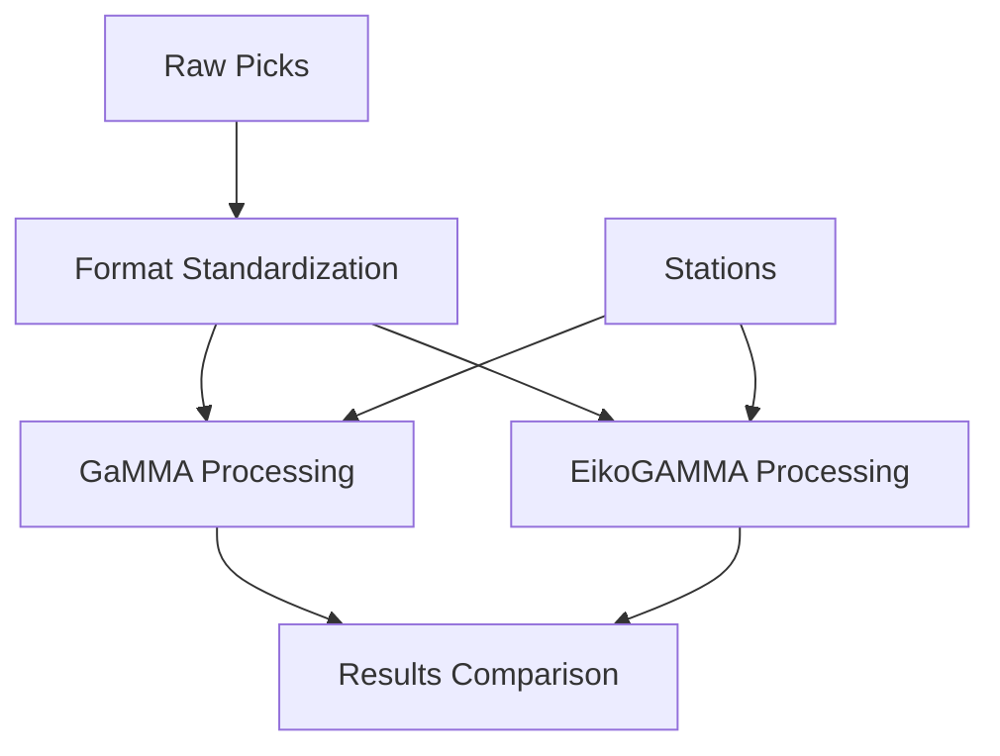
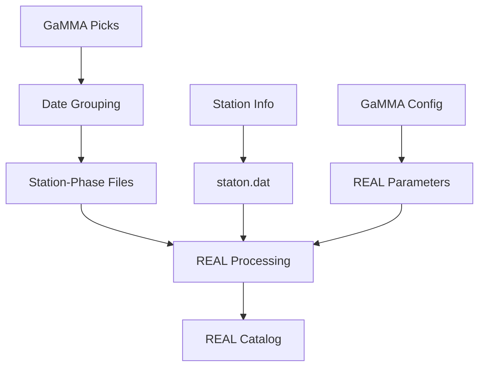
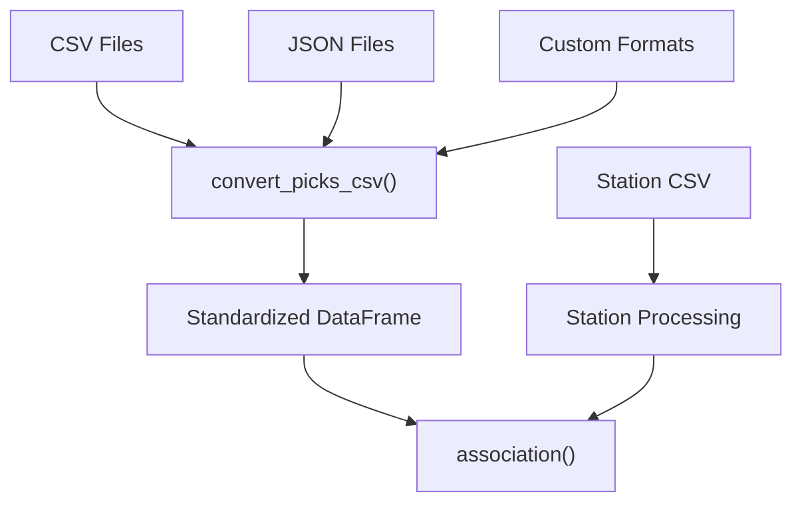
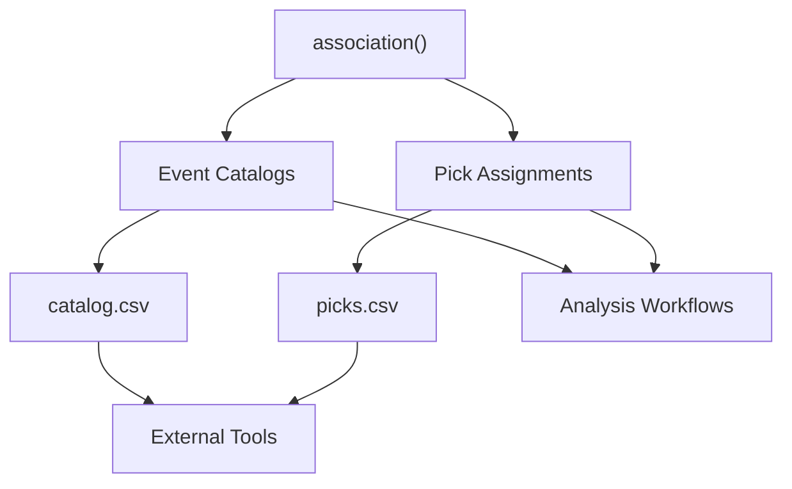
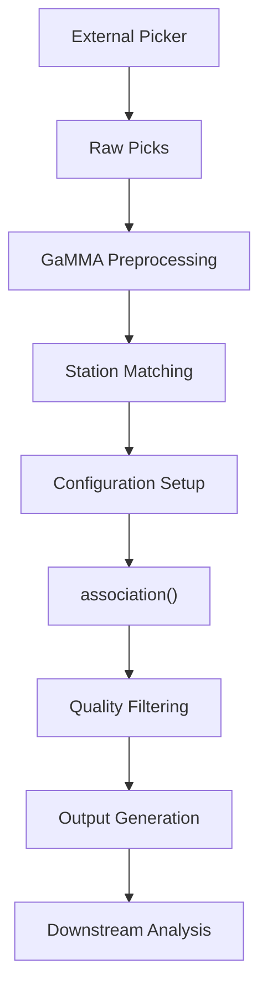
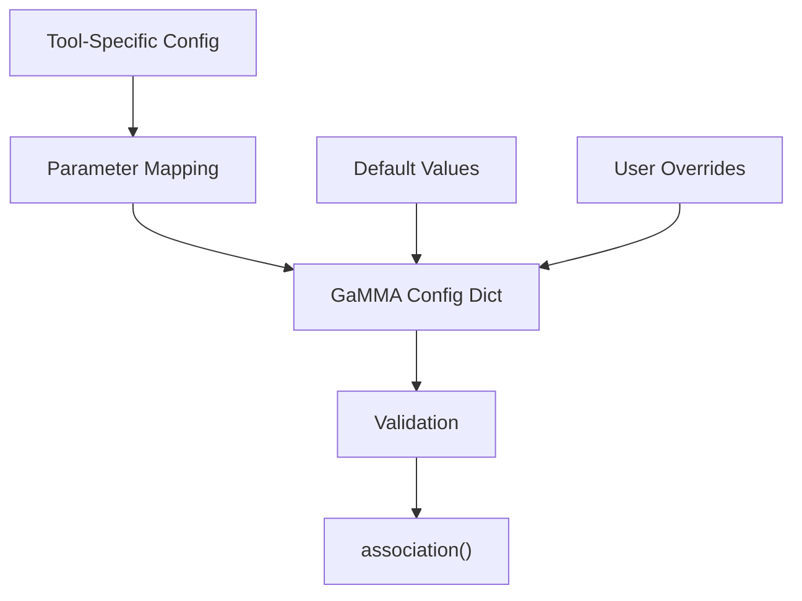

# Integration with Other Tools

> **Relevant source files**
> * [tests/comparison/compare_eikogamma.ipynb](https://github.com/AI4EPS/GaMMA/blob/edcf2cec/tests/comparison/compare_eikogamma.ipynb)
> * [tests/comparison/real/run.py](https://github.com/AI4EPS/GaMMA/blob/edcf2cec/tests/comparison/real/run.py)
> * [tests/example_phasenet.ipynb](https://github.com/AI4EPS/GaMMA/blob/edcf2cec/tests/example_phasenet.ipynb)

This page covers how GaMMA integrates with other seismological software and data processing pipelines. GaMMA is designed to work seamlessly with popular earthquake detection and location tools, enabling comprehensive seismic analysis workflows.

For basic usage patterns and examples, see [Examples and Tutorials](/AI4EPS/GaMMA/5-examples-and-tutorials). For performance comparison methodologies, see [Comparison Tools](/AI4EPS/GaMMA/6.2-comparison-tools).

## PhaseNet Pick Processing

GaMMA provides native support for processing picks generated by PhaseNet, a deep learning-based phase picker. The integration handles the complete workflow from PhaseNet output to earthquake association.

### Data Format Conversion

PhaseNet outputs are converted to GaMMA's expected format using standardized field mappings:



The conversion process maps PhaseNet fields to GaMMA's internal representation through the following field assignments:

| PhaseNet Field | GaMMA Field | Purpose |
| --- | --- | --- |
| `id` | `station_id` | Station identifier |
| `timestamp` | `phase_time` | Pick arrival time |
| `type` | `phase_type` | P or S wave phase |
| `prob` | `phase_score` | Pick confidence score |
| `amp` | `phase_amp` | Amplitude measurement |

Sources: [tests/example_phasenet.ipynb L246-L251](https://github.com/AI4EPS/GaMMA/blob/edcf2cec/tests/example_phasenet.ipynb#L246-L251)

### Configuration Integration

The PhaseNet integration uses specific configuration parameters optimized for deep learning pick quality:



Sources: [tests/example_phasenet.ipynb L267-L273](https://github.com/AI4EPS/GaMMA/blob/edcf2cec/tests/example_phasenet.ipynb#L267-L273)

### Complete Processing Pipeline

The integration follows this standardized workflow pattern:

```mermaid
sequenceDiagram
  participant PhaseNet
  participant GaMMA Config
  participant gamma.utils.association()
  participant Output Catalogs

  PhaseNet->>GaMMA Config: "Raw picks + stations"
  GaMMA Config->>GaMMA Config: "Field mapping & filtering"
  GaMMA Config->>gamma.utils.association(): "Standardized picks"
  gamma.utils.association()->>gamma.utils.association(): "DBSCAN clustering"
  gamma.utils.association()->>gamma.utils.association(): "BGMM association"
  gamma.utils.association()->>Output Catalogs: "Events + assignments"
```

Sources: [tests/example_phasenet.ipynb L347-L373](https://github.com/AI4EPS/GaMMA/blob/edcf2cec/tests/example_phasenet.ipynb#L347-L373)

## EikoGAMMA Comparison Integration

GaMMA provides compatibility with EikoGAMMA for performance comparison and validation. The integration maintains consistent configuration parameters and output formats.

### Configuration Alignment

Both systems use compatible parameter structures:



Key shared parameters include:

* `center`: Geographic center coordinates
* `vel`: P and S wave velocities
* `dbscan_eps`: Clustering epsilon parameter
* `min_picks_per_eq`: Minimum picks per event

Sources: [tests/comparison/compare_eikogamma.ipynb L139-L144](https://github.com/AI4EPS/GaMMA/blob/edcf2cec/tests/comparison/compare_eikogamma.ipynb#L139-L144)

### Data Processing Compatibility

Both systems process identical input formats with consistent field mappings:



The standardization process ensures:

* Consistent timestamp formats
* Standardized station identifiers
* Aligned coordinate systems
* Compatible amplitude measurements

Sources: [tests/comparison/compare_eikogamma.ipynb L113-L125](https://github.com/AI4EPS/GaMMA/blob/edcf2cec/tests/comparison/compare_eikogamma.ipynb#L113-L125)

## REAL Algorithm Integration

GaMMA integrates with the REAL (Rapid Earthquake Association and Location) algorithm for comparative analysis and workflow validation.

### Data Format Translation

The integration includes format converters for REAL's specific input requirements:



The translation process creates:

* Daily pick files grouped by station and phase
* Station coordinate files in REAL format
* Parameter mapping between GaMMA and REAL configurations

Sources: [tests/comparison/real/run.py L18-L42](https://github.com/AI4EPS/GaMMA/blob/edcf2cec/tests/comparison/real/run.py#L18-L42)

### Parameter Mapping

Configuration parameters are mapped between systems:

| GaMMA Parameter | REAL Parameter | Purpose |
| --- | --- | --- |
| `vel.p` | V parameter | P-wave velocity |
| `vel.s` | V parameter | S-wave velocity |
| `dbscan_eps` | R parameter | Association window |
| `min_picks_per_eq` | S parameter | Minimum picks |

Sources: [tests/comparison/real/run.py L56-L62](https://github.com/AI4EPS/GaMMA/blob/edcf2cec/tests/comparison/real/run.py#L56-L62)

## Data Format Integration Patterns

GaMMA supports multiple input and output formats through standardized conversion utilities.

### Input Format Support



Supported input formats include:

* Comma-separated values (CSV)
* Tab-separated values (TSV)
* JSON pick files
* Custom delimiter formats

### Output Integration

GaMMA produces standardized outputs compatible with downstream tools:



Output formats maintain consistency:

* Event catalogs with location, time, and magnitude
* Pick assignments linking picks to events
* Quality metrics and uncertainty estimates

Sources: [tests/example_phasenet.ipynb L357-L373](https://github.com/AI4EPS/GaMMA/blob/edcf2cec/tests/example_phasenet.ipynb#L357-L373)

## Workflow Integration Patterns

GaMMA follows common integration patterns that facilitate embedding in larger seismological workflows.

### Standard Processing Workflow



This pattern is implemented across multiple integration examples:

* PhaseNet integration: [tests/example_phasenet.ipynb L347-L373](https://github.com/AI4EPS/GaMMA/blob/edcf2cec/tests/example_phasenet.ipynb#L347-L373)
* EikoGAMMA comparison: [tests/comparison/compare_eikogamma.ipynb L244-L276](https://github.com/AI4EPS/GaMMA/blob/edcf2cec/tests/comparison/compare_eikogamma.ipynb#L244-L276)
* REAL integration: [tests/comparison/real/run.py L54-L62](https://github.com/AI4EPS/GaMMA/blob/edcf2cec/tests/comparison/real/run.py#L54-L62)

### Configuration Management

Integration workflows use consistent configuration management:



The configuration system supports:

* Tool-specific parameter translation
* Default value management
* User customization and overrides
* Validation and error checking

Sources: [tests/example_phasenet.ipynb L267-L315](https://github.com/AI4EPS/GaMMA/blob/edcf2cec/tests/example_phasenet.ipynb#L267-L315)

 [tests/comparison/compare_eikogamma.ipynb L139-L195](https://github.com/AI4EPS/GaMMA/blob/edcf2cec/tests/comparison/compare_eikogamma.ipynb#L139-L195)