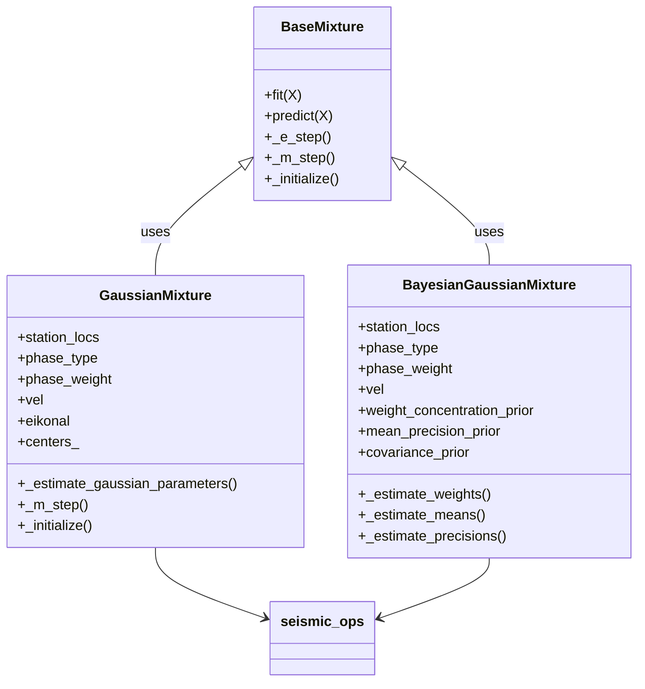
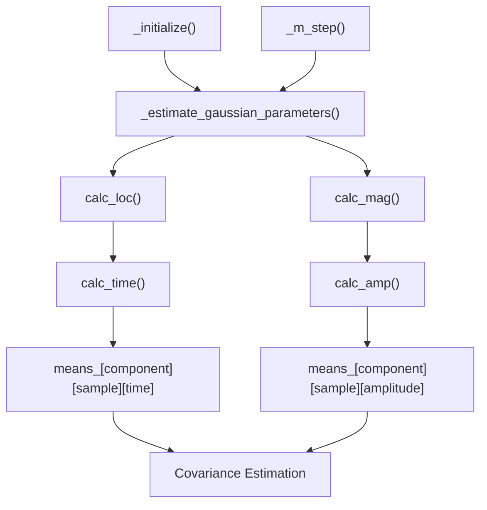
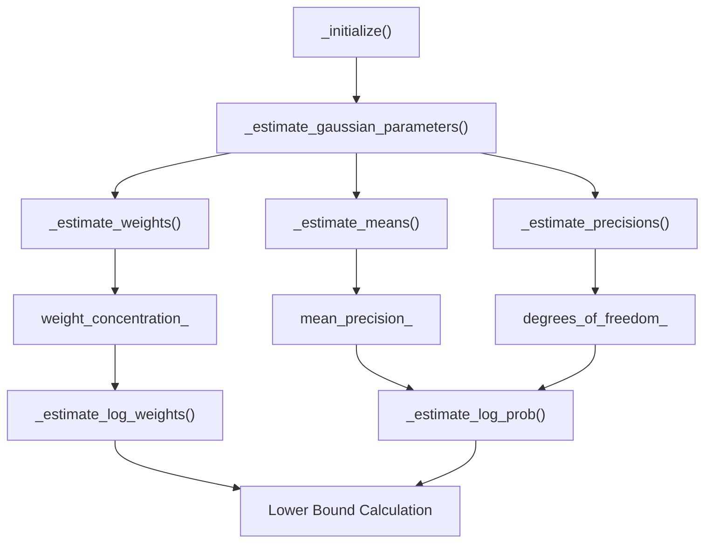
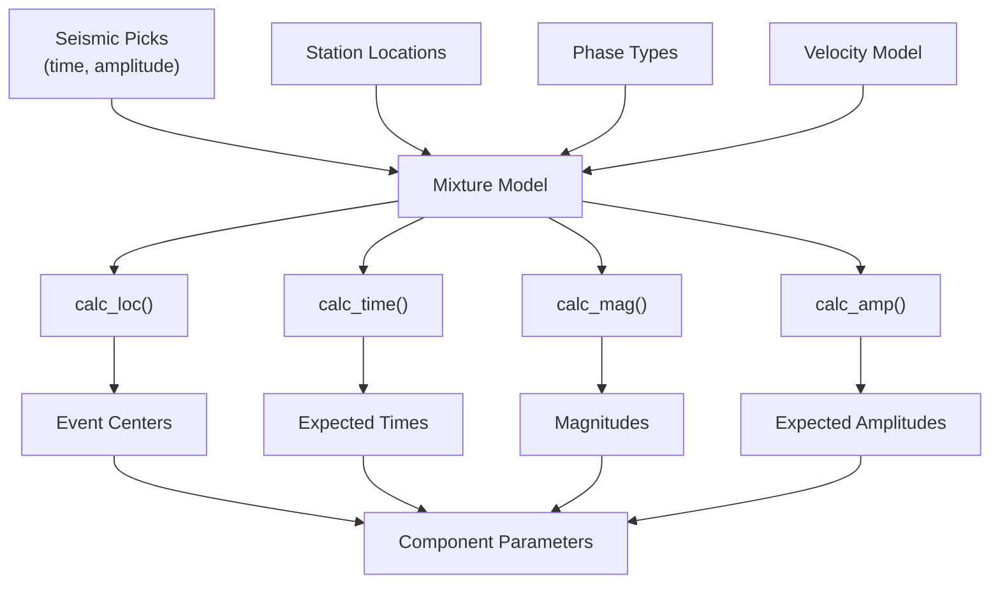

# Mixture Model Classes

> **Relevant source files**
> * [gamma/_bayesian_mixture.py](https://github.com/AI4EPS/GaMMA/blob/edcf2cec/gamma/_bayesian_mixture.py)
> * [gamma/_gaussian_mixture.py](https://github.com/AI4EPS/GaMMA/blob/edcf2cec/gamma/_gaussian_mixture.py)

This document covers the specialized Gaussian mixture model classes in GaMMA that implement statistical clustering algorithms for seismic event association. These classes extend standard mixture models with seismic-specific functionality for travel time calculation, event location, and magnitude estimation.

For information about the base mixture model implementation, see [Base Classes](/AI4EPS/GaMMA/4.4-base-classes). For details about the seismic operations these classes use, see [Seismic Operations](/AI4EPS/GaMMA/4.2-seismic-operations).

## Overview

GaMMA provides two main mixture model classes that serve as the core statistical engines for seismic event association:

* `GaussianMixture` - Standard expectation-maximization (EM) algorithm
* `BayesianGaussianMixture` - Variational Bayesian inference with automatic model selection

Both classes extend the `BaseMixture` class and integrate seismic physics through the `seismic_ops` module.

## Class Hierarchy



Sources: [gamma/_gaussian_mixture.py L553-L967](https://github.com/AI4EPS/GaMMA/blob/edcf2cec/gamma/_gaussian_mixture.py#L553-L967)

 [gamma/_bayesian_mixture.py L73-L890](https://github.com/AI4EPS/GaMMA/blob/edcf2cec/gamma/_bayesian_mixture.py#L73-L890)

 [gamma/_base.py L1-L15](https://github.com/AI4EPS/GaMMA/blob/edcf2cec/gamma/_base.py#L1-L15)

## GaussianMixture Class

The `GaussianMixture` class implements standard EM algorithm with seismic-specific modifications for event association.

### Key Parameters

| Parameter | Type | Description |
| --- | --- | --- |
| `station_locs` | array-like | Station coordinates (x, y, z) |
| `phase_type` | array-like | Phase types ('P', 'S') for each pick |
| `phase_weight` | array-like | Weights for different phase types |
| `vel` | dict | P and S wave velocities |
| `eikonal` | object | Eikonal solver for travel time calculation |
| `centers_init` | array-like | Initial event locations |
| `bounds` | tuple | Search bounds for event locations |

### Seismic-Specific Methods

The class overrides key mixture model methods to incorporate seismic physics:



Sources: [gamma/_gaussian_mixture.py L842-L913](https://github.com/AI4EPS/GaMMA/blob/edcf2cec/gamma/_gaussian_mixture.py#L842-L913)

 [gamma/_gaussian_mixture.py L250-L347](https://github.com/AI4EPS/GaMMA/blob/edcf2cec/gamma/_gaussian_mixture.py#L250-L347)

### Parameter Estimation Process

The `_estimate_gaussian_parameters` function performs seismic-specific parameter estimation:

1. **Event Location**: Uses `calc_loc()` to estimate earthquake locations based on travel times
2. **Magnitude Calculation**: Uses `calc_mag()` for amplitude-based magnitude estimates
3. **Mean Calculation**: Computes expected arrival times and amplitudes using `calc_time()` and `calc_amp()`
4. **Covariance Estimation**: Standard mixture model covariance calculation

Sources: [gamma/_gaussian_mixture.py L250-L347](https://github.com/AI4EPS/GaMMA/blob/edcf2cec/gamma/_gaussian_mixture.py#L250-L347)

## BayesianGaussianMixture Class

The `BayesianGaussianMixture` class implements variational Bayesian inference with automatic determination of the number of components.

### Additional Bayesian Parameters

| Parameter | Type | Description |
| --- | --- | --- |
| `weight_concentration_prior_type` | str | 'dirichlet_process' or 'dirichlet_distribution' |
| `weight_concentration_prior` | float | Prior concentration parameter |
| `mean_precision_prior` | float | Precision prior on component means |
| `covariance_prior` | array-like | Prior on covariance matrices |
| `degrees_of_freedom_prior` | float | Prior degrees of freedom |

### Variational Inference Process



Sources: [gamma/_bayesian_mixture.py L531-L890](https://github.com/AI4EPS/GaMMA/blob/edcf2cec/gamma/_bayesian_mixture.py#L531-L890)

### Bayesian Parameter Estimation

The Bayesian approach maintains posterior distributions over model parameters:

* **Weight Estimation**: Updates Dirichlet concentration parameters
* **Mean Estimation**: Incorporates mean precision priors
* **Precision Estimation**: Uses Wishart distribution for covariance priors
* **Component Selection**: Automatically determines active components

Sources: [gamma/_bayesian_mixture.py L563-L741](https://github.com/AI4EPS/GaMMA/blob/edcf2cec/gamma/_bayesian_mixture.py#L563-L741)

## Seismic Integration

Both classes integrate seismic physics through specialized parameter estimation:



Sources: [gamma/_gaussian_mixture.py L250-L347](https://github.com/AI4EPS/GaMMA/blob/edcf2cec/gamma/_gaussian_mixture.py#L250-L347)

 [gamma/_bayesian_mixture.py L531-L890](https://github.com/AI4EPS/GaMMA/blob/edcf2cec/gamma/_bayesian_mixture.py#L531-L890)

 [gamma/seismic_ops.py L1-L50](https://github.com/AI4EPS/GaMMA/blob/edcf2cec/gamma/seismic_ops.py#L1-L50)

## Usage Patterns

### Standard Gaussian Mixture

```css
# Example initialization
gm = GaussianMixture(
    n_components=50,
    station_locs=stations,
    phase_type=phase_types,
    vel={"p": 6.0, "s": 3.5}
)
```

### Bayesian Gaussian Mixture

```css
# Example initialization with priors
bgm = BayesianGaussianMixture(
    n_components=100,
    weight_concentration_prior_type="dirichlet_process",
    station_locs=stations,
    phase_type=phase_types,
    vel={"p": 6.0, "s": 3.5}
)
```

Sources: [gamma/_gaussian_mixture.py L757-L813](https://github.com/AI4EPS/GaMMA/blob/edcf2cec/gamma/_gaussian_mixture.py#L757-L813)

 [gamma/_bayesian_mixture.py L368-L430](https://github.com/AI4EPS/GaMMA/blob/edcf2cec/gamma/_bayesian_mixture.py#L368-L430)

## Key Differences

| Aspect | GaussianMixture | BayesianGaussianMixture |
| --- | --- | --- |
| Algorithm | Standard EM | Variational Bayes |
| Model Selection | Fixed components | Automatic selection |
| Uncertainty | Point estimates | Posterior distributions |
| Computational Cost | Lower | Higher |
| Overfitting | More prone | More robust |

Sources: [gamma/_gaussian_mixture.py L553-L747](https://github.com/AI4EPS/GaMMA/blob/edcf2cec/gamma/_gaussian_mixture.py#L553-L747)

 [gamma/_bayesian_mixture.py L73-L348](https://github.com/AI4EPS/GaMMA/blob/edcf2cec/gamma/_bayesian_mixture.py#L73-L348)