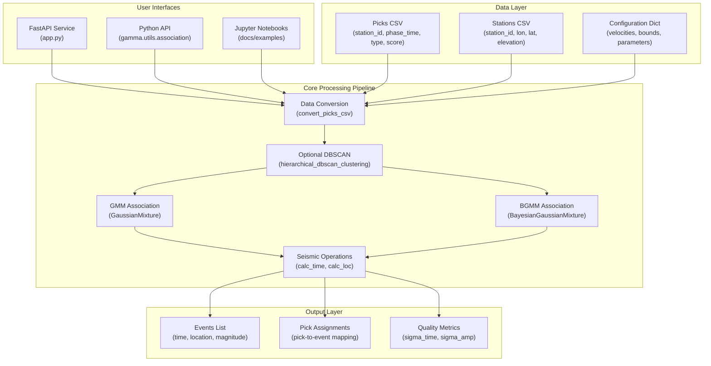
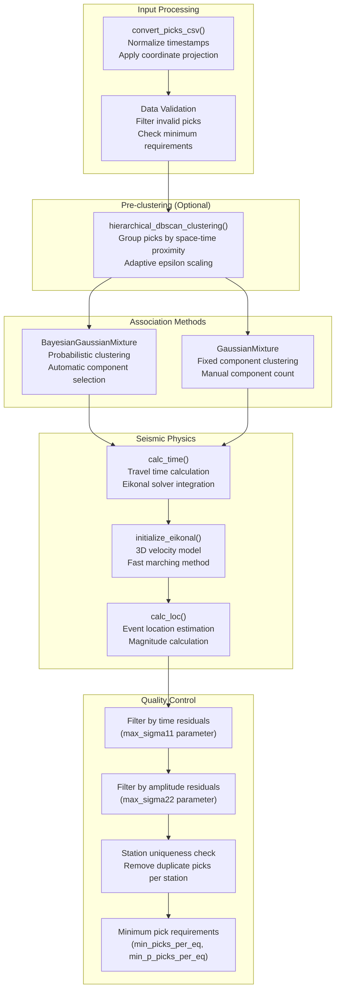
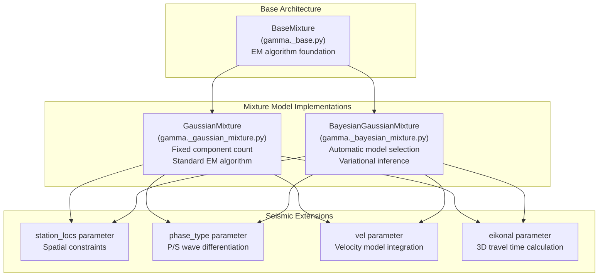

# Overview

> **Relevant source files**
> * [docs/README.md](https://github.com/AI4EPS/GaMMA/blob/edcf2cec/docs/README.md)
> * [gamma/utils.py](https://github.com/AI4EPS/GaMMA/blob/edcf2cec/gamma/utils.py)
> * [tests/comparison/stations_ridgecrest.csv](https://github.com/AI4EPS/GaMMA/blob/edcf2cec/tests/comparison/stations_ridgecrest.csv)

This document provides a comprehensive introduction to GaMMA (Gaussian Mixture Model Associator), its architecture, and core components. GaMMA is a Python package that uses statistical machine learning to associate seismic phase picks into earthquake events.

For installation instructions, see [Installation and Setup](/AI4EPS/GaMMA/2-installation-and-setup). For detailed API documentation, see [API Reference](/AI4EPS/GaMMA/4-api-reference). For practical usage examples, see [Examples and Tutorials](/AI4EPS/GaMMA/5-examples-and-tutorials).

## Purpose and Scope

GaMMA solves the seismic event association problem by clustering phase picks (P-wave and S-wave arrivals) from multiple seismic stations into coherent earthquake events. The system uses Gaussian Mixture Models (GMM) and Bayesian Gaussian Mixture Models (BGMM) to perform probabilistic clustering in a joint space-time domain, incorporating seismic physics through travel time calculations.

The package is designed to work with various seismic data sources including PhaseNet picks, SeisbBench datasets, and custom CSV formats. It provides both programmatic Python APIs and web service interfaces for integration into larger seismological workflows.

## System Architecture

### High-Level Components

**Sources:** [gamma/utils.py L155-L276](https://github.com/AI4EPS/GaMMA/blob/edcf2cec/gamma/utils.py#L155-L276)

 [docs/README.md L1-L54](https://github.com/AI4EPS/GaMMA/blob/edcf2cec/docs/README.md#L1-L54)

 [app.py](https://github.com/AI4EPS/GaMMA/blob/edcf2cec/app.py)

### Core Processing Workflow

The association workflow implements a multi-stage pipeline that transforms raw seismic picks into earthquake catalogs:

**Sources:** [gamma/utils.py L54-L86](https://github.com/AI4EPS/GaMMA/blob/edcf2cec/gamma/utils.py#L54-L86)

 [gamma/utils.py L88-L152](https://github.com/AI4EPS/GaMMA/blob/edcf2cec/gamma/utils.py#L88-L152)

 [gamma/utils.py L279-L532](https://github.com/AI4EPS/GaMMA/blob/edcf2cec/gamma/utils.py#L279-L532)

 [gamma/seismic_ops.py](https://github.com/AI4EPS/GaMMA/blob/edcf2cec/gamma/seismic_ops.py)

## Key Code Components

### Main Association Function

The primary entry point is the `association()` function in `gamma.utils`, which orchestrates the entire workflow:

| Component | Function | Purpose |
| --- | --- | --- |
| Data preprocessing | `convert_picks_csv()` | Convert input CSV data to internal format with coordinate transformations |
| Pre-clustering | `hierarchical_dbscan_clustering()` | Optional spatial-temporal clustering to improve performance |
| Association core | `associate()` | Core GMM/BGMM clustering with seismic physics constraints |
| Initialization | `init_centers()` | Smart initialization of cluster centers based on pick distribution |

**Sources:** [gamma/utils.py L155-L162](https://github.com/AI4EPS/GaMMA/blob/edcf2cec/gamma/utils.py#L155-L162)

 [gamma/utils.py L279-L294](https://github.com/AI4EPS/GaMMA/blob/edcf2cec/gamma/utils.py#L279-L294)

 [gamma/utils.py L605-L657](https://github.com/AI4EPS/GaMMA/blob/edcf2cec/gamma/utils.py#L605-L657)

### Statistical Models

GaMMA implements two clustering approaches, both extending scikit-learn's mixture models with seismic-specific features:

**Sources:** [gamma/_base.py](https://github.com/AI4EPS/GaMMA/blob/edcf2cec/gamma/_base.py)

 [gamma/_gaussian_mixture.py](https://github.com/AI4EPS/GaMMA/blob/edcf2cec/gamma/_gaussian_mixture.py)

 [gamma/_bayesian_mixture.py](https://github.com/AI4EPS/GaMMA/blob/edcf2cec/gamma/_bayesian_mixture.py)

### Seismic Operations Module

The `seismic_ops` module provides specialized functions for seismological calculations:

| Function | Purpose | Key Features |
| --- | --- | --- |
| `calc_time()` | Travel time calculation | Supports both 1D velocity models and 3D eikonal solver |
| `calc_loc()` | Event location estimation | Iterative least-squares with phase weighting |
| `calc_amp()` | Amplitude prediction | Distance-based magnitude estimation |
| `initialize_eikonal()` | 3D velocity model setup | Fast marching method for complex velocity structures |

**Sources:** [gamma/seismic_ops.py](https://github.com/AI4EPS/GaMMA/blob/edcf2cec/gamma/seismic_ops.py)

## Configuration and Parameters

GaMMA uses a configuration dictionary to control association behavior. Key parameter categories include:

### Core Algorithm Parameters

* `method`: Choice between "GMM" and "BGMM"
* `vel`: P and S wave velocities (default: `{"p": 6.0, "s": 6.0/1.73}`)
* `dims`: Spatial dimensions to use (`["x(km)", "y(km)", "z(km)"]`)
* `use_amplitude`: Whether to include amplitude information in clustering

### Quality Control Filters

* `min_picks_per_eq`: Minimum picks required per event
* `max_sigma11`: Maximum time residual threshold
* `max_sigma22`: Maximum amplitude residual threshold
* `min_stations`: Minimum number of unique stations per event

### Performance Optimization

* `use_dbscan`: Enable hierarchical DBSCAN pre-clustering
* `dbscan_eps`: DBSCAN time epsilon parameter
* `ncpu`: Number of CPU cores for parallel processing
* `oversample_factor`: Controls initial number of mixture components

**Sources:** [gamma/utils.py L163-L198](https://github.com/AI4EPS/GaMMA/blob/edcf2cec/gamma/utils.py#L163-L198)

 [docs/README.md L20-L37](https://github.com/AI4EPS/GaMMA/blob/edcf2cec/docs/README.md#L20-L37)

## Data Flow and Integration Points

### Input Data Formats

GaMMA accepts standardized CSV formats for both picks and station metadata:

**Picks CSV Format:**

* `station_id`: Station identifier
* `timestamp`: Pick time (ISO format)
* `type`: Phase type ("P" or "S")
* `prob`: Pick confidence score
* `amp`: Amplitude measurement (optional)

**Stations CSV Format:**

* `station_id`: Station identifier
* `longitude`, `latitude`: Station coordinates
* `elevation`: Station elevation in meters

**Sources:** [gamma/utils.py L54-L86](https://github.com/AI4EPS/GaMMA/blob/edcf2cec/gamma/utils.py#L54-L86)

 [tests/comparison/stations_ridgecrest.csv L1-L60](https://github.com/AI4EPS/GaMMA/blob/edcf2cec/tests/comparison/stations_ridgecrest.csv#L1-L60)

### Output Data Structure

The system returns structured results containing:

1. **Events List**: Array of event dictionaries with time, location, magnitude, and quality metrics
2. **Assignment List**: Tuples linking pick indices to event indices with association probabilities
3. **Quality Metrics**: Covariance matrices, sigma values, and confidence scores

**Sources:** [gamma/utils.py L507-L532](https://github.com/AI4EPS/GaMMA/blob/edcf2cec/gamma/utils.py#L507-L532)

This architecture enables GaMMA to process large volumes of seismic data efficiently while maintaining high association accuracy through physics-informed clustering and robust quality control mechanisms.