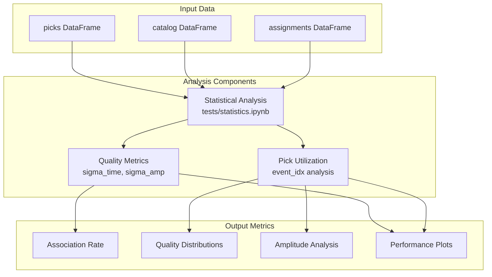
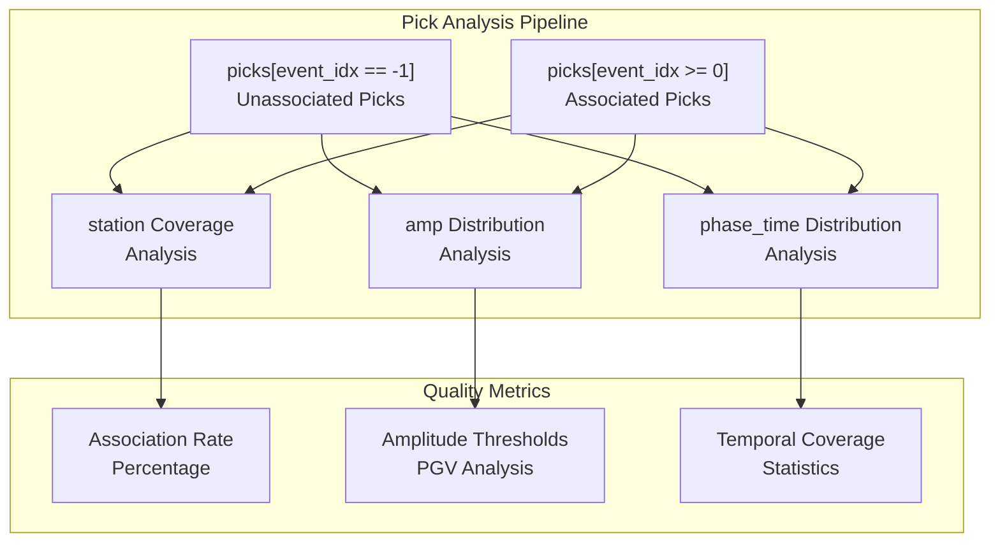
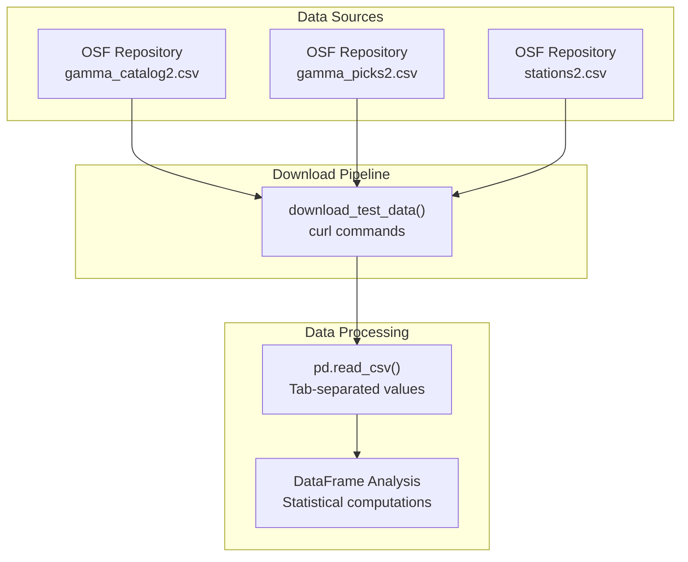
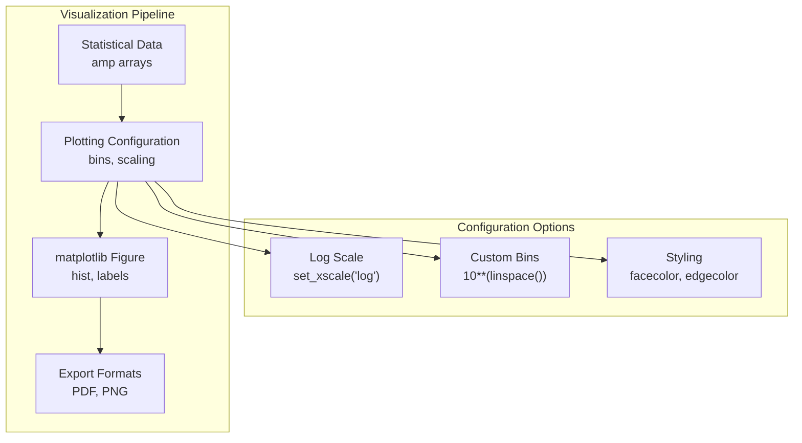

# Performance Analysis

> **Relevant source files**
> * [tests/comparison/statistics.ipynb](https://github.com/AI4EPS/GaMMA/blob/edcf2cec/tests/comparison/statistics.ipynb)
> * [tests/statistics.ipynb](https://github.com/AI4EPS/GaMMA/blob/edcf2cec/tests/statistics.ipynb)

This document covers the tools and methodologies for analyzing GaMMA's performance in seismic event association tasks. It focuses on statistical analysis of association results, quality metrics computation, and performance visualization capabilities.

For information about setting up the testing framework, see [Testing Framework](/AI4EPS/GaMMA/6.1-testing-framework). For benchmarking against other association methods, see [Comparison Tools](/AI4EPS/GaMMA/6.2-comparison-tools).

## Overview

GaMMA provides comprehensive performance analysis capabilities through statistical evaluation of association results, quality metrics calculation, and visualization tools. The analysis focuses on key metrics such as association accuracy, pick utilization rates, and quality distributions of detected events.

## Performance Metrics Framework

The performance analysis system operates on the core data structures produced by GaMMA's association algorithms. The primary analysis targets include associated events, unassociated picks, and quality metrics.

Sources: [tests/statistics.ipynb L1-L185](https://github.com/AI4EPS/GaMMA/blob/edcf2cec/tests/statistics.ipynb#L1-L185)

## Statistical Analysis Tools

### Pick Association Statistics

The core performance analysis examines pick association patterns by analyzing the `event_idx` field in the picks data structure. Picks with `event_idx == -1` represent unassociated picks, providing insight into algorithm efficiency.

Sources: [tests/statistics.ipynb L108-L161](https://github.com/AI4EPS/GaMMA/blob/edcf2cec/tests/statistics.ipynb#L108-L161)

### Amplitude Distribution Analysis

The system provides detailed analysis of amplitude distributions for both associated and unassociated picks. This analysis uses logarithmic binning to examine peak ground velocity (PGV) patterns across different association outcomes.

| Metric | Description | Implementation |
| --- | --- | --- |
| `amp` field analysis | PGV distribution for unassociated picks | `picks[picks["event_idx"] == -1]["amp"]` |
| Logarithmic binning | Statistical distribution analysis | `10**(np.linspace(-7, -2, 50))` |
| Quality thresholds | Amplitude-based filtering criteria | Configurable bin ranges |

Sources: [tests/statistics.ipynb L148-L161](https://github.com/AI4EPS/GaMMA/blob/edcf2cec/tests/statistics.ipynb#L148-L161)

## Data Acquisition and Processing

### Test Data Integration

Performance analysis relies on standardized test datasets that can be programmatically downloaded and processed. The system supports multiple data sources for comprehensive evaluation.

Sources: [tests/statistics.ipynb L42-L53](https://github.com/AI4EPS/GaMMA/blob/edcf2cec/tests/statistics.ipynb#L42-L53)

 [tests/statistics.ipynb L108-L110](https://github.com/AI4EPS/GaMMA/blob/edcf2cec/tests/statistics.ipynb#L108-L110)

## Visualization and Reporting

### Statistical Plots Generation

The performance analysis system generates publication-quality visualizations for amplitude distributions and other key metrics. Plots are saved in multiple formats for different use cases.

| Output Format | Purpose | File Extension |
| --- | --- | --- |
| PDF | Publication quality | `.pdf` |
| PNG | Web display | `.png` |
| Interactive display | Jupyter notebooks | matplotlib backend |

The visualization pipeline uses logarithmic scaling for amplitude data and configurable binning strategies for different data ranges.

Sources: [tests/statistics.ipynb L148-L161](https://github.com/AI4EPS/GaMMA/blob/edcf2cec/tests/statistics.ipynb#L148-L161)

## Integration with Testing Framework

The performance analysis tools integrate with the broader testing and validation framework through standardized data formats and metric computation interfaces. Results can be consumed by comparison tools and validation pipelines.

Performance metrics feed into the comparison framework for benchmarking against reference implementations and alternative association methods. The statistical analysis provides quantitative measures for algorithm tuning and validation.

Sources: [tests/statistics.ipynb L1-L185](https://github.com/AI4EPS/GaMMA/blob/edcf2cec/tests/statistics.ipynb#L1-L185)