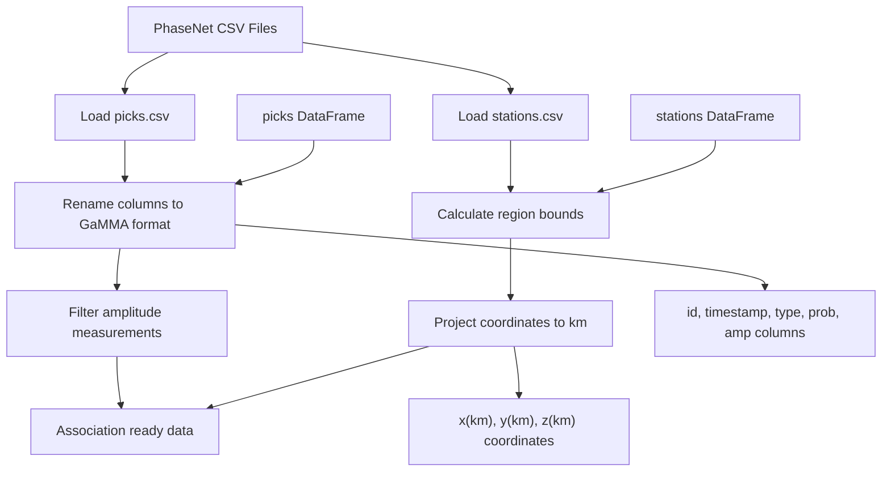
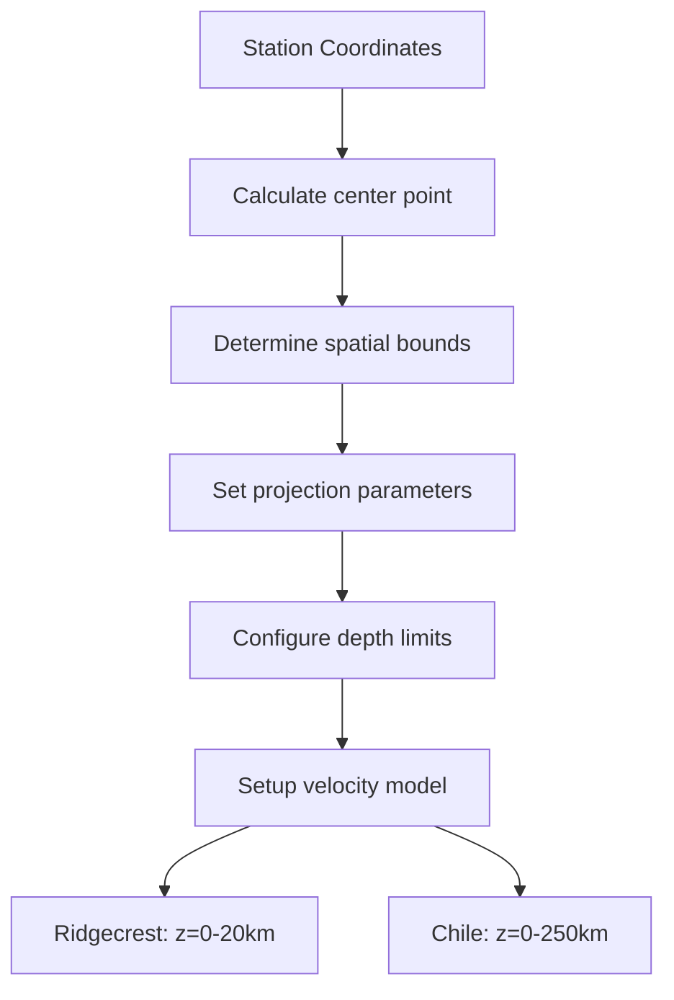
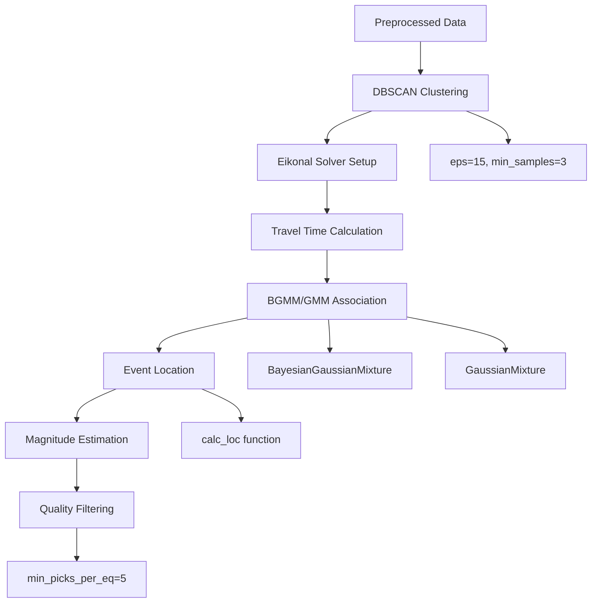
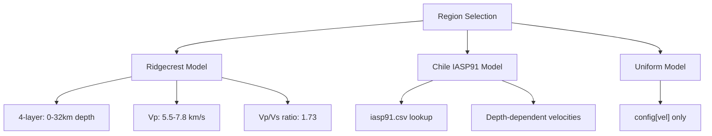
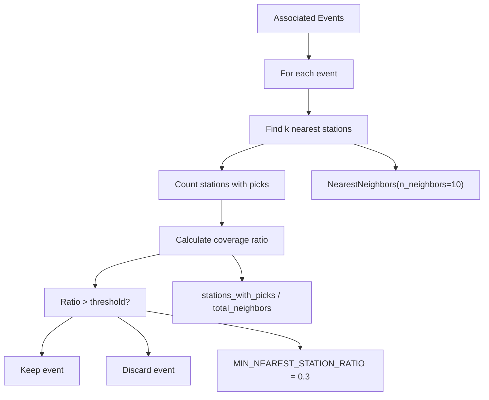

# PhaseNet Integration

> **Relevant source files**
> * [docs/example_phasenet.ipynb](https://github.com/AI4EPS/GaMMA/blob/edcf2cec/docs/example_phasenet.ipynb)
> * [docs/example_phasenet_ncedc.ipynb](https://github.com/AI4EPS/GaMMA/blob/edcf2cec/docs/example_phasenet_ncedc.ipynb)

This document provides a comprehensive guide for using GaMMA with PhaseNet-generated seismic phase picks. It covers data preparation, configuration setup, the association workflow, and result analysis for real-world seismic datasets.

For information about the core association algorithms, see [Core Association Functions](/AI4EPS/GaMMA/4.1-core-association-functions). For details about seismic operations and travel time calculations, see [Seismic Operations](/AI4EPS/GaMMA/4.2-seismic-operations).

## Overview

The PhaseNet integration demonstrates how to process machine learning-generated phase picks using GaMMA's Gaussian mixture model approach for earthquake event association. The workflow handles the complete pipeline from raw PhaseNet CSV output to associated earthquake catalogs with location and magnitude estimates.

**Sources:** [docs/example_phasenet.ipynb L1-L84](https://github.com/AI4EPS/GaMMA/blob/edcf2cec/docs/example_phasenet.ipynb#L1-L84)

## Data Format Requirements

GaMMA expects two primary CSV input files when working with PhaseNet data:

### Phase Picks Format

The picks file must contain columns that map to GaMMA's internal format:

| PhaseNet Column | GaMMA Column | Description |
| --- | --- | --- |
| `station_id` | `id` | Station identifier |
| `phase_time` | `timestamp` | Pick timestamp (ISO format) |
| `phase_type` | `type` | Phase type (P or S) |
| `phase_score` | `prob` | Detection probability (0-1) |
| `phase_amplitude` | `amp` | Phase amplitude measurement |

### Station Metadata Format

The stations file requires:

| Column | Description |
| --- | --- |
| `station_id` | Station identifier (matches picks) |
| `longitude` | Station longitude (degrees) |
| `latitude` | Station latitude (degrees) |
| `elevation_m` | Station elevation (meters) |

**Sources:** [docs/example_phasenet.ipynb L194-L212](https://github.com/AI4EPS/GaMMA/blob/edcf2cec/docs/example_phasenet.ipynb#L194-L212)

## Data Preprocessing Workflow



The preprocessing pipeline transforms PhaseNet output into GaMMA-compatible format through coordinate projection and data structure standardization.

**Sources:** [docs/example_phasenet.ipynb L194-L232](https://github.com/AI4EPS/GaMMA/blob/edcf2cec/docs/example_phasenet.ipynb#L194-L232)

## Configuration Setup

### Regional Configuration

GaMMA requires region-specific configuration that adapts to local seismic characteristics:



### Core Parameters

The configuration dictionary controls all aspects of the association process:

| Parameter Group | Key Parameters | Purpose |
| --- | --- | --- |
| **Spatial** | `center`, `xlim_degree`, `ylim_degree` | Define geographic region |
| **Algorithm** | `method`, `use_dbscan`, `use_amplitude` | Control association approach |
| **DBSCAN** | `dbscan_eps`, `dbscan_min_samples` | Preprocessing clustering |
| **Filtering** | `min_picks_per_eq`, `max_sigma11` | Quality control |

**Sources:** [docs/example_phasenet.ipynb L214-L325](https://github.com/AI4EPS/GaMMA/blob/edcf2cec/docs/example_phasenet.ipynb#L214-L325)

## Association Execution

### Core Association Call

The main association process uses the `gamma.utils.association` function:

```
events, assignments = association(picks, stations, config, event_idx0, config["method"])
```

### Processing Flow



### Method Selection

The notebook demonstrates both association methods:

* **BGMM** (`method="BGMM"`): Uses `BayesianGaussianMixture` with `oversample_factor=5`
* **GMM** (`method="GMM"`): Uses `GaussianMixture` with `oversample_factor=2`

**Sources:** [docs/example_phasenet.ipynb L407-L441](https://github.com/AI4EPS/GaMMA/blob/edcf2cec/docs/example_phasenet.ipynb#L407-L441)

## Velocity Model Configuration

### Eikonal Solver Setup

GaMMA supports 1D layered velocity models through the eikonal solver:



### Regional Velocity Models

**Ridgecrest Configuration:**

* Depth layers: [0.0, 5.5, 16.0, 32.0] km
* P-wave velocities: [5.5, 5.5, 6.7, 7.8] km/s
* S-wave velocities: computed using Vp/Vs = 1.73

**Chile Configuration:**

* Uses IASP91 global velocity model
* Loaded from `iasp91.csv` file
* Supports deeper events (0-250 km)

**Sources:** [docs/example_phasenet.ipynb L273-L306](https://github.com/AI4EPS/GaMMA/blob/edcf2cec/docs/example_phasenet.ipynb#L273-L306)

## Result Processing and Output

### Output Files

The association process generates standardized CSV files:

| File | Content | Key Columns |
| --- | --- | --- |
| `gamma_events.csv` | Associated events | `time`, `longitude`, `latitude`, `depth_km`, `magnitude` |
| `gamma_picks.csv` | Pick assignments | `station_id`, `phase_time`, `event_index`, `gamma_score` |

### Quality Metrics

Each event includes uncertainty estimates:

* `sigma_time`: Travel time residual standard deviation
* `sigma_amp`: Amplitude residual standard deviation
* `cov_time_amp`: Time-amplitude covariance

**Sources:** [docs/example_phasenet.ipynb L413-L441](https://github.com/AI4EPS/GaMMA/blob/edcf2cec/docs/example_phasenet.ipynb#L413-L441)

## Optional Post-Processing

### Nearest Station Ratio Filtering

An optional filtering step removes events with poor station coverage:



**Sources:** [docs/example_phasenet.ipynb L456-L504](https://github.com/AI4EPS/GaMMA/blob/edcf2cec/docs/example_phasenet.ipynb#L456-L504)

## Visualization and Analysis

The notebook provides comprehensive visualization tools:

### Temporal Analysis

* Event frequency histograms
* Magnitude-time plots
* Quality metric time series

### Spatial Analysis

* Event location maps with station positions
* Depth cross-sections (longitude vs depth, latitude vs depth)
* Magnitude distribution analysis

### Quality Assessment

* Covariance matrix visualization (`sigma_time`, `sigma_amp`, `cov_time_amp`)
* Association uncertainty plots

**Sources:** [docs/example_phasenet.ipynb L517-L941](https://github.com/AI4EPS/GaMMA/blob/edcf2cec/docs/example_phasenet.ipynb#L517-L941)

## Performance Considerations

### Computational Parameters

| Parameter | Purpose | Typical Value |
| --- | --- | --- |
| `ncpu` | Parallel processing | 32 |
| `dbscan_eps` | Clustering distance threshold | 15 km |
| `dbscan_min_cluster_size` | Minimum cluster size | 500 picks |
| `dbscan_max_time_space_ratio` | Temporal vs spatial weight | 5 |

### Memory and Speed Optimization

* Use `use_dbscan=True` for large datasets to reduce computational complexity
* Adjust `dbscan_eps` to balance event splitting vs processing speed
* Filter amplitude-less picks when `use_amplitude=True`

**Sources:** [docs/example_phasenet.ipynb L266-L325](https://github.com/AI4EPS/GaMMA/blob/edcf2cec/docs/example_phasenet.ipynb#L266-L325)