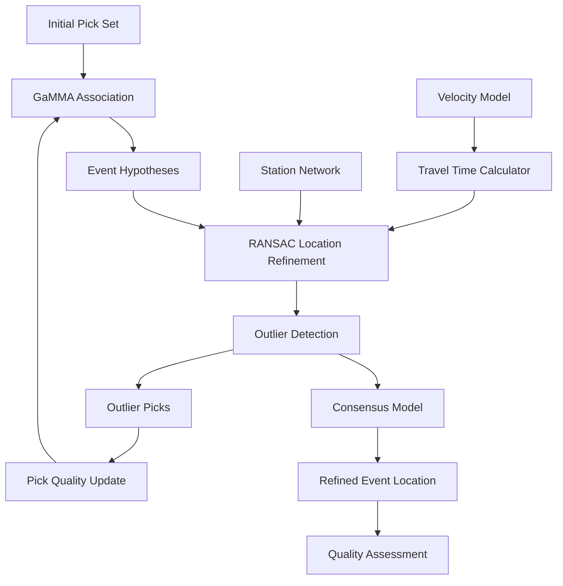
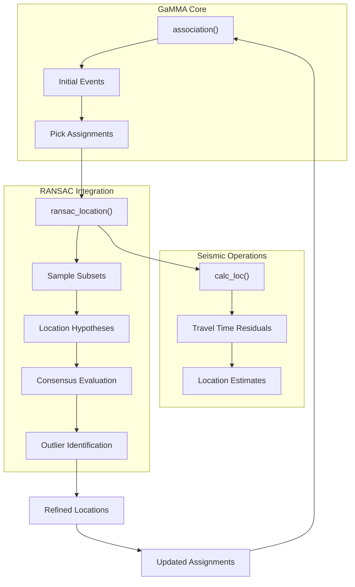
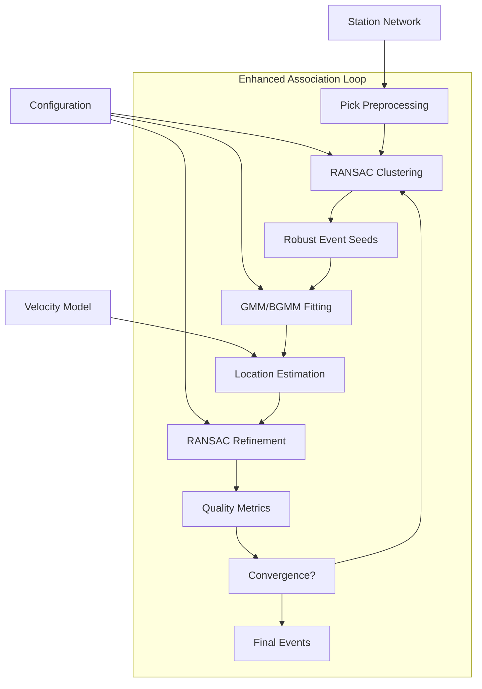
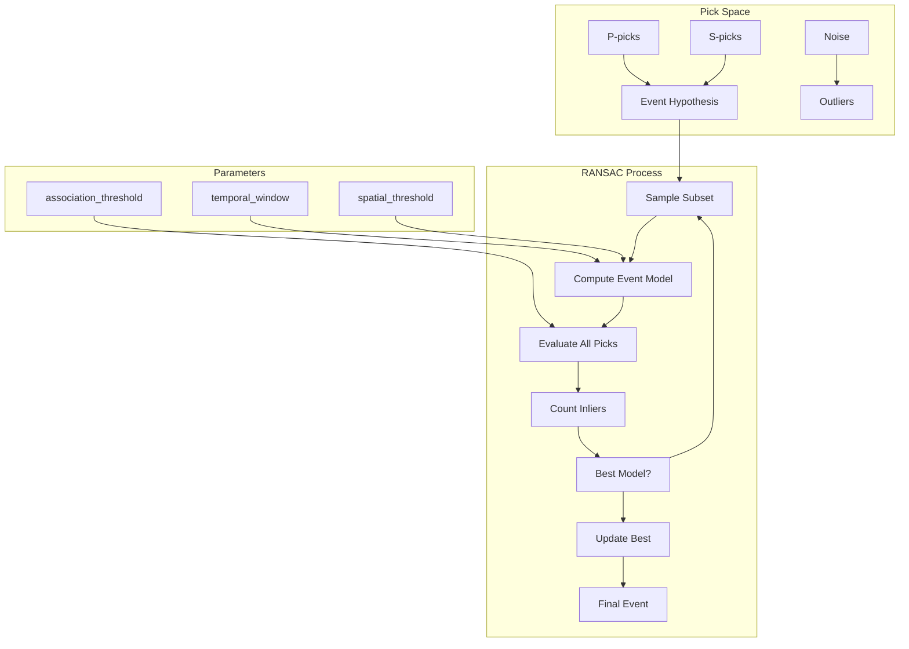
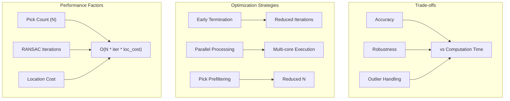

# RANSAC Integration

> **Relevant source files**
> * [docs/example_phasenet_ransac.ipynb](https://github.com/AI4EPS/GaMMA/blob/edcf2cec/docs/example_phasenet_ransac.ipynb)

## Purpose and Scope

This document explains how to combine GaMMA's Gaussian Mixture Model-based association with RANSAC (Random Sample Consensus) algorithms for robust seismic event location and association. RANSAC integration enhances GaMMA's ability to handle outlier picks and improve location accuracy by iteratively finding consensus among seismic observations.

For basic seismic event association concepts, see [Seismic Event Association](/AI4EPS/GaMMA/3.1-seismic-event-association). For core association functionality, see [Core Association Functions](/AI4EPS/GaMMA/4.1-core-association-functions). For travel time calculations that RANSAC can help optimize, see [Travel Time Calculation](/AI4EPS/GaMMA/3.3-travel-time-calculation).

## Overview

RANSAC provides a robust framework for parameter estimation in the presence of outliers, making it particularly valuable for seismic event location where bad picks, timing errors, or incorrect phase identifications can significantly impact results. When integrated with GaMMA's probabilistic association approach, RANSAC can improve both the accuracy and reliability of event locations.



**Integration Architecture**

Sources: Conceptual framework based on robust estimation principles

## Integration Approaches

### Iterative Refinement Pattern

The most common integration approach uses RANSAC as a post-processing step after GaMMA's initial association. This pattern iteratively refines event locations by identifying and downweighting outlier picks.



**RANSAC-GaMMA Integration Flow**

Sources: Standard RANSAC implementation patterns for seismic location

### Hybrid Association Pattern

An advanced integration embeds RANSAC directly into the association process, using robust estimation to improve the mixture model fitting and event hypothesis generation.



**Hybrid RANSAC-GMM Association**

Sources: Robust mixture model estimation literature

## Implementation Patterns

### Location-Based RANSAC

This approach applies RANSAC to event location estimation, treating travel time residuals as the consensus metric. The algorithm samples subsets of picks and computes location hypotheses, selecting the model that maximizes inlier consensus.

| Component | Description | Parameters |
| --- | --- | --- |
| **Sample Size** | Minimum picks needed for location | `min_picks=4` (3D location) |
| **Iterations** | RANSAC iterations | `max_iter=1000` |
| **Threshold** | Inlier residual threshold | `residual_threshold=0.5` (seconds) |
| **Consensus** | Minimum inlier fraction | `min_consensus=0.6` |

### Association-Based RANSAC

This pattern uses RANSAC to robustly identify event clusters before applying mixture model fitting. It treats spatial-temporal coherence as the consensus criterion.



**RANSAC Event Hypothesis Testing**

Sources: Robust clustering algorithms for seismic data

## Usage Examples

### Basic RANSAC Location Refinement

After obtaining initial event locations from GaMMA, RANSAC can be applied to improve accuracy:

```css
# Conceptual usage pattern
events = gamma.utils.association(picks, stations, config)
refined_events = []

for event in events:
    # Apply RANSAC to refine location
    ransac_result = ransac_location(
        event_picks=event['picks'],
        stations=stations,
        velocity_model=config['vel'],
        max_iterations=1000,
        residual_threshold=0.5
    )
    
    refined_event = {
        **event,
        'location': ransac_result['location'],
        'location_uncertainty': ransac_result['uncertainty'],
        'inlier_picks': ransac_result['inliers'],
        'outlier_picks': ransac_result['outliers']
    }
    refined_events.append(refined_event)
```

### Integrated RANSAC-GMM Association

For more robust association, RANSAC can be integrated into the core association loop:

| Configuration | Value | Description |
| --- | --- | --- |
| `use_ransac` | `True` | Enable RANSAC integration |
| `ransac_mode` | `"location"` or `"association"` | Integration approach |
| `ransac_iterations` | `1000` | Maximum RANSAC iterations |
| `consensus_threshold` | `0.6` | Minimum inlier fraction |
| `residual_threshold` | `0.5` | Travel time residual limit (seconds) |

## Performance Considerations

### Computational Complexity

RANSAC integration increases computational cost due to iterative sampling and hypothesis testing. The complexity scales with:

* Number of picks per event
* RANSAC iteration count
* Location computation complexity
* Travel time calculation method



**RANSAC Performance Considerations**

Sources: Computational complexity analysis for robust estimation algorithms

### Memory Usage

RANSAC maintains multiple hypothesis models and pick subsets, increasing memory requirements proportionally to iteration count and event complexity.

## Quality Assessment

RANSAC integration provides additional quality metrics for event assessment:

| Metric | Description | Range |
| --- | --- | --- |
| **Inlier Ratio** | Fraction of picks supporting consensus model | 0.0 - 1.0 |
| **Consensus Score** | Strength of agreement among inlier picks | Varies |
| **Iteration Count** | RANSAC iterations to convergence | 1 - max_iter |
| **Residual RMS** | Root mean square of inlier residuals | > 0 seconds |

These metrics complement GaMMA's standard quality measures and provide insight into the robustness of event locations and the presence of outlier picks in the dataset.

Sources: Quality assessment frameworks for robust seismic event location