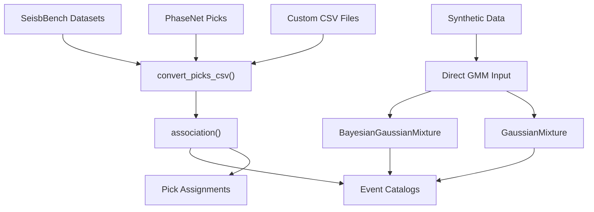
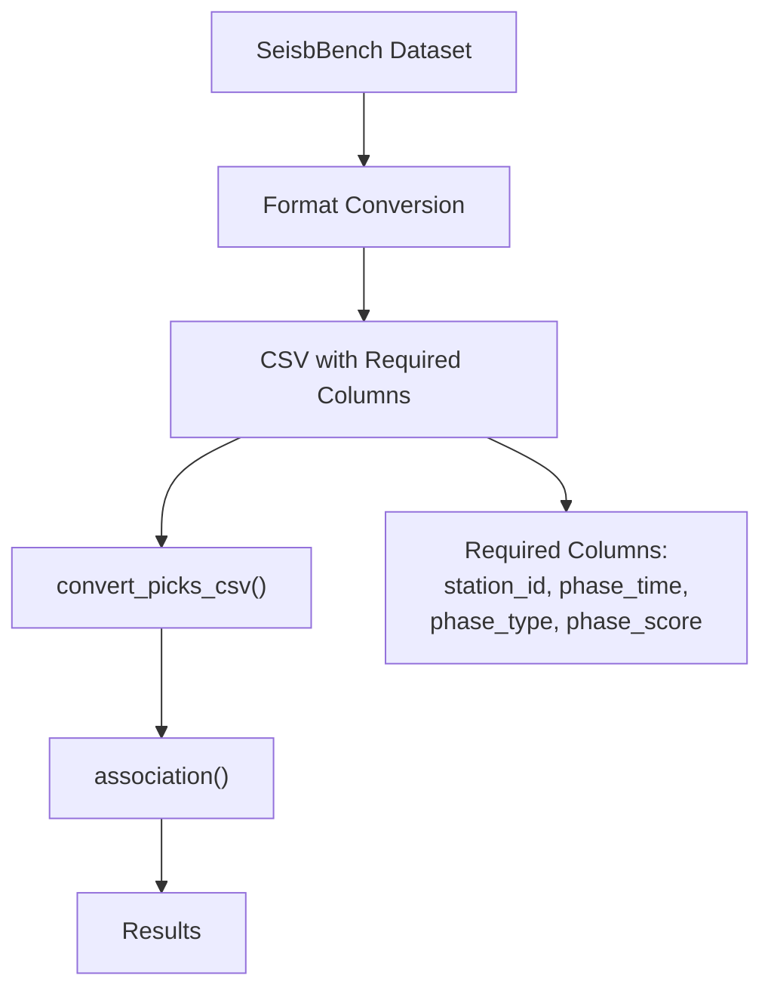
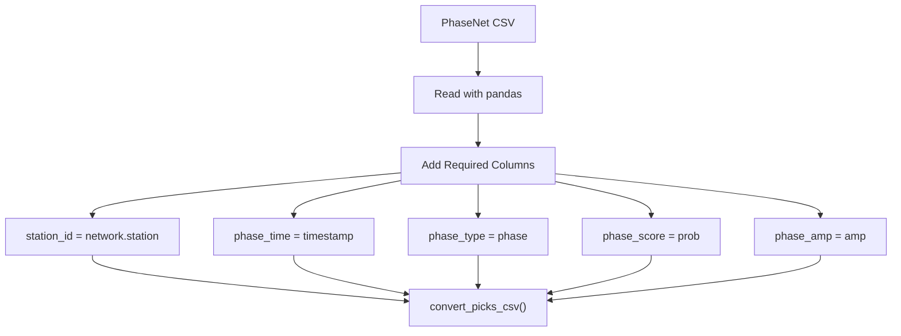
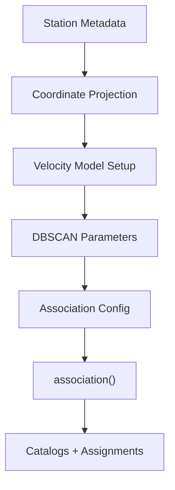
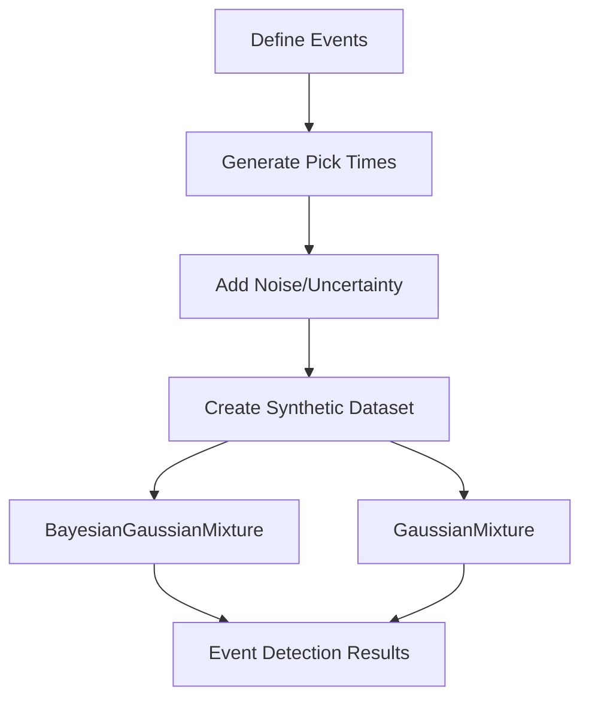
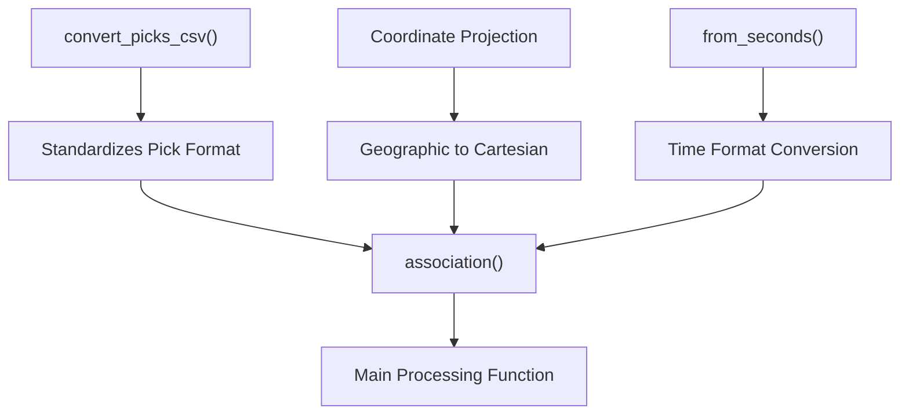

# SeisbBench and Other Data Sources

> **Relevant source files**
> * [docs/example_seisbench.ipynb](https://github.com/AI4EPS/GaMMA/blob/edcf2cec/docs/example_seisbench.ipynb)
> * [docs/example_synthetic.ipynb](https://github.com/AI4EPS/GaMMA/blob/edcf2cec/docs/example_synthetic.ipynb)
> * [tests/example_phasenet_neuma.ipynb](https://github.com/AI4EPS/GaMMA/blob/edcf2cec/tests/example_phasenet_neuma.ipynb)

This page provides examples and guidance for using GaMMA with various seismic data sources beyond the basic PhaseNet integration. It covers SeisbBench datasets, synthetic data generation, custom CSV formats, and the data conversion utilities that enable GaMMA to work with different input formats.

For basic PhaseNet integration examples, see [PhaseNet Integration](/AI4EPS/GaMMA/5.1-phasenet-integration). For synthetic data generation techniques, see [Synthetic Data Examples](/AI4EPS/GaMMA/5.2-synthetic-data-examples).

## Overview of Data Source Support

GaMMA supports multiple seismic data formats and sources through its flexible data processing pipeline. The system can handle picks from machine learning models like PhaseNet, benchmark datasets like SeisbBench, synthetic data for testing, and custom user formats.



**Data Flow Through GaMMA Processing Pipeline**

Sources: [gamma/utils.py](https://github.com/AI4EPS/GaMMA/blob/edcf2cec/gamma/utils.py)

 [docs/example_phasenet.ipynb](https://github.com/AI4EPS/GaMMA/blob/edcf2cec/docs/example_phasenet.ipynb)

 [docs/example_synthetic.ipynb](https://github.com/AI4EPS/GaMMA/blob/edcf2cec/docs/example_synthetic.ipynb)

## SeisbBench Integration

SeisbBench is a standardized benchmark dataset for seismic signal processing. GaMMA can process SeisbBench data through the same CSV conversion workflow used for other pick datasets.

The typical SeisbBench workflow involves:

1. Loading SeisbBench datasets in their native format
2. Converting to GaMMA's expected CSV format with required columns
3. Processing through the standard association pipeline



**SeisbBench Data Processing Workflow**

Sources: [gamma/utils.py](https://github.com/AI4EPS/GaMMA/blob/edcf2cec/gamma/utils.py#LNaN-LNaN)

## PhaseNet Data Workflow

The PhaseNet example demonstrates a comprehensive workflow for processing machine learning-generated picks. The process involves data loading, format standardization, configuration setup, and association processing.

### Data Format Conversion

PhaseNet picks require conversion to GaMMA's standardized format:



**PhaseNet Data Format Conversion**

The example shows the column mapping process at [tests/example_phasenet_neuma.ipynb L134-L144](https://github.com/AI4EPS/GaMMA/blob/edcf2cec/tests/example_phasenet_neuma.ipynb#L134-L144)

:

```
picks["station_id"] = picks["id"]
picks["phase_time"] = picks["timestamp"] 
picks["phase_amp"] = picks["amp"]
picks["phase_type"] = picks["type"]
picks["phase_score"] = picks["prob"]
```

### Configuration and Processing

The PhaseNet workflow includes extensive configuration for regional parameters:



**PhaseNet Processing Configuration**

Key configuration elements include velocity models, coordinate projections, and clustering parameters as shown in [tests/example_phasenet_neuma.ipynb L175-L224](https://github.com/AI4EPS/GaMMA/blob/edcf2cec/tests/example_phasenet_neuma.ipynb#L175-L224)

Sources: [tests/example_phasenet_neuma.ipynb](https://github.com/AI4EPS/GaMMA/blob/edcf2cec/tests/example_phasenet_neuma.ipynb)

 [gamma/utils.py](https://github.com/AI4EPS/GaMMA/blob/edcf2cec/gamma/utils.py)

## Synthetic Data Examples

Synthetic data provides controlled testing environments for GaMMA algorithms. The synthetic example demonstrates direct usage of the Gaussian mixture model classes without the full association pipeline.

### Synthetic Data Generation



**Synthetic Data Processing Flow**

The synthetic example shows direct instantiation of mixture models:

```javascript
from gamma import BayesianGaussianMixture, GaussianMixture
```

This approach bypasses the CSV conversion utilities and directly provides data to the statistical models.

Sources: [docs/example_synthetic.ipynb L30](https://github.com/AI4EPS/GaMMA/blob/edcf2cec/docs/example_synthetic.ipynb#L30-L30)

 [gamma/_bayesian_mixture.py](https://github.com/AI4EPS/GaMMA/blob/edcf2cec/gamma/_bayesian_mixture.py)

 [gamma/_gaussian_mixture.py](https://github.com/AI4EPS/GaMMA/blob/edcf2cec/gamma/_gaussian_mixture.py)

## Data Conversion Utilities

GaMMA provides several utilities for handling different data formats and coordinate systems.

### Key Conversion Functions



**Data Conversion Utility Functions**

The `convert_picks_csv()` function handles the standardization of pick data formats, while coordinate projection utilities handle geographic transformations required for distance calculations.

### Required Data Columns

All data sources must be converted to include these standardized columns:

| Column | Description | Type |
| --- | --- | --- |
| `station_id` | Unique station identifier | string |
| `phase_time` | Pick time (ISO format) | datetime |
| `phase_type` | Phase type (P, S, etc.) | string |
| `phase_score` | Pick confidence score | float |
| `phase_amp` | Amplitude measurement | float |

Additional optional columns like `event_index` and `gamma_score` are added during processing.

Sources: [gamma/utils.py](https://github.com/AI4EPS/GaMMA/blob/edcf2cec/gamma/utils.py)

 [tests/example_phasenet_neuma.ipynb L140-L145](https://github.com/AI4EPS/GaMMA/blob/edcf2cec/tests/example_phasenet_neuma.ipynb#L140-L145)

## Configuration for Different Data Sources

Different data sources may require specific configuration adjustments:

### Regional Parameters

* Coordinate system setup with `center`, `xlim_degree`, `ylim_degree`
* Velocity models appropriate for the study region
* Time windows matching the data coverage

### Algorithm Parameters

* `oversample_factor` tuning based on data characteristics
* DBSCAN clustering parameters (`dbscan_eps`, `dbscan_min_samples`)
* Quality filtering thresholds (`min_picks_per_eq`, `max_sigma11`, etc.)

### Data-Specific Settings

* Amplitude usage (`use_amplitude`) depending on data availability
* Method selection (`BGMM` vs `GMM`) based on dataset size and characteristics

The configuration dictionary structure remains consistent across data sources, enabling easy adaptation to new datasets.

Sources: [tests/example_phasenet_neuma.ipynb L175-L229](https://github.com/AI4EPS/GaMMA/blob/edcf2cec/tests/example_phasenet_neuma.ipynb#L175-L229)

 [gamma/utils.py](https://github.com/AI4EPS/GaMMA/blob/edcf2cec/gamma/utils.py)