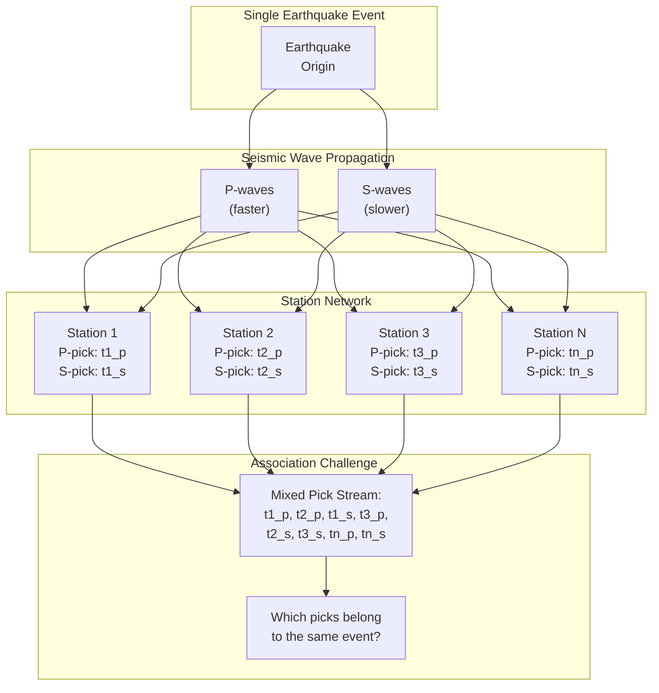
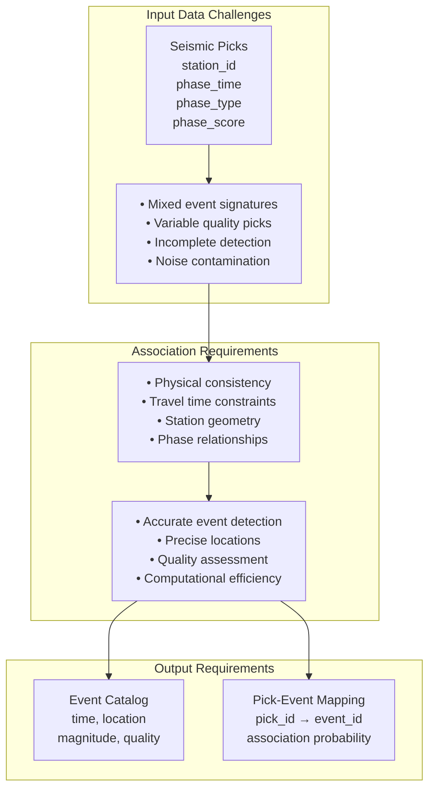
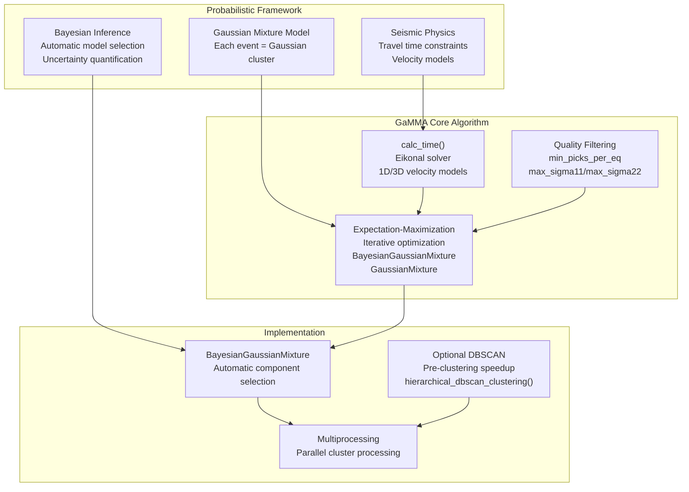
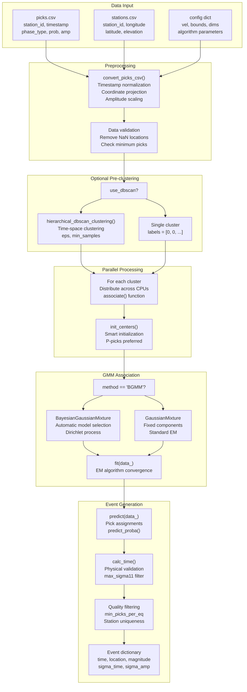
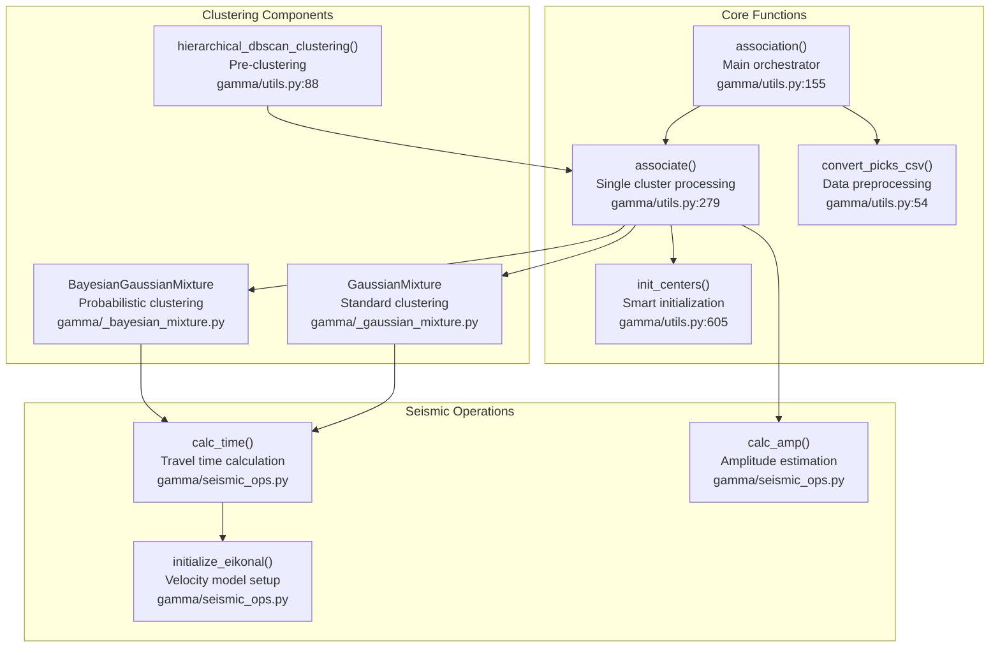
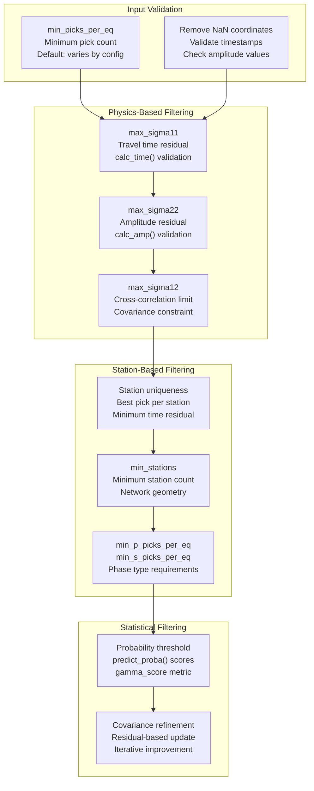

# Seismic Event Association

> **Relevant source files**
> * [docs/README.md](https://github.com/AI4EPS/GaMMA/blob/edcf2cec/docs/README.md)
> * [gamma/utils.py](https://github.com/AI4EPS/GaMMA/blob/edcf2cec/gamma/utils.py)
> * [tests/comparison/stations_ridgecrest.csv](https://github.com/AI4EPS/GaMMA/blob/edcf2cec/tests/comparison/stations_ridgecrest.csv)

This document explains the fundamental concept of seismic event association, the computational challenges it presents, and how GaMMA (Gaussian Mixture Model Associator) solves this problem using probabilistic clustering techniques. For information about the specific Gaussian Mixture Model algorithms used, see [Gaussian Mixture Models](/AI4EPS/GaMMA/3.2-gaussian-mixture-models). For details about travel time calculations and seismic physics, see [Travel Time Calculation](/AI4EPS/GaMMA/3.3-travel-time-calculation).

## What is Seismic Event Association?

Seismic event association is the process of grouping individual phase picks (P-wave and S-wave arrivals detected at seismic stations) that originate from the same earthquake event. When an earthquake occurs, it generates seismic waves that travel through the Earth and are recorded by multiple seismic stations across a network. Each station may detect both P-wave and S-wave arrivals, creating a collection of individual "picks" that must be correctly grouped to identify and locate the underlying earthquake events.

Sources: [gamma/utils.py L155-L276](https://github.com/AI4EPS/GaMMA/blob/edcf2cec/gamma/utils.py#L155-L276)

 [docs/README.md L13-L16](https://github.com/AI4EPS/GaMMA/blob/edcf2cec/docs/README.md#L13-L16)

## The Association Problem

The association problem becomes complex when multiple earthquakes occur within overlapping time windows, creating ambiguity about which picks belong to which events. Real seismic networks may record hundreds or thousands of picks per day, and simple time-based grouping is insufficient because:

| Challenge | Description | Example |
| --- | --- | --- |
| **Overlapping Events** | Multiple earthquakes occur close in time | Two events 10 seconds apart may have overlapping S-wave arrivals |
| **Distance Variations** | Stations at different distances record the same event at different times | P-wave from distant event may arrive after S-wave from nearby event |
| **Network Geometry** | Irregular station spacing creates complex arrival patterns | Dense urban network vs. sparse regional network |
| **False Picks** | Noise and processing artifacts create spurious detections | Cultural noise, wind, processing errors |
| **Missing Picks** | Not all stations detect every event | Weak signals, station outages, directivity effects |

Sources: [gamma/utils.py L54-L86](https://github.com/AI4EPS/GaMMA/blob/edcf2cec/gamma/utils.py#L54-L86)

 [docs/README.md L20-L38](https://github.com/AI4EPS/GaMMA/blob/edcf2cec/docs/README.md#L20-L38)

## GaMMA's Solution Approach

GaMMA solves the association problem using a probabilistic approach based on Gaussian Mixture Models (GMM), treating each earthquake as a cluster in a multidimensional space of time, location, and optionally amplitude. The key insight is that picks from the same event should cluster together when projected into a space that accounts for seismic wave travel times.

### Core Philosophy

GaMMA models each earthquake event as a Gaussian distribution in the joint space of:

* **Time dimension**: Event origin time
* **Spatial dimensions**: Event location (x, y, z coordinates)
* **Amplitude dimension**: Event magnitude (optional)

The association process finds the optimal clustering by maximizing the likelihood that observed picks originated from the hypothesized earthquake events, while incorporating seismic physics through travel time calculations.

Sources: [gamma/_bayesian_mixture.py](https://github.com/AI4EPS/GaMMA/blob/edcf2cec/gamma/_bayesian_mixture.py)

 [gamma/_gaussian_mixture.py](https://github.com/AI4EPS/GaMMA/blob/edcf2cec/gamma/_gaussian_mixture.py)

 [gamma/utils.py L360-L401](https://github.com/AI4EPS/GaMMA/blob/edcf2cec/gamma/utils.py#L360-L401)

## Core Workflow

The GaMMA association workflow processes seismic picks through several stages, from data preprocessing to final event output. The main entry point is the `association()` function in `gamma.utils`.

Sources: [gamma/utils.py L155-L276](https://github.com/AI4EPS/GaMMA/blob/edcf2cec/gamma/utils.py#L155-L276)

 [gamma/utils.py L279-L532](https://github.com/AI4EPS/GaMMA/blob/edcf2cec/gamma/utils.py#L279-L532)

## Key Components and Functions

### Data Processing Pipeline

The association process begins with data conversion and validation through several key functions:

| Function | Purpose | Key Operations |
| --- | --- | --- |
| `convert_picks_csv()` | Convert input data to internal format | Timestamp normalization, coordinate projection, amplitude scaling |
| `estimate_eps()` | Calculate DBSCAN parameters | Station spacing analysis, velocity-based time windows |
| `hierarchical_dbscan_clustering()` | Pre-cluster picks by time-space proximity | Iterative DBSCAN with adaptive parameters |
| `init_centers()` | Initialize GMM cluster centers | P-pick preference, spatial weighting |

Sources: [gamma/utils.py L54-L86](https://github.com/AI4EPS/GaMMA/blob/edcf2cec/gamma/utils.py#L54-L86)

 [gamma/utils.py L88-L153](https://github.com/AI4EPS/GaMMA/blob/edcf2cec/gamma/utils.py#L88-L153)

 [gamma/utils.py L605-L657](https://github.com/AI4EPS/GaMMA/blob/edcf2cec/gamma/utils.py#L605-L657)

### Quality Control and Filtering

GaMMA implements multiple layers of quality control to ensure reliable event detection:

Sources: [gamma/utils.py L422-L489](https://github.com/AI4EPS/GaMMA/blob/edcf2cec/gamma/utils.py#L422-L489)

 [gamma/utils.py L427-L454](https://github.com/AI4EPS/GaMMA/blob/edcf2cec/gamma/utils.py#L427-L454)

 [gamma/utils.py L456-L476](https://github.com/AI4EPS/GaMMA/blob/edcf2cec/gamma/utils.py#L456-L476)

The association process outputs two main data structures: a list of events with their properties (time, location, magnitude, uncertainties) and a list of assignments mapping each pick to its most likely event. This probabilistic approach allows GaMMA to handle ambiguous cases while providing uncertainty estimates for downstream analysis.