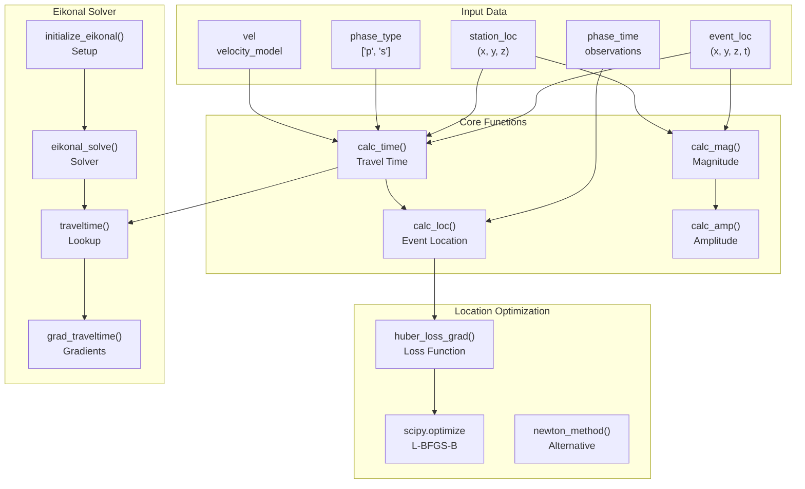
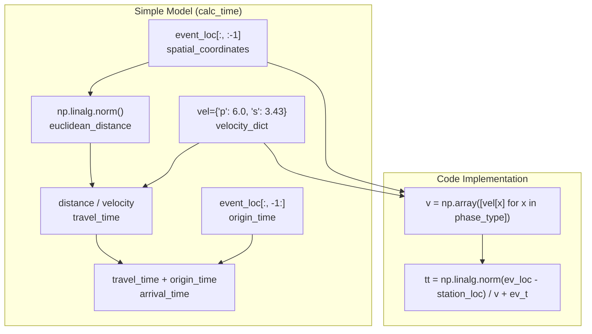
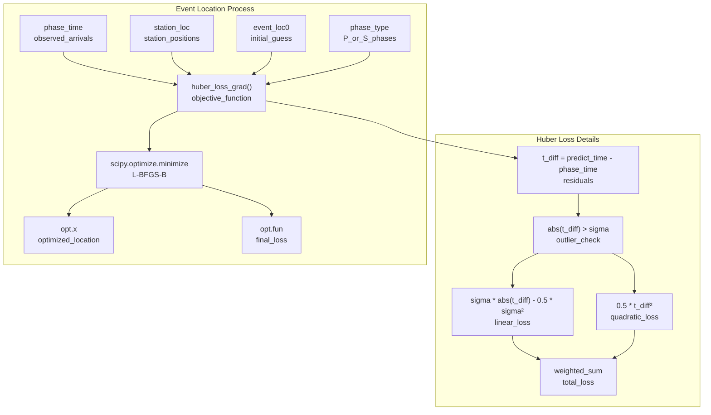
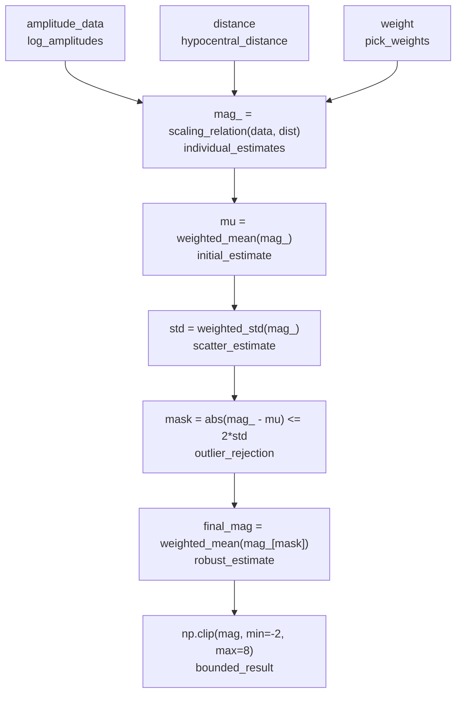
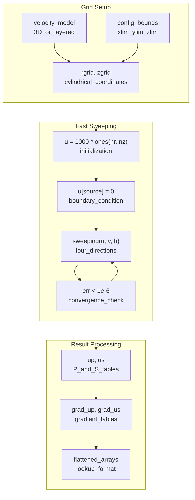
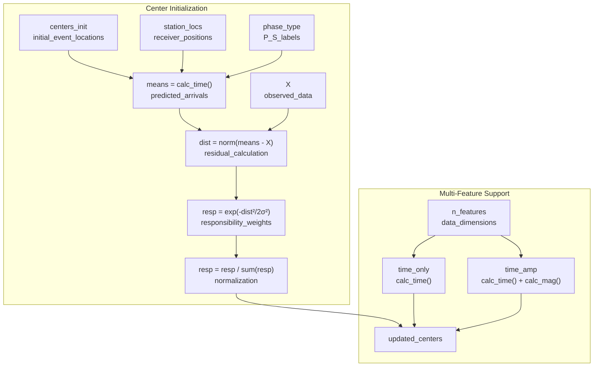

# Seismic Operations

> **Relevant source files**
> * [gamma/seismic_ops.py](https://github.com/AI4EPS/GaMMA/blob/edcf2cec/gamma/seismic_ops.py)

## Purpose and Scope

The `gamma.seismic_ops` module provides low-level seismological computations essential for earthquake event association and location. This module handles travel time calculations, event location optimization, magnitude estimation, and implements an eikonal solver for heterogeneous velocity models.

For the high-level association workflow that uses these operations, see [Core Association Functions](/AI4EPS/GaMMA/4.1-core-association-functions). For the statistical mixture model components that rely on these calculations, see [Mixture Model Classes](/AI4EPS/GaMMA/4.3-mixture-model-classes).

## System Architecture

The seismic operations module serves as the computational backbone for physical seismological calculations within GaMMA:



Sources: [gamma/seismic_ops.py L1-L486](https://github.com/AI4EPS/GaMMA/blob/edcf2cec/gamma/seismic_ops.py#L1-L486)

## Travel Time Calculation

The module provides two approaches for calculating seismic travel times between event locations and stations:

### Simple Velocity Model

For homogeneous or simple layered models, travel times are calculated using direct distance and constant velocities:



Sources: [gamma/seismic_ops.py L208-L218](https://github.com/AI4EPS/GaMMA/blob/edcf2cec/gamma/seismic_ops.py#L208-L218)

### Eikonal-Based Travel Times

For complex 3D velocity structures, the module uses pre-computed travel time tables from an eikonal solver:

| Component | Function | Purpose |
| --- | --- | --- |
| **Solver Setup** | `initialize_eikonal()` | Creates 2D travel time grids for P and S waves |
| **Table Lookup** | `traveltime()` | Bilinear interpolation from pre-computed tables |
| **Gradient Calculation** | `grad_traveltime()` | Computes gradients for optimization |
| **Internal Interpolation** | `_interp()` | Numba-optimized bilinear interpolation |

Sources: [gamma/seismic_ops.py L154-L203](https://github.com/AI4EPS/GaMMA/blob/edcf2cec/gamma/seismic_ops.py#L154-L203)

 [gamma/seismic_ops.py L315-L392](https://github.com/AI4EPS/GaMMA/blob/edcf2cec/gamma/seismic_ops.py#L315-L392)

## Event Location Algorithm

The `calc_loc()` function implements robust event location using Huber loss optimization:



Sources: [gamma/seismic_ops.py L290-L313](https://github.com/AI4EPS/GaMMA/blob/edcf2cec/gamma/seismic_ops.py#L290-L313)

 [gamma/seismic_ops.py L257-L287](https://github.com/AI4EPS/GaMMA/blob/edcf2cec/gamma/seismic_ops.py#L257-L287)

## Magnitude Estimation

The module implements multiple magnitude scaling relationships for different seismological contexts:

### Primary Implementation (Picozzi et al., 2018)

The default magnitude calculation uses rapid response scaling:

```python
# Coefficients from Picozzi et al. (2018)
c0, c1, c2, c3 = 1.08, 0.93, -0.015, -1.68
mag_ = (data - c0 - c3 * np.log10(np.maximum(dist, 0.1))) / c1 + 3.5
```

### Robust Magnitude Calculation

The `calc_mag()` function includes outlier rejection:



Sources: [gamma/seismic_ops.py L220-L237](https://github.com/AI4EPS/GaMMA/blob/edcf2cec/gamma/seismic_ops.py#L220-L237)

 [gamma/seismic_ops.py L240-L252](https://github.com/AI4EPS/GaMMA/blob/edcf2cec/gamma/seismic_ops.py#L240-L252)

## Eikonal Solver Implementation

The eikonal solver computes travel times in heterogeneous media by solving |∇u| = f, where u is travel time and f is slowness:

### Core Algorithm Components

| Function | Purpose | Implementation |
| --- | --- | --- |
| `sweeping()` | Fast sweeping method | Four-directional sweep pattern |
| `calculate_unique_solution()` | Local solver | Quadratic formula for travel time update |
| `sweeping_over_I_J_K()` | Grid traversal | Numba-optimized nested loops |
| `eikonal_solve()` | Main solver | Iterative convergence with error checking |

### Solver Workflow



Sources: [gamma/seismic_ops.py L77-L89](https://github.com/AI4EPS/GaMMA/blob/edcf2cec/gamma/seismic_ops.py#L77-L89)

 [gamma/seismic_ops.py L54-L74](https://github.com/AI4EPS/GaMMA/blob/edcf2cec/gamma/seismic_ops.py#L54-L74)

 [gamma/seismic_ops.py L15-L21](https://github.com/AI4EPS/GaMMA/blob/edcf2cec/gamma/seismic_ops.py#L15-L21)

## Integration with Mixture Models

The seismic operations integrate with GaMMA's mixture models through the `initialize_centers()` function:



Sources: [gamma/seismic_ops.py L394-L438](https://github.com/AI4EPS/GaMMA/blob/edcf2cec/gamma/seismic_ops.py#L394-L438)

## Performance Optimization

The module uses several optimization strategies:

* **Numba JIT compilation** for eikonal solver inner loops: `@njit` decorators on performance-critical functions
* **Vectorized operations** with NumPy for batch processing of multiple events/stations
* **Scipy optimization** with L-BFGS-B for robust gradient-based event location
* **Pre-computed lookup tables** for complex velocity models to avoid repeated eikonal solving

Sources: [gamma/seismic_ops.py L15](https://github.com/AI4EPS/GaMMA/blob/edcf2cec/gamma/seismic_ops.py#L15-L15)

 [gamma/seismic_ops.py L93](https://github.com/AI4EPS/GaMMA/blob/edcf2cec/gamma/seismic_ops.py#L93-L93)

 [gamma/seismic_ops.py L117](https://github.com/AI4EPS/GaMMA/blob/edcf2cec/gamma/seismic_ops.py#L117-L117)

 [gamma/seismic_ops.py L302-L312](https://github.com/AI4EPS/GaMMA/blob/edcf2cec/gamma/seismic_ops.py#L302-L312)