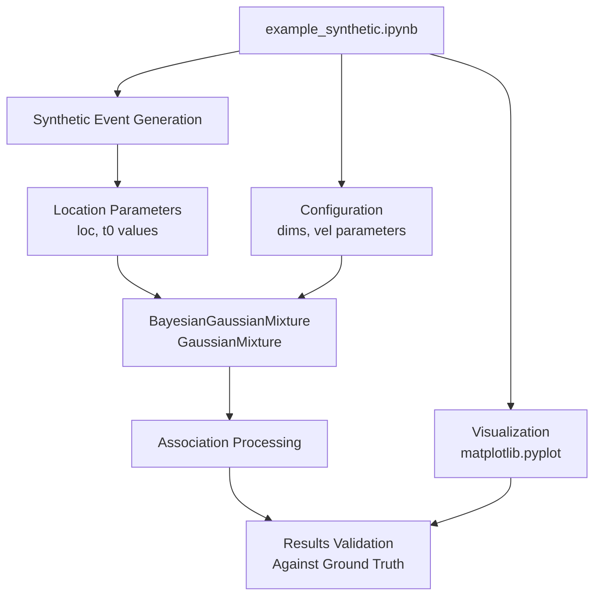
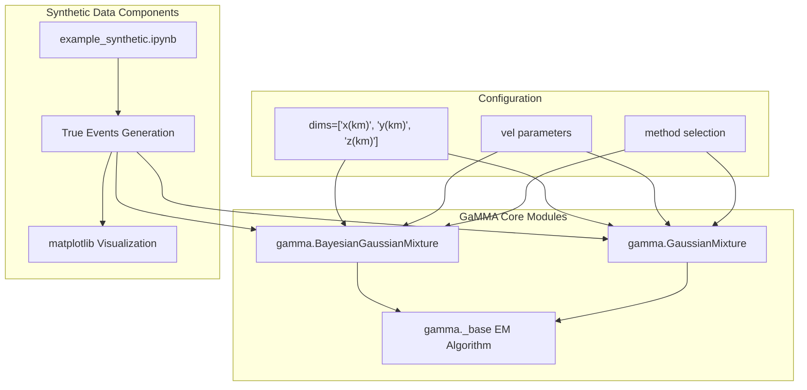
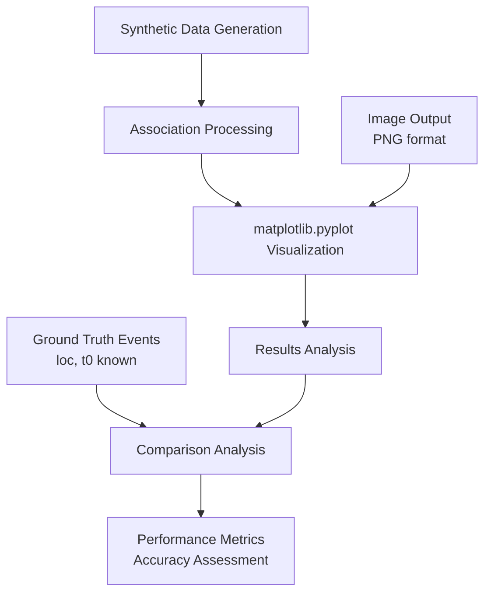

# Synthetic Data Examples

> **Relevant source files**
> * [docs/example_seisbench.ipynb](https://github.com/AI4EPS/GaMMA/blob/edcf2cec/docs/example_seisbench.ipynb)
> * [docs/example_synthetic.ipynb](https://github.com/AI4EPS/GaMMA/blob/edcf2cec/docs/example_synthetic.ipynb)
> * [tests/comparison/synthetic_ridgecrest_data.ipynb](https://github.com/AI4EPS/GaMMA/blob/edcf2cec/tests/comparison/synthetic_ridgecrest_data.ipynb)

This page demonstrates how to create and use synthetic seismic data for testing, validation, and development with the GaMMA (Gaussian Mixture Model Associator) system. Synthetic data provides controlled environments where ground truth is known, enabling systematic evaluation of association algorithms and parameter tuning.

For examples using real seismic data from various sources, see [SeisbBench and Other Data Sources](/AI4EPS/GaMMA/5.3-seisbbench-and-other-data-sources). For PhaseNet integration workflows, see [PhaseNet Integration](/AI4EPS/GaMMA/5.1-phasenet-integration).

## Purpose and Workflow Overview

Synthetic data examples serve multiple purposes in seismic event association:

* **Algorithm Validation**: Test association performance against known ground truth
* **Parameter Optimization**: Tune GaMMA configuration parameters systematically
* **Development Testing**: Validate new features and modifications
* **Educational Use**: Demonstrate concepts with controlled, interpretable examples

## Synthetic Data Generation Workflow

The synthetic data workflow follows a structured approach from data generation through association analysis:

Sources: [docs/example_synthetic.ipynb L1-L50](https://github.com/AI4EPS/GaMMA/blob/edcf2cec/docs/example_synthetic.ipynb#L1-L50)

## Core Components and Implementation

The synthetic data implementation utilizes key GaMMA components for controlled testing scenarios:

Sources: [docs/example_synthetic.ipynb L25-L31](https://github.com/AI4EPS/GaMMA/blob/edcf2cec/docs/example_synthetic.ipynb#L25-L31)

## Synthetic Event Parameters

The synthetic example generates controlled events with predetermined characteristics:

| Parameter | Description | Example Values |
| --- | --- | --- |
| `loc` | Event location (km) | 400.000, 1600.000, 880.000 |
| `t0` | Event time (seconds) | 33.333, 93.333, 153.333 |
| Event spacing | Temporal separation | ~60 second intervals |
| Spatial distribution | Location variance | 240-1360 km range |

The synthetic events are created with known ground truth values, enabling direct comparison with association results.

Sources: [docs/example_synthetic.ipynb L44-L56](https://github.com/AI4EPS/GaMMA/blob/edcf2cec/docs/example_synthetic.ipynb#L44-L56)

## Mixture Model Configuration

Synthetic data examples demonstrate both mixture model approaches available in GaMMA:

### BayesianGaussianMixture Implementation

* Bayesian approach with uncertainty quantification
* Automatic model complexity determination
* Robust handling of noise and outliers

### GaussianMixture Implementation

* Classical expectation-maximization approach
* Direct parameter estimation
* Computationally efficient for large datasets

The choice between `BayesianGaussianMixture` and `GaussianMixture` can be evaluated systematically using synthetic data with known characteristics.

Sources: [docs/example_synthetic.ipynb L30](https://github.com/AI4EPS/GaMMA/blob/edcf2cec/docs/example_synthetic.ipynb#L30-L30)

## Visualization and Analysis

Synthetic examples include comprehensive visualization capabilities for results interpretation:

The visualization output enables direct comparison between synthetic ground truth and association results, facilitating algorithm validation and parameter optimization.

Sources: [docs/example_synthetic.ipynb L59-L100](https://github.com/AI4EPS/GaMMA/blob/edcf2cec/docs/example_synthetic.ipynb#L59-L100)

## Integration with Testing Framework

Synthetic data examples integrate with the broader GaMMA testing and validation ecosystem:

* **Performance Benchmarking**: Systematic evaluation against controlled datasets
* **Regression Testing**: Ensure consistency across code modifications
* **Parameter Sensitivity Analysis**: Evaluate algorithm behavior across parameter ranges
* **Comparative Analysis**: Compare different association methods on identical synthetic datasets

The synthetic data approach provides the controlled environment necessary for rigorous algorithm development and validation workflows.

Sources: [docs/example_synthetic.ipynb L1-L100](https://github.com/AI4EPS/GaMMA/blob/edcf2cec/docs/example_synthetic.ipynb#L1-L100)