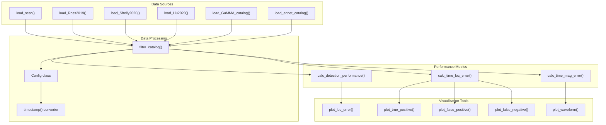
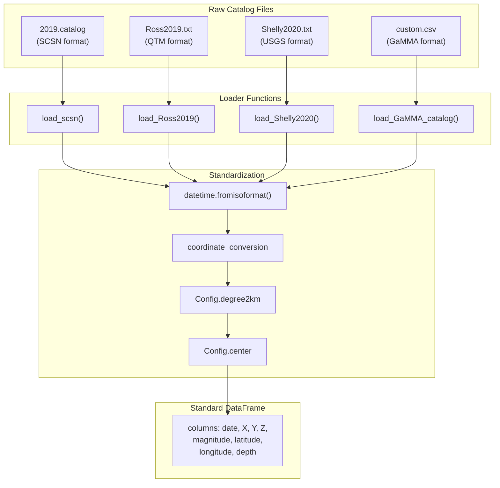
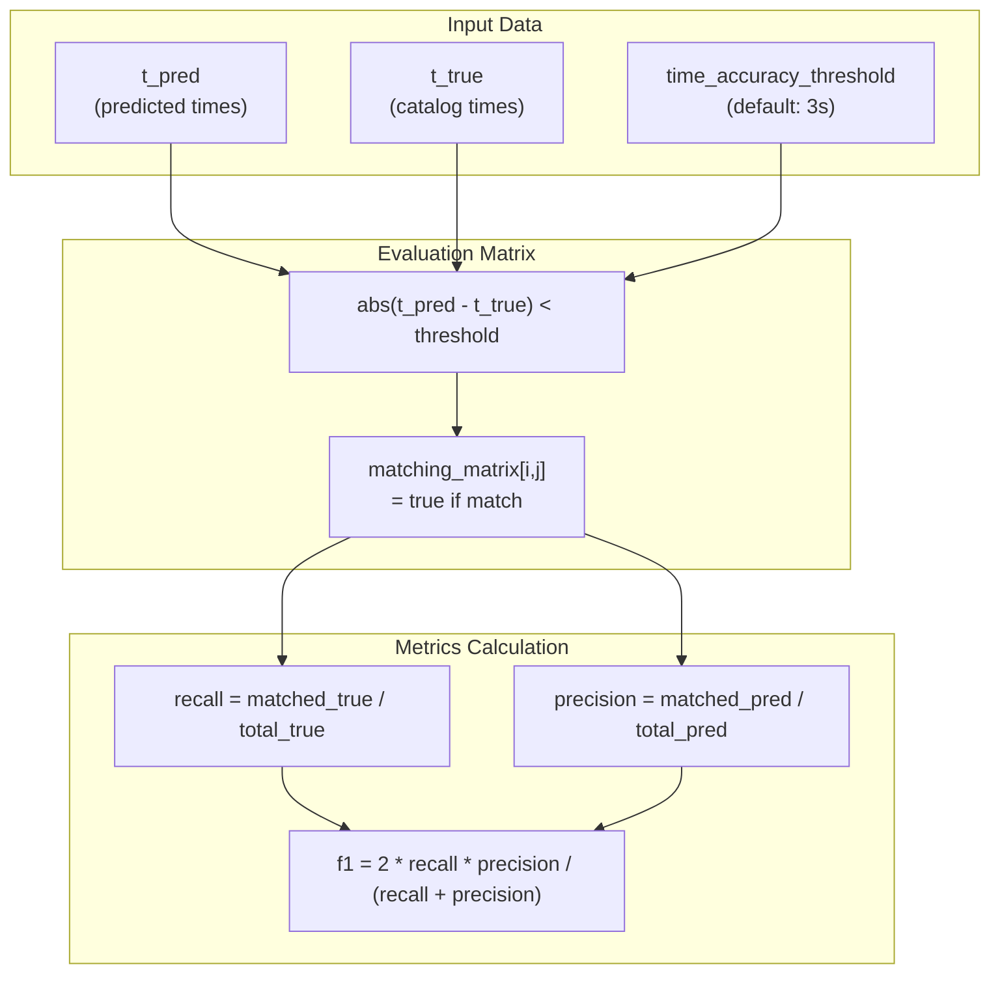
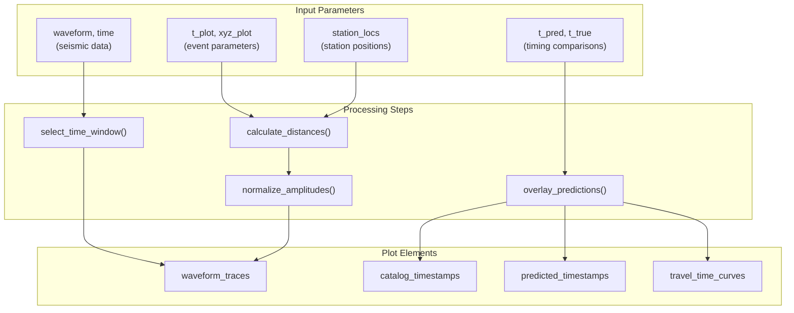
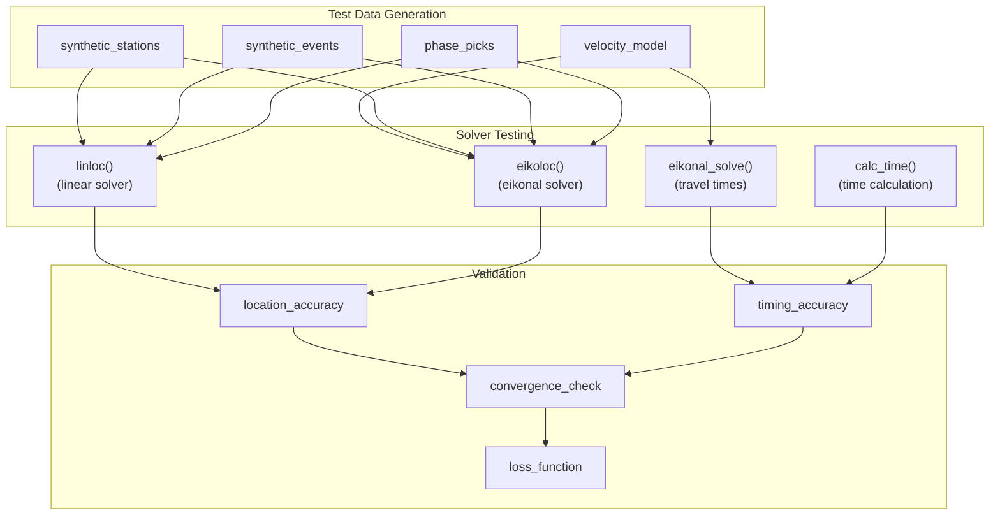

# Testing Framework

> **Relevant source files**
> * [gamma/__init__.py](https://github.com/AI4EPS/GaMMA/blob/edcf2cec/gamma/__init__.py)
> * [tests/.gitignore](https://github.com/AI4EPS/GaMMA/blob/edcf2cec/tests/.gitignore)
> * [tests/comparison.ipynb](https://github.com/AI4EPS/GaMMA/blob/edcf2cec/tests/comparison.ipynb)
> * [tests/test_seismoc_ops.py](https://github.com/AI4EPS/GaMMA/blob/edcf2cec/tests/test_seismoc_ops.py)
> * [tests/util.py](https://github.com/AI4EPS/GaMMA/blob/edcf2cec/tests/util.py)

This document covers GaMMA's comprehensive testing and validation framework, which includes performance evaluation metrics, catalog comparison tools, and visualization utilities for validating seismic event association results. The testing framework enables systematic comparison against reference catalogs and provides statistical analysis tools to assess GaMMA's accuracy and reliability.

For information about using comparison tools to benchmark against other methods, see [Comparison Tools](/AI4EPS/GaMMA/6.2-comparison-tools). For performance analysis and statistics generation, see [Performance Analysis](/AI4EPS/GaMMA/6.3-performance-analysis).

## Overview

The testing framework provides utilities for loading reference catalogs, evaluating detection performance, calculating location and timing errors, and visualizing results. It supports multiple seismic catalog formats and implements standard seismological evaluation metrics.

**Core Testing Framework Architecture**



Sources: [tests/util.py L1-L631](https://github.com/AI4EPS/GaMMA/blob/edcf2cec/tests/util.py#L1-L631)

## Test Data Management

The framework supports loading and processing multiple seismic catalog formats through dedicated loader functions.

### Catalog Loaders

| Function | Purpose | Data Source |
| --- | --- | --- |
| `load_scsn()` | SCSN catalog (2019.catalog format) | Southern California Seismic Network |
| `load_Ross2019()` | Ross et al. 2019 QTM catalog | Ridgecrest earthquake sequence |
| `load_Shelly2020()` | Shelly et al. 2020 catalog | USGS Science Base |
| `load_Liu2020()` | Liu et al. 2020 catalog | AGU publications |
| `load_GaMMA_catalog()` | GaMMA output format | Tab-separated values |
| `load_eqnet_catalog()` | EqNet format | Custom research catalogs |

**Data Loading and Standardization Pipeline**



Sources: [tests/util.py L39-L278](https://github.com/AI4EPS/GaMMA/blob/edcf2cec/tests/util.py#L39-L278)

### Configuration Management

The `Config` class provides standardized coordinate transformation parameters:

```python
class Config:
    degree2km = np.pi * 6371 / 180  # Earth radius conversion
    center = (35.705, -117.504)     # Reference coordinate center
    horizontal = 0.5                # Horizontal offset
    vertical = 0.5                  # Vertical offset
```

Sources: [tests/util.py L17-L22](https://github.com/AI4EPS/GaMMA/blob/edcf2cec/tests/util.py#L17-L22)

## Performance Evaluation Metrics

The framework implements standard seismological performance metrics for evaluating detection accuracy.

### Detection Performance

The `calc_detection_performance()` function calculates recall, precision, and F1 scores:

```python
def calc_detection_performance(t_pred, t_true, time_accuracy_threshold=3):
    evaluation_matrix = np.abs(t_pred[np.newaxis, :] - t_true[:, np.newaxis]) < time_accuracy_threshold
    recalls = np.sum(evaluation_matrix, axis=1) > 0
    num_recall = np.sum(recalls)
    num_precision = np.sum(np.sum(evaluation_matrix, axis=0) > 0)
    recall = num_recall / len(t_true)
    precision = num_precision / len(t_pred)
    f1 = 2 * recall * precision / (recall + precision)
    return recall, precision, f1
```

**Performance Evaluation Workflow**



Sources: [tests/util.py L308-L318](https://github.com/AI4EPS/GaMMA/blob/edcf2cec/tests/util.py#L308-L318)

### Location and Timing Errors

The `calc_time_loc_error()` function computes spatiotemporal errors for matched events:

| Error Type | Calculation | Units |
| --- | --- | --- |
| `err_time` | `t_pred - t_true` | seconds |
| `err_xy` | `norm(xy_pred - xy_true)` | kilometers |
| `err_z` | `z_pred - z_true` | kilometers |
| `err_loc` | `norm(xyz_pred - xyz_true)` | kilometers |

Sources: [tests/util.py L321-L348](https://github.com/AI4EPS/GaMMA/blob/edcf2cec/tests/util.py#L321-L348)

### Magnitude Error Analysis

The `calc_time_mag_error()` function evaluates magnitude estimation accuracy:

```python
def calc_time_mag_error(t_pred, mag_pred, t_true, mag_true, time_accuracy_threshold):
    evaluation_matrix = np.abs(t_pred[np.newaxis, :] - t_true[:, np.newaxis]) < time_accuracy_threshold
    # Match events and calculate magnitude differences
    err_mag = mag_pred[matched_idx] - mag_true[recalled_idx]
    return err_time, err_mag, t, mag
```

Sources: [tests/util.py L351-L370](https://github.com/AI4EPS/GaMMA/blob/edcf2cec/tests/util.py#L351-L370)

## Visualization Tools

The framework provides comprehensive visualization capabilities for result analysis.

### Location Error Plotting

The `plot_loc_error()` function creates scatter plots comparing predicted and catalog locations:

```python
def plot_loc_error(t_pred, xyz_pred, t_true, xyz_true, time_accuracy_threshold, 
                   fig_name, xlim=None, ylim=None, station_locs=None):
    # Plot matched locations with different colors
    plt.plot(xyz_true[recalled_idx, 0], xyz_true[recalled_idx, 1], ".", color="C3")
    plt.plot(xyz_pred[matched_idx, 0], xyz_pred[matched_idx, 1], ".", color="C0")
    if station_locs is not None:
        plt.scatter(station_locs[:, 0], station_locs[:, 1], color="k", marker="^")
```

Sources: [tests/util.py L374-L410](https://github.com/AI4EPS/GaMMA/blob/edcf2cec/tests/util.py#L374-L410)

### Waveform Analysis

**Waveform Visualization Components**



Sources: [tests/util.py L413-L471](https://github.com/AI4EPS/GaMMA/blob/edcf2cec/tests/util.py#L413-L471)

## Seismic Operations Testing

The test suite includes validation of core seismic computation functions.

### Travel Time Calculation Tests

The `test_seismic_ops.py` file validates travel time calculations and location algorithms:

```markdown
# Test setup with synthetic data
vp = 6.0
vp_vs_ratio = 1.75
vs = vp/vp_vs_ratio
station_loc = np.array([[1, 0, 0]])
event_loc = np.array([[0, 0, 10]])
event_t = np.array([[0]])

# Test both linear and eikonal solvers
inv_linloc, loss = linloc(loc0, phase_time, phase_type, phase_loc, phase_weight)
inv_eikoloc, loss = eikoloc(loc0, phase_time, phase_type, phase_loc, phase_weight, 
                           up=up, us=us, rgrid=rgrid, zgrid=zgrid, h=h)
```

**Seismic Operations Test Framework**



Sources: [tests/test_seismic_ops.py L1-L125](https://github.com/AI4EPS/GaMMA/blob/edcf2cec/tests/test_seismic_ops.py#L1-L125)

## Data Filtering and Selection

The `filter_catalog()` function provides temporal and spatial filtering capabilities:

```python
def filter_catalog(catalog, start_datetime, end_datetime, xmin, xmax, ymin, ymax, config=Config()):
    selected_catalog = catalog[
        (catalog["date"] >= start_datetime) &
        (catalog["date"] <= end_datetime) &
        (catalog['X'] >= xmin) & (catalog['X'] <= xmax) &
        (catalog['Y'] >= ymin) & (catalog['Y'] <= ymax)
    ]
    # Convert to arrays for analysis
    t_event = [timestamp(row["date"]) for _, row in selected_catalog.iterrows()]
    xyz_event = [[row['X'], row['Y'], row['Z']] for _, row in selected_catalog.iterrows()]
    return np.array(t_event), np.array(xyz_event), np.array(mag_event), selected_catalog
```

The framework supports comprehensive filtering by:

* Temporal bounds (`start_datetime`, `end_datetime`)
* Spatial bounds (`xmin`, `xmax`, `ymin`, `ymax`)
* Magnitude thresholds
* Quality criteria

Sources: [tests/util.py L281-L305](https://github.com/AI4EPS/GaMMA/blob/edcf2cec/tests/util.py#L281-L305)