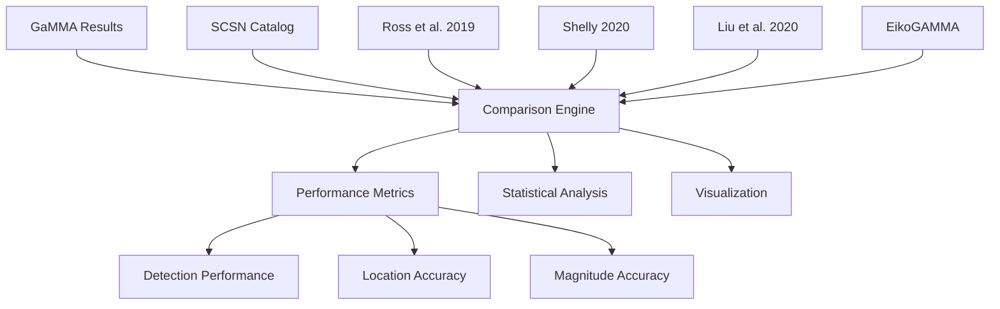
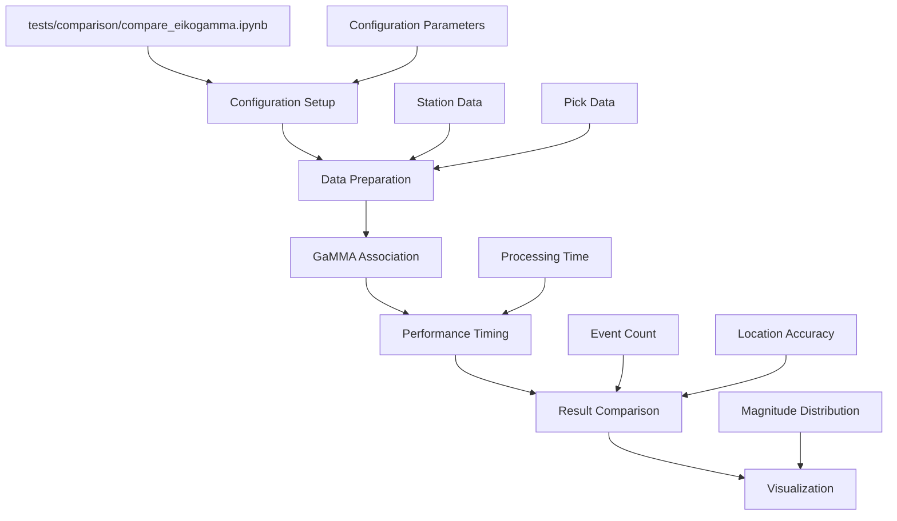
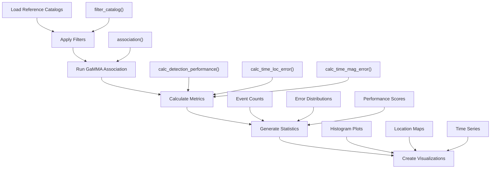
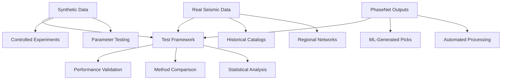

# Testing and Validation

> **Relevant source files**
> * [tests/.gitignore](https://github.com/AI4EPS/GaMMA/blob/edcf2cec/tests/.gitignore)
> * [tests/comparison.ipynb](https://github.com/AI4EPS/GaMMA/blob/edcf2cec/tests/comparison.ipynb)
> * [tests/comparison/compare_eikogamma.ipynb](https://github.com/AI4EPS/GaMMA/blob/edcf2cec/tests/comparison/compare_eikogamma.ipynb)
> * [tests/example_phasenet.ipynb](https://github.com/AI4EPS/GaMMA/blob/edcf2cec/tests/example_phasenet.ipynb)
> * [tests/util.py](https://github.com/AI4EPS/GaMMA/blob/edcf2cec/tests/util.py)

This page covers GaMMA's testing infrastructure, validation methodologies, and performance analysis tools. It provides guidance on how to validate GaMMA's performance against other seismic event association methods and analyze results using built-in comparison tools.

For information about using GaMMA with specific data sources, see [Examples and Tutorials](/AI4EPS/GaMMA/5-examples-and-tutorials). For development and deployment practices, see [Development and Deployment](/AI4EPS/GaMMA/7-development-and-deployment).

## Testing Framework

GaMMA provides comprehensive testing utilities through the `tests` module, including performance metrics, catalog comparison functions, and statistical analysis tools. The testing framework is built around comparing GaMMA's output against established seismic catalogs and other association algorithms.

### Core Testing Utilities

The primary testing utilities are located in `tests/util.py` and provide functions for loading various catalog formats, calculating performance metrics, and generating comparative analyses.

```mermaid
flowchart TD

A["tests/util.py"]
B["load_GaMMA_catalog()"]
C["load_scsn()"]
D["load_Ross2019()"]
E["load_Shelly2020()"]
F["load_Liu2020()"]
G["load_eqnet_catalog()"]
H["calc_detection_performance()"]
I["Precision/Recall"]
J["F1 Score"]
K["calc_time_loc_error()"]
L["Time Differences"]
M["Location Errors"]
N["calc_time_mag_error()"]
O["Magnitude Differences"]
P["filter_catalog()"]
Q["Temporal Filtering"]
R["Spatial Filtering"]
S["plot_loc_error()"]
T["Visualization Tools"]

A --> B
A --> C
A --> D
A --> E
A --> F
A --> G
H --> I
H --> J
K --> L
K --> M
N --> O
P --> Q
P --> R
S --> T
```

Sources: [tests/comparison.ipynb L27-L40](https://github.com/AI4EPS/GaMMA/blob/edcf2cec/tests/comparison.ipynb#L27-L40)

### Performance Metrics

The testing framework provides several key performance metrics:

| Metric Function | Purpose | Output |
| --- | --- | --- |
| `calc_detection_performance()` | Calculate detection statistics | Precision, recall, F1 score |
| `calc_time_loc_error()` | Temporal and spatial accuracy | Time differences, location errors |
| `calc_time_mag_error()` | Magnitude estimation accuracy | Magnitude residuals |
| `filter_catalog()` | Apply temporal/spatial filters | Filtered event catalogs |

Sources: [tests/comparison.ipynb L27-L40](https://github.com/AI4EPS/GaMMA/blob/edcf2cec/tests/comparison.ipynb#L27-L40)

## Comparison Tools

GaMMA includes comprehensive comparison tools for benchmarking against other seismic event association methods. These tools support multiple reference catalogs and provide standardized evaluation metrics.

### Supported Reference Catalogs

The comparison framework supports several established seismic catalogs:

Sources: [tests/comparison.ipynb L123-L131](https://github.com/AI4EPS/GaMMA/blob/edcf2cec/tests/comparison.ipynb#L123-L131)

### EikoGAMMA Comparison

A dedicated comparison with EikoGAMMA is available through the specialized notebook:

Sources: [tests/comparison/compare_eikogamma.ipynb L92-L198](https://github.com/AI4EPS/GaMMA/blob/edcf2cec/tests/comparison/compare_eikogamma.ipynb#L92-L198)

## Performance Analysis

The performance analysis tools provide comprehensive evaluation of GaMMA's accuracy and efficiency compared to other methods.

### Evaluation Workflow

Sources: [tests/comparison.ipynb L58-L146](https://github.com/AI4EPS/GaMMA/blob/edcf2cec/tests/comparison.ipynb#L58-L146)

### Statistical Analysis

The framework provides several types of statistical analysis:

1. **Detection Performance**: Precision, recall, and F1 scores for event detection
2. **Temporal Accuracy**: Time residuals and error distributions
3. **Spatial Accuracy**: Location error calculations and distance metrics
4. **Magnitude Accuracy**: Magnitude residual analysis and bias assessment

### Visualization Tools

Comprehensive visualization tools are provided for result analysis:

| Visualization Type | Function | Purpose |
| --- | --- | --- |
| Event Distribution | Histogram plots | Compare event counts across catalogs |
| Location Accuracy | Scatter plots, maps | Visualize spatial accuracy |
| Time Series | Time-based plots | Show temporal patterns |
| Error Analysis | Error distribution plots | Analyze accuracy metrics |

Sources: [tests/comparison.ipynb L172-L204](https://github.com/AI4EPS/GaMMA/blob/edcf2cec/tests/comparison.ipynb#L172-L204)

 [tests/example_phasenet.ipynb L400-L577](https://github.com/AI4EPS/GaMMA/blob/edcf2cec/tests/example_phasenet.ipynb#L400-L577)

## Data Sources and Test Setup

### Test Data Sources

The testing framework supports multiple data sources for comprehensive validation:

Sources: [tests/example_phasenet.ipynb L225-L315](https://github.com/AI4EPS/GaMMA/blob/edcf2cec/tests/example_phasenet.ipynb#L225-L315)

### Configuration for Testing

Testing configurations are typically set up with specific parameters for reproducible results:

* **Temporal bounds**: `starttime` and `endtime` parameters
* **Spatial bounds**: `xlim_degree` and `ylim_degree` parameters
* **Algorithm settings**: `method` (BGMM/GMM), `use_dbscan`, `use_amplitude`
* **Filtering parameters**: `min_picks_per_eq`, `max_sigma11`, `max_sigma22`

Sources: [tests/comparison/compare_eikogamma.ipynb L131-L195](https://github.com/AI4EPS/GaMMA/blob/edcf2cec/tests/comparison/compare_eikogamma.ipynb#L131-L195)

 [tests/example_phasenet.ipynb L237-L315](https://github.com/AI4EPS/GaMMA/blob/edcf2cec/tests/example_phasenet.ipynb#L237-L315)

## Validation Workflows

### Standard Validation Process

1. **Data Preparation**: Load and preprocess seismic data and station information
2. **Configuration Setup**: Define association parameters and filtering criteria
3. **Association Execution**: Run GaMMA association algorithm
4. **Results Loading**: Load reference catalogs for comparison
5. **Metric Calculation**: Compute performance statistics
6. **Analysis and Visualization**: Generate plots and statistical summaries

### Automated Testing

The framework supports automated testing through Jupyter notebooks that can be executed programmatically:

* `tests/comparison.ipynb`: General comparison framework
* `tests/comparison/compare_eikogamma.ipynb`: EikoGAMMA-specific comparison
* `tests/example_phasenet.ipynb`: PhaseNet integration testing

Sources: [tests/.gitignore L1-L10](https://github.com/AI4EPS/GaMMA/blob/edcf2cec/tests/.gitignore#L1-L10)