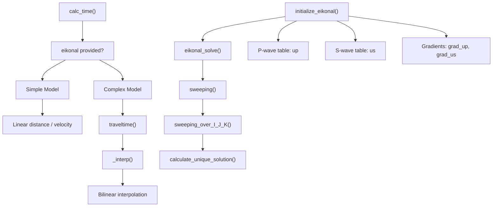
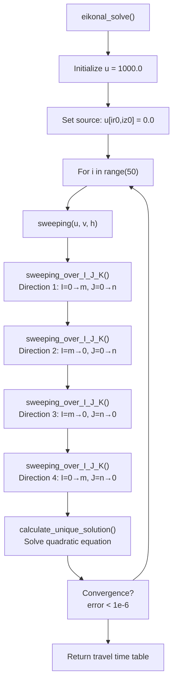
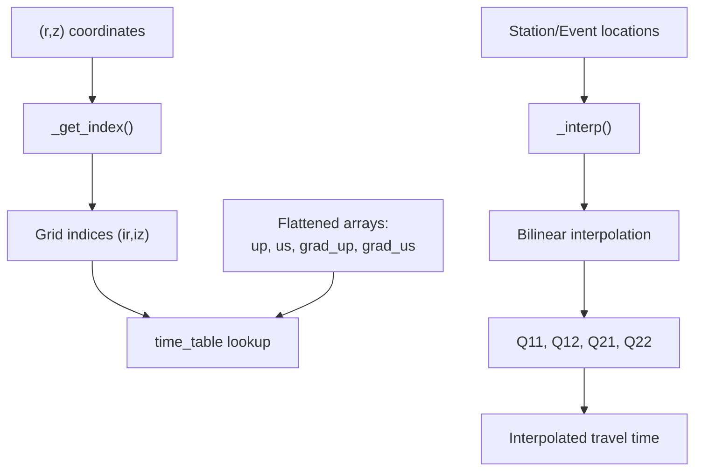
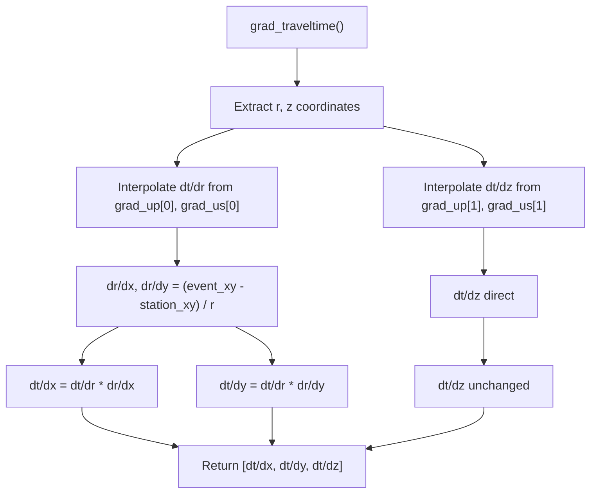
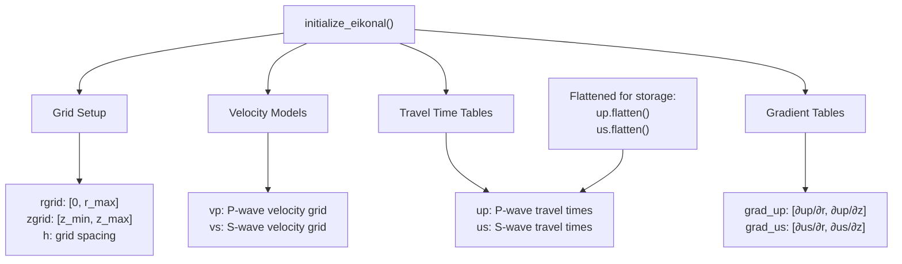

# Travel Time Calculation

> **Relevant source files**
> * [gamma/seismic_ops.py](https://github.com/AI4EPS/GaMMA/blob/edcf2cec/gamma/seismic_ops.py)

This document explains the seismic physics and computational methods behind travel time calculations in GaMMA, including the eikonal solver implementation and velocity model handling. Travel times are fundamental to seismic event association as they determine the expected arrival time of seismic waves at different stations.

For information about how these travel times are used in the association process, see [Core Association Functions](/AI4EPS/GaMMA/4.1-core-association-functions). For details about the statistical models that use these travel times, see [Gaussian Mixture Models](/AI4EPS/GaMMA/3.2-gaussian-mixture-models).

## Overview

Travel time calculation in GaMMA supports two main approaches:

1. **Simple velocity model**: Constant velocities for P and S waves with straight-ray paths
2. **Complex velocity model**: 3D velocity structures solved using an eikonal solver

The system automatically selects the appropriate method based on whether an eikonal configuration is provided.

## Physics Background

### Wave Propagation

Seismic waves travel through the Earth at different velocities depending on:

* **Wave type**: P-waves (primary) travel faster than S-waves (secondary)
* **Material properties**: Velocity varies with rock type, density, and depth
* **Path geometry**: Waves may refract through layered media

### Eikonal Equation

For complex velocity structures, GaMMA solves the eikonal equation:

```
|∇u| = f
```

Where:

* `u` is the travel time field
* `f = 1/v` is the slowness (inverse of velocity)
* `∇u` is the gradient of the travel time

This partial differential equation describes how seismic waves propagate through heterogeneous media.

**Travel Time Calculation Architecture**



Sources: [gamma/seismic_ops.py L208-L217](https://github.com/AI4EPS/GaMMA/blob/edcf2cec/gamma/seismic_ops.py#L208-L217)

 [gamma/seismic_ops.py L154-L173](https://github.com/AI4EPS/GaMMA/blob/edcf2cec/gamma/seismic_ops.py#L154-L173)

 [gamma/seismic_ops.py L315-L391](https://github.com/AI4EPS/GaMMA/blob/edcf2cec/gamma/seismic_ops.py#L315-L391)

## Eikonal Solver Implementation

### Fast Sweeping Method

The eikonal solver uses a fast sweeping algorithm that iteratively updates travel times across a 2D grid in cylindrical coordinates (radius, depth).

**Eikonal Solver Algorithm Flow**



Sources: [gamma/seismic_ops.py L77-L89](https://github.com/AI4EPS/GaMMA/blob/edcf2cec/gamma/seismic_ops.py#L77-L89)

 [gamma/seismic_ops.py L54-L74](https://github.com/AI4EPS/GaMMA/blob/edcf2cec/gamma/seismic_ops.py#L54-L74)

 [gamma/seismic_ops.py L25-L50](https://github.com/AI4EPS/GaMMA/blob/edcf2cec/gamma/seismic_ops.py#L25-L50)

 [gamma/seismic_ops.py L16-L21](https://github.com/AI4EPS/GaMMA/blob/edcf2cec/gamma/seismic_ops.py#L16-L21)

### Unique Solution Calculation

The core numerical method solves a discretized eikonal equation at each grid point:

```
((u - a1)^+)^2 + ((u - a2)^+)^2 = f^2 h^2
```

The `calculate_unique_solution()` function implements this using the upwind finite difference scheme.

**Grid Indexing and Interpolation**



Sources: [gamma/seismic_ops.py L94-L102](https://github.com/AI4EPS/GaMMA/blob/edcf2cec/gamma/seismic_ops.py#L94-L102)

 [gamma/seismic_ops.py L118-L151](https://github.com/AI4EPS/GaMMA/blob/edcf2cec/gamma/seismic_ops.py#L118-L151)

## Travel Time Functions

### Primary Interface

The `calc_time()` function serves as the main interface, automatically selecting between simple and complex models:

| Parameter | Type | Description |
| --- | --- | --- |
| `event_loc` | array | Event locations [x, y, z, t] |
| `station_loc` | array | Station locations [x, y, z] |
| `phase_type` | list/array | Phase types ["p", "s"] |
| `vel` | dict | Velocities {"p": 6.0, "s": 3.43} |
| `eikonal` | dict/None | Eikonal solver tables |

### Implementation Details

**Simple Model** (when `eikonal=None`):

```
tt = distance / velocity + event_time
```

**Complex Model** (when `eikonal` provided):

* Uses precomputed travel time tables `up` and `us`
* Performs bilinear interpolation via `_interp()`
* Handles cylindrical coordinate transformation

Sources: [gamma/seismic_ops.py L208-L217](https://github.com/AI4EPS/GaMMA/blob/edcf2cec/gamma/seismic_ops.py#L208-L217)

### Gradient Calculation

The `grad_traveltime()` function computes travel time gradients needed for event location optimization:

**Gradient Components Flow**



Sources: [gamma/seismic_ops.py L176-L202](https://github.com/AI4EPS/GaMMA/blob/edcf2cec/gamma/seismic_ops.py#L176-L202)

## Velocity Models

### Configuration Structure

Velocity models are defined in the configuration with depth-dependent velocities:

```css
vel = {
    "z": [depth1, depth2, ...],    # Depth values (km)
    "p": [vp1, vp2, ...],          # P-wave velocities (km/s)  
    "s": [vs1, vs2, ...]           # S-wave velocities (km/s)
}
```

### Eikonal Initialization Process

The `initialize_eikonal()` function sets up the solver infrastructure:

1. **Grid Generation**: Creates cylindrical coordinate grids
2. **Velocity Interpolation**: Maps 1D velocity profiles to 2D grids
3. **Source Positioning**: Sets source at origin (r=0, z=0)
4. **Table Computation**: Solves eikonal equation for P and S waves
5. **Gradient Calculation**: Computes spatial derivatives for location

**Eikonal Data Structure**



Sources: [gamma/seismic_ops.py L315-L391](https://github.com/AI4EPS/GaMMA/blob/edcf2cec/gamma/seismic_ops.py#L315-L391)

## Integration with Event Location

Travel times are used in the earthquake location process through:

* **Huber Loss Function**: Robust objective function for location optimization
* **Gradient-Based Optimization**: Uses travel time gradients for efficient convergence
* **Bounds Constraints**: Geographic limits on event locations

The `calc_loc()` function combines travel time predictions with observed arrival times to estimate event locations using L-BFGS-B optimization.

Sources: [gamma/seismic_ops.py L290-L312](https://github.com/AI4EPS/GaMMA/blob/edcf2cec/gamma/seismic_ops.py#L290-L312)

 [gamma/seismic_ops.py L257-L287](https://github.com/AI4EPS/GaMMA/blob/edcf2cec/gamma/seismic_ops.py#L257-L287)

## Performance Considerations

* **Numba Acceleration**: Critical functions use `@njit` decorator for performance
* **Precomputed Tables**: Eikonal solutions cached to avoid repeated computation
* **Memory Layout**: Arrays flattened using C-order for efficient access
* **Grid Resolution**: Parameter `h` balances accuracy vs. computational cost

Sources: [gamma/seismic_ops.py L15](https://github.com/AI4EPS/GaMMA/blob/edcf2cec/gamma/seismic_ops.py#L15-L15)

 [gamma/seismic_ops.py L93](https://github.com/AI4EPS/GaMMA/blob/edcf2cec/gamma/seismic_ops.py#L93-L93)

 [gamma/seismic_ops.py L117](https://github.com/AI4EPS/GaMMA/blob/edcf2cec/gamma/seismic_ops.py#L117-L117)