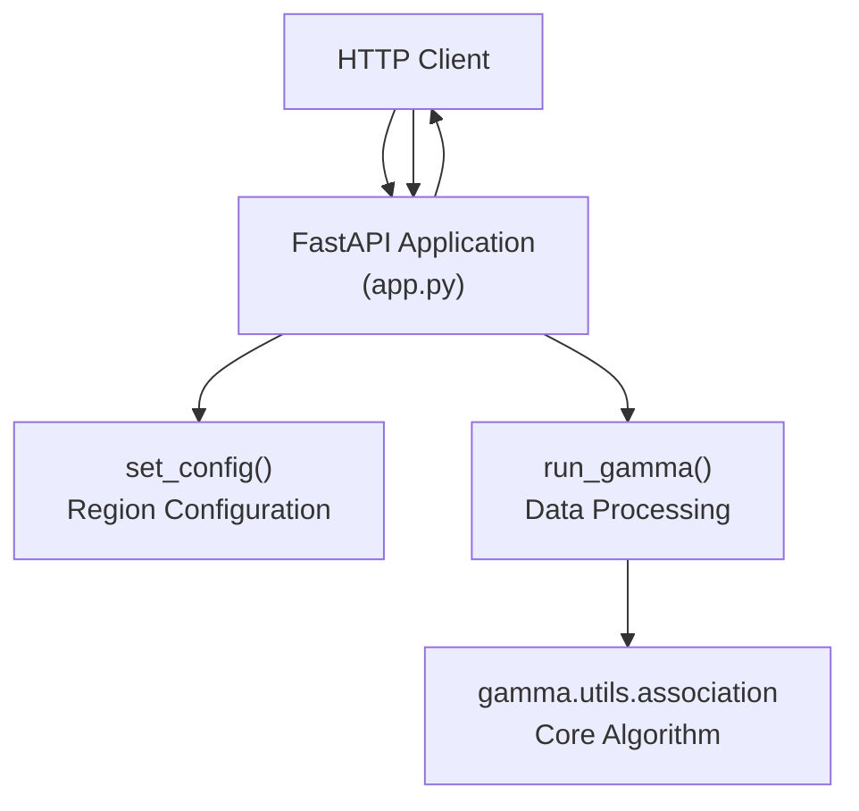
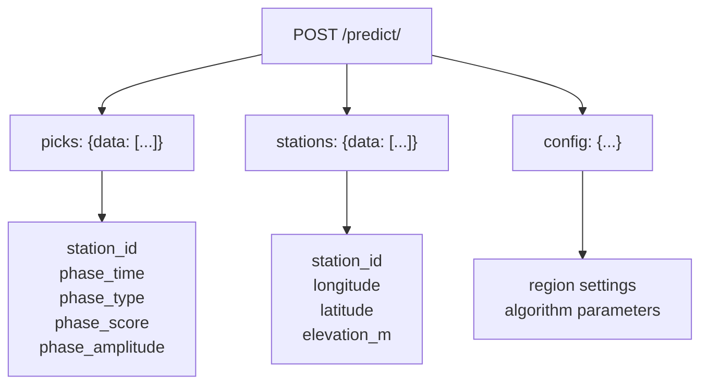
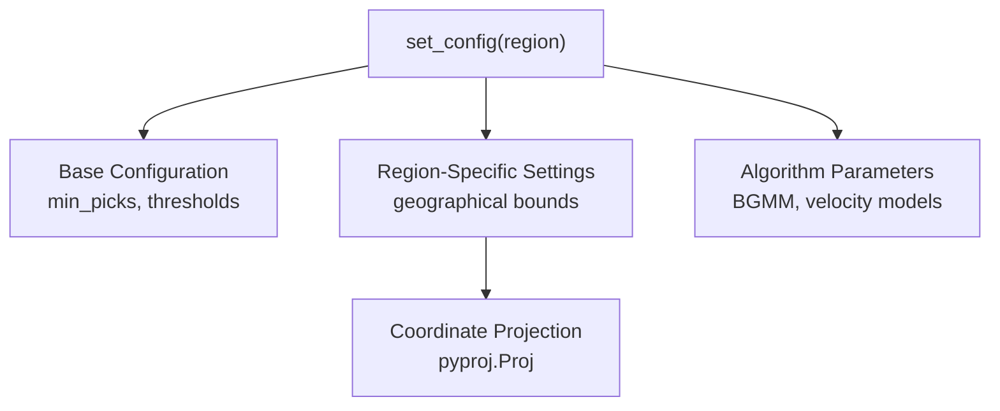
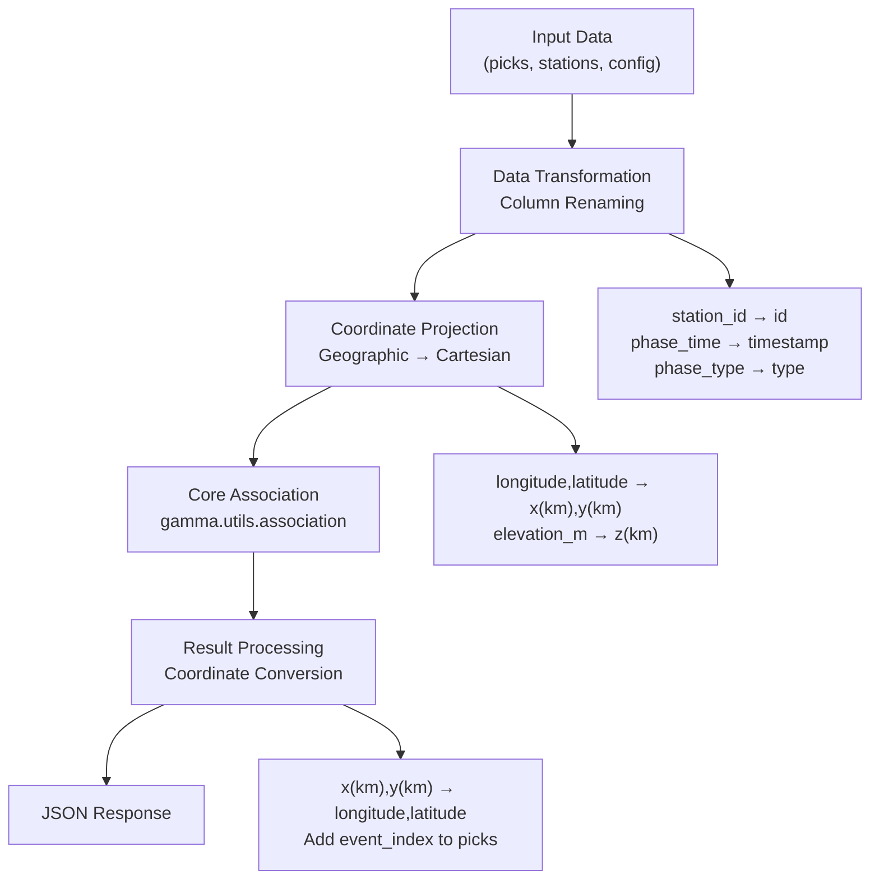
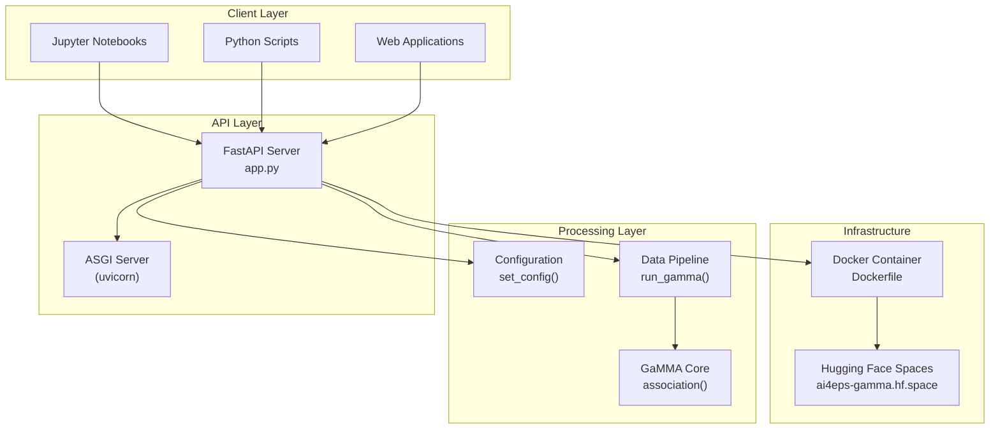

# Web API

> **Relevant source files**
> * [app.py](https://github.com/AI4EPS/GaMMA/blob/edcf2cec/app.py)
> * [docs/app.py](https://github.com/AI4EPS/GaMMA/blob/edcf2cec/docs/app.py)
> * [docs/example_fastapi.ipynb](https://github.com/AI4EPS/GaMMA/blob/edcf2cec/docs/example_fastapi.ipynb)

This document describes GaMMA's FastAPI-based web service that provides HTTP endpoints for seismic event association. The web API allows remote clients to submit pick data and receive associated events through standard HTTP requests.

For information about the core association algorithms, see [Core Association Functions](/AI4EPS/GaMMA/4.1-core-association-functions). For direct Python usage without the web interface, see [Examples and Tutorials](/AI4EPS/GaMMA/5-examples-and-tutorials).

## API Overview

The FastAPI application provides a simple REST interface with two main endpoints. The service is designed to be lightweight and can be deployed as a standalone web service or integrated into larger seismological processing pipelines.



**API Endpoints**

| Endpoint | Method | Description |
| --- | --- | --- |
| `/` | GET | Health check endpoint returning `{"Hello": "GaMMA!"}` |
| `/predict/` | POST | Main prediction endpoint for seismic event association |

Sources: [app.py L6-L27](https://github.com/AI4EPS/GaMMA/blob/edcf2cec/app.py#L6-L27)

## Main Prediction Endpoint

The `/predict/` endpoint accepts seismic pick data, station metadata, and configuration parameters, then returns associated events and updated pick assignments.

### Request Format

The endpoint expects a JSON payload with three main components:



**Required Pick Data Fields:**

* `station_id`: Station identifier
* `phase_time`: Phase arrival time (ISO format string)
* `phase_type`: Phase type ("P" or "S")
* `phase_score`: Detection confidence score
* `phase_amplitude`: Phase amplitude value

**Required Station Data Fields:**

* `station_id`: Station identifier (must match picks)
* `longitude`: Station longitude in degrees
* `latitude`: Station latitude in degrees
* `elevation_m`: Station elevation in meters

Sources: [app.py L14-L27](https://github.com/AI4EPS/GaMMA/blob/edcf2cec/app.py#L14-L27)

 [app.py L119-L132](https://github.com/AI4EPS/GaMMA/blob/edcf2cec/app.py#L119-L132)

### Response Format

The endpoint returns a JSON object containing associated events and updated picks with event assignments:

```
{
  "events": [...],
  "picks": [...]
}
```

If no events are detected, the response returns `{"events": None, "picks": [...]}`.

Sources: [app.py L22-L27](https://github.com/AI4EPS/GaMMA/blob/edcf2cec/app.py#L22-L27)

## Configuration System

The API includes a comprehensive configuration system with region-specific defaults. The `set_config()` function provides pre-configured settings optimized for different seismic regions.



**Default Configuration Categories:**

| Category | Parameters | Purpose |
| --- | --- | --- |
| Pick Thresholds | `min_picks`, `min_score`, `min_p_picks`, `min_s_picks` | Quality control |
| Geographic Bounds | `minlongitude`, `maxlongitude`, `minlatitude`, `maxlatitude` | Study region |
| Algorithm Settings | `method="BGMM"`, `use_dbscan=False` | Association method |
| Velocity Model | `vel={"p": 6.0, "s": 3.43}` | Travel time calculation |

The system currently includes built-in support for the Ridgecrest region, with extensible architecture for additional regions.

Sources: [app.py L30-L106](https://github.com/AI4EPS/GaMMA/blob/edcf2cec/app.py#L30-L106)

## Data Processing Pipeline

The `run_gamma()` function implements a multi-step data transformation pipeline that prepares input data for the core association algorithm.



**Key Processing Steps:**

1. **Column Renaming**: Maps API field names to internal GaMMA conventions
2. **Coordinate Projection**: Converts geographic coordinates to Cartesian using azimuthal equidistant projection
3. **Core Association**: Calls the main `association()` function from `gamma.utils`
4. **Result Formatting**: Converts results back to API format with geographic coordinates

Sources: [app.py L112-L158](https://github.com/AI4EPS/GaMMA/blob/edcf2cec/app.py#L112-L158)

## Deployment Architecture

The FastAPI application is designed for flexible deployment scenarios, from local development to cloud-based services.



**Deployment Options:**

* **Local Development**: Direct FastAPI server using uvicorn
* **Containerized**: Docker-based deployment for consistency
* **Cloud Service**: Hugging Face Spaces for public access

The service is accessible both locally (`http://127.0.0.1:8000`) and through the public endpoint at `https://ai4eps-gamma.hf.space`.

Sources: [docs/example_fastapi.ipynb L34-L35](https://github.com/AI4EPS/GaMMA/blob/edcf2cec/docs/example_fastapi.ipynb#L34-L35)

## Usage Example

The following example demonstrates the complete workflow for using the GaMMA web API:

```javascript
import requests
import pandas as pd

# Prepare data
GAMMA_API_URL = "https://ai4eps-gamma.hf.space"
picks = pd.DataFrame(pick_data)
stations = pd.DataFrame(station_data)
config = {"region": "Ridgecrest"}

# Convert to API format
picks_dict = picks.to_dict(orient="records")
stations_dict = stations.to_dict(orient="records")

# Make API request
response = requests.post(
    f"{GAMMA_API_URL}/predict/",
    json={
        "picks": {"data": picks_dict},
        "stations": {"data": stations_dict},
        "config": config
    }
)

# Process results
if response.status_code == 200:
    result = response.json()
    events = result["events"]
    updated_picks = result["picks"]
```

The API handles all coordinate transformations, data validation, and association processing internally, returning results in a format suitable for further analysis or visualization.

Sources: [docs/example_fastapi.ipynb L1320-L1334](https://github.com/AI4EPS/GaMMA/blob/edcf2cec/docs/example_fastapi.ipynb#L1320-L1334)