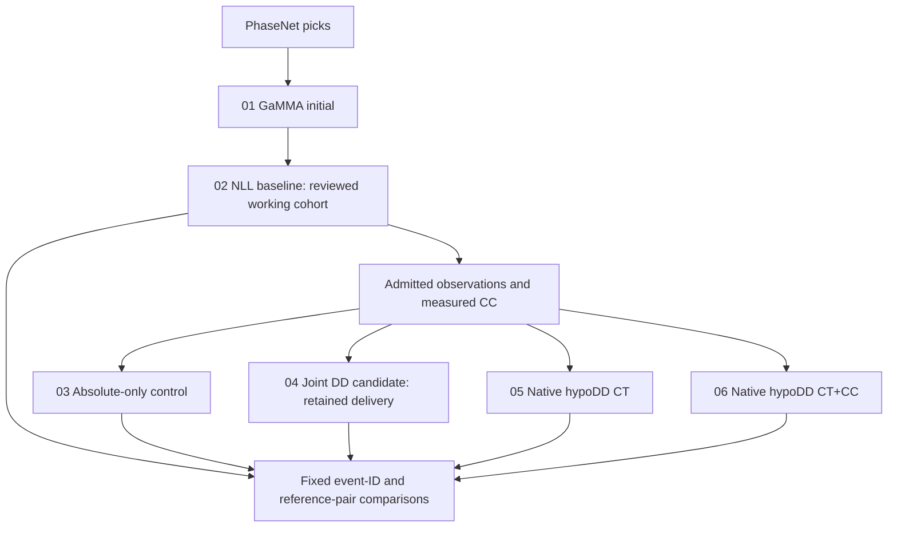

# Catalog identities and lineage

Use method names for scientific products and stage numbers only for execution history.
`ours` identifies ownership, not validated accuracy. External catalogs always use
`Reference: <name>`. There is no single unlabeled "final" CSV.
CT means differential times from picked arrivals; CC means waveform-cross-correlation
differential times; joint DD fits absolute arrivals and CC double differences together.

| Order / catalog ID | Figure label | Method and role | Authoritative source |
| --- | --- | --- | --- |
| 01 / `gamma_initial` | `GaMMA initial (ours)` | Association output and preliminary locations; not the precision-location product | [Stage 03 full events](../export/01_baseline/03_associate_gamma/full/events.csv) |
| 02 / `nll_baseline` | `NLL baseline (ours)` | Original absolute locations, enriched with review and magnitude information in stage 10. The 6,520 working events are the common starting population | [Reviewed baseline master](../export/01_baseline/10_validate_catalog/events.csv) |
| 03 / `absolute_control` | `Absolute-only control (ours)` | Stage 52 matched absolute-arrival control, with the admitted observations and joint solver but without CC constraints; not the original NLL baseline | [Branch table; select `branch=absolute_all`](../export/06_full_catalog/52_full_catalog/branch_locations.csv) |
| 04 / `joint_dd_candidate` | `Joint DD candidate (ours)` | Stage 52 absolute-arrival plus CC double-difference joint solution; retained delivery candidate, with depth/time limitations | [6,520 working events](../export/06_full_catalog/52_full_catalog/working_catalog.csv) |
| 05 / `hypodd_ct` | `hypoDD CT (ours)` | Stage 53 native hypoDD with catalog differential times; full working cohort attempted, retained subset explicitly recorded | [Native CT catalog](../export/06_full_catalog/53_native_double_difference/hypodd_ct/catalog.csv) |
| 06 / `hypodd_cc` | `hypoDD CT+CC (ours)` | Stage 53 native hypoDD with the same catalog differences plus accepted waveform CC differences; independent comparison branch | [Native CT+CC catalog](../export/06_full_catalog/53_native_double_difference/hypodd_cc/catalog.csv) |

Stage 04 and stage 10 are **not two independent location methods**: stage 10 adds
review, quality and magnitude fields to the NLL baseline. Likewise the stage 52
9,942-row master is a delivery container: 6,520 joint working solutions plus 3,422
unchanged non-working records. It must not be described as 9,942 jointly relocated events.

## Execution lineage

Branches 03–06 start from original NLL coordinates. Native CT+CC is not a serial
postprocessing of the joint candidate, nor a relocation of the CT branch.
Native CT and CT+CC have identical CT rows, initialization and historical controls
except for CC use and weights. Their historical constant-layer model and omitted
station elevations differ from the joint solver's linear model and receiver elevations.
This limits attribution of cross-method differences to the solver alone.

## Reading and joining products

- Join by `event_id`; never by row position. Native integer IDs are local adapters,
  with their mapping in stage 53 `input_events.csv`.
- Compare the same retained event IDs and unchanged reference matches. Read stage 53
  `event_membership.csv` alongside all spatial metrics; excluded events are not filled
  silently with baseline coordinates.
- Use `depth_km` under the documented +0.7 km model datum. Depth below sea level is
  `depth_km - 0.7`. Keep the nominal-reference-depth caveat.
- Keep each branch's origin time with its own coordinates. Do not combine baseline
  times and candidate locations. Native time precision is 0.01 s.
- Stage 52 magnitude estimates retain original geometry; native exported catalogs
  omit placeholder magnitudes. Native formal errors do not replace calibrated uncertainty.
- Stage 13/15 hypoDD catalogs are historical pilot/transfer subsets, not full-cohort
  products. Other historical stages are diagnostics or rejected alternatives, not
  additional numbered monitoring steps.

The stage 52 candidate remains the delivery choice unless an explicit scientific
decision changes it. Running a standard relocation program does not automatically
promote its output. See the [stage 53 comparison](../export/06_full_catalog/53_native_double_difference/README.md)
and [delivery limitations](EXPERT_DELIVERY.md).
