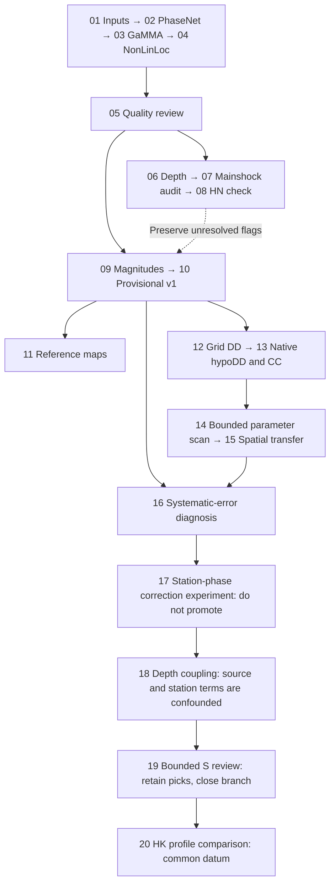
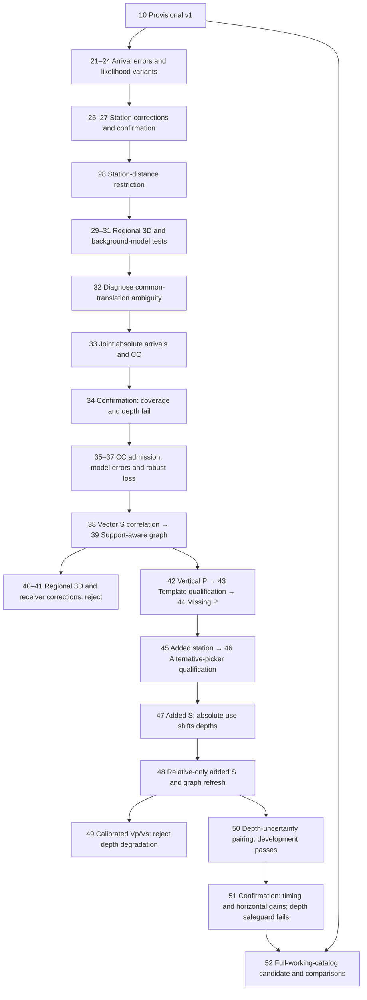

# Catalog evolution and organization

## Scientific objective and current gap

The target is a reproducible full-window catalog with defensible absolute locations, useful relative geometry, explicit uncertainties and traceable observations. More stages, lower residuals, sharper-looking faults and closer agreement with one reference are not interchangeable with greater accuracy.

Provisional v1 is the preserved baseline (9,942 candidates; 6,520 ordinary working events, including 2,052 accepted provisional magnitudes). Stage 52 is the latest full-scale joint-location candidate for the same 6,520 working IDs, retaining all 9,942 master identities. It has measured spatial gains and explicit limitations; the bounded campaign did not produce a fully validated replacement. The original linear-interpolated velocity implementation is an expert variant; it must not be described as an exact implementation of Shelly's constant-layer table.

## Completed branches

Numbers are historical stage identifiers, not catalog versions. Use the [grouped output index](../export/README.md) for current physical paths; old flat paths remain compatibility links. Companion plotting/report scripts belong to their scientific stage.

| Stage | Role and inputs | Result and disposition |
| --- | --- | --- |
| 01 Prepare inputs | Production; source waveforms and metadata | Freeze actual channel selection; preserve incomplete instruments explicitly |
| 02 PhaseNet | Production; 01 | Full three-day picks; reusable upstream observations |
| 03 GaMMA | Production; 02 | Event association and coarse locations; stable event/pick identities |
| 04 NonLinLoc | Production; 03 | Absolute locations using the existing linear model and receiver elevations |
| 05 Review | Quality and comparison; 03/04, references | Provisional quality flags and frozen reference pairs; not manual truth labels |
| 06 Depth diagnosis | Diagnostic; 04/05 | Constant-layer sensitivity has mixed results; no global replacement |
| 07 Mainshock audit | Diagnostic; 06, original model/arrival evidence | Layer semantics clarified; mainshock depth/arrival issues unresolved |
| 08 Strong-motion check | Observation experiment; 07 | No HN S pick passed admission criteria; no observation change adopted |
| 09 Magnitude | Production; ordinary-event selection and responses | Provisional ML with support flags; not a catalog-completeness estimate |
| 10 Validate/export | Product assembly and comparison; preceding baseline | Current full provisional v1, preserving all candidates and exclusions |
| 11 Catalog maps | Comparison; v1 and references | Direct spatial views; no catalog mutation |
| 12 Grid DD pilot | Relative-location experiment; v1 local cohort | 144 connected events; custom NLL-grid solver, not native hypoDD |
| 13 hypoDD + CC | Relative-location experiment; 12 and waveform windows | Native catalog-only/CC alternatives; verified CC time/sign conversion |
| 14 Parameter scan | Bounded development selection; 13 | Twelve settings completed; freeze catalog control and provisional CC candidate; scan closed |
| 15 Spatial transfer | Validation experiment; v1 new cohort and frozen 14 settings | 147 connected events; differential benefit transfers, added absolute-location benefit does not |
| 16 Systematic diagnosis | Diagnostic; v1 observations and both local cohorts | 291 events/10,419 picks; select station-phase corrections for a future absolute-location test |
| 17 Station corrections | Fixed observation-model experiment; 16 corrections and 147 transfer events | 588 native fits plus implementation checks completed; withheld timing/horizontal agreement improve, depth agreement worsens; do not promote |
| 18 Depth coupling | Fixed-grid sensitivity attribution; 17 outcomes | Explains upward movement through station-correction/depth trade-off; physical origin of large S residuals remains unresolved; no new locations |
| 19 Bounded S-arrival review | Independent waveform inspection; fixed 12 events at SRT/TOW2 | 24 windows: 19 onset-compatible, 5 ambiguous; no supported systematic ~1-s late-pick explanation; close branch and retain picks |
| 20 Controlled HK profile comparison | Fixed 147-event cohort, published HK layers, explicit common datum | Control/HK and withheld-control/HK inversions; see report for measured outcomes and decision |

The execution chain is not a requirement to rerun stages 01–16 in order. Mainshock diagnostics are a side branch. Reference maps consume catalogs without producing new locations. Stage 14 searches configurations; stage 15 tests frozen configurations; stage 16 diagnoses mechanisms.

## What the experiments establish

- CC is useful for relative timing: on the spatial-transfer common cohort, withheld CC RMS improves from 60.7 to 46.9 ms compared with catalog-only hypoDD. This does not remove the cluster's absolute offset.
- Added CC does not consistently improve absolute agreement. In the transfer cohort, the median absolute Shelly depth difference rises from 0.470 to 0.662 km. References remain independent estimates, not exact truth.
- Receiver height affects absolute travel times but largely cancels in the tested nearby-event differences. Changing layer interpretation has phase-dependent effects and is not an established universal fix.
- Station-phase residual medians correlate at 0.79 across the two cohorts. Development-only corrections reduce fixed-location, origin-centered transfer RMS from 0.390 to 0.304 s. Of 61 supported station-phase combinations, 44 improve and 17 worsen. This supports a controlled correction experiment, not automatic adoption.
- Both mainshocks remain flagged. Ordinary-event progress need not wait for their resolution. Neither the existing depth geometry diagnostic nor NLL's conditional errors fully accounts for velocity-model uncertainty.

## Stage 17 decision: retain the baseline

The [fixed correction experiment](../export/03_location_experiments/02_arrival_and_station/17_station_corrections/README.md) is complete.
All 147 events remain located in each of the four branches, with no depth-bound hits.
Zero corrections reproduce control, a uniform positive delay verifies the origin-time
sign, and all 147 control locations reproduce the archived xyz/origin exactly at
exported precision. Native residuals agree with independent grid calculations within
0.000052 s. Raw primary observations and the prior catalog remain unchanged.

| Metric | Control | Corrected |
| --- | --- | --- |
| All fitted-pick RMS, s | 0.394 | 0.295 |
| Six-instrument withheld arrival RMS, s | 0.400 | 0.297 |
| Liu median horizontal difference, km | 1.096 | 0.766 |
| Official median horizontal difference, km | 0.883 | 0.738 |
| Shelly median horizontal difference, km | 0.935 | 0.632 |
| Shelly median absolute depth difference, km | 1.337 | 2.030 |
| Shelly median signed depth difference, km | −0.251 | −1.916 |

The correction shifts 142/147 events shallower, with median signed depth change
−1.406 km. Twelve events move more than 3 km in 3D. The predeclared reference
non-degradation gate fails, even though all other gates pass. These are pragmatic
development decision gates, not universal statistical accuracy criteria.

Benefits are real within this experiment but incomplete: withheld P and S RMS both
improve, and excluding six instruments perturbs corrected locations less in median
(3D change 0.300 versus 0.512 km). Receiver-specific adverse outcomes remain: WBM P/S
and WMF S withheld RMS worsen. A smaller conditional posterior sigma and greater
station-removal stability do not establish more accurate absolute depth.

The supported P/S corrections are heterogeneous: their median S-minus-P difference
is only 0.024 s and 15/29 paired instruments have a positive difference. Thus the
upward shift should not be attributed to a single uniform S delay without further
analysis. The corrections were inferred at imperfect development locations and may
absorb source-depth or velocity/path error as well as receiver/picking effects.
This is a hypothesis supported by the trade-off, not an identified physical cause.
Reference depths also carry uncertainty and some frozen horizontal/time matches have
large depth discrepancies; the experiment does not establish Shelly as exact truth.

**Stop this branch before fresh-cohort expansion or full-catalog application.** Preserve
both solutions, the failed gate and all adverse cases. The next bounded scientific
question is how depth sensitivity and velocity/path assumptions couple to the fixed
correction field; do not rescale corrections, alter associations, or shift catalogs
to match a reference. A new physical intervention requires its own design before
running, and v1 remains the only full-catalog product.

## Stage 18: explain the upward shift before another intervention

The [depth-coupling diagnosis](../export/02_diagnostics/18_depth_coupling/README.md) uses the existing
control coordinates and grids, with no inversion, parameter scan or reference fitting.
After eliminating horizontal and origin-time sensitivity, project the frozen
correction vector onto the remaining depth sensitivity. Its predicted median shift
is −1.243 km versus the actual −1.406 km; it predicts 140/147 shallow shifts versus
142/147 observed, with eventwise correlation 0.834 and median absolute difference
0.190 km. This explains the immediate numerical mechanism, not the true earth model.

In the fixed correction gauge, S terms contribute −1.263 km and P terms −0.056 km
to the mean predicted shift. SRT S (+0.929 s) and TOW2 S (+1.115 s) contribute cohort
means −0.478 and −0.366 km respectively. Their S-minus-P corrections are +0.679 and
+0.763 s. These labels identify influential observations, not faulty stations.
Contributions from individual terms depend on the chosen common-time gauge; the
summed depth effect does not. All signed contributions are retained in the report.

A single counterfactual deepens every development hypocenter by 1 km while retaining
xy, origin and observed picks. Re-estimated residual medians then predict an additional
+0.266-km median transfer depth response, deeper for all 147 events. Thus event-median
centering does not make station terms independent of assumed source depths. This
is an estimator-sensitivity demonstration, not a correction derived from known true
depths, nor evidence that source-depth error explains the entire upward shift.

At the same control coordinates, changing the Jacobian to the original constant-layer
representation still predicts a −1.519-km median response to the same corrections.
Its own previously estimated corrections predict −2.000 km locally. The velocity
representation changes sensitivity but does not eliminate this correction/depth
coupling in these calculations. This is not a full alternate-model relocation and
does not exclude other velocity errors: both representations retain the same
underlying velocity information. True structural delay and picking/association error
remain confounded with source-location error.

Keep v1 and the stage-17 non-promotion decision. The next bounded observation question
is whether the large SRT/TOW2 S residuals represent physical path delays or arrival
identification errors. Independent waveform/onset evidence is needed before changing
station terms, observations or velocity structure. Do not delete these stations or
rescale their corrections on the basis of this attribution alone.

## Stage 19: close the bounded arrival-review branch

The [12-event review](../export/02_diagnostics/19_s_arrival_review/README.md) is complete. Freeze six
events per cohort, with two each selected for large, typical and relatively small
mean centered S residuals at SRT/TOW2. Require both P and S at both stations before
selection; no waveform-based sample replacement or extension was performed.
All 24 three-component windows were inspected in detrended counts and one fixed
1–12 Hz display band, with wide/detail views and neighboring-pick context.

Nineteen windows are compatible with an S-like horizontal onset close to the pick;
five remain ambiguous. Seven of eight large-residual windows are compatible and
one ambiguous. No inspected window establishes a repeatable approximately one-second
late S pick. Earlier Z energy or P coda cannot be relabeled S solely to remove a
travel-time residual. This is assistant visual assessment, not human ground truth,
a new arrival table, or an estimate of catalog-wide picking accuracy.

**Close the review; retain picks and uncertainty flags.** Do not repick globally,
remove SRT/TOW2, expand the sample, or reinstate the rejected station corrections.
The next physical intervention should address velocity/path and source-depth
constraints with observations held fixed. The review does not prove a particular
velocity model wrong or uniquely distinguish path error from source-location error.
A new intervention needs one bounded design; no further residual decomposition or
picker/filter sweep is justified by the present evidence. Provisional v1 is unchanged.

## Stage 20: controlled HK profile comparison

The [experiment](../export/02_diagnostics/20_velocity_model_qualification/README.md) tests the published constant-layer HK profile against the archived linear Shelly-derived baseline. Initial qualification is preserved as `INPUT_MODEL_NOTES.md`; qualification alone is not an optimization step.

Both profiles explicitly adopt the current +0.7-km ASL plane. This assumption enables a controlled profile comparison but does not establish the original HK geographic registration or remove reference-depth uncertainty. There is no fitted datum offset. All 147 event identities and 5,413 picks, receiver elevations, errors and search settings are fixed. Four branches (control/HK, all observations/six instruments withheld) produce 588 fits, with 923 held-out predictions per auxiliary branch. No station corrections, repicking or parameter scan.

The decision depends on predeclared retention, depth-bound, posterior-depth, withheld-prediction and reference-discrepancy gates. Implementation checks require baseline reproduction, correct grid velocities and independent timing-equation agreement. The examined cohort is not blind validation; even a pass permits only a fresh-cohort check, not replacement of the full catalog.

HK improves withheld-arrival RMS from 0.4003 to 0.3558 s (11.1%), with both P and S improving. Median horizontal discrepancies decrease from 1.096 to 0.885 km (Liu), 0.883 to 0.791 km (Official), and 0.935 to 0.756 km (Shelly). However, the paired median depth shift is +1.914 km; Shelly median absolute-depth discrepancy increases from 1.337 to 1.737 km (29.9%). The p90 conditional depth sigma increases from 1.618 to 1.801 km (11.3%), exceeding the fixed 10% gate. All 588 fits are LOCATED with no near-bound solutions. Decision: do not promote; retain the full v1 and close this one-model experiment without retuning.

## Route back to a high-precision full catalog

Steps 1–2 below have now been completed by stage 17. The decision is not to retain
this correction for full use; steps 3–6 are conditional future work, not the active
next run. Stage 20 also fails promotion: neither correction-only nor the tested HK profile provides balanced depth and prediction improvement. Do not continue scanning these branches.

1. **One intervention:** test fixed development-estimated station-phase corrections in absolute NonLinLoc location. Keep the current velocity representation, receiver elevations, pick times, associations, errors and search settings fixed. Unsupported station-phases remain unchanged. Do not estimate corrections from reference coordinates or tune their strength on transfer results.
2. **Decide whether to retain it:** compare corrected and uncorrected solutions on identical event identities; retain rejected/unlocated events in the accounting. Examine held-out residual structure, depth-bound hits, geometry, solution stability, reference differences and adverse station-specific effects together. A residual reduction alone is insufficient. Predeclare quantitative acceptance rules before running the new location experiment; stage 17 froze and applied these rules in its design.json before native runs.
3. **If useful, check generalization:** use a fresh ordinary-event cohort spanning different locations, depths and time periods. The existing transfer cohort has already been examined and is development validation. A failed test ends this branch with an explicit result; do not reopen a broad weight scan.
4. **Build a full candidate only after validation:** apply the accepted absolute-location change across the eligible full-window event set. Preserve stable event IDs, attrition and uncertainty flags. Reassess distance-dependent magnitudes if locations change materially. Keep v1 intact.
5. **Add relative refinement separately:** use the frozen hypoDD/CC methods where pair connectivity and waveform support permit. Preserve both absolute and relative products and each connected component's datum/anchor. Isolated events stay in the absolute catalog; a visually compact cluster is not sufficient reason to promote the relative solution.
6. **Release v2:** publish a full event table, phase table, method/usage flags, comparable validation and a short limitations report. Version increments signify an adopted full product, not another script or experimental subset.

If station corrections fail to improve location stability/generalization, use the residual evidence to choose either a velocity-structure investigation or an observation/association investigation. Do not start both as unrestricted parallel campaigns.

## Current directory design

Code remains organized by scientific responsibility in `00_config/`, `01_pipeline/`, `02_diagnostics/`, `03_experiments/` and `04_comparison/`. Keep case-specific implementation here. `docs/` and `export/` remain unnumbered.

Outputs use the [six ordered groups and complete stage index](../export/README.md). Stage IDs remain inside those groups for traceability. Baseline, diagnostic, experimental, confirmation and full-catalog outputs have distinct places; a new output folder does not imply an adopted catalog version. The current candidate is stage 52 and the preserved baseline is stage 10. No speculative v2 folder or duplicate product tree is created.

Historical scripts and frozen manifests keep their original paths through compatibility symlinks. New work should use grouped paths directly. Keep related plots and run variants inside the producing experiment rather than adding another global stage. Do not rename stages to make chronology look sequential or delete failed experiments that still provide shared observations and grids.

## Migration status and reproducibility

The 19 existing Python entry points and five YAML files have moved into the numbered groups. The production, diagnostic, comparison and experiment code now resolves the same expert root. Cross-group imports point to their new files. Configuration paths remain relative to the expert root; parameter values are unchanged. The integrated stage-10 validation/export code stays in the pipeline. No locator, picker, numerical method or scientific selection was changed.

Existing `docs/` and `export/` paths are preserved. Output reports and native controls still describe historical runs and have not been rewritten. Current commands and the complete old-to-new map are in RUNBOOK. A small pre-migration source/config/document snapshot is retained at `export/_provenance/pre_layout_migration.zip` because these files had not yet been committed; it preserves the original bytes needed to interpret archived code hashes. It is not another result or waveform copy.

Moving code changes its hash. Resume guards that require the exact historical script should continue to reject mismatched code; do not bypass them or rewrite archived hashes. For a new scientific run, configure a separate output destination with an explicit run identity before execution. This migration does not add a general alternate-output option to legacy scripts that lack one. Reproducing a historical run requires restoring the matching source version and its original layout in an isolated checkout.

Migration validation checks syntax/imports, cross-group dependencies, configuration equivalence, command help where supported, and stable output paths without running downloads, picking or inversion. New experiments use the new layout; closed scans remain available but are not required production steps.

Do not delete previous results as part of this organizational change. Later cleanup should distinguish reproducible scratch files from sole copies of catalogs, observations, native controls and scientific evidence.

## Stage 21 / optimization round 01: effective observation errors

The new [bounded campaign](OPTIMIZATION.md) permits up to 30 executed optimization rounds. Round 01 calibrates effective station/phase uncertainty from development events without changing arrivals or the velocity model. It reduces withheld RMS by 7.3% and horizontal reference medians by 13–26%, but shifts depths shallower by a paired median 0.781 km and increases the Shelly absolute-depth discrepancy by 18%. The reference gate fails. Keep the evidence and original v1; test the likelihood method next rather than retuning this estimator. [Results and figures](../export/03_location_experiments/02_arrival_and_station/21_observation_errors/README.md).

## Stage 22 / optimization round 02: EDT likelihood

EDT improves median horizontal reference discrepancies by 22.1% (Liu), 12.8% (Official), and 24.1% (Shelly). Shelly median absolute-depth discrepancy improves from 1.3375 to 1.1208 km (16.2%), with paired median depth change -0.195 km. However, withheld RMS changes from 0.4003 to 0.4037 s (+0.85%); P improves slightly and S worsens. Conditional depth-sigma P90 increases from 1.618 to 2.452 km. It fails the predeclared withheld-improvement and posterior-width gates, so do not promote to the full catalog. All 294 native fits completed; two retained phase rows (one event in both branches) have rounded-zero consistency weights.

Unlike the earlier model and weighting trials, this candidate improves both horizontal and depth reference medians. Keep it as a promising candidate, not an adopted catalog. Posterior width is conditional on likelihood and cannot by itself show worse true accuracy. The next bounded round should separate spatial solution from origin estimation and assess stability with a common observational perturbation protocol, without retuning EDT on these outcomes or accessing the reserved sample. Preserve the failed gates rather than retrospectively declaring a pass.

See [the complete experiment](../export/03_location_experiments/02_arrival_and_station/22_edt_likelihood/README.md).

## Stage 23 / optimization round 03: EDT origins and common omission stability

A fit-only analytic origin at fixed EDT xyz reduces held-out RMS from 0.4037 to 0.3955 s, versus baseline 0.4003 s. This is only 1.2% below baseline and misses the frozen 5% improvement requirement. Under the same six-instrument omission, EDT horizontal displacement median is 0.391 km versus 0.342 km, and depth-displacement P90 is 1.016 versus 0.859 km. Thus larger EDT posterior width is accompanied by increased instability under this particular comparable perturbation; this is not a general uncertainty calibration. Keep the candidate and previous reference improvements, but do not promote. Test one native common-origin-constrained EDT likelihood next, rather than continuing origin-only shifts. [Report](../export/03_location_experiments/02_arrival_and_station/23_edt_origins/README.md).

## Stage 24 / optimization round 04: EDT common-origin constraint

The native common-origin penalty does not resolve the EDT tradeoff. It preserves most horizontal/depth reference improvements but worsens withheld prediction and omission stability relative to plain EDT. Posterior width decreases without a corresponding improvement in the directly comparable perturbation result. Do not promote either this variant or its broader full-catalog application; close the EDT-variant search without tuning the source penalty.

| Metric | Baseline | EDT | EDT_OT_WT_ML |
|---|---:|---:|---:|
| Withheld RMS (s) | 0.40029 | 0.40370 | 0.40615 |
| Depth posterior sigma P90 (km) | 1.61827 | 2.45178 | 2.28027 |
| Omission horizontal P90 (km) | 0.83344 | 0.93507 | 0.95906 |
| Omission depth P90 (km) | 0.85937 | 1.01562 | 1.04687 |

[Experiment report](../export/03_location_experiments/02_arrival_and_station/24_edt_origin_constraint/README.md). The next bounded direction is development-only geometrically constrained station corrections; do not continue the EDT penalty search.

## Stage 25 / round 05: constrained station corrections

The constrained correction improves held-out RMS by 26.0% and all three horizontal reference medians by 17.9–31.6%. Median omission horizontal and depth displacements both fall by 50%. However, the paired transfer depth shift remains -1.172 km, and Shelly median absolute-depth discrepancy rises from 1.3375 to 1.7772 km (+32.9%). Relative to the unconstrained stage-17 correction, the depth discrepancy is smaller (2.0298 to 1.7772 km), but the non-degradation gate still fails. The mean development constraint is satisfied numerically; it does not enforce the same response for spatially distinct transfer geometries. Do not promote or retune projection weights on this cohort.

The next bounded intervention will apply only the original development P-phase corrections, retaining S picks with zero correction. Stage 18 already attributes most correction-induced depth displacement to S terms, while the bounded S waveform review did not establish a systematic picking error. This tests whether P path corrections can retain useful location gains without applying the poorly separated S/depth component. It does not assert that all P corrections are physical or that S arrivals are wrong. Keep all original observations and the same model; no reference fitting, correction scaling, or station removal.

[Results](../export/03_location_experiments/02_arrival_and_station/25_constrained_corrections/README.md).

## Stage 26 / round 06: P-only corrections qualify for reserved confirmation

With all S picks retained at zero correction, the original 32 P correction cells produce balanced gains: held-out RMS -5.14%, horizontal reference medians -8.4–10.6%, Shelly absolute-depth median -10.6%, median depth shift -0.078 km, and smaller matched station-omission displacements. All current transfer gates pass, narrowly for held-out RMS. Freeze this candidate and use the 300 reserved events next; do not call it an adopted full catalog. [Report](../export/03_location_experiments/02_arrival_and_station/26_p_corrections/README.md).

## Stage 27 / round 07: reserved confirmation fails

Reserved confirmation fails. Held-out RMS changes from 0.50796 to 0.50572 s (0.44% improvement, below the required 5%). Primary near-boundary events increase from 0/300 to 13/300. Horizontal reference medians improve by 7.3–15.0%, but Shelly absolute-depth median changes from 1.67931 to 1.74269 km (+3.8%). All 300 primary events and 267 valid auxiliary pairs remain represented. Do not promote the coefficients to the full catalog or adjust them using this reserved sample.

This rejects a catalog-wide gain claim; it does not erase the positive examined-cohort results. The 300 events have now been used for confirmation and must not be advertised as untouched in later evaluation. Preserve v1. Close the current global station-correction family instead of repeatedly tuning against confirmation failures.

A conspicuous inherited reference-depth outlier is retained: Shelly reference 70583816, paired to gamma_0004911, has recorded depth 119.49 km. It stretches the depth CDF; its provenance/physical validity is unresolved. It has not been silently excluded, rematched or used to tune coefficients. The published reference medians and predeclared gates remain unchanged; the independent near-boundary and held-out failures already reject promotion.

[Confirmation report](../export/03_location_experiments/02_arrival_and_station/27_reserved_p_corrections/README.md).

## Stage 28 / round 08: fixed near-station selection rejected

This selection is not promoted. It removes 895/5,413 input picks and leaves 146 primary and 144 auxiliary fits, versus 147 in each baseline branch. On 144 identical auxiliary events, all 911 fixed held-out arrivals are scored: RMS increases from 0.40110 to 0.44678 s (+11.4%), with both P and S worsening. Reference horizontal/depth medians show some improvements, but these do not compensate for prediction and coverage losses. Depth omission-displacement median/P90 increase by 37.5%/27.3%. Close this fixed-radius trial; do not scan radii on these outcomes.

The named omitted instruments are the same, but the effective perturbation is not identical: only 864/911 of those arrivals belong to the near-station primary fit; the others were already outside the radius. Interpret omission stability with this qualification, not as a calibrated uncertainty comparison. The retained scoring set still includes every fixed held-out arrival on the common eligible events.

[Results](../export/03_location_experiments/02_arrival_and_station/28_near_stations/README.md). The next physical direction is an independently documented regional 3-D model; qualification alone must not be counted as optimization.

## Stage 29 / round 09: regional 3D gains horizontally but fails the depth gate

All 588 native fits complete, with all original observations retained and independent residual errors below 0.00006 s. The 0.25 km grid passes the fixed numerical gate; coarser failed pilots remain archived. Against the original fine 2D baseline, held-out RMS drops from 0.40029 to 0.34616 s (-13.5%). Horizontal reference medians improve from 1.09578 to 0.47821 km (Liu), 0.88262 to 0.56113 km (Official), and 0.93524 to 0.47792 km (Shelly). Matched station-omission stability and conditional depth width also improve.

However, Shelly median absolute depth discrepancy increases from 1.33747 to 2.24104 km (+67.6%). Median paired depth change relative to the matched 3D background is +2.46094 km. Both control comparisons fail the reference non-degradation gate; all other gates pass. Retain the model as a promising horizontal candidate, but do not promote it or use the new confirmation reserve yet. These 147 connected transfer events are not the full catalog; gains here do not establish case-wide performance.

A bounded first-order Vs=Vp/1.73 check at all regional solutions predicts only -0.14764 km median depth change, with P10/P90 -0.41979/+0.14345 km. It is not a new relocation result and does not establish that fixing the ratio would solve the depth problem. Receiver/model sampling also shows that Vp/Vs differs in opposite directions near stations (median 1.68962) and at matched-baseline source positions (1.75264), relative to the local 1.73 background. Avoid a single-ratio causal claim.

Next test the mean velocity-depth background while retaining regional lateral variations. Fix the averaging and normalization using the case domain and documented local profile, without reference fitting or parameter scans. [Results and figures](../export/03_location_experiments/03_velocity_models/29_3d_velocity/transfer/README.md).

## Stage 30 / round 10: local-background transplantation rejected

All 294 candidate fits and 294 reused matched-background controls pass execution/identity checks. Against the original fine 2D baseline, held-out RMS worsens 0.40029→0.43901 s (+9.7%); the S component worsens 0.41437→0.47226 s. Shelly median absolute depth discrepancy increases 1.33747→3.33769 km (+149.6%). Horizontal medians still improve 22.8–40.2%, but posterior depth width and station-omission stability also fail. The paired median depth change relative to the matched 3D control is -2.30468 km. No promotion or confirmation run.

Together with round09, this establishes a background/depth sensitivity, not a correct depth profile. Stop manual background transplantation. Next constrain any background selection using development-only withheld near-station P-S observations, with candidates/eligibility/selection fixed beforehand and no reference-depth fitting. The second reserve stays unopened. Before new large grids, verify exact travel-time cropping to the native search volume for storage and CPU efficiency; this must preserve computed times and native locations and does not count as an optimization round.

[Results and figures](../export/03_location_experiments/03_velocity_models/30_local_background/transfer/README.md).

## Stage 31 / round 11: development-only model selection rejected

Exact cropping of computed travel-time buffers reduces the pilot storage by about 83.5%, preserves every retained value bitwise and reproduces two fixed native locations/origins exactly. It changes neither the physical propagation volume nor the location method and is not a separate optimization round.

The next physical comparison is frozen before scores: two existing velocity endpoints plus one fixed 50/50 velocity midpoint, with original 1D as a scoring control. Withhold each development event's nearest paired instrument; 138 of 144 events meet predeclared input requirements, with the remaining six explicitly retained and not replaced. Choose the midpoint only on independent held-out S-P prediction, never on reference depths. No further alpha scan follows failure. Transfer gates and the unused second reserve still apply. [Design and status](../export/03_location_experiments/03_velocity_models/31_background_calibration/README.md).

All 552 fits are complete on the same 138 eligible events. Held-out S-P RMS is 0.29325 s (original), 0.31691 s (local background), 0.28140 s (raw regional), and 0.30971 s (midpoint). The midpoint fails both fixed selection conditions. Close background mixing without further weights; preserve the six eligibility exclusions and all outputs. The raw regional near-station improvement does not override its earlier depth gate. The second reserve remains unused and v1 remains the only full catalog. Revisit fixed relative-location validation and anchor dependence before proposing another intervention.

## Stage 32: relative-location anchor diagnostic

Fourteen native runs preserve the fixed stage15 observations, model and controls. Both unperturbed runs exactly reproduce archived coordinates. Six ±1 km common input translations per method leave 0.95–0.98 km of horizontal shift and 0.60–0.93 km of depth shift in the final cluster. CC does not remove the common-position dependence. Centered deformation and catalog-only retention changes are retained in the report.

This rules out interpreting the earlier differential-time gains as independent absolute anchoring. Next test absolute-arrival plus CC differential-time constraints in one consistent travel-time model, with fixed observation holdouts and matched controls. No coordinate blending, new velocity-weight scan or reference fitting. This is a diagnostic, not an optimization round; 11 rounds remain completed, v1 unchanged, reserve v2 unused. [Evidence](../export/03_location_experiments/04_joint_location/32_relative_anchor_check/README.md).

## Stage33 / round12: joint absolute and waveform-differential location passes pilot gates

Executed 16 sparse least-squares solves on the fixed 147-event transfer cohort: absolute-only/joint primary and withheld controls plus six common-start translations per withheld method. Native radial-grid predictions and sparse derivatives are independently checked. Both terms use the original elevated linear model. No reference coordinate is fitted; CC error is fixed at 50 ms, with unmodeled edge/shared-waveform correlations disclosed.

Withheld CC RMS improves 0.11719→0.04628 s (60.5%); absolute-arrival RMS improves 0.40064→0.39650 s. Horizontal reference medians and Shelly depth discrepancy improve against both matched control and original NLL. Near-boundary count remains zero. Joint-start perturbations give at most 0.00975 km mean and 0.01447 km P90 location differences. The fixed gates pass. Freeze this candidate for broader validation; do not call the local pilot a full catalog or confirmed accuracy gain. [Results](../export/03_location_experiments/04_joint_location/33_joint_location/README.md).

## Stage34 / round13: broader confirmation inputs frozen

Retain the 300 frozen reserve_v2 events, including all disconnected and auxiliary-ineligible cases. Add 1,970 geometry-selected support events, excluding prior development/transfer/consumed-reserve events. Freeze 31,776 candidate differential observations before new waveform outcomes. CC extraction is running with unchanged acceptance/window settings; one unsupported case-boundary edge is explicitly retained as rejected, without changing pairs or primary picks. No location/reference confirmation result or full adoption exists yet.

Stage34 update: 3,036 accepted CC edges were measured; the auxiliary training graph supports only 181/300 reserved targets, failing the frozen 210-event coverage requirement. No criterion is relaxed. Original NLL omission controls all complete. Joint/absolute location runs have started; no location/reference score exists yet. The confirmation set is now exposed to coverage assessment.

Stage34 attribution: 19 reserve targets have no nearby event, 42 no eligible training pick pair, 48 no accepted training CC despite candidate pairs, and 10 insufficient remaining observations. A geometry-preserving prefilter accounting check restores candidate support for 23 of the 42 pair-deficient events when only the old absolute-residual cutoff is omitted. This is evidence of model-dependent selection, not evidence of accepted CC or better locations. Keep current confirmation fixed; investigate this observation-selection mechanism only as a separate future experiment. The native/primary comparisons are complete and multi-start joint omission solves are still running.

## Stage34 / round13 completed: not promoted

Held-out CC RMS improves 0.13884→0.07169 s and absolute RMS 0.43804→0.43269 s (original NLL 0.44040 s). Reference medians and initialization stability pass. Two frozen gates fail: training CC coverage 181/300 versus required 210, and near-depth-boundary count 0→7 versus allowed increase 3. Do not promote. All 300 primary targets and 290 eligible auxiliary targets remain explicit; support events are excluded from accuracy scores.

Of the seven near-boundary cases, only gamma_0007386 reaches approximately zero depth, versus 2.502 km in the matched absolute-only solution, with just one CC edge at one station. Six others lie between 0.249 and 0.487 km. The next intervention must address differential constraints with weak event/station support and model uncertainty; merely restoring residual-prefiltered candidates is insufficient evidence. [Confirmation results](../export/03_location_experiments/04_joint_location/34_joint_confirmation/RESULTS.md).

## Stage35 / round14: additional waveform-tested observations

Remove only the model-dependent absolute residual prefilter for CC candidates. The 2,270-event geometry and all absolute picks stay identical; 40,256 candidate edges are measured with unchanged waveform checks. The former reserve is now exposed development data. Two padded-window exclusions are explicit. Stage34 absolute-only results may be reused only after exact input identity and old-edge CC reproducibility checks; joint solutions are recomputed. No result or fresh confirmation claim exists yet.

## Stage35 / round14 completed: no promotion

The sole observation-selection change produces 3,396 accepted CC edges. On the identical old 526 withheld edges, RMS improves 0.071693→0.064152 s; on all 575 expanded held edges it improves 0.078260→0.069497 s relative to the previous joint solution. Eight new joint solves and eight verified absolute controls complete. This is a real common-observation prediction gain, not a scoring-set artifact.

Coverage still fails (190/300 versus required 210), and near-depth-boundary events increase from stage34's seven to nine. No adoption; the exposed set is development data. More reliable edges do not by themselves repair the absolute-depth sensitivity. Preserve both results and examine physical model/differential-model uncertainty rather than scanning CC cutoffs. [Results](../export/03_location_experiments/04_joint_location/35_cc_observation_selection/RESULTS.md).

## Stage36 / round15 completed: model-sensitivity errors not sufficient

Eight new joint solutions plus verified controls complete. Held CC RMS changes 0.069497→0.069957 s; near-depth-boundary targets decrease nine→eight but still fail the allowed increase. gamma_0007386 remains near zero (0.03239 km). Training CC coverage is unchanged at 190/300. No promotion. The alternative-model contrast is a working error envelope, not a calibrated uncertainty; do not tune its multiplier to force a favorable depth. [Results](../export/03_location_experiments/04_joint_location/36_differential_model_error/RESULTS.md).

## Stage37 / round16 completed: CC Huber loss not sufficient

All eight new joint solves plus controls complete. Held CC RMS is 0.068746 s versus quadratic 0.069497 s, but coverage remains 190/300 and near-depth-boundary count remains nine. The weak single-edge target stays at essentially zero depth. No promotion; no threshold scan. Huber residual robustness does not supply missing independent geometric information. A potential next observation intervention is joint two-horizontal-component S correlation, motivated by 1,427 training S candidates with only one individually accepted component. [Results](../export/03_location_experiments/04_joint_location/37_robust_cc/RESULTS.md).

## Stage38 / round17 completed: joint-horizontal S adds useful observations but fails promotion

Accepted S edges increase 978→1,601; P rows remain identical. On all old held CC measurements, RMS improves 0.068746→0.066901 s and the additional old-set non-degradation gate passes. Coverage is still 194/300 and near-depth-boundary count is eight, so no promotion. The weak target remains near zero despite one additional independent-station S edge. Do not scan waveform thresholds; examine whether nearest-event pairing is withholding useful multi-station constraints. [Results](../export/03_location_experiments/04_joint_location/38_vector_s/RESULTS.md).

## Stage39 / round18 completed: support-aware pairs help but do not qualify

The fixed graph augmentation adds 611 support events; all 40,256 old candidate measurements retain their acceptance decisions and accepted differential times within 1.46e-11 s. Accepted P/S pairs become 5,161/2,646. Sixteen matched absolute/joint solves complete with verified sparse derivatives and fixed target identities.

Training CC coverage improves 194→206/300, common-old held CC RMS 0.066901→0.062501 s, and near-depth-boundary targets 8→6. The enlarged held set gives 0.148634→0.069485 s against matched absolute-only controls; held absolute RMS improves 0.438062→0.429886 s. Reference and initialization gates pass, but coverage and boundary still fail. No promotion. Old P prediction improves while old S prediction worsens slightly; do not claim uniform gain.

The weak shallow target gains six accepted pairs across five neighbors but still only two stations and remains near zero depth. Close this graph-ranking trial rather than scan pair counts or radius. Future physical/observational work must address independent station/phase geometry and absolute-depth/model sensitivity. Both confirmation reserves are consumed; v1 remains the only full product. [Results](../export/03_location_experiments/04_joint_location/39_support_aware_pairs/README.md).

## Stage40 / round19 completed: 3D joint model improves horizontal results but shifts the depth bias

Twenty solves use unchanged stage39 observations: 16 regional-model solves and four matched-background 3D controls. All 148 fields and interpolation/derivative checks pass. Old held CC RMS improves 0.062501→0.058004 s; fixed enlarged held CC RMS 0.069485→0.068726 s; held absolute RMS 0.429886→0.381343 s. Horizontal reference medians improve, and near-boundary count falls from six to zero.

Depths shift by paired median +2.505 km. Shelly absolute-depth discrepancy worsens 1.848→2.083 km, with signed median switching from -1.573 to +2.033 km. The matched-background 3D control has only +0.171 km depth shift and 1.656 km Shelly depth discrepancy: grid representation cannot account for the regional shift. Coverage remains 206/300. No promotion; v1 is unchanged.

This is evidence of absolute-depth/model dependence persisting after consistent CC inversion, not permission to blend opposite biases or retune the gates. Further work needs independent physical/observational constraints. [Results and physical comparison](../export/03_location_experiments/03_velocity_models/40_joint_3d_model/README.md).

## Stage41 / round20 completed: disjoint P statics improve prediction but worsen depth

Fit 27 P station terms using 147 archived regional-model events excluded from every current target/support. Calibrations have zero count-weighted P mean; S stays zero. Split correction correlation is 0.973 and cross-applied centered calibration RMS improves 0.282→0.241 s. Correction signs, exact static cancellation in CC, grid identities and sparse derivatives pass checks.

Sixteen corrected solves complete. Held absolute RMS improves 0.381343→0.367297 s, with both P and S improvements. All 1,408 held CC RMS improves 0.068726→0.067624 s, while old 575 CC RMS worsens slightly 0.058004→0.058508 s. Targets deepen by median 0.204 km and Shelly depth discrepancy worsens 2.083→2.315 km. Coverage/reference-depth gates fail; no promotion. Close correction-strength trials.

The existing stage01 inventory explicitly deferred CI.WNM..EH, CI.WRV2..EH and CI.WVP2..EH because they have only vertical recordings. These offer an observational next step, provided P-only picking and association can be independently qualified. They are not missing horizontal waveforms to fabricate, and no new picks have yet been added. [Results](../export/03_location_experiments/03_velocity_models/41_regional_p_statics/README.md).

## Stage42 / round21 completed: added vertical P helps timing, not the full decision

Add 3,866 real vertical P picks and 429 P CC edges at WNM/WRV2/WVP2 to the fixed stage39 original-model baseline; all old data and target identities remain. Sixteen matched solves and numerical checks complete. Held absolute RMS improves 0.429886→0.425338 s; identical 1,408-CC RMS improves 0.069485→0.066867 s; historical 575-CC RMS improves 0.062501→0.062112 s.

Only 134/300 targets gain new P observations. Training CC coverage reaches 207/300, while near-boundary targets increase 6→7. Nominal reference differences worsen slightly; no promotion. Keep both failed gates and the original full product. Do not scan single-component thresholds. A future qualified waveform-template transfer trial could address missing picks at otherwise recorded instruments. [Results and comparison figure](../export/04_observation_experiments/42_vertical_p_observations/README.md).

A third 300-event confirmation reserve was frozen before these location results, excluding all prior target/support/calibration/review events. It remains unused and contains no pre-M6.4 events; it cannot independently confirm that early period. Details and round counts are in OPTIMIZATION.md.

## Stage43 / round22 completed: pure template transfer is not admitted

The waveform method searches a fixed complete P template around a model-differential center without using the hidden query pick. On 561 calibration pairs disjoint from all current targets/supports and reserve3, 75 pass waveform checks. Median timing difference is 0.01994 s, but P90 is 0.49249 s and 14 accepted cases differ by >0.2 s. Off-time acceptance is 2/561, with all requested windows available. Fixed coverage/timing gates fail; no target observations or locations change.

Large discrepancies occur even with CC>0.9. Existing picks are automated labels, while band-limited waveform similarity does not uniquely prove first-arrival identity. Preserve both the disagreement and failed qualification; do not hand-label a winner or relax thresholds. The next observation candidate is the unchanged, separately qualified stage42 direct neural P method applied to missing P at current training receivers, with later standard CC only after direct onset admission. [Results and selected waveform examples](../export/04_observation_experiments/43_template_p_observations/README.md).

## Stage44 / round23 completed: missing-P completion has limited effect

9,412 conditional direct-neural windows yield356 waveform-qualified candidates,262 unambiguous event assignments and237 final P observations after25 collisions with archived different-event onsets are rejected. They affect40/300 scored targets. Standard CC accepts35 new edges; all historical observations and target IDs are retained. All16 matched solves finish.

Held absolute RMS improves0.425338→0.424065s; held1408-CC changes0.066867→0.066831s; old575-CC worsens slightly0.062112→0.062126s. Coverage remains207/300 and seven near-boundary targets remain. No promotion; no missing-P threshold scan. [Results](../export/04_observation_experiments/44_missing_p_observations/README.md).

A separate public-data check recovered LB.DAC at EarthScope. Nine native250Hz HH component/day files are now in the external archive; the live candidate inventory is360 files/42 stations/120NSLCs. Historical expert input snapshots and all fits through44 remain unchanged. A future station-addition trial needs its own input freeze and anti-alias rate conversion; acquisition is not a location optimization result.

## Stage45 / round24 completed: new LB.DAC geometry gives a mixed, limited gain

Nine native 250 Hz component/day files yield 1,289 admitted P/S observations and 78 accepted CC edges under frozen rules. The original cohort, phases and CC rows remain intact. New native P/S tables reproduce an old receiver bitwise; anti-alias and actual timestamp checks pass. An initial header implementation error was isolated before any location fit; it is not a scientific trial or an extra round.

All 16 matched solves complete. Fixed 1,408-CC RMS improves 0.066831→0.065971 s and old 575-CC RMS 0.062126→0.061894 s, but held absolute RMS worsens 0.424065→0.426001 s. Liu/Official horizontal differences worsen; nominal Shelly depth difference improves 1.913→1.824 km. Median depth shift is +0.00110 km. Training coverage remains 207/300 and near-boundary count decreases seven→six; both gates still fail.

No full product is adopted and reserve 3 remains unused. Close the station-only trial without changing admission thresholds. The next intervention must target unsupported events and absolute-depth constraints, rather than count additional observations as accuracy. [Results and comparison figure](../export/04_observation_experiments/45_added_station/README.md).

## Stage46 / round25 completed: joint alternative picker rejected

Original non-conservative EQTransformer, fixed model preprocessing and two shifted inference contexts are tested on1,186 old transfer examples disjoint from current targets/supports and reserve3. P acceptance238/640 (37.19%) fails the predefined50% availability gate; accepted P timing median/P90 is0.04/0.11s. S acceptance492/546 (90.11%) and timing0.05/0.09s pass all S checks. Original picks are compatibility labels, not manual truth. No target picks or locations change. [Report](../export/04_observation_experiments/46_alternative_picker/README.md).

## Stage47 / round26 completed: more S data improve horizontal structure but worsen depth behavior

A separately counted S-only trial reuses the unchanged successful S recipe from46; round25's joint P/S failure remains.45,646 requests yield4,557 admitted S observations and162 additional vector S CC edges. All old stage45 data and target/support identities remain; all16 matched solves and source/numerical checks pass.

Held absolute RMS worsens0.426001→0.428505s, fixed1,408-CC RMS0.065971→0.066891s, while historical575-CC improves0.061894→0.060005s. Horizontal reference medians improve, but the paired median depth shift is-0.239km and Shelly depth discrepancy worsens1.824→1.965km. Training coverage stays207/300; near-boundary joint targets increase6→12. Absolute-only targets already increase1→9, showing that the new absolute observations affect the depth/model balance. This does not establish whether onset or path/model error is responsible. No promotion; reserve3 unused.

A bounded geometry/overlap audit finds22 unsupported eligible targets with unmeasured augmented-neighbor opportunities,16 gaining more opportunities after observation completion. No CC acceptance is inferred from that count. Next separate absolute versus differential use of new S, and compare the frozen graph with a refresh of the same support-aware rule on updated phase keys. Preserve radius, cap and every gate; no confidence/weight scan. [Results and figure](../export/04_observation_experiments/47_missing_s_observations/README.md).

## Stage48 / round27 completed: retain differential S without the added absolute-depth shift

The fixed-graph control uniformly omits new EQ S from the absolute objective while retaining its CC contribution. Absolute objective/Jacobian matches45 exactly. Median depth shift returns approximately to zero; joint boundary count12→6 and absolute-only9→1. This attributes the added shift to absolute S usage within the pipeline, not uniquely to onset or velocity error.

Refreshing the same support-aware pairing rule adds15 supports and918 accepted differential observations. All32 matched solves and numerical/source checks finish. Fixed1408 CC RMS improves0.065971→0.064456s versus45; held absolute RMS slightly worsens0.426001→0.426581s. Shelly nominal depth discrepancy improves1.824→1.709km. However coverage208/300 and near-boundary6 still fail. No promotion; reserve3 unused, three rounds remain. The expanded1524-edge held set is reported separately, not substituted for the fixed set. [Results and figures](../export/04_observation_experiments/48_differential_augmentation/README.md).

## Stage49 / round28 completed: moveout calibration does not transfer to1D absolute depth

An origin-free event-centered Deming fit on the disjoint old147-event cohort uses101 eligible events/898 training pairs. Fitted Vp/Vs1.698836 (event-bootstrap95%1.692599–1.704491) improves five-fold held-station moveout RMS0.303528→0.209936s on170 pairs. Every calibration gate passes.

Actual uniform S-table scaling with fixed Vp and stage48 observations completes16 matched solves but fails. Joint depths shift-1.560km; boundary6→79 (absolute-only1→91). Held absolute RMS0.426581→0.438850s, fixed1524 CC RMS0.074758→0.082126s, and Shelly depth discrepancy1.709→3.733km. Historical575/1408 CC also worsen beyond5%. Calibration intercept elimination does not establish absolute source-depth constraints; reject this constant-ratio substitution without a ratio scan. No promotion, reserve3 unused; two rounds remain.

A report-only correction scores original historical CC values even when later vector-S acceptance differs. Frozen solver/source identities and all16 fits remain unchanged. [Results, provenance and figures](../export/03_location_experiments/03_velocity_models/49_velocity_ratio/README.md).

## Stage50 / round29 completed: depth-aware pairing passes fixed development gates

Original NLL depth moment envelopes nominate additional waveform pairs while retaining horizontal3km, top12/shared-phase rules, every old pair/observation and the stage48 model/objective.74 supports and1,252 pairs yield1,854 new accepted differential observations. All16 fits complete.

Coverage improves208→222/300 and boundary count6→3. Fixed575/1408/1524 RMS improves3.60%/3.66%/2.47%; all reference, timing and anchor gates pass. Held absolute RMS0.426581→0.430128s and Shelly depth discrepancy1.708890→1.752415km slightly worsen but remain within the unchanged gates. The expanded1853-edge set is scored separately. No event is dropped or depth clipped; three shallow uncertainties remain.

Freeze the full candidate before reserve3 outcomes. Round30 is confirmation, not another parameter trial; full production still requires successful confirmation and whole-product checks. [Results and frozen candidate](../export/04_observation_experiments/50_uncertain_depth_pairs/README.md).

## Stage51 / round30 completed: aggregate improvement, failed local-depth safeguard

The frozen candidate was applied to all300 third-reserve targets, with3,218 total events. Observation completion adds4,753 picks; waveform measurement admits11,516 differential edges. All16 fits and282 native omission controls complete, with numerical/source identities verified.

On2,009 auxiliary held edges, differential RMS improves0.162089→0.108425s. Held absolute RMS improves0.433326→0.419967s (original native0.437453s). Horizontal reference medians and Shelly nominal depth discrepancy also improve; coverage234/300 and starting-position stability pass. The sole failed gate is six near-depth-boundary targets versus the allowed three. One event moves7.578→0.014km despite its matched absolute depth remaining7.607km; all flags are retained and are not ground-truth error labels.

No threshold relaxation, target dropping, new trial or full production follows. All30 rounds are consumed; the requested validated higher-precision full catalog remains unachieved. V1 remains the sole full product. [Results, figure, boundary audit and decision](../export/05_confirmation/51_confirmation/README.md).

## Stage52 completed: full working catalog and fixed-reference comparison

The user separately authorized a full-scale application after the30-round campaign. This does not reopen parameter selection or change the failed stage51 confirmation. Stage52 keeps the selected model/objective and expands the observation graph over all6,520 working events, retaining all9,942 master IDs and3,422 unchanged non-working locations.

Four matched absolute/joint primary/withheld solves converge. Of3,562,868 candidate differential observations,294,943 pass unchanged scalar-P/vector-S rules;5,780 events have CC support. Historical stage50/51 acceptance and lags reproduce on140,909/144,163 rows. Sparse derivative checks pass. CPU processes accelerate extraction and fitting without changing the objective.

On fixed pairs, horizontal medians decrease Liu0.939→0.761km (4,497 pairs), Official0.856→0.747km (3,961), Shelly0.929→0.599km (4,401). Applying the already-existing stage05 reference-depth eligibility0–40km to every branch gives4,377 Shelly depth pairs: median1.847→0.797km, P904.945→2.297km. The24 out-of-range reference values are present in the local raw file; only depth scoring excludes them. Horizontal/time identities, fitting inputs and all saved solutions are unchanged. The reporting-only correction and original/current reporting fingerprints are recorded in `comparison_audit.json`; historical round decisions were not rewritten.

Held CC RMS improves0.149650→0.070944s, while held absolute RMS worsens0.402972→0.410726s. Reference origin-time medians also worsen (Liu0.287→0.377s; Official0.190→0.267s; Shelly0.197→0.252s). Depth-boundary counts are0 original,33 matched absolute,63 joint. Median depth shift is+0.044km, but P90 absolute change is3.661km. There is no new calibrated posterior, and inherited ML has not been recomputed with new geometry.

The latest working candidate is `export/06_full_catalog/52_full_catalog/working_catalog.csv`; the full master is `events.csv`. It is an improved spatial candidate with explicit limitations, not an independently validated v2. [Results and four figure sets](../export/06_full_catalog/52_full_catalog/README.md).

## Output grouping after stage 52

The 52 physical stage directories are now grouped into six ordered scientific areas, with four branches inside location experiments. See the [authoritative output index](../export/README.md); the earlier code-only migration and this output migration preserve the same scientific stage identities. No speculative `catalogs/v2` directory was created.

The migration preserves scientific script bytes, data, stage identities, fitted results and frozen hashes. Legacy flat paths are symlinks for historical consumers and are hidden only in VS Code Explorer. Grouped paths are used in current navigation. The small mapping/link inventory resides in `export/_provenance/export_layout.json`. No new optimization round, cache deletion, catalog filtering or scientific adoption was performed.

## Stage 52 closing review: end the current optimization cycle

The [bounded time/depth review](../export/06_full_catalog/52_full_catalog/diagnostics/time_depth/README.md) uses the existing full catalog only. Of 63 depth-boundary flags, 30 occur among 905 events with CC at 1–2 instruments, 31 among 4,875 events with >=3, and two among 740 without CC. Timing degradation persists in the >=3 group and is accompanied by increased within-event P/S residual separation. A uniform origin offset cannot remove this phase difference, and the data do not isolate a unique physical cause. Retain the candidate plus baseline and flags; stop exploratory tuning. No new stage number, fit, data selection, correction or promotion is introduced.

## Workflow maps retained from the overview

Historical stage IDs describe the exploration, not a required production sequence. The short effective workflow is in the expert README.

## Stage 53 — full-cohort native double-difference comparison

User-requested completion after stage 52 closure: reuse original NLL working IDs, existing pair graph and CC measurements; run native hypoDD CT and CT+CC with frozen historical controls. No new picking, CC search or parameter scan. Both branches initialize from NLL, preserve membership/exclusion records and use fixed reference pairs. The joint DD candidate is retained pending an explicit adoption decision. See [catalog lineage](CATALOGS.md) and [results](../export/06_full_catalog/53_native_double_difference/README.md).

Stage 53 completed: CT 5,960 retained, CT+CC 5,997, common 5,938. Native CC improves on native CT but does not surpass the joint candidate in horizontal reference medians/P90 across the three references. Retain the stage 52 delivery and both named native comparison products; preserve native timing benefits, model differences and all exclusion records.
